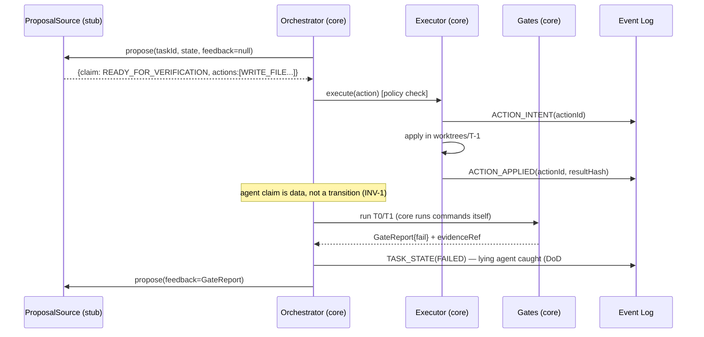
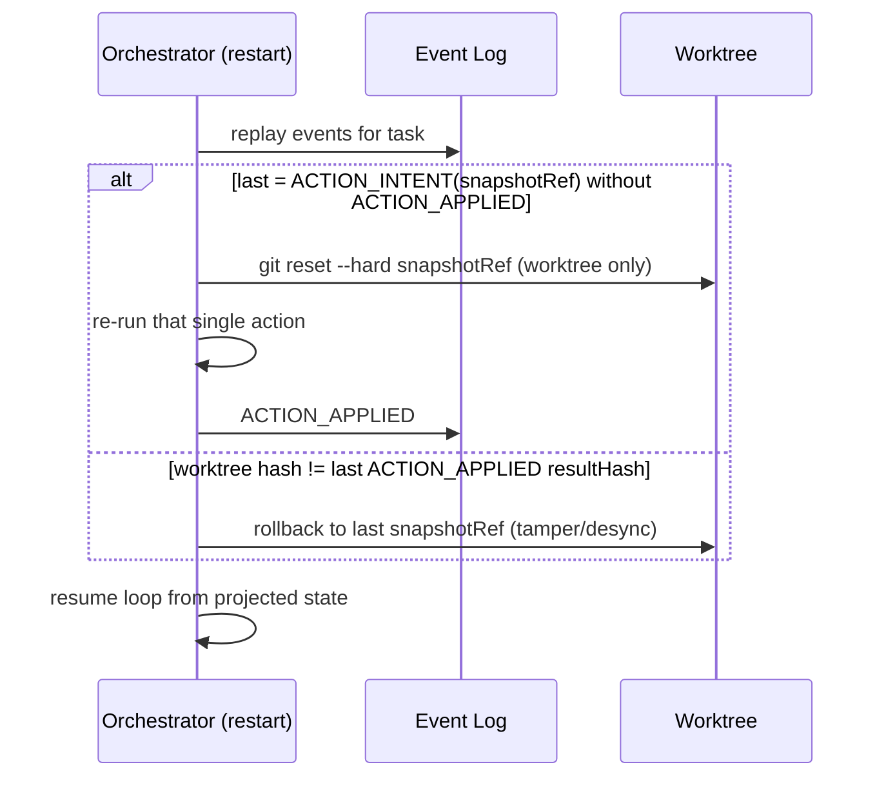

# Design: Autonomous Engineering Platform — Phase 0 (Deterministic Core + Console Foundation) + §15 Spikes

> Status: approved 2026-07-06, amended 2026-07-06 (traceability backfilled from derived requirements.md; goal-mode; adversarial review by spec-architect — verdict REVISE round 1, all 12 findings applied, see clarifications.md A5)
> Source of truth: `./unified-platform-spec.md` v1.1 (§3, §4, §6, §8, §11, §13, §14, §15). This design
> transcribes the spec into an implementable module plan for Phase 0 scope only. On any conflict the
> spec wins (order: Invariants §2 → templates §11 → other sections).

## Architecture Overview

Phase 0 builds Ring 0 (`core/`) proven safe with a **stub agent** through the 9-item fault-injection
DoD, plus the Console foundation (`console/`). No real model is connected in this phase (spec §14
Phase 0: "ยังไม่ต่อ Claude เข้า autonomous").

```
pnpm workspace (repo root = platform/ of spec §14)
├── core/                      # Ring 0 — vendor-name-free (INV-7, CI-checked), zero runtime deps
│   └── src/
│       ├── actions/           # Action DSL types + validation (§6.1)
│       ├── executor/          # action execution: policy checks, idempotency, worktree fs ops
│       ├── state/             # append-only event log (node:sqlite WAL), lease, projection
│       ├── evidence/          # content-addressed immutable evidence store
│       ├── gates/             # ladder T0/T1 real, T2/T3 explicit stubs; golden harness; convention gate
│       ├── security/          # egress sandbox (default-deny), path allowlist policy
│       ├── budget/            # iteration/costUnits/wallclock backstop
│       ├── orchestrator/      # state machine §6.3 + task loop driving a ProposalSource
│       └── ports.ts           # ProposalSource port (stub agent implements; AAL implements in P1)
│   └── test/fault-injection.test.ts   # the 9 DoD scenarios (written RED first)
├── console/
│   ├── backend/               # Fastify REST + static SPA serve; knows Claude (NOT core/)
│   └── web/                   # React SPA (Vite): F-Status, F-Proj, F-Sess(read), F-Auth, F-Usage card
├── spikes/                    # §15 spikes 1–5 (own package: sdk + node-pty deps stay out of core)
├── scripts/                   # create-worktree.sh, rollback-worktree.sh, check-core-vendor-free.sh
├── .ai/policies/gate-ladder.json      # platform runtime config (coexists with framework .ai/)
└── docs/spikes/               # recorded spike evidence (SPIKE-n.md)
```

Dependency rule (INV-7/8/9): `core/` imports nothing from `console/`, `spikes/`, or any vendor SDK;
`console/backend` calls core only through its public API (Phase 0: none needed — console reads
Claude Code's own files live, INV-11). CI runs `check-core-vendor-free.sh` (greps `core/` for
`claude|anthropic|codex|glm|openai`, case-insensitive → fail). The grep covers ALL of `core/`
including tests and comments — vendor words are forbidden even in core test prose ("stub stands in
for the model", never a vendor name); this discipline is deliberate, not an accident of the grep.

### Ring 0 component responsibilities

| Module | Responsibility | Spec |
|---|---|---|
| `actions` | `Action` union types, schema validation, structured `ActionRejection` | §6.1 |
| `executor` | run one Action under policy: path allowlist per role, egress gate, `ACTION_INTENT`→ execute →`ACTION_APPLIED(resultHash)`, duplicate `actionId` → idempotent skip | §6.1, INV-14 |
| `state` | SQLite (WAL) event log, append-only (no UPDATE/DELETE); lease claim via atomic compare-and-set; heartbeat + TTL; `state.json` projection rebuild; `events.jsonl` export | §6.2, INV-10 |
| `evidence` | store blobs by sha256 under `.ai/evidence/`; metadata binds `{commitHash, envHash, gateConfigHash}`; only core writes | INV-10 |
| `gates` | T0 (lint, typecheck, targeted tests — fallback full unit), T1 (full unit+integration, convention gate, golden of touched ACs), T2/T3 return `{status:"not_enabled", tier}` explicitly; golden harness: `test/golden/**` read-only to every role + `_MANIFEST.sha256` verify | §6.4, §6.5 |
| `security` | `NetworkSandbox` (darwin: `sandbox-exec` deny-network profile; else fail-closed refuse), `PathPolicy` per role | §10.1, INV-14 |
| `budget` | counters per task: iterations, costUnits, wallclock → exceed = `ESCALATED` event, loop stops | §6.6 |
| `orchestrator` | drive state machine (§6.3): ask `ProposalSource` → validate/execute via executor → run gates itself → transition; **agent claims never cause transitions** (INV-1/2) | §6.3, §9.2 |

### The ProposalSource port (how the stub agent plugs in)

```ts
// core/src/ports.ts — vendor-neutral; the ONLY doorway for any agent into core
interface ProposalSource {
  propose(input: {
    taskId: string; state: TaskState; role: Role;
    feedback: ActionRejection[] | GateReport | null;   // structured, never free text
  }): Promise<{ claim: "WORKING" | "READY_FOR_VERIFICATION" | "BLOCKED"; actions: Action[] }>;
}
```
Fault-injection scenarios are just malicious/broken `ProposalSource` implementations. In Phase 1 the
AAL implements this same port — core does not change (INV-8).

## Sequence Diagrams

### Task loop with stub agent (happy path + lying agent)



### Crash recovery (DoD#6) — snapshot-before-intent, rollback-then-rerun

`RUN_COMMAND` is not idempotent in general (installs, appends, git mutations) and has no
deterministic post-hash, so "hash-compare then re-apply" is unsound for it. The executor therefore
takes a **worktree snapshot (git commit on a recovery ref) BEFORE writing `ACTION_INTENT`**, and the
intent event records `{snapshotRef}`. Recovery for an intent with no `ACTION_APPLIED` is always
**reset worktree to snapshotRef, then re-run that one action** — double-apply is structurally
impossible regardless of action type.



DoD#6 test MUST include a non-idempotent `RUN_COMMAND` case (e.g. a command appending a line to a
file), crash injected between INTENT and APPLIED, and assert the line appears exactly once after
recovery — a `WRITE_FILE`-only test does not prove DoD#6.

### Console startup gate (INV-15, §13.1)

```mermaid
sequenceDiagram
  participant U as operator
  participant C as platform console
  U->>C: platform console --host 0.0.0.0
  C->>C: bind non-loopback? yes; auth provider? none (Phase 0 has none)
  alt --insecure given
    C-->>U: start + loud warning
  else
    C-->>U: REFUSE start + error explaining fix (fail-closed)
  end
```

## Data Models & Interfaces

### Action DSL (§6.1, verbatim from spec)

```ts
type Action =
  | { type: "WRITE_FILE";  actionId: string; path: string; contentRef: string }
  | { type: "APPLY_PATCH"; actionId: string; diffRef: string }
  | { type: "RUN_COMMAND"; actionId: string; cmd: string; cwd: string;
      network: "none" | `allowlist:${string}` }
  | { type: "READ_FILE";   actionId: string; path: string }
  | { type: "REQUEST_TOOL"; actionId: string; name: string; args: unknown };
```

### Events (append-only rows in SQLite, exported as events.jsonl)

```ts
interface PlatformEvent {
  seq: number;            // autoincrement — total order
  ts: string;             // ISO
  runId: string; taskId: string | null;
  type: "TASK_STATE" | "ACTION_INTENT" | "ACTION_APPLIED" | "ACTION_REJECTED"
      | "GATE_RESULT" | "LEASE_CLAIMED" | "LEASE_RENEWED" | "LEASE_RELEASED"
      | "BUDGET_EXCEEDED" | "ESCALATED" | "GOVERNANCE_CHANGE";
  payload: object;        // JSON, schema per type
}
```
Rules: INSERT only (SQL layer exposes no update/delete); projection `state.json` derived, always
rebuildable; lease = `LEASE_CLAIMED {taskId, ownerId, leaseUntil}` + a `leases` table updated via
`UPDATE ... WHERE owner=? AND leaseUntil<?` compare-and-set (the *log* stays append-only; the lease
table is a projection with atomic CAS as §6.2 requires).

Lease claim is ONE SQLite transaction: `BEGIN IMMEDIATE` → CAS `UPDATE` → if `changes() === 1`
INSERT `LEASE_CLAIMED` event → `COMMIT`; `changes() === 0` → `ROLLBACK`, claim denied. Log and
lease table can never diverge (INV-10). DoD#8 test: two separate `DatabaseSync` connections on the
same file (busy-timeout set), same injected clock instant — assert claimant #2 gets
`changes() === 0`, executes nothing, and observes the other owner's `LEASE_CLAIMED`.

### State machine (§6.3)

States: `PROPOSED → ANALYZING → READY → IMPLEMENTING → VERIFYING → (FAILED → DIAGNOSING → REPAIRING → VERIFYING) | (PASSED → REVIEWING → APPROVED → MERGE_QUEUED → AUDITED → COMPLETED)` plus
`BLOCKED, ESCALATED, CANCELLED, ROLLED_BACK, QUARANTINED, PAUSED`. Phase 0 exercises
PROPOSED→…→VERIFYING→FAILED/ESCALATED and PASSED; transitions after REVIEWING are declared in the
table but guarded `not_enabled_phase0` (explicit, not silent). Transition function is a pure lookup
table `(state, event) → state`; illegal transition → structured error event, never a crash.
**No code path lets a ProposalSource claim set VERIFYING→COMPLETED (INV-2).**

### Gate config + report

```jsonc
// .ai/policies/gate-ladder.json (raw bytes of this file hashed into every GateReport — INV-10)
{
  "t0": { "lint": "<cmd>", "typecheck": "<cmd>", "targetedTests": "<cmd or fallback:full_unit>" },
  "t1": { "fullTests": "<cmd>", "convention": "builtin", "golden": "builtin" },
  "t2": { "status": "not_enabled_phase0" },
  "t3": { "status": "not_enabled_phase0" }
}
```

```ts
interface GateReport {
  tier: "T0" | "T1" | "T2" | "T3";
  pass: boolean | "not_enabled";
  gateConfigHash: string; commitHash: string; envHash: string;
  checks: { name: string; pass: boolean; evidenceRef: string }[];  // evidence = core-captured output
}
```

### Golden harness

- `test/golden/**` in the *target* repo: read-only for every role (PathPolicy denies writes; DoD#2).
- `_MANIFEST.sha256` lists file hashes; T1 recomputes and compares → mismatch = gate fail
  `golden_manifest_mismatch` (DoD#4 fake-green detection) — and merge is blocked.
- **DoD#4 scope (honest):** Phase 0 proves *golden-file tampering / hash mismatch* detection only.
  A vacuous-but-passing test written inside `test/ai-generated/` is NOT caught by the manifest;
  that is what the RED-check (§9.2 rule 1 — a proposed test must first fail for the expected
  reason) covers, and RED-check ships with the Phase 1 TDD loop. The fault-injection test and its
  docs claim exactly this scope, no more.
- Fault-injection tests run against a **synthetic target repo fixture** (temp dir, `git init`,
  minimal package with passing/failing tests + golden dir) — not against the platform repo itself.

### Console REST API (Phase 0 endpoints; every UI capability = an endpoint)

| Endpoint | Returns | Feature |
|---|---|---|
| `GET /api/status` | `claude --version` output, active runs (from event log), auth+quota cards | F-Status |
| `GET /api/projects` | registry from `~/.claude/projects/` + registered cwds; `loopManaged` flag when `.ai/goal.yaml` present | F-Proj |
| `GET /api/sessions?project=` | session list parsed live from Claude Code JSONL (read-only, INV-11) | F-Sess |
| `GET /api/auth` | active auth method heuristic + `shadowing: true` when `ANTHROPIC_API_KEY`/`ANTHROPIC_AUTH_TOKEN` set (red warning; never unset automatically §5.1) | F-Auth |
| `GET /api/usage/estimate` | mini-card only (full indexer = Phase 2): 5h-window estimate grouped from local transcripts, labeled `"estimate"` + disclaimer strings (INV-13). Weekly estimate is shown ONLY when the operator has entered their weekly reset anchor (stored with optional calibrated-% in a local `usage-config.json`); without an anchor the card says a reset time is needed — never an unanchored guess. No hardcoded caps (§5.3) | F-Usage |
| `PUT /api/usage/config` | store `{weeklyResetAnchor?, calibratedPercent?}` (operator-entered, §5.3 calibration) | F-Usage |

Launcher: `platform console [--port 9119] [--host 127.0.0.1] [--no-open] [--insecure]` — a small
bin in `console/backend`. Non-loopback host without auth provider → process exits non-zero with
guidance (fail-closed; there IS no provider in Phase 0, so non-loopback requires `--insecure`).
UI shows the third-party disclaimer (§1.3).

**§13.3 subset applicable in Phase 0** (loopback does not mean safe from the operator's browser):
- Host-header validation (allowlist `localhost`/`127.0.0.1`/`[::1]` + actual port) + peer-IP guard
  on loopback binds — blocks DNS-rebinding from a malicious page.
- CORS restricted to the console's own localhost origin(s).
- Redaction of home paths / credential file paths in every response and log (INV-14).
- Negative guarantees with tests: NO route returns or exports tokens/credentials (INV-12); NO route
  creates users (INV-15 single-operator).

### Spikes (§15) — each = runnable script + recorded result in docs/spikes/SPIKE-n.md

| # | Proves | Method | Pass criteria |
|---|---|---|---|
| 1 | SDK session observability | `listSessions`/`getSessionMessages` against real `~/.claude` data | real sessions listed + messages readable |
| 2 | PTY parity (gate of INV-17) | node-pty spawns real `claude`; scripted probes + manual checklist for TUI-only checks | (a) slash commands work (b) `--resume` works (c) permission prompt in-terminal (d) detach/attach survives (e) `/usage` shows Max quota, no API bill |
| 3 | SDK streaming + canUseTool | one `query()` turn, streaming, `canUseTool` callback fires | events stream; callback observed |
| 4 | Subscription billing (gate of INV-12) | unset `ANTHROPIC_API_KEY` etc → run spike 3 → verify credential source + quota movement | success via `/login` creds; no API billing |
| 5 | Adapter isolation (INV-9 pre-proof) | `query({allowedTools: [], settingSources: []})` | model proposes, executes nothing. Context isolation is verified INDIRECTLY (SDK does not expose the assembled system prompt): probe-prompt the model for machine-specific markers that exist in the local CLAUDE.md (e.g. distinctive rule names) — markers absent = pass, and SPIKE-5.md states the indirect nature of this check |

Spikes that require visually reading `/usage` record status `PARTIAL(manual-step: …)` — never
claimed passed without observation (A4 in clarifications.md).

## Technology Decisions

| Decision | Choice | Rationale |
|---|---|---|
| Language/runtime | TypeScript strict, Node 26, pnpm workspaces | CODING_STANDARDS: statically-typed, strict; Node 26 already installed |
| Core test runner | `node:test` with Node's native TypeScript type-stripping (no loader) | builtin; core keeps zero runtime deps; `tsx` is added ONLY if native stripping proves insufficient, with the reason recorded |
| Event log storage | `node:sqlite` (builtin, WAL) | §6.2 requires atomic CAS for lease; builtin = no install/native-build burden. **Known risk, accepted and recorded in docs/DEVIATIONS.md:** `node:sqlite` is Stability 1.2 (release candidate) — we pin the Node minor in `.nvmrc`/`engines` and suppress its ExperimentalWarning deliberately; fallback path if the API shifts = `better-sqlite3` behind the same thin storage interface |
| Egress enforcement | darwin: `sandbox-exec` deny-network profile around `RUN_COMMAND` (children inherit the sandbox); non-darwin: refuse to run (fail-closed) until a Linux impl (`unshare -n`) lands | deterministic block > env-var hopes; fail-closed per INV-15; documented ceiling |
| CI platform for fault-injection job | **macOS runner (pinned)** for `core` fault-injection suite | DoD#3 asserts real blocked-at-connect behavior, which Phase 0 only implements via `sandbox-exec`; on Linux the suite would test `sandbox_unavailable` refusal instead of the real block. Linux `unshare -n` impl is future work, recorded |
| Console backend | Fastify | §14 names Fastify/Hono; Fastify has first-class schema validation + inject() testing |
| Console web | React + Vite | §14 names React SPA; Vite = minimal toolchain |
| Spike deps (`node-pty`, `@anthropic-ai/claude-agent-sdk` pinned) | isolated in `spikes/` package | keeps core/console clean; spikes are evidence, not product. SPIKE-2 starts with a pre-flight `node-pty` build check on Node 26 — no prebuilt/failed gyp build → record `PARTIAL(build-blocked)` + pin a Node minor that builds, never claim parity untested |
| Gate policy file format | **JSON** (`.ai/policies/gate-ladder.json`) in Phase 0; hashed as raw bytes into GateReport | keeps core truly zero-dep (`JSON.parse` builtin). Spec §11.1 names `gate-ladder.yaml` inside the Phase-1 goal-contract template — YAML (+one reviewed `yaml` dep) arrives in Phase 1 with goal.yaml; recorded in docs/DEVIATIONS.md |

## Error Handling Strategy

| Case | Handling |
|---|---|
| Action outside role allowlist / touches `test/golden/**` | `ACTION_REJECTED` event + structured `ActionRejection` returned as next-round feedback — no crash, no silent drop (§6.1) |
| `RUN_COMMAND` with undeclared network | command runs inside deny-network sandbox; attempted egress fails at connect; stderr captured as evidence + `egress_blocked` flag in log (DoD#3) |
| Sandbox unavailable on platform | executor refuses RUN_COMMAND with `sandbox_unavailable` (fail-closed) rather than running unsandboxed |
| Duplicate `actionId` | idempotent skip; `ACTION_APPLIED(duplicate: true)` (DoD#7) |
| Crash between INTENT/APPLIED | recovery algorithm (sequence diagram above); never double-apply (DoD#6) |
| Lease contention | second claimant's CAS fails → it must not execute; observes `LEASE_CLAIMED` by other owner (DoD#8) |
| Flaky test in gates | retry once; still-flapping = `GATE_RESULT{flaky_suspect}` + flag for human — never auto-quarantine (DoD#5, INV-16) |
| Budget exceeded | `BUDGET_EXCEEDED` + `ESCALATED` terminal for this run; loop provably halts (DoD#9) |
| Agent claims success | claim recorded as data; only core-run gates cause PASSED (DoD#1, INV-1/2) |
| Console non-loopback w/o auth | refuse start, exit non-zero, actionable message (INV-15) |
| Console reading absent `~/.claude` | empty-state responses with guidance, not 500s |
| `claude` binary not on PATH (F-Status) | degraded status card ("CLI not found" + install hint), not a 500 |

## Testing Strategy

Order is normative (spec §0.4): fault-injection scenarios are written as failing tests FIRST, then
core is implemented until they pass.

| Layer | What | Maps to |
|---|---|---|
| `core/test/fault-injection.test.ts` | DoD 1–9, each an independent scenario on a synthetic target-repo fixture with a malicious `ProposalSource` | REQ-1, REQ-2, REQ-5, REQ-6, REQ-7, REQ-8.5, REQ-9, REQ-10 (DoD map in requirements.md) |
| co-located unit tests in `core/src/**` | state-machine table, lease CAS, event-log append-only property, hash/evidence, path policy, budget counters | REQ-3, REQ-4, REQ-5, REQ-7, REQ-10 |
| `console/backend` tests | Fastify `inject()` per endpoint incl. auth-shadowing detection + fail-closed startup gate + redaction of home paths in responses + host-header/CORS rejection cases + negative guarantees (no credential route, no user-creation route) | REQ-12, REQ-13, REQ-14, REQ-15 |
| golden harness self-test | manifest mismatch detected; write attempt to golden rejected | REQ-9 |
| CI vendor-name check | `check-core-vendor-free.sh` runs in CI; a planted vendor word fails | REQ-11 |
| Spike evidence | each SPIKE-n.md records exact commands + observed output | REQ-16 |

Console web (SPA) Phase 0: logic kept in pure functions (grouping transcripts into 5h windows,
shadowing detection display) with unit tests; rendering kept thin — no E2E in Phase 0 (T2 is
stubbed by design).

## Non-Functional Considerations (why Design-First)

- **Safety invariants precede features:** INV-1/2 (propose/dispose), INV-10 (append-only + evidence),
  INV-14 (egress default-deny, secret-block), INV-15 (fail-closed) are structural — they cannot be
  retrofitted, so the design fixes them before requirements enumeration.
- **Vendor isolation as a hard boundary:** INV-7 vendor-name-free `core/` is enforced by CI from the
  first commit, keeping quota-survivability (§5.4) open.
- **Determinism:** core has no wall-clock/randomness in logic paths (injectable clock/id sources) so
  fault-injection scenarios and crash-recovery replay are reproducible.
- **Claim discipline (§16):** quota numbers labeled estimates; T2/T3 stubs say `not_enabled` rather
  than passing silently; prompt-injection wording = mitigated, never solved.
- **Single-operator, local-first:** no user management anywhere; default bind loopback.

## Requirement Traceability

| Design element | Satisfies |
|---|---|
| `actions` + `executor` policy checks (path allowlist, golden read-only, structured rejection) | REQ-1 |
| `security` NetworkSandbox (sandbox-exec / fail-closed) | REQ-2 |
| `state` event log (INSERT-only, projection rebuild, events.jsonl export) | REQ-3 |
| `evidence` content-addressed store + GateReport binding | REQ-4 |
| `state` lease (single-transaction CAS + heartbeat/TTL) | REQ-5 |
| executor snapshot-before-intent + crash recovery + duplicate-actionId skip | REQ-6 |
| `orchestrator` + state-machine transition table (claims-as-data, no COMPLETED path) | REQ-7 |
| `gates` ladder T0/T1, gate-ladder.json byte hash, T2/T3 explicit stubs, flaky retry-and-flag | REQ-8 |
| Golden harness (manifest verify, scope note) | REQ-9 |
| `budget` counters → BUDGET_EXCEEDED/ESCALATED | REQ-10 |
| Dependency rule + `check-core-vendor-free.sh` + ProposalSource port | REQ-11 |
| Launcher + startup gate + §13.3 Phase-0 subset | REQ-12 |
| `GET /api/status` / `/api/projects` / `/api/sessions` | REQ-13 |
| `GET /api/auth` shadowing detection | REQ-14 |
| `GET /api/usage/estimate` + `PUT /api/usage/config` | REQ-15 |
| `spikes/` package + docs/spikes/SPIKE-n.md records | REQ-16 |
