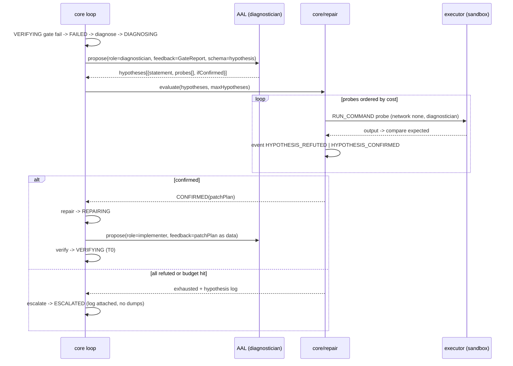
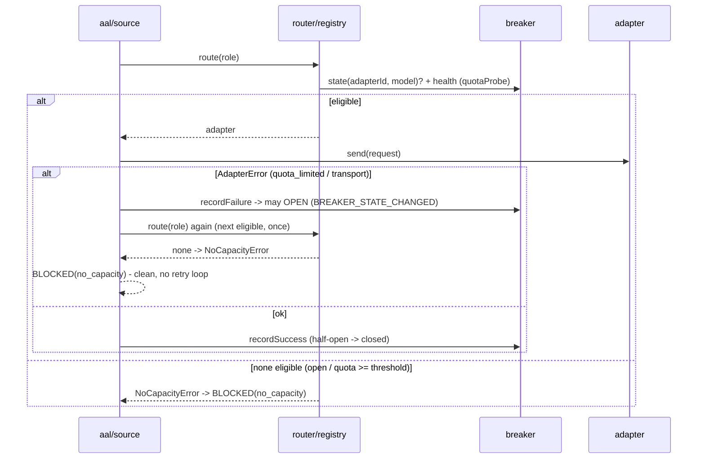
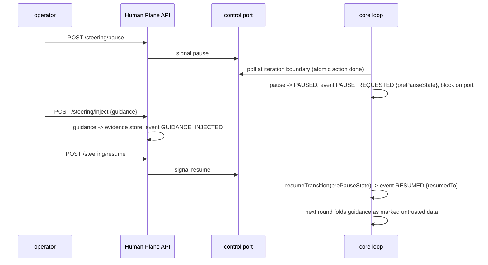
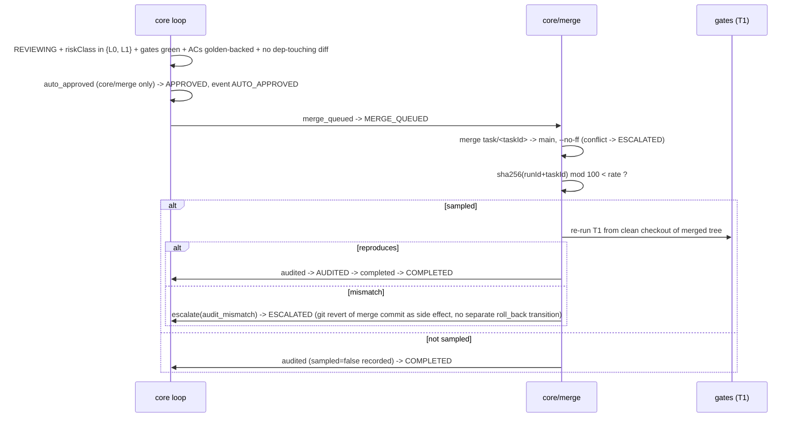
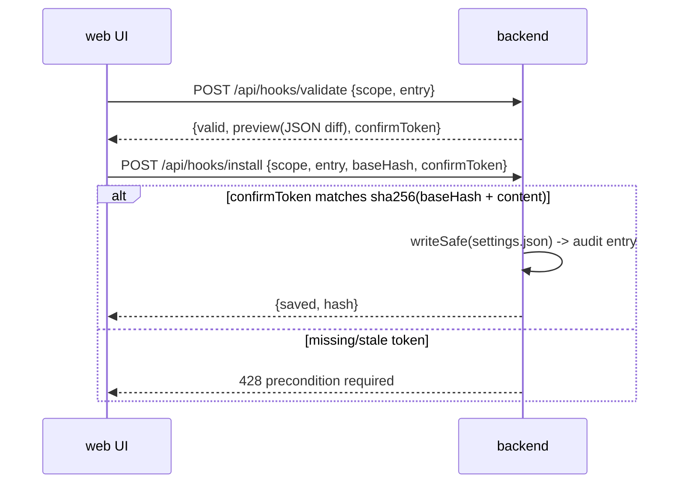

# Design: Autonomous Engineering Platform — Phase 2 (Semi-autonomous + Survivability + Console Extensions)

> Status: approved 2026-07-07 (human gate, clarifications decision #4), amended 2026-07-07 (REQ-ID backfill from derived requirements.md; /spec-analyze sync — 20 findings AZ-1..AZ-20 applied, see requirements.md findings log)
> Review trail: spec-architect adversarial round 1 — 12 findings (3 BLOCKER, 5 MAJOR,
> 4 MINOR), all applied; the "drop PAUSED state" alternative in finding #2 was
> rebutted as unfaithful to §6.3 and resolved via the reviewer's option b instead.
> Source of truth: `./unified-platform-spec.md` v1.1 (§14 Phase 2). Conflict order per
> §0.7: Invariants §2 → templates §11 → other sections. `clarifications.md` in this
> folder binds (user decisions #1–#4, assumptions B1–B5).
> Mode: Design-First — requirements.md derives from this file (`/spec-requirements`
> backfills REQ IDs + traceability).

## Spec conflicts resolved (recorded per §0.7)

1. **§8 feature-table phase column vs §14 roadmap** — §8 marks F-MCP/F-Hook/F-Sub/F-Skill
   as Phase 3 and F-Sys as Phase 4, but §14 Phase 2 lists all five. Same conflict class
   Phase 1 already resolved: **§14 is authoritative** (§0.3 "สร้างทีละ Phase ตาม §14
   เท่านั้น"; §8 column predates the v1.1 re-plan). All five ship in Phase 2.
2. **Automation guards without a scheduler** — §10.2 puts quota guards on "F-Sched and
   scheduled autonomous run", but F-Sched is Phase 3 (§14). Phase 2 applies the guards to
   the only spawner that exists: `platform loop run` (and `platform conformance --live`).
   The guard module is scheduler-agnostic so F-Sched reuses it in Phase 3.
3. **Per-provider token bucket (§10.2)** — deferred: Phase 2 dispatch is one sequential
   task loop over one adapter; the breaker + quota guard cover the same risk with zero
   concurrency. Token bucket arrives with parallel dispatch (Phase 3). Recorded here as a
   deliberate deferral, not an omission.
4. **T2/T3 gate tiers stay stubbed** — §14 Phase 2 does not name them; auto-merge L0–L1
   relies on T0/T1 + golden + sampling audit (which re-runs T1 from a clean checkout).
   T2 arrives with merge queue (Phase 3).

## Architecture Overview

Phase 2 adds **no new ring and no new package**. Every addition extends an existing
workspace along seams Phase 1 left explicitly open:

```
core/        RING 0  + repair/ (hypothesis engine)  + governance/ (policy versioning)
                     + steering (control port in orchestrator/loop)  + merge/ (L0–L1 auto-merge
                     + sampling audit)  + security plane completions (dep-policy in executor,
                     canary tripwire helper, data-govern check)
aal/         RING 1  + breaker.ts (per adapter+model circuit breaker)
                     + health-aware eligible()/route()  + runtime canary check + data-policy
                     enforcement in source.ts  + repair.ts usage accumulation (backlog #1)
adapters/    RING 2  + anthropic.ts quota-probe injection point + transcript glob fallback
                     (backlog #4); no new adapter (Codex/GLM = Phase 3)
console/backend      + F-MCP/F-Hook/F-Sub/F-Skill/F-Sys REST routes over the existing
                     writeSafe pattern  + consent gate for hook writes  + automation guard
                     preflight in bin/platform.ts  + real Clock (backlog #2)  + PTY repaint
                     nudge (backlog #3)  + Human Plane server COMPOSED into loop runs
console/web          + pages for the five new F-* + steering/pause indicator on loop status
```

Dependency rules unchanged and CI-enforced: `core/` + `aal/` vendor-name-free
(`check-core-vendor-free.sh`); `core/` never imports `aal/`/`adapters/`/`console/`;
`adapters/` = wire translation only; `console/` reaches core only through the Human Plane
API + composition root (INV-7/8/11).

### New module responsibilities

- **`core/src/repair/hypothesis.ts`** — Hypothesis engine (§9.3). Validates a
  diagnostician proposal against the hypothesis schema, orders probes by cost, asks the
  executor to run each probe (`RUN_COMMAND`, egress-deny, diagnostician role), compares
  output to `expected`, and returns `CONFIRMED(hypothesis)` or `all_refuted`. Every
  probe run and every verdict is an event; refuted hypotheses are always recorded
  (feeds escalation + kills repeat guessing). `max_hypotheses_per_failure` from the
  frozen contract bounds the cycle; exceeding it → `ESCALATED hypotheses_exhausted`
  with the full hypothesis log. Probes per hypothesis are policy-capped (default 5;
  over-cap proposals rejected as structured feedback), each probe is timeout-bounded,
  an errored/timed-out probe marks the hypothesis `undecided` (counted toward the cap,
  never a refutation — an execution error is not evidence), and budget/wallclock checks
  run between probes (AZ-11). **Routing prerequisite (review #1):** the DIAGNOSING
  round reaches the model as `role='diagnostician'` — `aal/src/source.ts` must route
  per-call from `ProposalInput.role` (today it binds `deps.role` at construction and
  discards `input.role`), and `registry.ts roleRequires()` gains a `diagnostician`
  case (reasoning-only, no structuredOutput requirement beyond schema conformance).
- **`core/src/governance/policy.ts`** — Meta-governance (INV-16). A run starts by
  hashing its policy inputs (gate-ladder file, security-plane policy, path policy
  version) and comparing against the last `GOVERNANCE_CHANGE` in the **durable
  governance log** — append-only JSONL at `.ai/governance/events.jsonl`, committed to
  the repo (survives checkouts; git history = audit trail; per-run event logs never
  hold governance state — AZ-1). Empty log = first run, compared as `beforeHash: null`
  → mismatch. Mismatch → the run refuses to start (`policy_unapproved`, structured) and
  records a `GOVERNANCE_PROPOSED` event in the governance log. CI/test fixtures seed an
  approved snapshot labeled `decidedBy: 'ci-fixture'` — explicit scaffolding, never
  claimed human (AZ-1). Human approval records `GOVERNANCE_CHANGE
  {kind, beforeHash, afterHash, rationale}` — versioned, append-only. This gates ALL
  policy changes (a conservative superset of "loosening" — mechanical loosening
  detection is not attempted; tightening pays one extra approval). Flaky quarantine
  rides the same path: `flakySuspect` gate results generate a `governance` approval
  whose approve fires the `quarantine` transition — never automatic.
  **Approval reachability (review #3):** a refused run must not depend on a server it
  never started — `platform governance list|approve <id>` CLI subcommands read pending
  proposals from the event log and append `GOVERNANCE_CHANGE` directly (the human at
  the TTY *is* the approval; entry audited). When a Human Plane server IS running,
  `GET /approvals` also lists governance proposals and `POST /approvals/{id}` handles
  them by kind (AZ-3): `policy_change` appends the event and returns (never calls
  `onDecision`); `flaky_quarantine` (carries a taskId) additionally fires the
  `quarantine` transition on approval — still human-approved; approved via CLI with no
  live run → takes effect when the next run loads that task (deferred, recorded).
- **`core/src/merge/auto-merge.ts`** — L0–L1 auto-merge + sampling audit. Post-REVIEWING
  policy: riskClass ∈ {L0, L1} **and all gates green and every AC the task maps to is
  golden-backed (`golden: true`)** (review #7 — a loop-written non-golden test that was
  quietly weakened would otherwise self-certify; §10.1 residual demands the held-out
  floor) → `AUTO_APPROVED` event (policy decision, recorded as such — not a human
  approval) → `merge_queued` → clean fast-forward/no-conflict merge of the **task
  branch** into the fixture repo's main branch (conflict → `ESCALATED merge_conflict`)
  → sampling audit → `audited` → `completed`. Sampling is deterministic:
  `sha256(runId + taskId) mod 100 < rate` (auditable, replayable — no RNG). A sampled
  audit re-runs the T1 ladder from a clean checkout of the merged tree; "reproduce" =
  ordered gate verdicts equal AND evidence content hashes equal, excluding timing/host
  metadata (AZ-9); mismatch → a single `escalate(audit_mismatch)` whose handling
  performs the git revert of the merge commit as a side effect — final state ESCALATED,
  no separate roll_back transition on this path (AZ-5). L2+ tasks — and ANY task whose
  diff touches a dependency manifest or lockfile (matched against the governance-pinned
  pattern list in `.ai/policies/security-plane.json`, shared with dep-policy — AZ-17;
  supply-chain T4, review #8) — keep the Phase-1 path: approval package → human decision
  via Human Plane. Non-golden-backed ACs likewise force the approval package; "mapped
  ACs" = the frozen contract's `acceptance_criteria` (single-task loop maps all), and a
  contract with zero ACs forces the approval package too (AZ-16). Risk class source:
  per-task `risk` field in the goal contract (see Data Models); absent → defaults to
  `L2` (fail-toward-human). The CI fixture ships `automation.json` with
  `auditSampleRate: 100` + a seeded governance snapshot so the sampled path runs
  deterministically; production keeps the hash rate (AZ-15).
  **Merge topology (review #6):** today the executor commits snapshots directly onto
  the fixture repo's only branch — there is nothing to merge. Phase 2 gives each task
  a real branch: `runSupervisedLoop` creates `task/<taskId>` from main before the
  loop starts, the executor's worktree tracks that branch, and auto-merge merges it
  into main (`--no-ff` so the revert target is one merge commit). Rollback = revert of
  that merge commit — distinct from in-progress snapshot commits, both append-only.
  **State machine (review #4):** `merge_queued`/`audited`/`completed` leave
  `PHASE_GATED`; new trigger `auto_approved: REVIEWING → APPROVED` (fired by
  core/merge policy only — never exposed through `ports.ts`, so no agent claim can
  reach it, INV-2); `MERGE_QUEUED` and `AUDITED` join `ACTIVE_STATES` so
  `escalate`/`roll_back` are legal from them (merge_conflict / audit_mismatch paths).
- **`core/src/orchestrator/loop.ts` (extended)** — steering + control port. Gains an
  optional `control` port polled at every iteration boundary (after the current atomic
  action completes — §10.3): `kill` → existing kill semantics; `pause` → fire `pause`
  transition into PAUSED (a real task state, §6.3), emitting `PAUSE_REQUESTED
  {prePauseState}` — the pre-pause state is recorded IN the event so resume is
  replayable — then block on the port until resume or kill.
  **Resume (review #2):** the machine today has no exit from PAUSED (not in
  `ACTIVE_STATES`, no `resume` trigger — a dead-end). Phase 2 adds
  `resumeTransition(prePauseState): TransitionResult` beside `transition()`: legal only
  from PAUSED, only to a member of `ACTIVE_STATES`, target = the recorded
  `prePauseState`. Loop fires it on resume → `RESUMED {resumedTo}` → re-enters the
  round it was about to start. (The reviewer's alternative — keep task state unchanged
  and make pause loop-internal — was rebutted: §6.3 names PAUSED as a state entered
  from every active state; the event-log projection must show it.)
  Injected guidance arrives as a context piece: `GUIDANCE_INJECTED {evidenceRef}`,
  folded into the next round's feedback exactly like gate feedback (existing
  untrusted-data folding in `aal/src/source.ts`) — guidance is advisory data; anything
  touching AC/scope must go through a goal.yaml amendment, which the frozen-contract
  hash check already converts to `ESCALATED contract_changed`.
- **`core/src/security/` completions** —
  (a) *dep-policy*: executor accepts `network: 'allowlist:package_install'` on
  `RUN_COMMAND` when the security-plane policy file authorizes it: command must match
  the policy's frozen-lockfile install pattern (e.g. `pnpm install --frozen-lockfile
  --ignore-scripts`), a lockfile — matched against the policy's manifest/lockfile
  pattern list, the SAME list the risk floor uses (AZ-17) — must exist in the worktree,
  and the sandbox profile for that single command permits network egress. Everything
  else keeps `network: 'none'` hard-deny. Non-darwin: fail-closed `sandbox_unavailable`
  (Phase-0/D-003 posture — the grant never executes unconfined; AZ-13). **Registry allowlist is enforced at the lockfile, not the socket (review
  #8):** `--frozen-lockfile` resolves every package exclusively from URLs already
  committed in the lockfile + `--ignore-scripts` blocks install-time code — that IS the
  deterministic registry pin §10.1 Tier 1 asks for. The SBPL grant is only transport.
  Residual named honestly: a maliciously *committed* lockfile — mitigated by the risk
  floor (any lockfile/manifest-touching diff is ≥ L2, never auto-merged) — *mitigated,
  not solved* (§16 claim discipline).
  (b) *injection canary tripwire*: pure helper `canaryTripped(response, canaryToken)`
  (checks structuredResult + action contents) — called from Ring 1 (below).
- **`aal/src/breaker.ts`** — circuit breaker per `(adapterId, modelVersion)`:
  `closed → open` (failure rate over a sliding window of recent sends) `→ half-open`
  (one probe request allowed) `→ closed` on success. Pure state machine with injected
  clock; emits `BREAKER_STATE_CHANGED` through a sink callback (composition root wires
  it to the event log — aal stays log-agnostic). `registry.eligible()` consults breaker
  state + a new `health` gate; `route()` order per §7.4: capability → breaker/health →
  (susceptibility + cost + outcome-weighting stay Phase-3 no-ops with the field slots
  already present).
- **`aal/src/source.ts` (extended)** — four changes:
  (a) *per-call role* (review #1): routes and builds the `AgentRequest` from
  `ProposalInput.role`, not a construction-time `deps.role`.
  (b) *failure handling*: now catches `AdapterError` from `send()` (Phase 1 let it
  propagate): records the failure with the breaker (`breaker` joins `AALSourceDeps`),
  retries ONCE against the next eligible adapter (`on_repeated_failure:
  switch_to_next_eligible`) **excluding every adapter+model key that already failed this
  round regardless of breaker state (AZ-4)**, and with none eligible — or with the
  single re-route also failed — returns the existing structured `BLOCKED(no_capacity)`
  — no retry loops, no criteria loosening (INV-5).
  (c) *health refresh* (review #5): `propose()` awaits one `registry.refreshHealth()`
  per round BEFORE `route()` — probes run async there, results land in a cached
  snapshot; `eligible()`/`route()` stay synchronous over that snapshot; `QUOTA_PROBE`
  emitted on change.
  (d) *real budget signal* (review #9): `AgentRequest.budget.costUnits` carries the
  task's actual remaining budget (from the tracker), replacing the hardcoded 500 —
  P4 degraded behavior now reacts to truth; when charging leaves remaining ≤ 0 the loop
  escalates `budget_exhausted` BEFORE building any further request — zero/negative is
  never sent (AZ-20).
  Runtime canary tripwire runs after `proposeWithRepair`: a tripped canary →
  `CANARY_TRIPPED` event + proposal rejected as structured feedback (round consumed,
  not crashed). Data-govern check runs before `send`: every `ContextPiece.path` must
  satisfy the provider data policy for the routed adapter — violation →
  `ESCALATED data_policy_violation`, nothing sent. Pathless pieces pass only when their
  kind is in the policy file's enumerated platform-generated list (feedback, contract,
  guidance, patchPlan); any other pathless piece escalates (AZ-20).
- **`aal/src/repair.ts` (backlog #1)** — `RepairOutcome` accumulates
  `usage.costUnits` across ALL rounds (`totalUsage`); `source.ts` charges the total.
  Conformance P3/P4 verdicts unchanged (they assert validity + round count, not usage).
- **`adapters/src/anthropic.ts` (extended)** — accepts an injected
  `quotaProbe?: () => Promise<{ fiveHourPct: number; weeklyPct: number } | null>` (per-window
  estimates, not one collapsed number — REQ-2.1/2.3; `null` = estimate unavailable = always-ok;
  composition root builds it from the console usage estimator — the adapter itself stays
  estimation-free); the adapter's health = `max(fiveHourPct, weeklyPct)` vs threshold, surfaced
  to the registry as `{ok, reason?, windows: {fiveHourPct, weeklyPct}}` and a `QUOTA_PROBE
  {fiveHourPct, weeklyPct}` event on change. Transcript
  capture (backlog #4): on predicted-path poll miss, one glob fallback
  `~/.claude/projects/*/<sessionId>.jsonl` before returning `null` — fixes the nested
  claude HOME/cwd munge mismatch without guessing envs.
- **`console/backend` — five new F-* route groups**, all copying the F-Mem pattern
  (GET returns `{content, hash}`, PUT goes through `writeSafe` → 409/422/200):
  - *F-MCP* (`/api/mcp/{scope}`): manage project `.mcp.json` (writes) + user-scope MCP
    config as a READ-ONLY view — `~/.claude.json` is multi-purpose state the CLI
    rewrites concurrently, so Phase 2 never PUTs it; the UI points at `claude mcp` for
    user-scope edits (AZ-18). Add stdio/HTTP server entries; enable/disable (project
    scope). "Test connection" = timeout-bounded stdio spawn / HTTP ping, results
    advisory. OAuth flows deferred to Phase 3 (needs browser round-trip design) —
    recorded deferral.
  - *F-Hook* (`/api/hooks/{scope}` + `/api/hooks/validate` + `/api/hooks/install`):
    builder/validator for all hook events + 5 handler types over settings.json scopes.
    **Consent gate (INV-16/§13.3):** writes are two-step — step 1 returns a preview
    (exact JSON diff + `confirmToken` = sha256 of the target file's baseHash + the
    proposed content, so a moved base invalidates the token — AZ-12); step 2 must echo
    the token AND the current baseHash (stale → 409; the previewed diff IS the applied
    diff). No token → 428. Every install/uninstall audited.
  - *F-Sub* (`/api/subagents`): CRUD `.claude/agents/*.md` — frontmatter validated
    (name/description/tools), body preserved verbatim.
  - *F-Skill* (`/api/skills`): list/edit `.claude/skills/*/SKILL.md` + manage
    `enabledPlugins` in settings scopes.
  - *F-Sys* (`/api/system/doctor|stats|retention`): doctor = `claude doctor`
    non-interactive capture (degraded card when binary missing, Phase-0 pattern); host
    stats from `node:os`; retention = `cleanupPeriodDays` editor + transcript-prune
    preview with an explicit destructive-action confirm (same two-step token as
    F-Hook).
- **`console/backend/src/guards.ts` — automation guard (INV-13)** — pure
  `decideAutomationStart({estimate, thresholds, override}): {ok} | {defer, until,
  reason}` where `estimate` is `{fiveHourPct, weeklyPct} | null`: refuses to start an
  autonomous run when the struct's max ≥ threshold (default 85%) — `until` = the reset
  time of the window that tripped (AZ-19); a null estimate defers fail-closed with
  reason `estimate_unavailable` (AZ-10); `--force-quota-override` bypasses exactly the
  refusal, records `AUTOMATION_OVERRIDE`, and hard budget caps still apply (AZ-6).
  Offers "defer until reset". Wired as preflight in
  `bin/platform.ts` `runLoop`/`runConformance --live` before any adapter construction.
  Autonomous default model = Sonnet (adapter `model` option default for loop runs;
  Opus stays interactive-only by default). Threshold + default model live in
  `.ai/policies/automation.json` (hash-pinned by governance like other policies).
- **Composition root (`bin/platform.ts` + `loop-run.ts`)** — Phase 2 makes the loop
  *operable*, not just runnable: `runSupervisedLoop` now starts the Human Plane server
  (Phase 1 built it but never composed it), writes `human-plane.json`, wires
  `onDecision` → machine transitions (task approvals only; governance approvals append
  and return), `onKill` + steering endpoints → the loop control port, and replaces the
  frozen `nowMs` **parameter** with an injected `Clock` (`{ now: () => Date.now() }` in
  production, tickable `makeClock` in tests — backlog #2/review #10; signature change
  touches every caller once, and event-log timestamps become real wall-clock, which is
  safe: no verdict or evidence hash depends on a timestamp — only the wallclock budget,
  which can now actually trip).
- **F-Term repaint nudge (backlog #3, review #11)** — `PtyLike` gains
  `resize(cols, rows)` (node-pty native) AND `TermManager` gains
  `resize(ptyId, cols, rows)` + tracks current dims per session (the WS bridge only
  holds a `ptyId`, it never touches `PtyLike` directly). The WS attach path, after
  `ws.send(re.buffer)`, sends a double-resize nudge (rows−1 → rows) forcing SIGWINCH so
  full-screen TUIs repaint — kills the first-attach blank window at its root (missed
  initial paint had no repaint trigger). The nudge is a signal, not injected bytes —
  the ring's byte-prefix-of-stream invariant holds.

### Composition root (who wires what)

`platform loop run` (Phase-2 shape): parse + freeze goal.yaml (edge, unchanged) →
**governance preflight** (policy hashes vs event log; refusal prints the pending
proposal id + the exact `platform governance approve <id>` command — approval never
depends on a server the refused run didn't start, review #3) → **automation guard**
(quota estimate vs threshold; live only) → build event log/evidence store (persistDir)
→ registry + breaker (sink → event log) + router → adapter (Fake default; anthropic
with `--live`, quotaProbe injected, model default Sonnet) → AAL source (per-call role,
repair totals, canary tripwire, data policy) → executor (dep-policy-aware sandbox) →
**task branch** `task/<taskId>` created from fixture main (review #6) → **Human Plane
server** (approvals incl. governance kind, steering, kill → control port) →
`runTaskLoop` with control port + real clock → post-REVIEWING: risk L0/L1 +
golden-backed ACs → auto-merge + sampling audit; L2+/non-golden/dep-touching →
approval package, wait for human decision.

## Sequence Diagrams

### Hypothesis-driven repair (§9.3)



### Breaker + quota-aware routing (§10.2, §5.4)



### Steering (§10.3)



### Auto-merge L0–L1 + sampling audit



### Consent-gated hook install (F-Hook)



## Data Models & Interfaces

### Hypothesis schema (§9.3, §11.3) — `core/src/repair/hypothesis.ts` + `.ai/schemas/hypothesis`

```ts
interface HypothesisProbe { cmd: string; cwd?: string; expected: string }   // substring|regex literal
interface Hypothesis {
  statement: string;
  probes: HypothesisProbe[];                    // run cheapest-first (array order = agent's cost order)
  ifConfirmed: { patchPlan: string; estimatedBlastRadius: string };
}
interface HypothesisVerdict { hypothesis: Hypothesis; verdict: 'confirmed' | 'refuted' | 'undecided'; probeOutputs: string[] }
// undecided = probe errored/timed out (REQ-5.8): counts toward max_hypotheses_per_failure, never a refutation
// events: HYPOTHESIS_PROPOSED {count} · PROBE_RUN {cmd, exit, evidenceRef}
//         HYPOTHESIS_CONFIRMED {evidenceRef} · HYPOTHESIS_REFUTED {evidenceRef}
```

Diagnostician role: `Role` union gains `'diagnostician'`; `WRITE_PREFIXES.diagnostician
= []` (read + RUN_COMMAND probes only, golden read-only like everyone).

### Breaker — `aal/src/breaker.ts`

```ts
type BreakerState = 'closed' | 'open' | 'half_open';
interface BreakerOptions { windowSize: number; failureThreshold: number; openMs: number }
interface Breaker {
  state(key: string): BreakerState;             // key = `${adapterId}@${modelVersion}`
  recordSuccess(key: string): void;
  recordFailure(key: string, kind: AdapterErrorKind): void;
  allowProbe(key: string): boolean;             // half-open single-flight
}
// sink: (event: { key, from, to, at }) => void  — composition root appends BREAKER_STATE_CHANGED
```

Registry: `RegisteredAdapter` gains `healthProbe?: () => Promise<AdapterHealth>` where
`AdapterHealth = { ok: boolean; reason?: 'quota_threshold' | 'probe_failed'; windows?: { fiveHourPct: number; weeklyPct: number } }`
(per-window estimates, AZ-19; absent = always-ok, e.g. FakeAdapter). **Async/sync split
(review #5):** registry adds `refreshHealth(): Promise<void>` — runs the probes, each
bounded by a policy-pinned timeout (timeout ⇒ not-ok `probe_failed`, AZ-14), stores
results in a cached snapshot; `eligible(role)`/`route(role)` stay synchronous over that
snapshot. Filter order: `!stale` → capability → breaker not-open → cached health.ok.
`source.propose()` awaits `refreshHealth()` once per round; `QUOTA_PROBE {fiveHourPct,
weeklyPct}` emitted on change.
`AALSourceDeps` gains `breaker` (source records send outcomes) — router alone can't,
it never sees the send.

### Goal contract additions (Phase-2 subset of §11.1)

```yaml
# per-AC / per-task risk + policies (all optional, defaults conservative)
risk: L1                        # declared task risk class; absent -> L2 (fail-toward-human)
                                # effective risk = max(declared, floor): diff touching a
                                # dependency manifest/lockfile floors to L2 (never auto-merged)
budget: { ..., max_hypotheses_per_failure: 3 }   # parsed since Phase 1, consumed now
```

`.ai/policies/automation.json` — `{ thresholdPercent: 85, autonomousModel: 'sonnet-latest', auditSampleRate: 25 }`
`.ai/policies/security-plane.json` — `{ packageInstall: { commandPattern: '...frozen-lockfile...--ignore-scripts...', requireLockfile: true } }`
`.ai/policies/provider-data-policy.json` — `{ "<adapterId>": { allowPaths: ["src/**", "test/**", ...] } }`
All three are hash-pinned by governance (below). Policy files are JSON (Phase-0 D-002
convention: core reads pre-parsed objects + raw bytes for hashing).

### Governance — `core/src/governance/policy.ts`

```ts
interface PolicySnapshot { files: { path: string; sha256: string }[] }
interface GovernanceProposal { id: string; kind: 'policy_change' | 'flaky_quarantine';
  beforeHash: string | null; afterHash: string; rationale: string; taskId?: string }
// preflight: snapshot(files) vs last GOVERNANCE_CHANGE in event log
//   match -> proceed · mismatch -> refuse start (policy_unapproved) + proposal listed at GET /approvals
// approve via POST /approvals/{id} -> append GOVERNANCE_CHANGE {kind, beforeHash, afterHash, rationale, decidedBy:'human'}
```

### Steering + control port

```ts
// core/src/ports.ts addition
interface LoopControl { poll(): 'none' | 'pause' | 'kill'; waitResume(): Promise<'resume' | 'kill'> }
// Human Plane API — replaces Phase-1 501s:
//   POST /steering/pause  -> 202 {state:'pause_requested'}   event PAUSE_REQUESTED
//   POST /steering/inject -> 202 {evidenceRef}               event GUIDANCE_INJECTED (body {guidance: string}, stored as evidence, marked data)
//   POST /steering/resume -> 202 {state:'resumed'}           event RESUMED
// inject is legal in PAUSED only (409 otherwise — keeps guidance atomic with the pause window)
```

### Auto-merge + audit — `core/src/merge/auto-merge.ts`

```ts
interface AutoMergePolicy { autoRisk: ('L0' | 'L1')[]; auditSampleRate: number /* 0..100 */ }
interface MergeOutcome { merged: boolean; commit?: string; sampled: boolean;
  audit?: { reproduced: boolean; gateReportRef: string } }
// events: AUTO_APPROVED {taskId, riskClass} · AUDIT_SAMPLED {taskId} · AUDIT_RESULT {reproduced, evidenceRef}
```

### State machine changes (machine.ts) — consolidated

```ts
// triggers added:   auto_approved: REVIEWING -> APPROVED   (fired by core/merge only; not in ports.ts)
//                   resume: PAUSED -> <prePauseState>      (via resumeTransition(prePauseState);
//                                                           legal targets = ACTIVE_STATES members)
// PHASE_GATED:      merge_queued / audited / completed removed (Phase-2 producers exist in core/merge)
// ACTIVE_STATES:    + MERGE_QUEUED, AUDITED  (escalate/roll_back become legal from both)
// INV-2 unchanged: no trigger is reachable from an agent claim; COMPLETED = core-produced evidence only
```

### Console additions (every UI capability = REST endpoint)

```
GET|PUT  /api/mcp/{scope}?project=          .mcp.json (project) / user MCP config — writeSafe
POST     /api/mcp/test                      {entry} -> timeout-bounded connectivity result (advisory)
GET      /api/hooks/{scope}?project=        current hooks + hash
POST     /api/hooks/validate                {scope, entry} -> {valid, preview, confirmToken}
POST     /api/hooks/install|uninstall       consent-gated (confirmToken) -> writeSafe + audit
GET|PUT|DELETE /api/subagents/{name}?scope= .claude/agents/*.md — frontmatter validated
GET      /api/subagents?scope=              list
GET|PUT  /api/skills/{name}?scope=          SKILL.md editor + enabledPlugins toggle
GET      /api/system/doctor                 captured `claude doctor` (degraded card if absent)
GET      /api/system/stats                  node:os host stats
GET|PUT  /api/system/retention              cleanupPeriodDays + prune preview; prune = two-step confirm
```

All writes: schema validate → `baseHash` optimistic concurrency (409) → atomic rename —
the existing `govern.ts writeSafe`, unchanged. Managed scope stays read-only by
construction (no PUT registered). Audit entries (spawn-style JSONL, `~/.platform/`)
extend to: hook install/uninstall, retention prune, governance decisions, and every
approval / steering (pause/inject/resume) / kill call (review #12 — §13.3 requires the
audit log to cover them, not only the core event log).

### Event types added in Phase 2 (append-only, INV-10)

`BREAKER_STATE_CHANGED` · `QUOTA_PROBE` · `HYPOTHESIS_PROPOSED` · `PROBE_RUN` ·
`HYPOTHESIS_CONFIRMED` · `HYPOTHESIS_REFUTED` · `PAUSE_REQUESTED` · `GUIDANCE_INJECTED`
· `RESUMED` · `AUTO_APPROVED` · `AUDIT_SAMPLED` · `AUDIT_RESULT` · `CANARY_TRIPPED` ·
`DATA_POLICY_VIOLATION` · `AUTOMATION_DEFERRED` · `AUTOMATION_OVERRIDE` ·
`GOVERNANCE_PROPOSED` (+ existing `GOVERNANCE_CHANGE` gets its first producers;
governance events land in the durable `.ai/governance/events.jsonl`, not per-run logs)

## Technology Decisions

| Decision | Choice | Rationale |
|---|---|---|
| New dependencies | **none** | every mechanism above is node builtins + existing deps (node-pty already has `resize`; sampling via `node:crypto` sha256; policies are JSON) — dependency rules satisfied by construction |
| Breaker location | Ring 1 (`aal/`), vendor-name-free, event sink injected | breaker logic is per-adapter-generic (INV-7); the QUOTA probe is adapter-specific and injected at Ring 2 construction |
| Quota probe | closure injected into `createAnthropicAdapter` by composition root, built over the existing `usage.ts` estimator | adapter stays estimation-free; console owns transcript math; numbers labeled estimates (INV-13) |
| Sampling audit RNG | `sha256(runId+taskId) mod 100` | deterministic, auditable, replayable — a random sample could not be re-verified from the event log |
| Governance granularity | ALL policy-file hash changes require approval (not just loosening) | mechanical loosening-detection is unsolvable in general; conservative superset costs one approval per tightening, closes the INV-16 hole completely |
| Consent gate token | `confirmToken = sha256(baseHash + proposed content)` echoed on step 2 | base-bound (REQ-13.1): a moved base invalidates the token; stateless, tamper-evident, no server session; stale preview = stale token = 428 |
| Steering inject scope | legal only in PAUSED | keeps guidance atomic with the pause window; avoids racing an in-flight round (§10.3 sequence is pause→inject→resume) |
| Diagnostician probes | run by CORE executor, never by the agent | INV-1; probes are RUN_COMMANDs under the same sandbox/egress policy as everything else |
| Dep-policy enforcement | registry pin at the LOCKFILE (`--frozen-lockfile` + `--ignore-scripts` + lockfile present) + policy-gated per-command network grant | lockfile resolution IS the deterministic registry allowlist (§10.1 Tier 1); SBPL is transport only; residual = malicious committed lockfile, contained by the ≥L2 risk floor on dep-touching diffs; "mitigated not solved" per §16 |
| Steering state model | PAUSED = real task state + `resumeTransition(prePauseState)`; pre-pause state recorded in `PAUSE_REQUESTED` | §6.3 names PAUSED as a state (projection must show it); recording the restore target in the event keeps resume replayable from the log |
| Governance approval surface | `platform governance list\|approve` CLI appends `GOVERNANCE_CHANGE` directly; Human Plane lists/handles kind `governance` when running | a refused run has no server; the human at the TTY is the single operator (INV-15) — no new remote surface |
| Auto-merge target | fixture repo main branch (clarifications decision #3) | real merge mechanics, zero blast radius; real-repo target is a later stretch |
| Autonomous default model | Sonnet (policy file), Opus reserved for interactive | §10.2 automation guards; override per-run flag exists but is logged |

## Error Handling Strategy

Extends the Phase-1 conventions (typed kinds, structured signals, never self-retry,
fail-closed security, escalate-don't-dump); Phase-2 additions:

- **`AdapterError` is now caught** in `aal/source.ts` (Phase 1 let it propagate):
  failure → breaker record → one `switch_to_next_eligible` re-route → none →
  `BLOCKED(no_capacity)`. `auth_unavailable` still refuses at construction (fail-closed,
  unchanged). No path loosens role requirements to find capacity (INV-5).
- **Breaker open ≠ error**: routing around an open breaker is normal degraded operation;
  `BREAKER_STATE_CHANGED` + `QUOTA_PROBE` events make it observable, never silent.
- **Hypothesis exhaustion** → `ESCALATED hypotheses_exhausted` carrying the ordered
  hypothesis log (statements + verdicts + probe evidence refs) — a decidable question,
  not a log pile (§10.3).
- **Canary trip** → proposal rejected as structured feedback + `CANARY_TRIPPED`; the
  round is consumed (budget charged), loop continues; repeat trips exhaust budget
  normally. Never crash, never silently strip.
- **Data-policy violation** → `ESCALATED data_policy_violation` BEFORE send — content
  never leaves the machine (same fail-closed direction as GOVERN secret hit).
- **Governance mismatch** → run refuses to START (`policy_unapproved`), prints the
  pending proposal id + the `platform governance approve <id>` command; nothing runs on
  unapproved policy.
- **Automation guard** → `AUTOMATION_DEFERRED {until, window, percent}` (window = the one that
  tripped, `until` = its reset time — REQ-16.2) + non-zero exit with
  the defer-until-reset hint; `--force-quota-override` exists, is logged, and still
  respects the hard budget caps.
- **Merge conflict** → `ESCALATED merge_conflict` (no auto-resolution); **audit
  mismatch** → revert commit + `ESCALATED audit_mismatch` (rollback is a new commit —
  event log + git history both append-only).
- **Steering races**: inject outside PAUSED → 409; pause during a gate run completes the
  gate first (atomic action boundary); kill during PAUSED resolves `waitResume` with
  `kill`; steering from MERGE_QUEUED onward → 409 structured (no boundary exists there —
  AZ-7); the approval wait is itself a boundary racing the control port, and a task
  approval arriving while PAUSED → 409, resume first (AZ-8). Wallclock budget counts
  ACTIVE time only — `PAUSE_REQUESTED→RESUMED` and approval-wait intervals are excluded
  via event-log timestamps (AZ-2).
- **Console writes**: unchanged 409/422 contract; consent-gated routes add 428 (missing/
  stale confirmToken). Retention prune with live PTYs → 409 (never yank transcripts
  under an attached session).

## Testing Strategy

RED-first (§0.4) per area; all CI on FakeAdapter — live runs stay manual with recorded
evidence (clarifications B2). Each area cites the REQ it verifies (IDs from
requirements.md, derived 2026-07-07).

| Area | Tests (representative, not exhaustive) |
|---|---|
| Breaker (`aal/breaker.test.ts`) — REQ-1 | window math closed→open→half-open→closed; half-open single-flight; per-key isolation; sink events fire on transitions only |
| Routing + degraded — REQ-2, REQ-3 | FakeAdapter gains fault knobs `throw_quota_limited` / `throw_transport` / `health_unhealthy`: send-failure → breaker records → re-route once → `BLOCKED(no_capacity)`; open breaker skipped in `eligible()`; recovery via half-open probe; `switch_to_next_eligible` proven with a SECOND registered FakeAdapter (single-lineage runs end at `no_capacity`, B4). **Benign baseline:** compliant adapter never trips breaker (false-positive guard — LESSONS) |
| Repair usage + budget signal (backlog #1, review #9) — REQ-6.1-6.3 | `schema_fail_first` behavior: `totalUsage` = sum of all rounds; source charges total; P3 verdict unchanged; `AgentRequest.budget.costUnits` = real remaining budget (P4 degraded reacts to truth, not a hardcoded 500) |
| Hypothesis engine — REQ-4, REQ-5 | confirmed-first-probe short-circuits; all-refuted → escalate with full log; max_hypotheses bound; probes run under sandbox (network none asserted); refuted verdicts persisted; diagnostician write-denied everywhere (path-policy test) |
| Steering — REQ-10 | pause lands at iteration boundary (never mid-action — fault-injection style crash-window test); `resumeTransition` restores the exact recorded pre-pause state (property: pause→resume round-trips from every ACTIVE_STATE); inject outside PAUSED → 409; guidance folded as marked data next round; kill during PAUSED terminates cleanly |
| Auto-merge + audit — REQ-7, REQ-8 | L0/L1 green + golden-backed ACs → AUTO_APPROVED → `task/<taskId>` merged into fixture main (`--no-ff`); non-golden AC or dep-touching diff → forced approval package; L2 → approval package path unchanged; conflict → ESCALATED; deterministic sampling (same runId+taskId always same verdict); audit mismatch → revert of the merge commit + ESCALATED; absent risk → defaults L2 (fail-toward-human) |
| Governance — REQ-9 | unapproved policy hash refuses start; `platform governance approve <id>` works with NO server running and unblocks the next start; Human Plane governance approval never calls `onDecision`; flaky-suspect → quarantine only via approval; tampering with policy file mid-run caught at next preflight |
| Security plane — REQ-11 | canary trip detected in structuredResult AND in action content; dep-policy: frozen-lockfile install allowed, arbitrary network still denied, missing lockfile denied, pattern near-miss denied + **benign baseline** (normal RUN_COMMAND unaffected); data-policy: out-of-policy path blocks send, in-policy passes |
| Fault-injection suite — REQ-7.3, REQ-8.5 | Phase-0 DoD#1–9 UNCHANGED green (INV-8 proof); new scenarios: breaker-open thrash attempt, fake AUTO_APPROVED from agent claim (must be impossible — trigger not exposed via ports), audit-evidence spoof (hash mismatch detected) |
| Console backend — REQ-12, REQ-13, REQ-14, REQ-15, REQ-18.3 | each new route: writeSafe 409/422 contract; consent gate 428 on missing/stale token; hook entry validation (event names, handler types); subagent frontmatter validation; retention prune 409 with live PTY; managed scope has no PUT (route-table test); audit JSONL gains entries for approve/steer/kill (review #12) |
| F-Term nudge (backlog #3) — REQ-17.1-17.3 | `TermManager.resize(ptyId, cols, rows)` reaches `PtyLike.resize`; attach path emits double-resize after replay (stub PtyLike with resize recorder); ring replay still byte-prefix of stream (nudge = signal, no injected bytes) |
| Transcript fallback (backlog #4) — REQ-17.4-17.5 | predicted-path miss + glob hit → captured; both miss → structured null (never crash) |
| Clock (backlog #2) — REQ-6.4-6.6 | wallclock budget trips with tickable clock in `loop-run.test.ts` (was impossible under frozen nowMs) |
| Loop E2E — REQ-18.1, REQ-18.2, REQ-18.4 | supervised loop on fixture repo: L1 task end-to-end to COMPLETED with sampled audit, all via FakeAdapter, CI-scripted numbers never reported as §12 metrics |
| Live (manual, DoD) — REQ-16, REQ-18.5 | one live loop with breaker + guard active; steering pause/inject/resume exercised from Console; calibration reported as ranges |

## Non-Functional Considerations (why Design-First)

- **Quota safety (INV-13)**: every autonomous entry point passes the automation guard;
  probe-before-route keeps the loop from burning the interactive window; all money/quota
  numbers stay labeled estimates.
- **Fail-closed everywhere new**: unapproved policy → no run; missing consent token →
  no write; data-policy violation → no send; sandbox unavailable → still refuses
  RUN_COMMAND (unchanged D-003/D-005 posture).
- **Determinism for auditability**: sampling, governance hashes, and breaker transitions
  are all replayable from the event log — no wall-clock or RNG dependence in verdicts
  (clock injected, sampling hashed).
- **Single-operator, loopback-first**: no new remote surface; F-Term stays
  loopback-HARD (clarifications B3); Human Plane stays 127.0.0.1 + bearer token.
- **No new dependencies**: the whole phase lands on node builtins + existing deps —
  keeps the vendor-free CI checks and the zero-dep core intact.
- **Claim discipline (§16)**: dep-policy and canary tripwire are *mitigations*;
  consensus/AUTO_APPROVED wording never implies human review happened; docs/comments
  must carry these labels.

## Requirement Traceability

Backfilled 2026-07-07 from requirements.md (derived from this design).

| Design element | Satisfies |
|---|---|
| `aal/src/breaker.ts` + "Breaker" data model | REQ-1.1-1.7 |
| Registry `healthProbe`/`refreshHealth` + anthropic quotaProbe injection | REQ-2.1-2.7 |
| `aal/src/source.ts` (b) failure handling + Error Handling Strategy | REQ-3.1-3.5 |
| `aal/src/source.ts` (a) per-call role + diagnostician role/path policy | REQ-4.1-4.3 |
| `core/src/repair/hypothesis.ts` + hypothesis schema + repair sequence | REQ-5.1-5.9 |
| `aal/src/repair.ts` totals + source (d) budget signal + injected Clock | REQ-6.1-6.7 |
| `core/src/merge/auto-merge.ts` + State machine changes + auto-merge sequence | REQ-7.1-7.9 |
| Sampling audit (deterministic hash, T1 re-run, revert path) | REQ-8.1-8.6 |
| `core/src/governance/policy.ts` + `platform governance` CLI + Human Plane kind | REQ-9.1-9.7 |
| `core/src/orchestrator/loop.ts` steering + `LoopControl` + steering sequence | REQ-10.1-10.9 |
| Security plane completions (canary tripwire, dep-policy, data-govern) | REQ-11.1-11.8 |
| Console F-MCP routes | REQ-12.1-12.4 |
| Console F-Hook + consent-gate sequence | REQ-13.1-13.4 |
| Console F-Sub + F-Skill routes | REQ-14.1-14.3 |
| Console F-Sys routes | REQ-15.1-15.4 |
| `console/backend/src/guards.ts` + `.ai/policies/automation.json` | REQ-16.1-16.6 |
| F-Term repaint nudge + anthropic transcript glob fallback | REQ-17.1-17.5 |
| Composition root (Human Plane composed, preflight order, audit extension, DoD) | REQ-18.1-18.5 |
