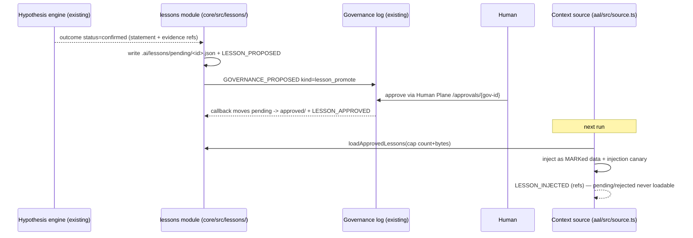
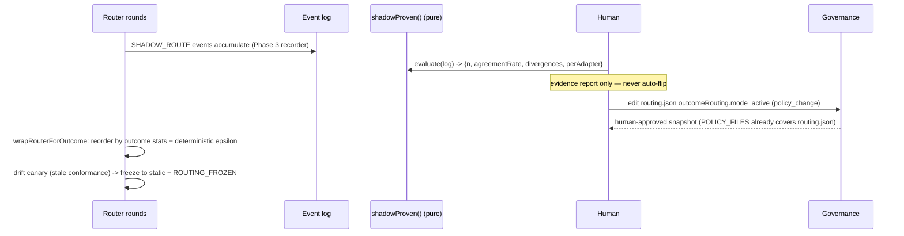
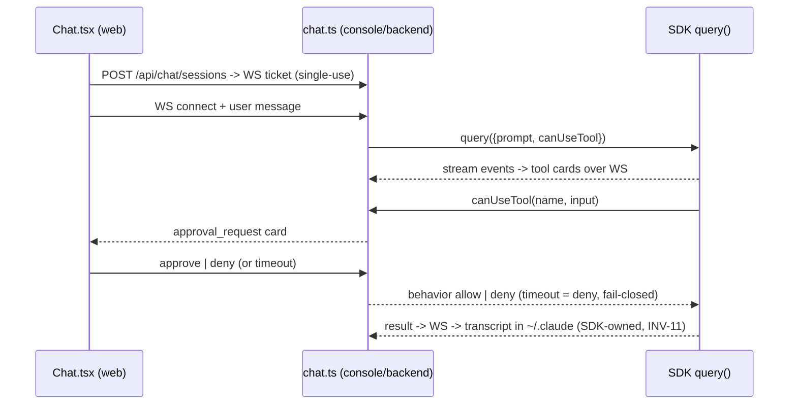

# Design — platform-phase4

> Status: approved 2026-07-08, amended 2026-07-08 (/spec-analyze AZ-1..AZ-14 sync)
> Mode: design-first (requirements.md derived FROM this design; REQ IDs backfilled into the traceability table at derive time).
> Upstream: `unified-platform-spec.md` **v1.3** §14 Phase 4 (authoritative scope + DoD) + `clarifications.md` (binding user decisions, 2026-07-08).

## Architecture Overview

Phase 4 completes the roadmap: it wires the human-approval path end-to-end (carried
Phase-3 gap), adds the goal-level continuous stages (issue intake in front, canary
deploy + automated rollback behind), activates the Learning Plane (lessons +
outcome routing) behind human governance, closes the fusion gaps (planner-role
auto-routing + a genuine uplift interval), and finishes the Console (F-Chat +
themes + responsive + i18n TH/EN). No Ring boundaries move: everything lands as
new modules in `core/` (vendor-free), pure helpers in `aal/`, and composition +
surface in `console/`.

```
            ┌──────────────────────── CONSOLE ────────────────────────┐
            │ Issues UI → F-Loop (deploy card) → F-Chat → themes/i18n │
            └──────┬──────────────────┬──────────────┬────────────────┘
   .ai/issues/*.json           Human Plane API   SDK query() (Claude-specific,
        │ human approve         (§10.3, exists)   non-parity, §15 item 3)
        ▼                            ▲
  draft goal.yaml ──(human runs)──► supervised loop composition (loop-run.ts)
                                     │  planner fusion trigger (§7.5) BEFORE task loop
                                     │  outcome-routed router (shadow → ACTIVE, governed)
                                     ▼
        task loop → REVIEWING ─ decideAutoApprove ─┬─ auto ──► runApprovedMerge
                                                   └─ package ► approvals Map → human
                                                                decision → runApprovedMerge
                                     ▼
        COMPLETED ──(contract has deploy: + approval)──► DEPLOY STAGE (core/src/deploy/)
                     CANARY → OBSERVING → EXPANDED | ROLLED_BACK | ESCALATED
                                     ▼
        confirmed hypotheses ──► pending lesson ──(governance approve)──► injectable
```

Key boundaries preserved:
- **INV-7**: all new `core/`+`aal/` code stays vendor-name-free (incl. comments).
- **INV-1/2**: every deploy/observe/rollback command and every lesson probe is run
  by the core executor; COMPLETED and DEPLOY states derive only from core-run
  evidence.
- **INV-16**: outcome-routing activation, lesson promotion, and any epsilon/mode
  change are governance-gated human decisions (routing.json is already in
  `POLICY_FILES`, `core/src/governance/policy.ts:22`).
- **INV-17 / F-Chat**: spec §15 item 3 sanctions `query()` + `canUseTool` "สำหรับ
  SDK enhanced view/autonomous เท่านั้น — ไม่ใช่ interactive parity path"; the
  "interactive approval = CLI-native" rule is scoped to F-Term. F-Chat carries a
  mandatory non-parity banner (§8 F-Chat row).

**Pre-declared cut line (recorded descope order if squeezed):** F-Chat fork →
i18n depth (EN-complete, TH partial) → planner auto-routing. Anything cut moves
to the spec changelog, never silently.

## Sequence Diagrams

### 1. Approval package end-to-end (workstream A — carried gap #1)

```mermaid
sequenceDiagram
  participant Loop as runSupervisedLoop
  participant AM as runAutoMerge (decide)
  participant HP as Human Plane API
  participant H as Human (F-Loop / 2nd device)
  participant ME as runApprovedMerge (shared engine)
  Loop->>AM: REVIEWING + gate report
  AM-->>Loop: decision=approval_package (reason)
  Loop->>Loop: buildApprovalPackage(diff/evidence/attestations)
  Loop->>HP: approvals.set(id, pkg) + APPROVAL_PACKAGE_CREATED
  H->>HP: GET /approvals
  H->>HP: POST /approvals/{id} {decision, attestations}
  HP->>Loop: onDecision(taskId, approve|reject)
  alt approve
    Loop->>Loop: transition human_approved -> APPROVED
    Loop->>ME: merge_queued -> merge/T2 -> sampled audit
    ME-->>Loop: AUDITED -> COMPLETED
  else reject
    Loop->>Loop: changes_requested -> CHANGES_REQUESTED (terminal this run)
  else timeout (approvalTimeoutMs)
    Loop->>Loop: escalate(approval_timeout) -> ESCALATED
  end
```

### 2. Canary deploy + automated rollback (workstream B — Loop 5 §9.1)

```mermaid
sequenceDiagram
  participant Loop as composition (post-COMPLETED)
  participant HP as Human Plane
  participant D as runDeployStage (core/src/deploy/)
  participant EX as Executor (core-run, evidence)
  Loop->>HP: deploy approval package -> GET /deploy (NOT the task approvals Map)
  HP-->>Loop: POST /deploy/decision {approve, attestations} -> onDeployDecision
  Note over HP,Loop: separate callback — never onDecision (task machine is terminal at COMPLETED)
  Loop->>D: start (frozen deploy config)
  D->>EX: canary_cmd (network: none — simulation, INV-14)
  D->>EX: observe_cmd × probes (exit code = health)
  alt failures <= threshold
    D->>EX: expand_cmd
    D-->>Loop: DEPLOY_STATE: EXPANDED
  else failures > threshold
    D->>EX: rollback_cmd
    alt rollback exit 0
      D-->>Loop: DEPLOY_STATE: ROLLED_BACK + root-cause payload (probe refs)
    else rollback fails
      D-->>Loop: DEPLOY_STATE: ESCALATED (rollback_failed)
    end
  end
```

### 3. Lessons pipeline (workstream D — §10.4)



### 4. Outcome routing shadow → ACTIVE (workstream E — §10.4, INV-16)



### 5. F-Chat canUseTool bridge (workstream G)



## Data Models & Interfaces

### A. Approval pipeline production wiring (carried #1)

Anchors: `console/backend/src/loop-run.ts:341` (empty Map), `:414` (auto-merge
before any human step), `core/src/merge/auto-merge.ts:180`, `core/src/human/approval.ts:62`,
`core/src/human/api.ts:83`.

Refactor `runAutoMerge` so both approval bases share one merge engine:

```ts
// core/src/merge/auto-merge.ts (extracted from the existing post-auto_approved body)
export interface ApprovedMergeOptions { /* runId, taskId, state: 'APPROVED', repoDir,
  taskBranch, mainBranch, originalReport, gateConfigRelPath, auditSampleRate,
  log, evidence, clock, queue? */ }
export async function runApprovedMerge(opts: ApprovedMergeOptions): Promise<AutoMergeOutcome>;
// runAutoMerge = decideAutoApprove -> (auto_approved + AUTO_APPROVED event -> runApprovedMerge)
//              | approval_package (unchanged return, still no state change)
```

Composition additions in `runSupervisedLoop`:

```ts
// loop-run.ts — new option
approval?: {
  timeoutMs: number;                    // decision window; expiry -> escalate('approval_timeout')
  maxDiffBudget?: number;               // default 400 (§11.2)
}
```

- On `decision === 'approval_package'`: compute `diffRef = evidence.put(git diff
  main...task)`, `diffLineCount`, `worktreeHash`; call `buildApprovalPackage`
  with goal excerpt/acIds/riskClass=`effectiveRisk`; `kind:'escalate'`
  (split_required) escalates as today. Otherwise `approvals.set(pkg.id, pkg)` +
  `APPROVAL_PACKAGE_CREATED` event. The Map passed to `createHumanPlaneServer`
  is now this shared instance (fixes `:341`).
- `awaitDecision(deferred, clock, timeoutMs)`: `onDecision` is a synchronous
  HTTP callback with no waker — the composition wraps it so a decision
  resolves a pending deferred promise (kill resolves it too). `awaitDecision`
  runs INSIDE the scope where the Human Plane server is still open (before the
  inner `finally { server.close() }`), and a timeout appends
  `escalate('approval_timeout')` → final ESCALATED **before** `log.close()`
  in the outer finally.
- approve → state APPROVED → `runApprovedMerge` → final from merge engine
  (COMPLETED / ESCALATED merge_conflict / t2_failed / audit_mismatch — all
  existing paths). reject → CHANGES_REQUESTED is **terminal for this run**
  (post-reject repair continuation = recorded limitation; cross-restart resume
  likewise deferred, see Non-Functional).
- `attestations` completeness is already enforced server-side (`api.ts:126`).

### B. Deploy plane — contract + Loop 5 engine (greenfield core)

New optional goal.yaml section, parsed in `freezeContract`
(`core/src/contract/contract.ts:43`, stays zero-dependency):

```yaml
deploy:                       # absent -> no deploy stage (backward compatible)
  canary_cmd: "sh deploy/canary.sh"
  observe_cmd: "sh deploy/health.sh"     # exit 0 = healthy probe
  expand_cmd: "sh deploy/expand.sh"
  rollback_cmd: "sh deploy/rollback.sh"
  observe: { probes: 5, failure_threshold: 1, interval_ms: 1000 }
```

```ts
// core/src/contract/contract.ts — TaskContract gains:
deploy?: {
  canaryCmd: string; observeCmd: string; expandCmd: string; rollbackCmd: string;
  observe: { probes: number; failureThreshold: number; intervalMs: number };
};
```

**No `allow_network` knob.** The executor's only network grant is
`allowlist:package_install` (`core/src/executor/executor.ts:302-310`); every
`RUN_COMMAND` is worktree-confined. Deploy commands run at `network: 'none'` —
consistent with the command-level-simulation framing (assumption B4) and with
§10.1's "ห้ามสลับ" ordering (egress default-deny stays the hardest layer,
INV-14). Real egress for a real deploy target would need a new governed grant
name wired fail-closed into the executor — a Ring-0 change explicitly OUT of
this phase, recorded as a limitation.

New `core/src/deploy/stage.ts` (NOT named canary.ts — `core/src/security/canary.ts`
is the injection tripwire). Deploy is a **goal-level stage with its own small
state machine**, recorded as `DEPLOY_STATE` events — it never mutates the task
machine (`machine.ts` table untouched; COMPLETED stays terminal for tasks):

```ts
export type DeployState =
  | 'PENDING_APPROVAL' | 'CANARY' | 'OBSERVING' | 'EXPANDED'
  | 'ROLLING_BACK' | 'ROLLED_BACK' | 'ESCALATED';
export interface DeployStageDeps {
  runId: string; taskId: string;
  config: NonNullable<TaskContract['deploy']>;  // frozen (hash covers it)
  executor: Executor;                            // core runs every command (INV-1)
  log: EventLog; evidence: EvidenceStore; clock: Clock;
}
export interface DeployOutcome {
  finalState: DeployState;
  probeResults: { pass: boolean; evidenceRef: string }[];
  rootCause?: { failedProbes: number; refs: string[] };  // on ROLLED_BACK
}
export async function runDeployStage(deps: DeployStageDeps): Promise<DeployOutcome>;
```

- Every command runs through the executor as `RUN_COMMAND` (evidence-captured,
  path-policied, `network: 'none'` — see above).
- Observe: run `observe_cmd` `probes` times, `intervalMs` apart (clock-injected,
  tickable in tests); failures > `failureThreshold` → `ROLLING_BACK` → run
  `rollback_cmd`; exit 0 → `ROLLED_BACK` + `rootCause` payload (probe refs);
  non-zero → `ESCALATED('rollback_failed')`. `expand_cmd` non-zero takes the
  same rollback path with root cause `expand_failed` (AZ-3). No retry loops.
  Freeze-time bounds: `probes >= 1`, `failure_threshold < probes` (AZ-3 — a
  threshold rollback could never exceed is refused at freeze).
- Composition (`loop-run.ts`): after task `finalState === 'COMPLETED'` and
  `contract.deploy` present — build a **deploy approval package** ALWAYS
  (hard human floor, AZ-4: `production_deployment` in approvalPolicy makes it
  explicit, its absence never disables the gate) (id `deploy-<taskId>`,
  **riskClass 'L4' attestations** — the L4 set is the only one containing
  "recoverable OR explicit rollback + backup" (`approval.ts:45-55`), exactly
  what a deploy approver must attest; diffRef = the merge commit; assumptions
  note `network: none (simulation)`). Deploy decision shares
  `approval.timeoutMs` (default 30 min, AZ-1/AZ-2); timeout → `DEPLOY_DECISION
  {decision:'timeout'}`, stage skipped, task stays COMPLETED. The Human Plane
  server stays open through the deploy stage and, after EXPANDED, for a
  manual-rollback window `deploy.expandedWindowMs` (default 10 min) →
  `DEPLOY_WINDOW_CLOSED` then close (AZ-2).
- **The deploy package NEVER enters the task `approvals` Map.** A task-package
  approve calls `onDecision` → `transition(currentState(), 'human_approved')`,
  and `currentState()` is COMPLETED (terminal) → guaranteed 409. Deploy gets
  its own surface and callback (below); `GET /approvals` stays
  task + governance only.
- reject → deploy skipped, `DEPLOY_DECISION {decision:'reject'}` recorded, task
  stays COMPLETED (merge already audited). Manual rollback: `POST
  /deploy/rollback`, legal ONLY from `EXPANDED` (post-expand regret) — during
  CANARY/OBSERVING the automated path owns rollback, and interrupting a
  running stage is the kill switch's job, not this endpoint's.
- **Honest labeling (§16):** every surface (events, F-Loop card, docs) calls
  this command-level deploy simulation on the target repo — not a production
  rollout.

Human Plane extension (`core/src/human/api.ts` — additive, Phase-1 behavior
preserved when callbacks absent; deploy decisions are a SEPARATE path from
`onDecision`, which stays task-machine-only):

```ts
// HandlerDeps gains (all optional):
deployState?(): DeployState | null;
deployApproval?(): ApprovalPackage | null;               // pending deploy package, if any
onDeployDecision?(decision: 'approve' | 'reject'): { ok: boolean; state?: DeployState; detail?: string };
onDeployRollback?(): { ok: boolean; detail?: string };   // manual, EXPANDED-only guard
// Routes: GET /deploy — 501 not composed | {state:null, approval:null} composed-idle
//         | {state, approval} (AZ-5); POST /deploy/decision {decision, attestations}
//         (attestation completeness enforced same as tasks, api.ts:126 pattern);
//         POST /deploy/rollback (409 unless EXPANDED). All audited.
```

### C. Issue intake (greenfield console)

Store `.ai/issues/<id>.json` (append-only status transitions via rewrite +
audit; id = `iss-<sha256 slice>` of title+createdAt):

```ts
export interface IssueRecord {
  id: string; title: string; body: string;          // body = UNTRUSTED DATA (INV-3)
  createdAt: string;
  status: 'open' | 'converted' | 'rejected';
  goalDraftPath?: string;                            // set on convert
}
```

`console/backend/src/issues.ts` + routes in `app.ts` (join the existing
auth/rate-limit/audit middleware — §13.3 sweep covers them):

- `POST /api/issues` {title ≤200, body ≤20_000} → create (413 over caps).
- `GET /api/issues` → list (body returned as text; web renders as plain text —
  no HTML/markdown interpretation of untrusted content).
- `POST /api/issues/{id}/convert` (**human action**) → writes
  `.ai/issues/<id>.goal.yaml`: goal id/title from the issue, objective = body
  excerpt, `acceptance_criteria: []` scaffold + a `# HUMAN: fill ACs, risk,
  budget before running` header, budget defaults from §11.1. Status →
  converted + audit entry. 409 if not open.
- **Never auto-starts a run — and the safety claim is exactly this, no more:**
  `goal.objective` becomes task framing in the contract (it is NOT a MARKed
  untrusted piece — no such mechanism exists for contract fields). What stops
  an injection-laced issue from running is that (1) convert is an authed,
  audited human action, (2) the draft's empty `acceptance_criteria: []` is
  structurally refused by `freezeContract` (`contract.ts:49`), so (3) a human
  MUST edit the draft — reading it — and explicitly pass it to `platform loop
  run --goal`, where governance preflight gates the run. Two deliberate human
  touches, recorded. Web UI shows an "issue text is untrusted data" banner.

### D. Lessons pipeline (greenfield core + governance extension)

Anchors: `core/src/repair/hypothesis.ts` (`HypothesisOutcome.status ===
'confirmed'`), `core/src/governance/policy.ts:17` (GovernanceKind).

```ts
// core/src/lessons/lessons.ts
export interface LessonRecord {
  id: string;                    // lsn-<sha256(statement+evidence).slice> — idempotent
  statement: string;             // from the confirmed hypothesis
  sourceRunId: string; sourceTaskId: string;
  evidenceRefs: string[];        // probe outputs proving it (content-addressed)
  proposedAt: string;
  approvedAt?: string;           // set only by governance approval
}
export function proposeLessonFromHypothesis(o: {...}): LessonRecord | null; // writes pending/, LESSON_PROPOSED, governance proposal
export function loadApprovedLessons(o: { dir: string; governanceLogPath?: string;
  cap: { maxLessons: number; maxBytes: number } }): LessonRecord[];
```

- Layout: `.ai/lessons/pending/<id>.json` → (approve) → `.ai/lessons/approved/<id>.json`.
  Loader reads **only** `approved/`; a pending/rejected lesson is structurally
  unloadable (the fault-injection test).
- Governance: `GovernanceKind` gains `'lesson_promote'` and the
  proposal/change records gain a `lessonId?` field (`taskId?` alone cannot
  identify which file to move — `policy.ts:42-66`); `applyGovernanceApproval`
  gains a `promoteLesson(lessonId)` callback (same shape as `fireQuarantine`)
  that moves the file + appends `LESSON_APPROVED`. Lessons ride the existing
  proposal list on `GET /approvals` — no second plane. **Offline-approval
  reconciler:** a lesson approved via the CLI while no run is live has no
  callback to move its file — `loadApprovedLessons` reconciles against the
  governance log at load time (promoted-but-unmoved → move then load),
  mirroring the deferred-quarantine pattern (`loop-run.ts:249-255`).
- Injection goes **through the core context-builder pipeline, not around it**:
  `buildContext` gains an optional lessons input so approved lessons pass
  SEED → GOVERN (secret scan = BLOCK — a secret-bearing lesson never reaches a
  prompt) → MARK (data marking + injection canary). The `feedback`-style
  post-build append path (`source.ts:167-180`) is explicitly NOT used — it
  bypasses GOVERN/MARK. `aal/src/source.ts` only supplies the loader output
  into `buildContext`. Cap by count+bytes; each injection appends
  `LESSON_INJECTED {ids, refs}` — the lesson hit-rate metric is a fold over
  these events. Lessons are untrusted data by INV-3 (spec names "lessons
  ของระบบเอง" explicitly).
- Corrupt lesson file → skipped + `ERROR` event (a bad lesson never blocks a
  run).

### E. Outcome routing ACTIVE (extend aal)

Anchors: `aal/src/shadow.ts`, `aal/src/router.ts:25` (filters only remove),
`loop-run.ts:107` (`wrapRouterForShadow`), `auditSampleValue`
(`core/src/merge/auto-merge.ts:171`) as the deterministic-percent pattern.

```jsonc
// .ai/policies/routing.json (already governance-hashed, POLICY_FILES)
{ "outcomeRouting": { "mode": "shadow",        // off | shadow | active — mode flip = policy_change approval
    "epsilon": 10,                              // percent, integer
    "minSamples": 20,
    "minDivergences": 1 } }                     // AZ-10 — full criteria set governance-hashed
```

```ts
// aal/src/shadow.ts additions (pure). shadowProven is a thin criteria check ON TOP
// of the folds that already exist — compareShadow (shadow.ts:80) supplies
// n/agreementRate/divergences; computeShadowOutcomeStats MOVES from loop-run.ts:82
// into aal/src/shadow.ts (exported) and supplies perAdapter. No reimplemented math.
export interface ShadowProofCriteria { minSamples: number; minDivergences?: number }
export interface ShadowProofReport {
  proven: boolean; n: number; agreementRate: number;
  divergences: ShadowDivergence[];
  perAdapter: Record<string, ShadowOutcomeStats>;
}
export function shadowProven(events: PlatformEvent[], c: ShadowProofCriteria): ShadowProofReport;
// evidence FOR the human governance decision — nothing consults it automatically (INV-16)

// aal/src/router.ts addition
export function wrapRouterForOutcome(router: Router, deps: {
  registry: Registry;
  stats: () => Record<string, ShadowOutcomeStats>;
  epsilonPercent: number;
  exploreKey: () => string;      // runId+taskId+round — deterministic, replayable
  log: EventLog; runId: string; taskId: string;
}): Router;
```

- Active reorder: sort `eligibleAdapters()` output by reviewing-reached rate
  desc; ties keep router order (stable); adapters with zero attempts keep
  original position (never invent preference — same rule as
  `shadowWouldChoose`). Exploration: `hashPercent(exploreKey()) <
  epsilonPercent` → swap index 0/1 (explore the runner-up) — the
  `auditSampleValue` fold, no RNG. Precedence (AZ-11): frozen >
  insufficient_data > reorder > epsilon — swap only when a reorder actually
  occurred (≥1 rated adapter) and eligible ≥ 2; frozen/insufficient rounds
  never swap. Emits `OUTCOME_ROUTE {order, explored, basis}`.
- Freeze: `shadowFrozen(registry.all())` → return the unwrapped order +
  `ROUTING_FROZEN` event once per round (drift canary → static routing, DoD
  line).
- Mode wiring in composition: `off` → plain router; `shadow` → existing
  recorder; `active` → recorder outside `wrapRouterForOutcome` (shadow keeps
  observing the now-reordered live choice).
- Hint filters still apply after reorder (reorder never re-adds a filtered
  candidate — REQ-5 semantics preserved).

### F. Planner-role fusion auto-routing (carried #2)

Anchors: `loop-run.ts:366` (`role: 'implementer'` hardcoded),
`console/backend/src/fusion.ts:91` (`createFusionToolHandler`), `:120`
(`fusionActive`), `aal/src/fusion/run.ts:133` (`runFusion`).

- `.ai/policies/fusion-profiles.json` gains `triggers: { plannerRole: boolean }`
  (governance-hashed file already).
- New composition step in `runSupervisedLoop` (before the task loop), active
  when `triggers.plannerRole && opts.planning?.enabled`:
  `runPlannerFusion` (in `console/backend/src/fusion.ts`) dispatches role
  `'planner'` through the (wrapped) router for panel membership, calls the
  existing `runFusion` with the `plan` artifact profile
  (deliberate-synthesis). **Panel input is pinned:** the frozen contract's
  goal {id, title, objective} + acceptance criteria — nothing else (the loop
  is a single-task composition; there is no task graph to plan over). The
  planner dispatch uses the SAME router instance as the task loop — whatever
  mode governance pinned; empty stats behave per the insufficient-data rule,
  no special case (AZ-13). The resolved plan is validated against
  `plan.schema.json` in `.ai/schemas/` — **created by this workstream** (the
  dir has only task-result/hypothesis/deliberation-analysis today, AZ-12;
  structural validation ONLY — no full planning gate exists in this
  composition, and the design says so rather than implying one), stored as
  evidence + `PLAN_RESOLVED {winner, panelSize, costUnits}` event, and passed
  into the task context as MARKed data. Consensus never crosses a gate (§16).
- CI: FakeAdapters prove exactly the **trigger contract** — dispatch happens
  iff the policy flag + option are on, and never when `fusionActive` is false
  (the structural live gate, Phase-3 pattern). CI claims nothing about plan
  quality.
- Uplift measurement (carried #3) is a LIVE-task procedure, not code: a
  `code_diff`/`tests` fusion activation + single-model baseline on the same
  calibration corpus task; interval computed by the existing
  `computeFusionCalibration` and recorded in `docs/calibration/` (§12 small-n
  interval).

### G. F-Chat (greenfield console — Claude-specific, allowed outside core/aal)

`console/backend/src/chat.ts` + `console/web/src/Chat.tsx`:

```ts
export interface ChatDeps {
  queryFn: QueryFn;              // injected; CI uses a scripted fake — no SDK, no network
  auditSink: (e: Record<string, unknown>) => void;
  approvalTimeoutMs: number;     // canUseTool expiry -> deny (fail-closed)
}
// Routes (behind existing console auth + rate limit + audit):
// POST /api/chat/sessions {projectDir, resume?, fork?} -> {sessionId, wsTicket}  (single-use ticket, term.ts pattern)
// WS   /api/chat/ws?ticket=...   client->{user_message|tool_decision}, server->{stream_delta|tool_card|approval_request|error|done}
```

- Streaming: SDK `query()` with `canUseTool` bridged to a per-session pending
  approval (diagram 5); timeout or WS drop → deny + audit. Fork/resume via SDK
  session options (`resume`, `forkSession`) — transcripts stay SDK-owned in
  `~/.claude` (no shadow copy, INV-11; F-Sess sees them for free). Bad/expired/
  reused WS ticket closes **4403** — the code F-Term actually uses
  (`term-runtime.ts:75`), AZ-14.
- Dependency: `@anthropic-ai/claude-agent-sdk` added to `console/backend`
  pinned to the SAME version `adapters/` already uses (no new floating dep).
- UI: message stream + tool cards + approve/deny buttons + **permanent
  NON-PARITY banner** ("ไม่ครบเท่า CLI — slash commands/plan mode ไม่มี; ใช้
  Terminal สำหรับ 100% parity") + quota estimate line (INV-13).

### H. Console themes + responsive + i18n (extend web)

- **Themes**: `console/web/src/styles.css` — CSS custom properties on `:root`
  (light) + `[data-theme="dark"]`; initial theme = `prefers-color-scheme`,
  user toggle persists `localStorage('console-theme')` and stamps
  `data-theme` on `<html>`. Components migrate hardcoded colors to `var()`
  (only color values move; layout styles stay put). Contrast AA in both
  themes (CODING_STANDARDS accessibility floor).
- **Responsive**: `@media (max-width: 768px)` — nav collapses, tables gain
  `overflow-x: auto` wrappers, cards stack single-column; TerminalPanel uses
  its existing fit behavior.
- **i18n**: `console/web/src/logic/i18n.ts` — no dependency:

```ts
export type LocaleKey = keyof typeof en;           // typed keys, TH must cover EN
export const t: (k: LocaleKey) => string;          // React context + hook, persisted toggle
```

  UI chrome only. Backend-authored strings (event payloads, CLI output, the
  INV-13 "มูลค่าเทียบราคา API" label, error details) render verbatim —
  translating evidence would falsify it.

### I. Security sweep + calibration wiring (extend)

- `app-hardening.test.ts` extends over every new endpoint (issues, chat,
  deploy, lessons/governance listing): auth required, rate-limited, redaction
  applied, audit entries written, fail-closed non-loopback, no
  token/credential exposure (§13.3 checklist as executable tests where
  possible — Phase-3 pattern).
- Calibration report gains: lesson injection count/hit-rate fold, shadowProven
  report snapshot, fusion uplift interval slot (filled by the live task) —
  extending the existing `computeCalibration` output shape, not replacing it.

## Technology Decisions

| Decision | Choice | Rationale |
|---|---|---|
| Deploy engine location | new `core/src/deploy/stage.ts`, own DEPLOY_STATE machine | vendor-free, executor-run (INV-1); task machine untouched — COMPLETED stays terminal; avoids `security/canary.ts` name collision |
| Deploy decision path | separate `GET /deploy` + `POST /deploy/decision` + `onDeployDecision` | reusing the task Map would call `onDecision` → `transition(COMPLETED, human_approved)` → guaranteed 409 (architect finding #1); deploy must never touch the task machine |
| Deploy network | `network: 'none'`, no contract knob | executor has no general egress grant (`executor.ts:302`); opening one is a Ring-0 governance change out of scope (architect finding #2, INV-14) |
| Merge continuation | extract `runApprovedMerge` from `runAutoMerge` | one merge/audit engine for both approval bases; no duplicated revert/audit logic |
| Approval wait | in-process `awaitDecision` + timeout → ESCALATED | wallclock-bounded; cross-restart resume deferred (recorded limitation) |
| Lesson injection path | through core `buildContext` (SEED→GOVERN→MARK), never post-build append | post-build append bypasses secret-scan + marking (architect finding #3); GOVERN blocks secret-bearing lessons |
| Issue store | flat JSON files in `.ai/issues/` | matches `.ai/` layout; no DB (standards: no real DB); git-diffable audit trail |
| Lesson approval | extend `GovernanceKind` with `lesson_promote` | reuses proposal list + Human Plane approve route — no second plane (INV-16 machinery already human-gated) |
| Epsilon exploration | deterministic hash percent (`auditSampleValue` pattern) | replayable from the event log; no RNG in routing |
| Routing config | `outcomeRouting` block in `routing.json` | file already in POLICY_FILES → mode flip is governance-gated by construction |
| F-Chat SDK access | direct SDK dep in `console/backend`, `queryFn` injected | console is Claude-specific by design (§8); injection keeps CI SDK-free; version pinned to adapters' |
| i18n | hand-rolled typed dictionary + context | two locales, UI chrome only — a library adds a dep for nothing (dependency rules) |
| Theming | CSS custom properties + `data-theme` | native platform feature; no CSS framework |
| Chat transport | WS + single-use ticket | same hardened pattern as F-Term (§13.3 WS rules) |

## Error Handling Strategy

| Case | Handling |
|---|---|
| Approval decision timeout | `escalate('approval_timeout')` → ESCALATED; package removed from Map; audit entry |
| Reject decision | CHANGES_REQUESTED terminal for this run (no silent retry); recorded limitation |
| Deploy config malformed / cmd empty | `ContractInvalidError` at freeze time — refused before any approval, never mid-stage |
| Canary/observe failures > threshold | rollback_cmd; exit 0 → ROLLED_BACK + root-cause (probe refs); non-zero → ESCALATED('rollback_failed'); no retry loops |
| Deploy declined by human | stage skipped, recorded; task stays COMPLETED (merge already audited) |
| POST /deploy/decision with no pending package | 404; with incomplete attestations → 400 (same rule as tasks) |
| Deploy decision timeout | `DEPLOY_DECISION {decision:'timeout'}`, stage skipped, task stays COMPLETED (AZ-2) |
| expand_cmd non-zero | rollback path, root cause `expand_failed` (AZ-3) |
| EXPANDED window expiry | `DEPLOY_WINDOW_CLOSED`, server closes (AZ-2) |
| POST /deploy/rollback outside EXPANDED | 409 (automated path owns rollback during CANARY/OBSERVING; kill switch covers interruption) |
| Deploy command attempts network | blocked by the `network:'none'` sandbox — surfaces as a failed probe/command with evidence, never silent egress |
| Secret-bearing lesson | GOVERN secret-scan BLOCKS at buildContext — lesson never reaches a prompt; ERROR event |
| Issue over size caps | 413, nothing written |
| Convert non-open issue | 409 |
| Corrupt lesson JSON | skip + ERROR event; run continues |
| Lesson cap exceeded | truncate by count then bytes, injected set recorded in LESSON_INJECTED |
| Routing stats empty / zero attempts | active mode keeps router order (basis `insufficient_data`) — never invents preference |
| Drift canary (stale conformance) | routing freeze → static order + ROUTING_FROZEN event (once per round) |
| canUseTool timeout / WS drop | deny (fail-closed) + audit |
| SDK query() stream error | error card to client, session closed, audit; no retry storm |
| WS ticket reuse / expired / missing | 4403 close — the code F-Term actually uses (`term-runtime.ts:75`, AZ-14) |
| Fusion trigger while `fusionActive` false | dispatch skipped + event notes gate closed (CI-proof path) |

## Testing Strategy

All tasks except the final LIVE pass prove with fakes only (FakeAdapter, fake
`queryFn`, fixture repos) — zero quota in CI (Phase-3 discipline). Fault-injection
DoD lines map to named CI tests:

| DoD line (v1.3 §14) | CI test (fakes) |
|---|---|
| approval package → approve → COMPLETED; reject → CHANGES_REQUESTED; timeout → ESCALATED | loop-run tests driving the Human Plane handler directly (A) |
| canary fail → rollback + ROLLED_BACK + root cause; rollback fail → ESCALATED | deploy stage tests on fixture scripts with forced exit codes (B) |
| deploy decision via /deploy/decision works AND a deploy package via the task-approvals path is impossible | api.ts tests: /deploy/decision happy+guard paths; regression test asserting deploy approval never routes through onDecision (finding #1) (B) |
| unapproved lesson never enters context; injected lesson MARKed + canary; secret-bearing lesson BLOCKED | lessons loader + buildContext injection tests incl. GOVERN block (D) |
| drift canary → routing freeze | wrapRouterForOutcome with a stale registry entry (E) |
| injection-laced issue never becomes goal.yaml without human | issues API test: convert is the only path and is authed + audited; empty-AC draft refused by freezeContract (C) |
| planner trigger dispatches iff policy+option on | composition test with FakeAdapters, fusionActive=false (F) |
| §13.3 over new endpoints | app-hardening extensions (I) |
| F-Chat approvals fail closed | chat.ts tests with scripted queryFn (G) |
| themes/responsive/i18n | component tests for t()/theme toggle + `viewports:` evidence lines (H) |

LIVE pass (single final task, never CI, real iTerm TTY — Phase-3 technique):
fusion uplift interval (code_diff/tests activation + single-model baseline,
~2x task-13 fusion spend), F-Loop approve from a second physical device over
tailnet (closes the Phase-3 not-completed DoD item), live canary
deploy + forced-failure rollback on a fixture target, live lesson
approve + inject, `shadowProven` evaluated on the accumulated real log with the
activation decision recorded honestly (insufficient n = recorded gap, not a
fake number), F-Chat live smoke. Runbook: `docs/calibration/RUNBOOK-phase4.md`.

## Non-Functional Considerations

- **Quota (INV-13):** fusion ≈ 4–5× per activation point; the live pass budgets
  ~2× task-13 fusion spend, hard-capped in `fusion-profiles.json` costUnits;
  chat surfaces a quota estimate; deploy/lessons/routing spend nothing (core +
  fakes).
- **Claim discipline (§16):** "uplift **interval** recorded", "activation
  **mechanics** proven", "deploy = command-level simulation" — these exact
  phrasings flow into events, UI copy, runbook, and task evidence.
- **Recorded limitations:** no cross-restart approval resume (package dies with
  the process → ESCALATED on timeout); reject ends the run (no auto repair
  round); outcome-routing divergence data is sparse with 2 lineages — the DoD
  claims mechanics + criteria evaluation, not outcome improvement; deploy
  commands run without network (real-egress deploys need a future governed
  executor grant — Ring-0, out of scope).
- **Single-operator / INV-15:** no new user-facing auth surface; all new
  endpoints sit behind the existing console gate + Human Plane token.
- **Append-only (INV-10):** all new state (deploy, lessons, issues status,
  routing events) lands as events or content-addressed files; projections
  rebuildable.
- **Accessibility:** theme palettes hold AA contrast; i18n toggle + approval
  buttons keyboard-reachable; tool cards have text equivalents.

## Requirement Traceability

Design-first: REQ IDs backfilled at derive time (2026-07-08).

| Design element | Satisfies |
|---|---|
| A. runApprovedMerge extraction | REQ-1 |
| A. approval package wiring (Map + event) | REQ-2 |
| A. awaitDecision + approve/reject/timeout continuation | REQ-3 |
| B. deploy contract section (freeze, no network knob) | REQ-4 |
| B. runDeployStage + DEPLOY_STATE machine | REQ-5 |
| B. deploy approval + /deploy routes + manual rollback guard | REQ-6 |
| B/Console. F-Loop deploy card | REQ-7 |
| C. issues store/API | REQ-8 |
| C. convert → draft goal (human-gated, empty-AC refusal) | REQ-9 |
| D. proposeLessonFromHypothesis (pending + proposal) | REQ-10 |
| D. lesson_promote governance + offline reconciler | REQ-11 |
| D. injection via buildContext (GOVERN/MARK, caps, events) | REQ-12 |
| E. shadowProven (on compareShadow + relocated stats) | REQ-13 |
| E. outcomeRouting config governance | REQ-14 |
| E. wrapRouterForOutcome (reorder + epsilon + freeze) | REQ-15 |
| F. planner fusion trigger + PLAN_RESOLVED | REQ-16 |
| G. chat sessions + WS ticket transport + queryFn injection | REQ-17 |
| G. streaming + canUseTool bridge (fail-closed) | REQ-18 |
| G. fork/resume + non-parity banner + quota line | REQ-19 |
| H. themes | REQ-20 |
| H. responsive/mobile | REQ-21 |
| H. i18n TH/EN | REQ-22 |
| I. §13.3 sweep over new endpoints | REQ-23 |
| I. calibration wiring | REQ-24 |
| LIVE pass (uplift interval, 2nd-device approve, live canary/lesson/routing decision, chat smoke) | REQ-25 |

## Architect Review Findings (fresh-context spec-architect, applied)

Verdict on the draft: `REVISE (3 MAJOR, 7 MINOR)` — all findings applied above.

| # | Sev | Finding (evidence) | Resolution applied |
|---|---|---|---|
| 1 | MAJOR | Deploy approval reuse broken: task-Map approve calls `onDecision` → `transition(COMPLETED, human_approved)` → guaranteed 409 (`api.ts:95-140`, `machine.ts:70-97`) | Deploy package never enters the task Map; new `GET /deploy` + `POST /deploy/decision` + `onDeployDecision` (§B, diagram 2, tech table, regression test) |
| 2 | MAJOR | `allow_network` had no executor mechanism — only grant is `allowlist:package_install` (`executor.ts:302-310`); a contract boolean opening egress breaks §10.1 ordering/INV-14 | Knob removed; deploy runs `network:'none'` (simulation framing); real egress = future governed Ring-0 grant, recorded limitation |
| 3 | MAJOR | Lesson injection via post-build append (`source.ts:167-180` feedback path) bypasses GOVERN secret-scan + MARK canary | Lessons routed through core `buildContext` (SEED→GOVERN→MARK); secret-bearing lesson BLOCKS; explicit non-use of the append path (§D) |
| 4 | MINOR | `lesson_promote` had no lessonId in governance records; offline (CLI) approval left files unmoved forever | `lessonId?` field added; `loadApprovedLessons` reconciles against the governance log at load (deferred-quarantine pattern) |
| 5 | MINOR | `awaitDecision` had no waker; server/log close ordering unspecified | Deferred-promise wake wrapped around `onDecision`; await inside server-open scope; timeout-escalate before `log.close()` (§A) |
| 6 | MINOR | Planner fusion assumed a planning stage/gate the single-task composition lacks | Panel input pinned to frozen goal+ACs; validation = `plan` schema only, stated plainly; CI claims trigger contract only (§F) |
| 7 | MINOR | Deploy package used L3 attestations — L4 is the set containing the rollback/backup attestation (`approval.ts:45-55`) | Deploy package uses L4 attestations (§B) |
| 8 | MINOR | `shadowProven` reimplemented folds that exist (`compareShadow`, `computeShadowOutcomeStats`) | Built on `compareShadow`; `computeShadowOutcomeStats` moves into `aal/src/shadow.ts` (exported) (§E) |
| 9 | MINOR | Issue `objective` "as data" over-claimed — contract fields are not MARKed pieces | Claim rewritten: safety = authed human convert + empty-AC refusal (`contract.ts:49`) + mandatory human edit before run (§C) |
| 10 | MINOR | Manual deploy rollback concurrency unspecified (POST during OBSERVING races the stage) | `POST /deploy/rollback` legal only from EXPANDED; automated path owns rollback mid-stage; kill switch covers interruption (§B) |
