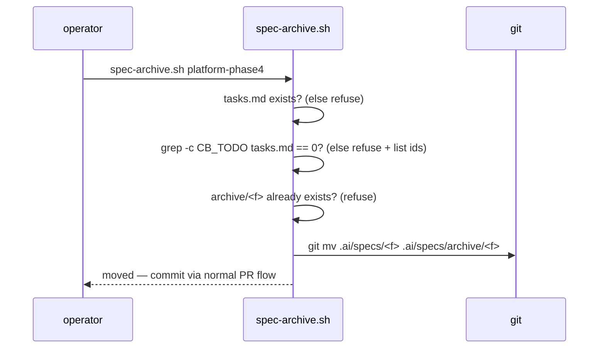
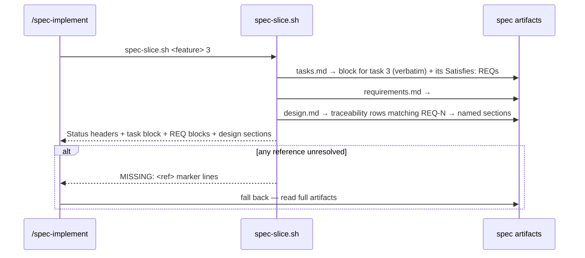

# Design: Spec Context Loading Discipline (archive + per-task slice)

> Status: approved 2026-07-11, amended 2026-07-11, amended 2026-07-12 (quick, no
> gates — REQ-3.6/3.7 bare-id matcher fix), amended 2026-07-12 (REQ-3.8-3.12,
> REQ-6 — Section-column matcher, code-fence safety, retrofit)

## Architecture Overview

Three small mechanisms plus one skill edit; the enforcement stack is untouched
(REQ-4.4):

- **`scripts/spec-archive.sh <feature>`** — validated `git mv` of
  `.ai/specs/<feature>/` → `.ai/specs/archive/<feature>/`.
- **SessionStart hook** (in `.claude/settings.json`) — its `ls .ai/specs`
  gains `grep -v '^archive$'` so the "Active specs" line lists live work only.
- **`scripts/spec-slice.sh <feature> <task-id>`** — deterministic awk
  extraction of: the task block + its `Satisfies:` REQ blocks + the design
  sections mapped to those REQs via design.md's Requirement Traceability
  table, matched by an explicit `Section` column (exact heading text, never
  the free-text design-element cell) and fence-aware so a heading-shaped line
  quoted inside a design.md example is never mistaken for a real boundary.
- **`.claude/skills/spec-implement/SKILL.md` step 1** — slice-first loading
  with three fallback triggers (MISSING marker / assembly-final task /
  operator asks).
- **CI** (`.github/workflows/ci.yml` spec-trace step) — second glob
  `.ai/specs/archive/*/` so archived specs keep tracing (REQ-1.5).

```
active work                        closed feature
.ai/specs/<f>/  ── spec-archive ─► .ai/specs/archive/<f>/
   │                                    │
   ├─ SessionStart lists it             ├─ hidden from SessionStart
   ├─ spec-slice serves tasks           └─ CI spec-trace still covers it
   └─ CI spec-trace covers it
```

## Sequence Diagrams





## Data Models & Interfaces — spec-archive.sh

```
usage: spec-archive.sh <feature>
exit 0 moved · exit 1 refusal (message lists unchecked ids / missing tasks.md)
```

Checks in order: feature dir exists under `.ai/specs/` (and NOT already under
`archive/`) → `tasks.md` present (REQ-1.4) → zero `- [ ]` checkbox lines
(REQ-1.2/1.3, pattern shared with the guard engine's `CB_TODO`) → destination
free → `git mv`. It never commits — the move rides the normal PR flow.

## Data Models & Interfaces — slice output contract & resolution rules

`spec-slice.sh` output contract (REQ-3.1, ordered):

```
== STATUS ==
requirements.md: > Status: approved 2026-07-11
design.md:       > Status: ...
tasks.md:        > Status: ...
== TASK 3 (tasks.md, verbatim) ==
- [ ] 3. <title>
      ... entire block to next checkbox/EOF ...
== REQ-2 (requirements.md) ==
## REQ-2: ... block to next ## ...
== DESIGN §Data Models & Interfaces (design.md) ==
... section block ...
== MISSING ==            (only when unresolved)
MISSING: REQ-9 (not found in requirements.md)
```

Resolution rules (all deterministic, REQ-3.2):

- Task block: from the checkbox line whose leading `N.` matches `<task-id>`
  to the next checkbox line or EOF (same region rule as the Evidence gate).
- REQ ids: every `REQ-<n>` token on the block's `Satisfies:` line(s);
  criterion-level ids (`REQ-1.2`) resolve to their parent `## REQ-1` block.
- Design sections: rows of the `## Requirement Traceability` table whose REQ
  column mentions any selected id — accepting both the `REQ-N` prefixed form
  and a bare `N.M` dotted id in the same cell (REQ-3.6; real specs use either
  style, and some tables use the bare style exclusively — a matcher that only
  recognized the prefixed form matched zero rows for those tables and dropped
  the whole design section with no signal at all, the bug amended 2026-07-12).
  Each matching row's `Section` column — located by its header name, never a
  fixed position (REQ-3.12) — is compared against every design.md `## `
  heading's own text by case-sensitive exact equality, after trimming
  whitespace from both sides; the column stores heading text only, never the
  `## ` prefix (REQ-3.8). This supersedes the original literal-substring match
  against the free-text design-element cell, retired because that cell is
  always prose summarizing the decision and never literally equals its own
  heading (see `.ai/shared/LESSONS.md` `#slice-design-cell-heading-mismatch`).
  A row whose `Section` value is absent (including a table with no `Section`
  column at all, e.g. before its spec is retrofitted) or matches no heading
  resolves to `MISSING:` per REQ-3.9 — the same signal as 3.4's existing
  unresolved-row case. Multiple rows sharing one `Section` value print that
  section's content once, not once per row (REQ-3.10). A selected REQ number
  that matches zero rows in the table at all (not just a matched row with an
  unresolved `Section`) resolves to its own `MISSING:` per REQ-3.7 — tracked
  separately from the per-row check so a table written entirely in the bare
  style still surfaces loudly instead of silently contributing nothing.
- Fence safety (REQ-3.11): the `/^## /`-boundary scan appears in three places
  in `spec-slice.sh` — `req_block()`, `section_from_heading()`, and the inline
  awk that finds the `## Requirement Traceability` section's own start/end —
  each tracks whether it is inside a ``` fenced block and ignores any
  `## `-looking line while fenced. Without this, this section truncates
  silently — no `MISSING:` marker — the moment a traceability row's `Section`
  value points at it: the fenced `spec-slice.sh` output-contract example just
  above quotes a `== REQ-2 (requirements.md) ==` line followed by a line
  starting `## REQ-2:`, which a fence-blind scan mistakes for the start of the
  next real `## ` heading. That fenced example stays in this file unchanged on
  purpose: it is this spec's own regression fixture for REQ-3.11 (see Testing
  Strategy). Note for whoever implements REQ-3.8: the step that locates the
  `## ` heading matching a `Section` value is a fourth place that scans for
  `## ` — implement it as a direct check via `section_from_heading()` itself
  rather than a separate enumeration, so it does not need its own fence guard.
- Unknown task id → exit 1 + `available: 1..N` list from the checkbox scan
  (REQ-3.3). Unresolvable REQ/section → `MISSING:` marker, exit 0 (REQ-3.4 —
  the marker, not the exit code, drives the fallback).

## Data Models & Interfaces — SessionStart edit

SessionStart edit (REQ-2.1) — the jq command's `$s` becomes:

```sh
ls .ai/specs 2>/dev/null | grep -v '^archive$' | tr '\n' ' '
```

## Data Models & Interfaces — ci.yml spec-trace loop

ci.yml spec-trace loop (REQ-1.5): `for dir in .ai/specs/*/ .ai/specs/archive/*/;`
— REQUIRES a CLI extension first (Codex-P2 #1): today `spec_trace.py main()`
accepts only `<feature>` and hardcodes `specs_dir = .ai/specs`, so a second
glob alone would look for archived features under the WRONG root and fail.
This spec adds an optional second argument `spec-trace.sh <feature>
[<specs-dir>]` (default `.ai/specs` — existing callers unchanged), threaded
through `main()` to the already-parameterized `run(feature, specs_dir)`; the
CI archive glob passes `.ai/specs/archive`.

## Data Models & Interfaces — spec-implement skill edit

skill edit (REQ-4.1/4.2/4.3) — step 1 of spec-implement becomes: run
`scripts/spec-slice.sh <feature> <id>` and read ONLY its output; fall back to
full artifacts when (a) output contains `MISSING:`, (b) the task is the final
or an assembly task, (c) the operator asked for full context. Steps 2-5 and
all gates unchanged.

## Technology Decisions

- **`git mv` over `mv`**: preserves history and stages the rename in one step;
  archive rides a normal PR (no new commit paths).
- **Slice = bash+awk, zero model judgment**: the slicer must be as
  deterministic as spec-trace; anything fuzzy goes through the MISSING →
  full-read fallback instead of guessing (REQ-3.2/3.4 — correctness outranks
  savings, per CLAUDE.md).
- **Traceability table as the design index**: it is the one artifact section
  whose format spec_trace.py already standardizes — reusing it avoids
  inventing a new cross-reference syntax.
- **Archive subdirectory over a status flag**: the SessionStart hook and every
  `ls`-based surface get the exclusion for free from the filesystem shape; a
  flag would need every consumer to parse frontmatter.
- **Existing closed phases**: the acceptance demo archives
  `platform-phase0..4` + the two bugfix specs (recorded open question:
  resolved as yes).
- **Retrofit heading split, done (REQ-6.1)**: `Data Models & Interfaces` used
  to hold five REQ groups' worth of content (REQ-1, REQ-2, the REQ-1.5 ci.yml
  edit, REQ-3, the REQ-4 skill edit) under one heading — mapping every row's
  `Section` value to that single heading would have been exact-match-correct
  but reintroduced the coarse-slice problem REQ-3 exists to fix (loading one
  task's design context, not the whole file). Split into five peer `## `
  headings, one per REQ group, all prefixed `Data Models & Interfaces — ` to
  stay visibly related: `— spec-archive.sh`, `— slice output contract &
  resolution rules`, `— SessionStart edit`, `— ci.yml spec-trace loop`, `—
  spec-implement skill edit`. The `spec-slice.sh` output-contract and its
  resolution rules stayed combined under one heading (rather than six
  headings, one per originally-labeled sub-block) because the traceability
  table already grouped REQ-3.1/3.2/3.5 as a single design element, and this
  is also where the REQ-3.11 fence fixture (the fenced output-contract
  example a few paragraphs above) lives — combining them keeps that fixture
  and every REQ-3.x row that depends on the same content under one stable
  heading, so nothing needed re-pinning after the split.

## Error Handling Strategy

| Failure | Behavior | REQ |
|---|---|---|
| unchecked tasks present | refuse, list ids | 1.2, 1.3 |
| tasks.md absent | refuse | 1.4 |
| destination exists | refuse (no overwrite) | 1.1 |
| unknown task id | exit 1 + available ids | 3.3 |
| REQ/section unresolved | MISSING: marker, still exit 0 | 3.4 |
| traceability REQ column is `REQ-N` prefixed or bare `N.M` | both match the same requirement | 3.6 |
| REQ matches zero traceability rows | MISSING: marker, still exit 0 | 3.7 |
| slice script itself absent/broken | skill instruction: fall back to full read (slice is an optimization, never a gate) | 4.2, 4.4 |
| `Section` value absent (no column, or table not yet retrofitted) or matches no heading | MISSING: marker, still exit 0 | 3.9 |
| multiple traceability rows share one `Section` value | section content printed once, not once per row | 3.10 |
| `## `-looking line appears inside a fenced code block | ignored as a boundary — never truncates the real section silently | 3.11 |

## Testing Strategy

New `.claude/hooks/tests/spec-slice.test.sh` with a fixture feature under
`mktemp -d` (mirrors CI's verify job pattern — REQ-5.2):

| Case | Asserts | REQ |
|---|---|---|
| archive with one `- [ ]` left | refuses, names the id | 1.2, 1.3, 5.1 |
| archive without tasks.md | refuses | 1.4 |
| archive clean feature | dir moved under archive/, `git status` shows rename | 1.1, 5.1 |
| spec-trace over archived fixture | still passes | 1.5, 5.1 |
| slice known task | output contains task block + its REQ block + mapped design section + Status headers | 3.1, 3.5 |
| slice unknown id | exit 1, lists available | 3.3 |
| slice with Satisfies: naming absent REQ | `MISSING:` present, exit 0 | 3.4 |
| slice where the traceability REQ column uses a bare `N.M` id, no `REQ-` prefix anywhere in the table | matched design section returned, not silently dropped | 3.6 |
| slice where a REQ matches zero traceability rows at all | `MISSING:` present for that REQ's design coverage, exit 0 | 3.7 |
| slice where a traceability row mixes a `REQ-N.M` prefixed id with a bare one in the same cell | matched design section returned (regression) | 3.6 |
| SessionStart command with archive present | output lacks `archive` | 2.1, 2.2 |
| slice where a traceability row's `Section` value is a proper substring of a real heading, or differs from it only by case | `MISSING:` — no false match, proving case-sensitive exact equality rather than substring matching | 3.8 |
| slice where a traceability row's `Section` value matches no `## ` heading, including a table with no `Section` column at all | `MISSING:` present for that design ref, exit 0 | 3.9 |
| slice where two traceability rows (same or different REQs) share one `Section` value | matched section's content appears exactly once in the output | 3.10 |
| slice against this spec's own "Data Models & Interfaces — slice output contract & resolution rules" section (the fenced `spec-slice.sh` output-contract example's embedded `## REQ-2:` line is the fixture) | full real section returned, not truncated at the fenced line; no spurious `MISSING:` | 3.11 |
| slice where the traceability table's `Section` column is not in the 2nd or 3rd position | still matched — header-name lookup finds it regardless of position | 3.12 |
| REQ-6 retrofit demo: slice a retrofitted spec's task | DESIGN content returned instead of MISSING, AND its last printed line matches the section's real last line (completeness, not just non-empty) | 6.3 |
| CI's existing spec-trace step (`ci.yml`, all 11 active specs) after the `Section` column is added | stays green — REQ column semantics (3.6/3.7 bare/prefixed matching) untouched by the new column | 6.4 |

## Requirement Traceability

| Design element | REQ | Section |
|---|---|---|
| spec-archive.sh git mv flow | REQ-1.1 | Data Models & Interfaces — spec-archive.sh |
| CB_TODO zero-count check + id listing | REQ-1.2, 1.3 | Data Models & Interfaces — spec-archive.sh |
| tasks.md-present check | REQ-1.4 | Data Models & Interfaces — spec-archive.sh |
| ci.yml second glob + specs-dir arg | REQ-1.5 | Data Models & Interfaces — ci.yml spec-trace loop |
| SessionStart grep -v archive | REQ-2.1, 2.2 | Data Models & Interfaces — SessionStart edit |
| slice output contract + resolution rules | REQ-3.1, 3.2, 3.5 | Data Models & Interfaces — slice output contract & resolution rules |
| unknown-id exit path | REQ-3.3 | Data Models & Interfaces — slice output contract & resolution rules |
| MISSING marker | REQ-3.4 | Data Models & Interfaces — slice output contract & resolution rules |
| bare `N.M` id accepted alongside `REQ-N` prefix | REQ-3.6 | Data Models & Interfaces — slice output contract & resolution rules |
| zero-row REQ match -> MISSING | REQ-3.7 | Data Models & Interfaces — slice output contract & resolution rules |
| spec-implement step-1 rewrite + fallback triggers | REQ-4.1, 4.2, 4.3 | Data Models & Interfaces — spec-implement skill edit |
| gates untouched (slice never enforces) | REQ-4.4 | Data Models & Interfaces — spec-implement skill edit |
| spec-slice.test.sh cases | REQ-5.1, 5.2 | Testing Strategy |
| Section-column exact-match mechanism (heading text, trimmed, case-sensitive, located by header name) | REQ-3.8, 3.9, 3.10, 3.12 | Data Models & Interfaces — slice output contract & resolution rules |
| fence-aware `## `-boundary scan (req_block, section_from_heading, trace-block extraction) | REQ-3.11 | Data Models & Interfaces — slice output contract & resolution rules |
| retrofit scope + peer-heading rule + completeness demo | REQ-6.1, 6.2, 6.3, 6.4 | Technology Decisions |
