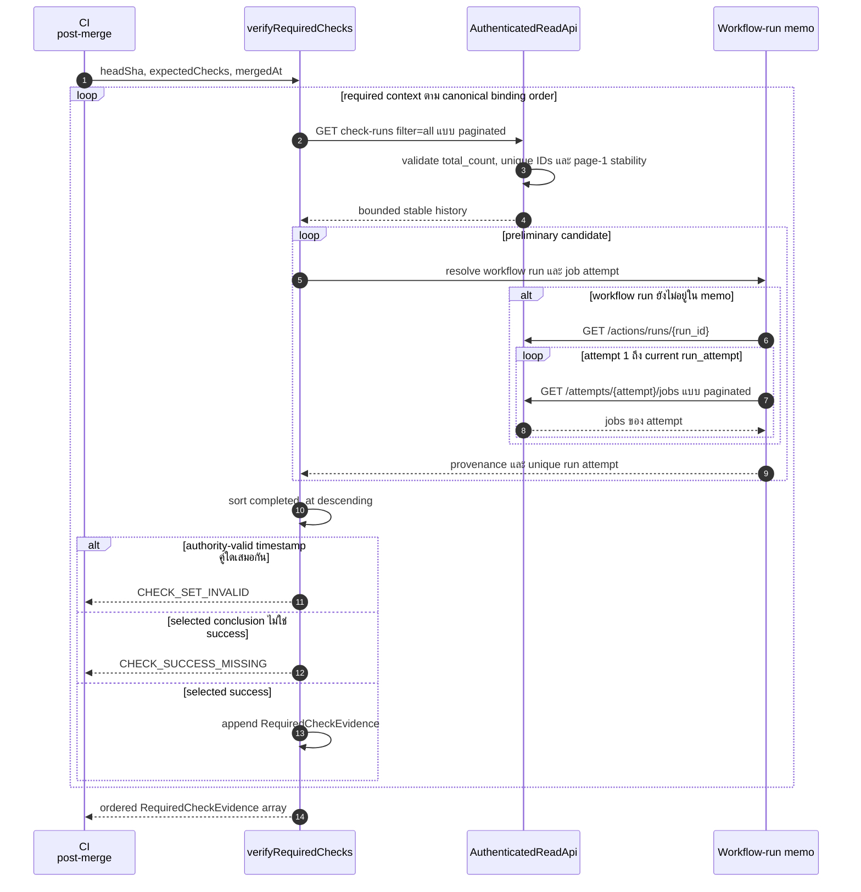
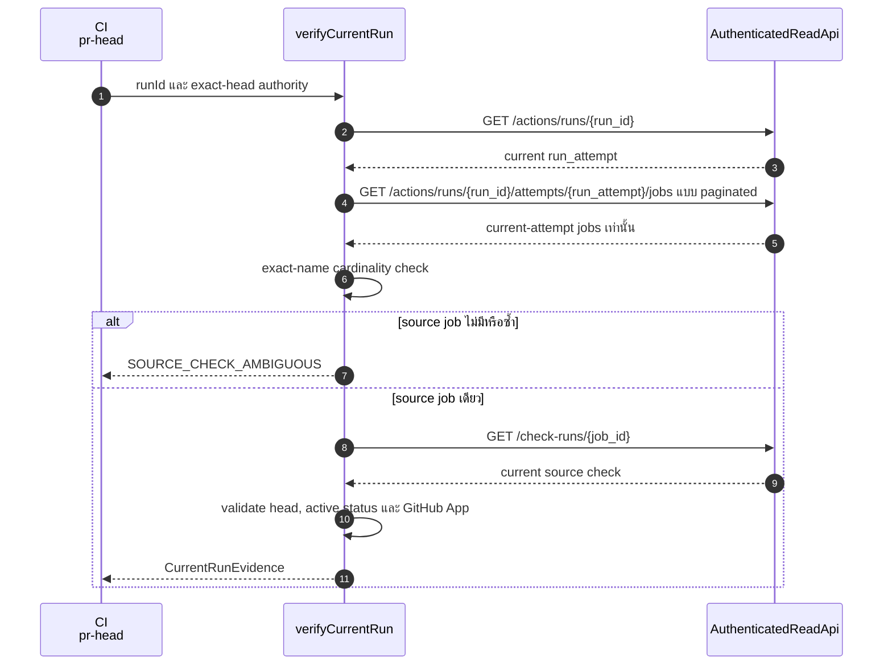

# Design: B0 Post-Merge Duplicate Check Runs

> Status: approved 2026-08-22

## Architecture Overview

การเปลี่ยน production อยู่ใน `.ai/bin/check-b0-bootstrap.mjs` และ regression tests อยู่ใน
`core/src/governance/policy.test.ts`. Workflow, ruleset, policy schema และ dependency graph
ไม่เปลี่ยน เพราะ `.github/workflows/ci.yml` เรียก verifier entry point เดิมอยู่แล้ว.

| Module | Interface | ความรับผิดชอบ |
|---|---|---|
| `AuthenticatedReadApi` | `get(path)`, `pages(path, key, options)` | authenticated GET, response-size bound, bounded pagination และ keyed-collection stability probe |
| `verifyRequiredChecks` | `(api, headSha, expectedChecks, mergedAt) -> RequiredCheckEvidence[]` | resolve post-merge check ต่อ context, เลือกล่าสุด และสร้าง evidence |
| `verifyCurrentRun` | `(api, context, authority) -> CurrentRunEvidence` | bind pr-head job กับ current workflow attempt |
| Candidate resolver | internal only | classify raw check run, validate provenance และ bind exact attempt |
| Workflow-run memo | internal only | อ่าน workflow และ attempt jobs หนึ่งครั้งต่อ workflow run ID |

`AuthenticatedReadApi` เป็น seam จริง: production ใช้ authenticated GitHub adapter ส่วน tests
ใช้ deterministic fake adapter. Candidate resolver และ memo เป็น internal seams ไม่ถูก expose
เพิ่ม เพราะ caller ต้องรู้เพียงสอง verifier operations กับ typed failure contract เดิม.

Dependency flow:

```text
runPrHead ──> verifyCurrentRun ──> AuthenticatedReadApi
runPostMerge ──> verifyRequiredChecks ──> AuthenticatedReadApi
                                      └─> internal candidate resolver
                                          └─> per-call workflow-run memo
```

Post-merge resolver ทำงานตามลำดับนี้:

1. อ่าน check history ด้วย `filter=all` ผ่าน stable keyed pagination ต่อ required context
2. ตัด raw rows ที่ name, head, status, app หรือ merge-time boundary ผิด
3. parse `details_url` เป็น exact repository workflow run ID และ job ID
4. อ่าน workflow run และ attempt-specific job pages ตั้งแต่ attempt 1 ถึง current attempt ภายใน global lookup budget
5. bind job ID กับ attempt เดียว แล้ว validate workflow/job provenance
6. เรียง authority-valid candidates ตาม `completed_at` จากใหม่ไปเก่า
7. fail closed เมื่อ authority-valid candidates คู่ใดมีเวลาเสร็จเท่ากัน หรือ selected conclusion ไม่ใช่ `success`
8. คืน evidence หนึ่งรายการต่อ context ตาม canonical normalized ruleset-binding order

Conclusion ไม่เป็นส่วนของ authority-valid classification. Resolver จึงเลือก attempt ล่าสุดก่อน
แล้วค่อยตัดสิน pass/block ทำให้ผลผ่านเก่าไม่สามารถกลบผลล้มเหลวล่าสุด.

## Sequence Diagrams

### Post-merge duplicate resolution



### pr-head current attempt resolution



## Data Models & Interfaces

Interfaces ด้านล่างเป็น contract เชิงแบบ ไม่มีการเพิ่ม TypeScript runtime หรือ dependency.

```typescript
type ReadOptions = {
  accept?: string;
  allow404?: boolean;
};

type PageOptions = {
  requireStableKeyedCollection?: boolean;
};

type ReadApi = {
  repository: {
    owner: string;
    repo: string;
    fullName?: string;
  };
  get(path: string, options?: ReadOptions): Promise<unknown>;
  pages(path: string, key: string | null, options?: PageOptions): Promise<unknown[]>;
};

type RequiredCheckExpectation = {
  context: string;
  integrationId: number;
};

type CurrentRunAuthority = {
  headSha: string;
  ruleset: {
    updatedAt: string;
    binding: {
      requiredStatusChecks: RequiredCheckExpectation[];
    };
  };
};

type RequiredCheckEvidence = {
  checkRunId: number;
  name: string;
  headSha: string;
  conclusion: 'SUCCESS';
  appId: number;
  appSlug: 'github-actions';
  workflowRunId: number;
  runAttempt: number;
  completedAt: string;
};

export async function verifyRequiredChecks(
  api: ReadApi,
  headSha: string,
  expectedChecks: RequiredCheckExpectation[],
  mergedAt: string,
): Promise<RequiredCheckEvidence[]>;

export async function verifyCurrentRun(
  api: ReadApi,
  context: { runId: string | number },
  authority: CurrentRunAuthority,
): Promise<{ run: Record<string, unknown>; sourceCheckRunId: number }>;
```

`verifyRequiredChecks` คง interface เดิม. `verifyCurrentRun` เพิ่ม `export` เท่านั้นเพื่อให้ tests
เรียก interface เดียวกับ runtime โดยไม่ expose internal candidate helpers.

Internal candidate shape:

```typescript
type ResolvedCandidate = {
  checkRunId: number;
  context: string;
  headSha: string;
  conclusion: string | null;
  appId: number;
  appSlug: string;
  workflowRunId: number;
  jobId: number;
  runAttempt: number;
  completedAt: string;
  completedAtMs: number;
};
```

### ReadApi pagination contract

- Caller ส่ง path โดยไม่ใส่ `per_page` หรือ `page`; `pages` เป็น owner ของ pagination params
- `pages` อ่านครั้งละ 100 rows และหยุดเมื่อ page สั้นกว่า 100 rows
- page ที่ 10 ยังเต็มหมายถึง completeness พิสูจน์ไม่ได้ จึง throw `API_PAGE_LIMIT`
- raw-array callers เดิมที่ส่ง `key=null` คง behavior เดิม
- check history ใช้ key `check_runs`; attempt history ใช้ key `jobs` และเปิด
  `requireStableKeyedCollection`
- stable keyed collection ต้องมี `total_count` เป็น safe non-negative integer ที่คงที่ทุกหน้า,
  row `id` เป็น positive integerไม่ซ้ำ และจำนวน rows ที่รวมได้เท่ากับ `total_count`
- หลังเก็บครบ `pages` อ่าน page 1 ซ้ำ แล้วเทียบ `total_count` กับลำดับ row IDs ของ page 1;
  mismatch หมายถึง collection เปลี่ยนระหว่าง pagination และต้อง fail closed
- adapter มี GET operations เท่านั้น ไม่มี write method ใน interface

### Candidate classification contract

Raw check run ผ่าน preliminary filter เมื่อทุกเงื่อนไขนี้จริง:

| Field | Invariant |
|---|---|
| `name` | exact-match required context |
| `head_sha` | exact-match reviewed head |
| `status` | `completed` |
| `app.id` | exact-match ruleset integration ID |
| `app.slug` | `github-actions` |
| `completed_at` | valid timestamp และไม่เกิน `merged_at` |
| `details_url` | HTTPS GitHub Actions run/job path ใน repository เดียวกัน |

Linked workflow และ job ผ่าน provenance filter เมื่อทุกเงื่อนไขนี้จริง:

| Field | Invariant |
|---|---|
| workflow `path` | `.github/workflows/ci.yml` |
| workflow `name` | `CI` |
| workflow `event` | `pull_request` |
| workflow `head_sha` | exact-match reviewed head |
| workflow `run_attempt` | positive integer |
| job `id` | exact-match job ID จาก `details_url` ใน attempt เดียว |
| job `run_id` | exact-match linked workflow run ID |
| job `name` | exact-match required context |
| job `head_sha` | exact-match reviewed head |

Wrong app, malformed local source หรือ wrong workflow provenance ทำให้ row นั้น ineligible.
Authenticated API failure, pagination exhaustion, unstable collection, lookup-budget exhaustion
หรือ zero/duplicate attempt binding ทำให้ทั้ง verification fail closed เพราะ completeness หรือ
provenance พิสูจน์ไม่ได้.

### Workflow-run memo contract

Memo มีอายุหนึ่ง `verifyRequiredChecks` call และ key เป็น positive workflow run ID. Value เก็บ
validated workflow metadata กับ `Map<jobId, runAttempt>` ซึ่งสร้างจากทุก attempt ตั้งแต่ 1 ถึง
current `run_attempt`. Memo ไม่ persist ข้าม run จึงไม่มี stale authority.

Resource bounds เป็น constants ภายใน verifier ไม่เปิด config ใหม่:

- `MAX_RUN_ATTEMPTS = 25` ต่อ workflow run
- `MAX_ATTEMPT_LOOKUPS = 100` รวมทุก workflow run ในหนึ่ง `verifyRequiredChecks` call
- แต่ละ lookup ยังอยู่ใต้ `MAX_PAGES = 10` เดิม

หาก `run_attempt` หรือ shared lookup counter เกิน bound ให้ throw `API_LOOKUP_LIMIT` ก่อนใช้
partial attempt map. Bound นี้กัน API amplification โดยไม่เปลี่ยน success semantics ของข้อมูลที่
พิสูจน์ได้ครบภายในเพดาน.

หาก job ID เดียวปรากฏมากกว่าหนึ่ง attempt ให้ mark duplicate และ reject เมื่อตัว candidate อ้าง
job นั้น. API error ของ attempt ใดไม่ถูก cache เป็นผลผ่านและ propagate เป็น typed failure เดิม.

### Deterministic ordering contract

- Resolver เรียงด้วย `completedAtMs` descending เท่านั้น
- Resolver ตรวจ duplicate `completedAtMs` ทั่ว authority-valid candidate set; พบคู่ใดเสมอกันให้
  reject ก่อนอ่าน conclusion แม้คู่เสมอไม่ใช่อันดับแรก
- Resolver ไม่ใช้ response order, check run ID หรือ workflow run ID เป็น temporal authority
- `expectedChecks` ต้องเป็น canonical normalized ruleset-binding order ที่ upstream สร้างไว้แล้ว:
  B0 context ก่อน แล้ว context อื่นเรียงชื่อ; verifierรักษาลำดับนี้โดยไม่ sort ซ้ำ
- API check-run response order ไม่มีผลต่อ evidence digest

## Technology Decisions

| Decision | เหตุผล |
|---|---|
| แก้ verifier file เดิม | รวม authority logic ไว้จุดเดียวและไม่เพิ่ม shallow wrapper |
| ขยาย `AuthenticatedReadApi.pages` เฉพาะ keyed collection | reuse pagination เดิมและเพิ่ม stability proof โดยไม่กระทบ raw-array callers |
| ใช้ `filter=all` | ต้องเห็น pre-merge history แม้มี run ภายหลัง |
| ใช้ attempt-specific jobs endpoint | GitHub contract แยก current/old executions ชัดกว่า generic `filter=all` |
| ใช้ per-call memo | ลด API calls ของ rerun candidates ที่ share workflow run ID โดยไม่สร้าง stale cache |
| ใช้ `completed_at` เท่านั้นสำหรับ primary order | ตรง semantics ที่ requirements อนุมัติและไม่เดา ID ordering |
| เวลาเสมอกันให้ fail closed | ไม่มี documented temporal tie-break ที่แข็งแรงพอ |
| จำกัด 25 attempts และ 100 attempt lookups ต่อ call | กัน API amplification; เกินเพดานให้ fail closed แทนใช้ partial authority |
| ใช้ Node stdlib และ `node:test` เดิม | ไม่เพิ่ม dependency, runtime หรือ test framework |
| คง workflow และ ruleset เดิม | Bug อยู่ใน resolver cardinality ไม่ใช่ CI composition |

ไฟล์ implementation ที่คาดว่าจะเปลี่ยนมีสองไฟล์:

| Path | Operation |
|---|---|
| `.ai/bin/check-b0-bootstrap.mjs` | MODIFY |
| `core/src/governance/policy.test.ts` | MODIFY |

## Error Handling Strategy

| Condition | Error code | Behavior | REQ |
|---|---|---|---|
| API unavailable, rejected หรือ invalid JSON | existing API error | propagate และ block | REQ-2.14, REQ-2.15 |
| page 10 เต็มก่อนเจอ terminal short page | `API_PAGE_LIMIT` | block | REQ-1.10, REQ-2.13, REQ-2.19, REQ-2.20, REQ-3.10 |
| keyed `total_count`, row IDs หรือ page-1 stability ไม่ตรง | `API_COLLECTION_CHANGED` | block ก่อน selection | REQ-1.10, REQ-2.13–REQ-2.15 |
| workflow attempts หรือ shared attempt lookups เกิน bound | `API_LOOKUP_LIMIT` | block ก่อนใช้ partial map | REQ-2.13–REQ-2.15 |
| required context ไม่มี authority-valid pre-merge candidate | `CHECK_SUCCESS_MISSING` | block | REQ-1.8 |
| authority-valid candidates คู่ใดมีเวลาเสร็จเท่ากัน | `CHECK_SET_INVALID` | block | REQ-1.2 |
| selected latest conclusion ไม่ใช่ `success` | `CHECK_SUCCESS_MISSING` | block โดยไม่ fallback | REQ-2.12 |
| details job ID หา attempt ไม่พบหรือพบซ้ำ | `CHECK_SOURCE_MISMATCH` | block | REQ-2.16–REQ-2.18 |
| local app หรือ workflow provenance ผิด | ไม่มี error ต่อ row | mark ineligible และพิจารณา row อื่น | REQ-2.1–REQ-2.11 |
| current attempt ไม่มีหรือมี source job ซ้ำ | `SOURCE_CHECK_AMBIGUOUS` | block | REQ-3.3–REQ-3.5 |
| current source check head, status หรือ app ผิด | `CHECK_SOURCE_MISMATCH` | block | REQ-3.6–REQ-3.9 |

ทุก error ยังคงผ่าน `B0VerificationError` และ CLI line รูปเดิม
`B0 BLOCKED [CODE]: detail`. ไม่มี retry ภายใน verifier เพราะ retry อาจผสม authority snapshot
คนละเวลา; GitHub Actions เป็น owner ของ job-level retry.

## Testing Strategy

ขยาย `core/src/governance/policy.test.ts` ซึ่งเป็น test owner เดิมและ import verifier ผ่าน
module interface จริง. Fake `ReadApi` route path แบบ deterministic, บันทึก GET paths และไม่มี
write method จึงพิสูจน์ read-only behavior โดยไม่เรียก GitHub จริง.

| Case | Observable assertion | REQ |
|---|---|---|
| PR #146 fixture มี failure, success, success บน exact head | เลือก check run ล่าสุดและ evidence IDs ตรง | REQ-1.1, REQ-1.3, REQ-4.1–REQ-4.6 |
| API check-run response order สลับ | evidence เท่าเดิม; context output ยังตาม canonical binding order | REQ-1.1, REQ-1.7 |
| latest candidate failure, older success | reject `CHECK_SUCCESS_MISSING` | REQ-2.12, REQ-4.7 |
| run หลัง merge กับ run ผ่านก่อน merge | ตัด run หลัง mergeและเลือก pre-merge run | REQ-1.4, REQ-4.8 |
| top candidates timestamp เท่ากัน | reject `CHECK_SET_INVALID` | REQ-1.2 |
| candidates ที่ไม่ใช่อันดับแรก timestamp เท่ากัน | reject `CHECK_SET_INVALID` | REQ-1.2 |
| required contexts หลายค่า | resolve แยกและ output ตาม ruleset order | REQ-1.5–REQ-1.7 |
| no valid candidate | reject | REQ-1.8 |
| check history หลายหน้าและ stable probe ตรง | `pages` result ทุกหน้าถูกพิจารณา | REQ-1.9, REQ-1.10 |
| page bound เต็ม | reject `API_PAGE_LIMIT` | REQ-2.13, REQ-2.19 |
| keyed page `total_count` เปลี่ยน, row ID ซ้ำ, collected count ผิด หรือ page-1 probe เปลี่ยน | reject `API_COLLECTION_CHANGED` ทีละกรณี | REQ-1.10, REQ-2.13–REQ-2.15 |
| preliminary field mutation ทีละค่า: name, head, status, app ID, app slug, completed time, details URL | mutated row ineligible; exact error/evidence ตรง fixture | REQ-2.1–REQ-2.6, REQ-4.9 |
| linked workflow field mutation ทีละค่า: path, name, event, head, run attempt | mutated row ineligible; exact error/evidence ตรง fixture | REQ-2.7–REQ-2.11, REQ-4.10 |
| API fail ที่ check history, workflow run หรือ attempt jobs | exact typed error propagate และ block | REQ-2.13–REQ-2.15 |
| exact job ID อยู่ attempt เดียว | evidence บันทึก attempt นั้น | REQ-2.16, REQ-4.2–REQ-4.4 |
| exact job ID ไม่พบหรืออยู่หลาย attempts | reject `CHECK_SOURCE_MISMATCH` | REQ-2.17, REQ-2.18 |
| run attempt เกิน 25 หรือ shared attempt lookups เกิน 100 | reject `API_LOOKUP_LIMIT` ก่อนใช้ partial map | REQ-2.13–REQ-2.15 |
| single valid run | pass/block decision และ evidence contract เดิม | REQ-4.5, REQ-4.11 |
| pr-head current attempt เท่ากับ 2 | request path มี `/attempts/2/jobs`; ไม่เรียก generic jobs path | REQ-3.1, REQ-3.2, REQ-4.12 |
| current attempt exact-name cardinality เป็น 0, 1, 2 | block, pass, block ตามลำดับ | REQ-3.3–REQ-3.5 |
| current source check field ผิดทีละค่า | reject source mismatch | REQ-3.6–REQ-3.9 |
| attempt jobs หลายหน้า | source job ในหน้าหลังถูกพบ | REQ-2.20, REQ-3.10 |
| fake adapter method inventory | มี `get/pages` เท่านั้นและไม่มี write call | REQ-4.13 |

Test ใช้ exact timestamps และ IDs จาก fixture เท่านั้น ไม่มี wall clock, network หรือ GitHub mutation.
รัน targeted test ก่อน แล้วรัน repository test command ตาม task gate ใน implementation phase.

## Requirement Traceability

| Design element | REQ | Section |
|---|---|---|
| paginated `filter=all` history และ deterministic selection | REQ-1 | Architecture Overview |
| candidate provenance, exact attempt binding และ fail-closed errors | REQ-2 | Data Models & Interfaces |
| attempt-specific current source resolution | REQ-3 | Data Models & Interfaces |
| ordered immutable evidence contract | REQ-4.1–REQ-4.5 | Data Models & Interfaces |
| PR #146 และ synthetic fixture matrix | REQ-4.6–REQ-4.13 | Testing Strategy |

### Fresh-context critique decisions

| Finding | Decision | Design change |
|---|---|---|
| B0D-1 output order ขัด upstream normalization | Applied | ระบุ canonical normalized ruleset-binding order และทดสอบ API response shuffle แทน expectation shuffle |
| B0D-2 tie check ครอบคลุมเฉพาะ top pair | Applied | ตรวจ duplicate timestamp ทั่ว authority-valid set พร้อม non-top tie test |
| B0D-3 short-page pagination พิสูจน์ snapshot ไม่พอ | Applied | เพิ่ม keyed `total_count`, unique IDs, exact count และ page-1 stability probe |
| B0D-4 attempt traversal ไม่มี global bound | Applied | เพิ่ม `MAX_RUN_ATTEMPTS`, `MAX_ATTEMPT_LOOKUPS` และ typed fail-closed error |
| B0D-5 test matrix อ้าง coverage กว้างเกิน assertion | Applied | แยก table-driven field mutations, API failure และ pagination instability cases |
