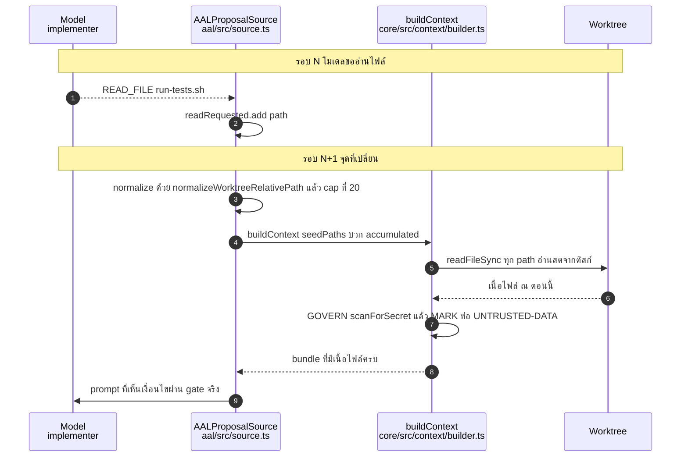

# Design — context-accumulation

Base: develop @ `effc5f6` · หลักฐานเต็ม (ตัวเลือกที่พิจารณา, ตัวเลข token, diagram ครบชุด)
อยู่ใน `.pipeline/context-accumulation/design.md` — เอกสารนี้เก็บเฉพาะสิ่งที่ต้องคงอยู่ถาวร

## หลักฐานที่ตัดสินใจจากมัน

จาก live run `RUN-1785819815065` (implementer 5 รอบ สลับ diagnostician 5 รอบ จบด้วย
`BUDGET_EXCEEDED {limit: iterations, iterations: 10}` ที่ seq 120):

| สิ่งที่วัด | ค่า | ความหมาย |
|---|---|---|
| `CONTEXT_BUILT` manifest ทั้ง 5 รอบ (seq 8, 29, 57, 76, 107) | `bytes: 6, pieceCount: 1` เท่ากันหมด | bundle ไม่เคยโต |
| `recall` | 0 → 0 → 0.333 → 0.333 → 0.333 | ตันเพราะ bundle ตรึงที่ 1 piece |
| `READ_FILE` ที่คืนเนื้อจริง | 9 ครั้ง รวม 2,535 bytes | ระบบอ่านสำเร็จ แต่เนื้อไปไม่ถึงโมเดล |
| `WRITE_FILE` | **0 ทั้ง run** (ทั้ง 3 run) | โมเดลไม่เคยลงมือแก้เลย |
| เนื้อ `run-tests.sh` ใน prompt ทั้ง 5 รอบ | **ไม่พบเลย** (grep ผ่าน `rawTranscriptRef`) | หลักฐานตรงของ D1 |

ไฟล์ที่อ่านสำเร็จมี `run-tests.sh` (39 bytes) ซึ่งบอกเงื่อนไขผ่าน gate ทั้งหมดคือ
`grep -q correct src/impl.txt` — ข้อมูลพอจะจบงานมีตั้งแต่ seq 31 แต่หายทุกรอบ

## ทางเลือกที่พิจารณาและเหตุผลที่เลือก

| ทาง | กลไก | เหตุผลที่ตก / รับ |
|---|---|---|
| **A (เลือก)** | สะสมเป็นชุด path แล้ว re-read ผ่าน `buildContext` ทุกรอบ | ได้ GOVERN + MARK + determinism ฟรี, ความสดรับประกันโดยโครงสร้าง, ไม่แตะ `core/` |
| B | เดินเนื้อ `outputRef` กลับผ่าน loop เข้า `ProposalInput` | เนื้อจะเข้า context โดยไม่ผ่าน `buildContext` — ชน Phase-4 REQ-12.2 ตรง ๆ, ต้องเขียนกลไก invalidate เอง, diff กว้าง 4 ไฟล์แตะ core |
| C | ให้ role ขอ pin ไฟล์ผ่าน vocabulary ใหม่ | สร้างคำศัพท์ที่สองสำหรับเจตนาที่ `READ_FILE` สื่ออยู่แล้ว |

เหตุผลหลักของ A ไม่ใช่ว่าโค้ดน้อยที่สุด แต่เพราะปัญหาสามอย่าง (secret governance, ความสด
ของข้อมูล, และ idempotency key ที่ชนข้ามรอบ) ถูกกำจัดด้วยโครงสร้างแทนที่จะต้องเขียนกลไก
คุมเพิ่มทีละอย่าง — ทุกกลไกที่ไม่ต้องเขียนคือกลไกที่พังไม่ได้

## กลไก

จุดเปลี่ยนอยู่ที่เดียว: `aal/src/source.ts` ส่ง seed set ที่โตขึ้นเข้า `buildContext`
ตัว `buildContext` เองไม่ถูกแก้ signature หรือพฤติกรรม

ลูกศร `B->>WT` คือหัวใจของความสด: ทุกรอบอ่านใหม่จากดิสก์ ไม่มี cache ให้ค้าง จึงเป็นไป
ไม่ได้เชิงโครงสร้างที่โมเดลจะเห็นเนื้อเก่าที่ขัดกับ worktree ปัจจุบัน

### การจัดการ secret สองทาง

`SecretInContextError` พก `.file` มาให้แล้ว caller จึงแยกทางได้โดยไม่แก้ builder:

- `.file` อยู่ใน `seedPaths` → คงเดิม: escalate `secret_in_context` แล้ว BLOCKED
- `.file` เป็น accumulated path → ถอดออกจากชุดสะสม, บันทึก event, build ใหม่ **วนต่อ**
  จนสำเร็จหรือชนเพดาน

**การวนต้องเป็น bounded drain ไม่ใช่ retry ครั้งเดียว** — `scanForSecret` hit
เกาะกลุ่มตามหัวข้อ ไม่กระจายอิสระ: สองไฟล์ production ที่ติดในรีโปนี้
(`core/src/evidence/auth.ts`, `core/src/gates/report-integrity.ts`) ติดด้วย identifier
ตัวเดียวกันและทำงานเรื่องเดียวกัน โมเดลที่แก้เรื่องนั้นมีเหตุผลจะอ่านทั้งคู่ในรอบเดียว
retry ครั้งเดียวจึงกันได้แค่ hit แรก แล้ว hit ที่สองปิด run ถาวร — ขัดกับ user story
ของ REQ-2 เอง · เพดานคือจำนวน path ใน **หน้าต่าง cap** ของรอบนั้น (`min(ชุดสะสม, 20)`
วัดครั้งเดียวก่อน evict แรก) และแต่ละรอบของลูปถอดอย่างน้อยหนึ่ง path ออกจากชุด ลูปจึง
จบเสมอโดยไม่ต้องนับรอบเอง

**เพดานเป็นหน้าต่างไม่ใช่ชุดเต็ม** — evict แต่ละครั้งทำให้หน้าต่าง 20 ตัวเลื่อนดูด path
เก่ากว่าเข้ามา ชุดสะสมจริงจึงอาจใหญ่กว่าเพดาน (21 ตัวที่ติดหมด → evict 20 แล้ว BLOCKED)
ยอมรับเพราะเคสนั้นต้องมี false positive เกิน 20 ไฟล์ในรอบเดียวขณะที่อัตราจริงคือ ~2.5%
ต่อไฟล์ และพฤติกรรมตอนชนเพดานเป็น fail-safe (block ไม่ leak) — การคำนวณ budget ใหม่
ตอนหน้าต่างเลื่อนเป็นความซับซ้อนที่ยังไม่มีหลักฐานว่าคุ้ม

canary token ต้องถูกเรียกครั้งเดียวต่อรอบแล้วใช้ซ้ำกับทุก build ในลูป มิฉะนั้น token
จะถูกเผาหลายใบต่อรอบและลำดับ id ที่ replay พึ่งพาจะเพี้ยน

### ขอบเขตที่บังคับด้วย cap

- 20 accumulated path, ตัดตัวเก่าสุด (`Set` ของ JS รักษาลำดับ insertion ตาม ECMA
  จึงไม่ต้องเขียน LRU)
- `seedPaths` ไม่ถูกตัดออกไม่ว่ากรณีใด — เป็นสัญญาจาก composition ไม่ใช่ของที่โมเดลขอ
- ยังไม่ทำ byte cap: เพดานต่อไฟล์ 8,000 bytes + COMPRESS มีอยู่แล้ว เพดานรวมที่รู้ตัวคือ
  20 × 8,000 bytes; จุดตัดที่ต้องกลับมาเพิ่มคือเห็น `stats.bytes` เกิน 32 KB จริง

## เอกสารที่ต้องแก้ตามกัน

พฤติกรรมใหม่เปลี่ยนสัญญาเดิม จึงต้องแก้ artifact เหล่านี้ใน change เดียวกัน:

- `unified-platform-spec.md` §9.4, version banner และ §17 changelog ต้องประกาศ seed set
  ต่อรอบกับ supersession ของ Phase-1 REQ-7.3.
- `requirements.md` ต้องเก็บ supersession block และผลต่อ `contextWaste` ไว้ถาวร.
- `.ai/specs/archive/platform-phase1/design.md` กับ doc comment ของ
  `core/src/context/builder.ts` ต้องเลิกอธิบาย input set เดิมที่ไม่จริงแล้ว.

## Containment ที่ขอบการอ่าน (เพิ่มหลัง audit)

ด่าน `normalizeWorktreeRelativePath` ที่ฝั่ง caller กันได้เฉพาะ path ที่ role ขอตรง ๆ
**EXPAND เป็นทางเข้าที่สอง และไม่ผ่านด่านนั้นเลย** — `visit()` ตรวจแค่ `excludePath` กับ
`collected.has()` ส่วนบรรทัดแปลง import (`core/src/context/builder.ts:168`) ตัด `../`
ชั้นเดียวแล้วส่งเข้า `join()` ซึ่งยุบ `..` ที่เหลือให้เอง audit รัน `buildContext` ตัวจริง
แล้วได้ piece `path=../outside/stolen.ts reason=expand:depth-1` พร้อมเนื้อไฟล์เต็ม

**หลักการที่เลือก: บังคับที่ขอบการอ่านจริง ไม่ใช่ที่ทางเข้าแต่ละทาง** — ทางเข้ามีสองทาง
วันนี้ (SEED, EXPAND) และการวาง guard ต่อทางเข้าแปลว่าทางเข้าที่สามในอนาคตจะพลาดอีก
จุดที่ทุกทางเข้าลอดผ่านเหมือนกันคือการอ่านไฟล์ใน `visit()` และรอบ GOVERN จึงเป็น
ตำแหน่งเดียวที่ปิดได้ครบด้วย guard ชุดเดียว

ใช้ idiom ที่ repo มีอยู่แล้วที่ `core/src/gates/red-provenance.ts:167,185-193`:
`realpathSync(worktreeDir)` เป็น root แล้วเทียบว่า path ที่ resolve แล้วยังอยู่ใต้ root
บวกการเปิดไฟล์ด้วย `O_NOFOLLOW` เพื่อไม่ให้ symlink พาออกนอกขอบ — ไม่เขียนกลไกใหม่

path ที่ไม่ผ่านถูกข้ามเงียบ ๆ แบบเดียวกับไฟล์ที่อ่านไม่ได้ (`builder.ts:158-161`)
ไม่ล้ม bundle ทั้งก้อน เพราะ import ที่ resolve ไม่ได้เป็นเรื่องปกติของ heuristic
`localImports` อยู่แล้ว การล้มทั้ง build จะเปลี่ยนพฤติกรรมที่ไม่เกี่ยวกับความปลอดภัย

### การแยกสาขา secret ต้องบังคับสองชั้น

รอบแรกออกแบบให้ caller ตัดสินสาขาเดียวจบ ปรากฏว่าไม่พอ ไล่มาสองรอบดังนี้:

1. เดิมใช้ negative membership (`!seedPaths.includes`) → ไฟล์จาก EXPAND ตกสาขา
   accumulated ผิด, evict ไม่ลบอะไรเลย, log `accumulated_secret_evicted` ทั้งที่ไม่มีอะไร
   ถูก evict แล้ว rebuild ด้วย input เดิมที่ให้ error เดิมเสมอ
2. แก้เป็น positive membership → ไฟล์จาก EXPAND กลายเป็น rethrow แล้ว
   `loop.ts` `move('block')` = **จบทั้ง run** ซึ่งร้ายกว่าเดิม เพราะ valve eviction
   ไม่มีอะไรให้ evict (ไฟล์นั้นโมเดลไม่เคยขอ)

รากของปัญหาคือ **caller ไม่มีข้อมูลพอจะแยกสามทาง** — `err.file` บอกแค่ชื่อไฟล์ ไม่บอกว่า
ไฟล์นั้นเข้า bundle เพราะถูกส่งเป็น seed หรือเพราะ EXPAND ตาม import มา ข้อมูลนั้นมีเฉพาะ
ใน builder ส่วน builder เองก็แยก seed กับ accumulated ไม่ได้เพราะทั้งคู่มาถึงเป็น
`input.seedPaths` ชุดเดียวกัน

**ดังนั้นบังคับคนละชั้นตามข้อมูลที่แต่ละชั้นมีจริง:**

| ชั้น | รู้อะไร | รับผิดชอบ |
|---|---|---|
| builder (GOVERN) | ไฟล์นี้อยู่ใน `input.seedPaths` หรือไม่ | ไม่อยู่ = EXPAND ล้วน → ข้าม piece รายชิ้น ไม่ throw (2.6) |
| caller (`source.ts`) | `deps.seedPaths` กับชุด accumulated แยกกัน | seed → escalate · accumulated → evict + rebuild (2.5) |

**ตัวตัดสินของชั้น builder ต้องเป็น membership ไม่ใช่ `reason` ของ piece** — `visit()`
กันการเดินซ้ำด้วย `collected.has(relPath)` ดังนั้น literal seed ที่บังเอิญถูก import จาก
seed ตัวที่ถูก visit ก่อน จะถูกบันทึกด้วย `reason='expand:depth-1'` ไปแล้ว และตอนลูป
เดินมาถึงมันเองก็ถูกตัดออกที่ `collected.has()` — reason จึงค้างเป็น expand ถาวรทั้งที่
เป็น seed จริง ตัดสินด้วย reason แล้ว secret ในไฟล์นั้นจะถูก skip เงียบแทนที่จะล้ม bundle
ซึ่งกลับด้าน AC-4 / Phase-1 REQ-7.3 โดยไม่ได้ตั้งใจ (spec นี้เคยเขียนผิดว่า path ใน
`seedPaths` ได้ `reason='seed'` เสมอ — coder พบตอน implement รอบ 3 และมี regression
test ปิดไว้ใน `core/src/context/builder.test.ts`)

ผลพลอยได้: เมื่อ builder ดูดกรณี EXPAND ไปแล้ว error ที่ยังขึ้นมาถึง caller จะเหลือแค่
seed กับ accumulated เท่านั้น การตัดสินที่ caller จึงกลับมาเป็นสองทางที่ตรงไปตรงมา
โดยให้ **seed ชนะเมื่อ path อยู่ทั้งสองชุด** (evict ไม่ช่วยเพราะ path ยังถูกส่งเข้า build
รอบสองอยู่ดี) และกรณีที่ไม่อยู่ในชุดใดเลยให้ปฏิบัติแบบ seed คือ fail closed

## Signal ของ piece ที่ถูกข้าม

builder มี precedent ของการคืน per-item block อยู่แล้วสองตัวคือ `lessonsBlocked` และ
`planBlocked` ซึ่ง caller เอาไป log ต่อ ส่วน file piece ที่ถูกข้าม (จาก containment ตาม
REQ-4 หรือจาก secret ตามเกณฑ์ 2.6) หายจาก bundle เงียบสนิท — ใช้รูปเดิมนั้นซ้ำ ไม่สร้าง
กลไกใหม่: คืน list ของ `{path, kind}` แล้ว caller ใส่ลง `CONTEXT_BUILT`

ข้อจำกัดที่ต้องบังคับ: payload มีได้เฉพาะ **path, จำนวน, เหตุผล** ห้ามมีเนื้อไฟล์หรือ
ส่วนของเนื้อไฟล์ เพราะ event log เป็น artifact ที่ Console แสดงได้ และ INV-14 บังคับว่า
block ไม่ใช่ redact — การใส่ตัวอย่างเนื้อลง log จะเป็นการ redact-and-store ซึ่งขัดทั้งคู่

เหตุผลที่นับเป็นส่วนหนึ่งของงาน ไม่ใช่ของแถม: งานทั้งงานนี้เกิดขึ้นเพราะช่องว่าง context
ที่มองไม่เห็น กินเวลาไป 3 live run กว่าจะจับได้ ถ้าปล่อยให้ไฟล์หายเงียบต่อ ก็สร้าง
ช่องว่างชนิดเดียวกันขึ้นมาใหม่ในกลไกที่เพิ่งสร้างมาปิดมัน

## ผลข้างเคียงที่บันทึกไว้

`contextWaste` (Phase-1 REQ-7.6) จะสูงขึ้นโดยกลไกหลังเปิดการสะสม เพราะ path ที่สะสมไว้
แต่รอบนั้นไม่ได้แตะถูกนับเป็น unused ทุกตัวใน `computeContextMetrics` เกณฑ์เดิมยังใช้ได้
ทุกตัวอักษรและไม่ถูก supersede — แต่ต้องบันทึกไว้ ไม่ใช่ปล่อยให้รอบหน้าอ่านค่าที่สูงขึ้น
ว่าเป็น regression ส่วน `contextRecall` จะดีขึ้นตามที่ตั้งใจ (เดิมตันที่ 0.333)

## ผลกระทบที่ตรวจแล้วว่าไม่มี

- **conformance P1-P8** — harness สร้าง bundle เป็น literal เอง
  (`aal/src/conformance/harness.ts:68-71`) ไม่มีเส้นทาง import ไปถึง `buildContext`
  และ baseline record (`.ai/calibration/conformance-*.json`) ไม่มี field ใดผูกกับ context
  จึงไม่ต้อง re-record
- **สิทธิ์เขียน** — allowlist คือ `bundle paths ∪ readRequested` อยู่แล้ว การสะสมให้
  ยูเนียนชุดเดิม
- **determinism (Phase-1 REQ-7.1)** — `buildContext` ยังเป็น pure function ของ input
  ที่ได้รับ; bundle ไม่เคย byte-identical ข้ามรอบอยู่แล้วตั้งแต่ Phase 1 เพราะ canary
  ใหม่ทุกรอบ เพดานที่แท้จริงคือ "input ชุดเดิม ให้ manifest เดิม" ซึ่งยังคงอยู่

## Requirement Traceability

| Design element | REQ | Section |
|---|---|---|
| seed set = `seedPaths` ∪ accumulated ผ่าน `buildContext` ทางเดียว | 1.1 | กลไก |
| re-read จาก worktree ทุกรอบโดยไม่มี cache | 1.2 | กลไก |
| normalize path ก่อนเข้า SEED | 1.3 | กลไก |
| cap 20 path และไม่ตัด `seedPaths` | 1.4 | กลไก |
| allowlist ยังเป็นยูเนียนชุดเดิม | 1.5 | ผลกระทบที่ตรวจแล้วว่าไม่มี |
| GOVERN + MARK อยู่ในเส้น `buildContext` เดิม | 2.1 | กลไก |
| secret จาก `seedPaths` ใช้สาขาเดิม | 2.2 | กลไก |
| accumulated secret ใช้ bounded drain | 2.3 | กลไก |
| canary ใบเดียวต่อรอบ | 2.4 | กลไก |
| caller แยก seed กับ accumulated แบบ seed ชนะและ fail closed | 2.5 | กลไก |
| builder แยก EXPAND ด้วย seed membership | 2.6 | กลไก |
| amendment §9.4 ปิดช่องว่างกับสัญญา §6.1 | 3.1 | เอกสารที่ต้องแก้ตามกัน |
| supersession block และ §17 changelog | 3.2 | เอกสารที่ต้องแก้ตามกัน |
| version banner, changelog entry และบรรทัดจุดเริ่ม | 3.3 | เอกสารที่ต้องแก้ตามกัน |
| Phase-1 design กับ builder doc comment ใช้คำอธิบายใหม่ | 3.4 | เอกสารที่ต้องแก้ตามกัน |
| `contextWaste` สูงขึ้นโดยกลไก ไม่ใช่ regression | 3.5 | ผลข้างเคียงที่บันทึกไว้ |
| containment บังคับที่จุดอ่านจริง | 4.1 | Containment ที่ขอบการอ่าน (เพิ่มหลัง audit) |
| ใช้ `realpathSync` และ `O_NOFOLLOW` | 4.2 | Containment ที่ขอบการอ่าน (เพิ่มหลัง audit) |
| ข้าม path ที่ไม่ผ่านโดยไม่ล้ม build | 4.3 | Containment ที่ขอบการอ่าน (เพิ่มหลัง audit) |
| reuse signal แบบ `lessonsBlocked` และ `planBlocked` | 5.1 | Signal ของ piece ที่ถูกข้าม |
| payload มี path, จำนวนและเหตุผลเท่านั้น | 5.2 | Signal ของ piece ที่ถูกข้าม |
