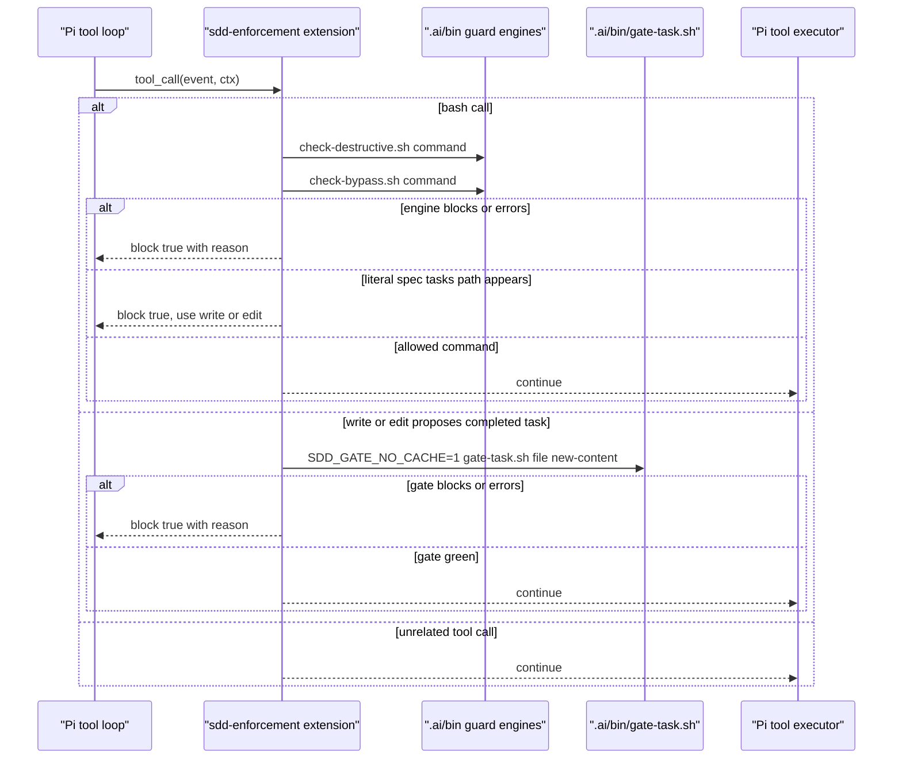
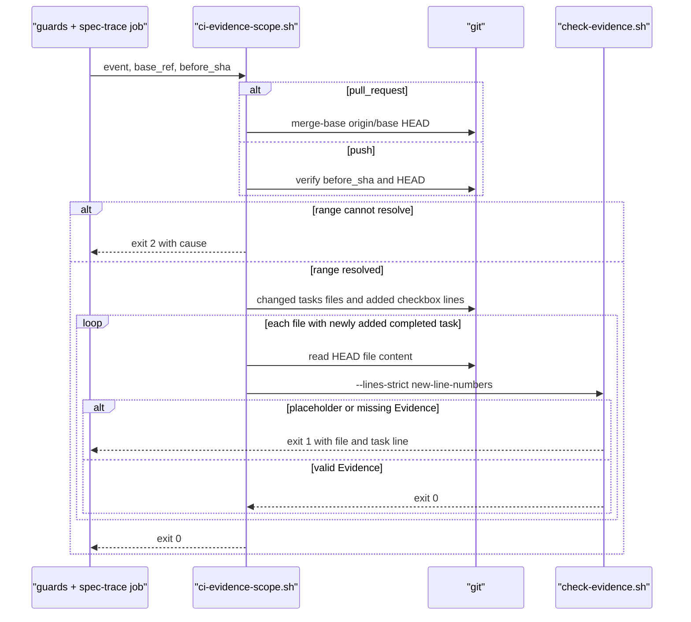

# Design: Cross-Harness SDD Closure

> Status: approved 2026-08-12, amended 2026-08-12

ปิด parity gap ด้วย adapter บางและ deterministic gates ที่เรียก shared `.ai/bin` engines.
ไม่เพิ่ม dependency หรือ capability manifest ใหม่.

## Architecture Overview

งานแบ่งเป็นหกส่วนที่มี owner ชัดเจน:

| Component | Responsibility |
|---|---|
| GitHub ruleset + credential evidence | ยืนยัน external controls แบบ status-only โดยไม่เก็บ secret |
| `.pi/extensions/sdd-enforcement.ts` | block Pi `bash`, `write` และ `edit` ก่อน execute ผ่าน shared engines |
| `.ai/bin/check-evidence.sh` | เพิ่ม line-selected strict mode โดยใช้ Evidence parser เดิม |
| `scripts/ci-evidence-scope.sh` | resolve PR/push range แล้วส่ง line number ของ task ที่เพิ่ง `[x]` เข้า parser |
| `.claude/hooks/tests/cross-harness-conformance.test.sh` | fixture กลางสำหรับ adapter, skill, capability และ MCP pin |
| Adapter/config docs | แก้ stale stack path, Pi exceptions, ruleset state และ MCP version |

External state ใช้หลักฐานสองแบบ:

- GitHub ruleset `protected-main-develop` เป็น active server-side control สำหรับ `main` และ
  `develop`.
- Credential verification บันทึกเพียง provider, revoked/not-revoked และ HTTP status; ไม่บันทึกค่า
  credential หรือ suffix.

Pi extension เป็น project-local file ที่ Pi 0.74 auto-discovers จาก `.pi/extensions/*.ts` เมื่อ launch
จาก repository root. ไฟล์เขียนเป็น TypeScript ที่เป็น valid JavaScript และใช้ Node stdlib เท่านั้น;
fixture import committed file โดยตรงผ่าน runtime ที่ pin ใน `.nvmrc` พร้อม Node type stripping
กับ mock `ExtensionAPI`.

## Sequence Diagrams

### Pi pre-execution enforcement



### Diff-aware CI Evidence gate



## Data Models & Interfaces

### Pi extension event contract

| Event | Input used | Delegate | Result |
|---|---|---|---|
| `bash` | `event.input.command` | `check-destructive.sh`, then `check-bypass.sh` | any non-zero blocks |
| `bash` mentioning canonical spec `tasks.md` | command text | extension path rule | block and require `write` or `edit` |
| `write` to spec `tasks.md` | normalized `path`, final `content` | `gate-task.sh` | non-zero blocks before write |
| `edit` to spec `tasks.md` | normalized `path`, reconstructed final content | `gate-task.sh` | non-zero blocks before edit |
| unrelated call | none | none | allow |

Canonical task paths match `.ai/bin/lib-guard.sh`:

```text
.ai/specs/*/tasks.md
.claude/specs/*/tasks.md
```

Extension derives repository root from `import.meta.url`, resolves tool paths against `ctx.cwd`, rejects
targets outside root and compares normalized repository-relative paths. Existing targets resolve through
`realpath`; new targets validate nearest existing parent. Auto-discovery support requires Pi launch from
repository root and is checked by manual probe.

For `edit`, extension reads current file, normalizes line endings and matches every `edits[].oldText`
against the same original content, matching Pi 0.74 semantics. Every exact match must be unique and
non-overlapping; zero, duplicate, overlapping or fuzzy-only matches block and require `write`. Gate receives
final reconstructed file, so split checkbox/Evidence edits share real task regions. `SDD_GATE_NO_CACHE=1`
prevents a pre-write cache hit; code-green describes current code state while Evidence describes proposed
spec state.

A Pi `bash` command containing a canonical spec tasks path is blocked wholesale because shell text cannot
reliably prove read-only intent; Pi provides `read`, `grep`, `write` and `edit` alternatives. Dynamic or
obfuscated shell paths remain a documented Pi capability exception backed by pre-commit and CI.

After a call passes, extension recursively freezes `event.input` and freezes the event object. A later
trusted extension therefore cannot mutate allowed input into blocked input before execution. Extensions
can execute arbitrary code with user permissions, so malicious extension code remains outside trust model.

### Evidence parser mode

เพิ่ม interface เดียวใน parser เดิม:

```text
check-evidence.sh --lines-strict LINE_FILE < tasks.md
```

| Exit | Meaning |
|---|---|
| `0` | ทุก completed-task opening line whose line number อยู่ใน `LINE_FILE` มี non-placeholder Evidence |
| `1` | มี selected task ที่ Evidence หายหรือเป็น placeholder; stdout คือ opening line |
| `2` | usage, unreadable selection file หรือ engine error |

Mode เดิมไม่เปลี่ยน:

- `--strict` ตรวจทุก completed task และยังใช้โดย `gate-task.sh`.
- `--added-only` ตรวจ presence-only และยังใช้โดย pre-commit.
- `--lines-strict` ใช้ new-side line-number identity กับ non-trivial predicate แบบ `--strict`.

Line-number identity กัน opening text ซ้ำเลือก historical task ผิดตัว. Parser fail closed เมื่อ selection
ไม่ใช่ positive integer, ชี้บรรทัดที่ไม่ใช่ completed-task opening หรือมี line number ซ้ำ.

### CI Evidence scope

```text
ci-evidence-scope.sh <event_name> <base_ref> <before_sha>
```

| Event | Range | Required input |
|---|---|---|
| `pull_request` | `merge-base(origin/<base_ref>, HEAD)..HEAD` | non-empty `base_ref` |
| `push` | `<before_sha>..HEAD` | resolvable non-zero `before_sha` |
| other | none | exit `2` |

Script parse unified diff hunk ใหม่เพื่อเก็บ new-side line number ของ opening lines `[x]`, แล้วอ่าน
content จาก `HEAD`. ถ้าเปลี่ยน `tasks.md` แต่ไม่มี opening line `[x]` ใหม่ จะผ่านโดยไม่ตรวจ historical
Evidence. Checkbox ที่ย้ายหรือลบแล้วเพิ่มใหม่ถือเป็น newly completed task และต้องมี Evidence.

### Capability contract

`.ai/README.md` parity matrix เป็น canonical capability contract; adapter docs อธิบาย mechanism และห้าม
ขัด matrix. ไม่เพิ่ม JSON manifest. ค่าหลังปิดงาน:

| Capability | Claude | Codex | OpenCode | Pi |
|---|---|---|---|---|
| spec skills | native | native | native | native |
| destructive/bypass guard | native hook | trusted interactive hook | native plugin | project extension |
| task gate | native post-tool | trusted post-tool | post-write advisory | project extension pre-write |
| fresh-context subagents | native | native | native | unsupported, route to another harness |
| MCP/browser | native | native | native | unsupported, route to another harness |

Conformance fixture เรียก adapters/shared engines ด้วย behavioral cases ก่อน lint matrix/docs. Pi cases
import exact committed extension, mock เฉพาะ tool execution และทดสอบ later-handler mutation. `--live`
mode additionally reports installed versions and root discovery; default CI mode never starts model
sessions or reads credentials.

Pi adapter ต้องระบุ fallback แบบ imperative: หยุด Pi path, รายงาน capability ที่ขาด และ hand off ไป
Claude Code, Codex หรือ OpenCode. Routing เป็น procedural enforcement; fixture ยืนยัน instruction นี้และ
ห้าม matrix อ้าง Pi native parity สำหรับสอง capability ดังกล่าว.

### GitHub ruleset contract

| Field | Required value |
|---|---|
| name | `protected-main-develop` |
| enforcement | `active` |
| branches | `refs/heads/main`, `refs/heads/develop` |
| merge | pull request, squash-only, review threads resolved |
| history | deletion and non-fast-forward blocked, linear history required |
| status checks | `platform (vendor check + typecheck + lint + tests)`, `guards + spec-trace` |
| approvals | `0`, because repository has one operator |

Implementation ใช้ desired-state readback แบบ idempotent: ถ้า ruleset ต่างจาก contract จึง update ผ่าน
authenticated GitHub API แล้ว read back; ถ้าตรงอยู่แล้วไม่ mutate. Task Evidence บันทึก ruleset ID และ
sanitized fields เท่านั้น. CI ไม่รับ repository-admin credentials.

GitHub ruleset pull-request rule รองรับ `allowed_merge_methods`; remote readback ต้องเป็น
`["squash"]`. ไม่ต้องเปลี่ยน repository-wide merge settings เพราะ rule นี้บังคับเฉพาะ branches ใน scope.

### MCP version contract

`chrome-devtools-mcp` is pinned to npm stable version `1.7.0` in two executable configs:

```text
chrome-devtools-mcp@1.7.0
```

Executable configs เป็น authority. Adapter prose อ้าง config โดยไม่ทำซ้ำ version. Conformance extracts
ทั้งสอง pins แล้ว fails on floating tag, non-exact version, mismatch หรือ missing pin.

### Credential closure procedure

Credential cleanup เป็น bounded operator procedure ไม่เพิ่ม script ที่อาจคัดลอก secret:

1. ตรวจ persistent locations ที่พบจริง: `~/.zshrc` และ `~/.config/opencode/opencode.jsonc`.
2. ลบเฉพาะ plaintext export; คง environment-variable reference ที่ไม่มีค่า literal.
3. Re-scan สองไฟล์หา credential assignment แบบ literal และตรวจ committed tree ด้วย secret engine.
4. Probe provider endpoint โดยส่ง inherited value แต่พิมพ์เฉพาะ HTTP status พร้อม invalid-key control.
5. ถ้า operator rotate ค่าใน environment แล้ว `200` หมายถึง replacement key; ใช้ operator-confirmed
   deletion เป็น revocation evidence เพราะระบบไม่เก็บ original value, suffix หรือ fingerprint.
6. ถ้ายังยืนยันไม่ได้ว่าค่าที่ provider รับเป็น original หรือ replacement ให้ task ค้างและรายงาน
   provider action; ห้ามบันทึก key หรือ suffix.

Exact-line edit เขียนผ่าน temporary file + rename. ไม่สร้าง plaintext backup เพราะ backup เพิ่มสำเนา
credential; recovery ใช้ shell config เดิมจาก source control เฉพาะส่วนที่ไม่ใช่ secret.

## Technology Decisions

- **Shared parser mode, not a new parser**: `--lines-strict` combines diff line identity with the
  existing strict Evidence predicate;
  pre-commit and task-gate semantics remain unchanged.
- **Testable script, thin workflow**: range resolution lives in `scripts/ci-evidence-scope.sh`; CI adds
  one invocation step.
- **Range failure exits `2`**: scanning all historical tasks would create false blockers and violate
  diff-only scope; failure must be loud, not silently broader.
- **Pi blocks and freezes before tool execution**: `tool_call` is block-capable in installed Pi 0.74;
  recursive freeze prevents later handler mutation of vetted input.
- **No Pi runtime dependency in repository**: project-local extension uses Node stdlib; Pi supplies
  runtime loader and API.
- **Existing matrix stays contract**: one Markdown table plus executable assertions is smaller than a
  second JSON source.
- **Deterministic CI, optional live probe**: CI validates files and mock events; operator-only mode checks
  installed CLIs without model calls.
- **Exact MCP pin in executable configs**: npm registry reports `1.7.0` as stable `latest` on 2026-08-12;
  future upgrades require reviewed config and fixture diff.

## Error Handling Strategy

| Failure | Behavior | REQ |
|---|---|---|
| Pi guard or task engine missing, cannot spawn or exits non-zero | block tool call; show engine name and exit/error class without command or stderr | 4.3 |
| Pi `bash` contains literal canonical spec tasks path | block before execution; direct user to `write` or `edit` | 4.8 |
| Pi target escapes root, symlink escapes root or edit match is not unique | block before execution; require normalized in-root `write` | 4.2, 4.3 |
| Pi task edit lacks non-placeholder Evidence or code-green fails | block before edit reaches disk | 4.2, 4.3 |
| later Pi handler attempts input mutation | frozen event rejects mutation; original vetted input executes | 4.1-4.3 |
| PR base ref, push before SHA, HEAD or Git diff cannot resolve | CI exits `2` with cause | 5.4 |
| changed task file has no new `[x]` opening line | skip that file without historical validation | 5.5 |
| selected task has placeholder Evidence | CI exits `1`; prints file and opening line | 5.6 |
| conformance behavior missing | fixture exits `1`; prints harness and behavior | 3.5, 6.5 |
| optional live CLI absent | `--live` reports harness unavailable and exits non-zero | 3.6 |
| provider accepts current key after rotation | distinguish operator-confirmed deleted original from active replacement; otherwise keep closure open | 1.2, 1.3 |
| GitHub ruleset differs from contract | final audit fails; no ruleset mutation occurs in CI | 2.1-2.7 |

## Testing Strategy

| Test | Observable cases | REQ |
|---|---|---|
| extend `check-evidence.test.sh` | line-selected inline/multiline pass; TODO fail; duplicate text selects only target line | 5.3, 5.5-5.7 |
| new `ci-evidence-scope.test.sh` | PR merge-base, push before SHA, bad refs, duplicate/moved task, unrelated edit | 5.1, 5.2, 5.4, 5.5 |
| new `cross-harness-conformance.test.sh` | four behavioral wires, exact Pi import, block/allow/freeze, exceptions, MCP pins | 3.1-3.5, 4.1-4.8, 6.3-6.5 |
| existing full guard suite | no regression in destructive, bypass, task-gate, secret or spec-trace behavior | 3.2, 5.3 |
| manual conformance `--live` | installed version and discovery report, no model call | 3.6 |
| read-only GitHub API | active ruleset fields equal contract for both branches | 2.1-2.7 |
| credential closure evidence | revoked PAT rejected; exposed Gemini key deletion operator-confirmed; replacement-key `200` not misclassified | 1.1-1.4 |

Fixture repositories use `mktemp -d` and controlled commits; tests never assert incidental current-repo
content. No UI verification applies.

## Architecture Review Decisions

| Finding | Decision | Design response |
|---|---|---|
| AR-1 ruleset apply path | Applied in part | Added idempotent desired-state update/readback; refuted repository-setting claim because ruleset readback exposes `allowed_merge_methods` |
| AR-2 credential removal path | Applied in part | Added bounded removal/rescan/probe procedure; rejected plaintext backup because it duplicates leaked secret |
| AR-3 later Pi handler mutation | Applied | Added recursive input/event freeze and adversarial mutation case |
| AR-4 copied Pi artifact test | Applied | Fixture imports exact committed `.ts` through `.nvmrc`-pinned Node type stripping |
| AR-5 duplicate Evidence opening text | Applied | Selection identity changed from text to new-side line number |
| AR-6 incomplete Pi edit content | Applied | Reconstruct final file with Pi 0.74 same-original matching; ambiguous replacement blocks |
| AR-7 path and discovery assumptions | Applied | Normalize/realpath paths, require root launch, document obfuscated-shell exception |
| AR-8 unsupported-capability routing | Applied | Clarified procedural stop/report/handoff behavior and conformance assertion |
| AR-9 two capability authorities | Applied | Matrix is canonical; adapter prose subordinate; behavior tests precede lint |
| AR-10 repeated MCP constant | Applied | Version exists only in executable configs; prose references config |

## Requirement Traceability

| Design element | REQ | Section |
|---|---|---|
| Architecture Overview — external credential evidence | REQ-1.1, REQ-1.2, REQ-1.3, REQ-1.4 | Architecture Overview |
| GitHub ruleset contract | REQ-2.1, REQ-2.2, REQ-2.3, REQ-2.4, REQ-2.5, REQ-2.6, REQ-2.7 | Data Models & Interfaces |
| Capability contract and deterministic fixture | REQ-3.1, REQ-3.2, REQ-3.3, REQ-3.4, REQ-3.5 | Data Models & Interfaces |
| Optional live conformance mode | REQ-3.6 | Testing Strategy |
| Pi extension event contract | REQ-4.1, REQ-4.2, REQ-4.3, REQ-4.8 | Data Models & Interfaces |
| Capability contract Pi exceptions and routing | REQ-4.4, REQ-4.5, REQ-4.6 | Data Models & Interfaces |
| Cross-harness Pi block/allow fixtures | REQ-4.7 | Testing Strategy |
| CI Evidence scope and parser mode | REQ-5.1, REQ-5.2, REQ-5.3, REQ-5.4, REQ-5.5, REQ-5.6 | Data Models & Interfaces |
| CI Evidence adversarial fixtures | REQ-5.7 | Testing Strategy |
| Adapter/config documentation cleanup | REQ-6.1, REQ-6.2 | Architecture Overview |
| MCP version contract | REQ-6.3, REQ-6.4 | Data Models & Interfaces |
| Capability contract failure behavior | REQ-6.5 | Error Handling Strategy |
