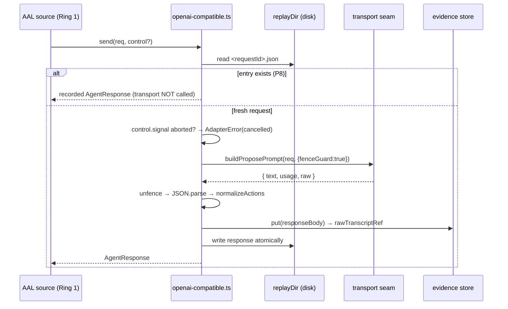
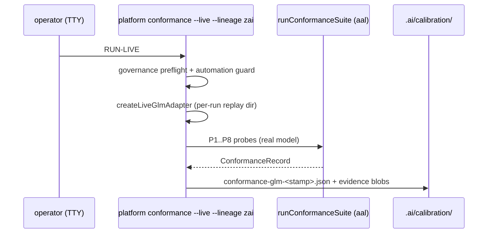

# Design: GLM-5.3 OpenAI-compatible adapter

> Status: draft 2026-08-16
> Mode: requirements-first — every design element cites its REQ in the traceability table.

## Architecture Overview

The third vendor lineage lands as one new Ring-2 module pair plus two
composition-root touches. No `core/` or `aal/` source changes (INV-8); vendor
strings (`glm`, `zai`, Z.ai URLs) appear only in Ring 2 and composition roots
(INV-7 stays provable by the unchanged vendor scan).

| Component | Ring/layer | Responsibility | New? |
|---|---|---|---|
| `adapters/src/openai-compatible.ts` | Ring 2 | Adapter core: manifest, `send()` with durable replay, typed error mapping, plus the pure request-builder/response-parser the live seam reuses | new |
| `adapters/src/openai-compatible-live.ts` | Ring 2 | Z.ai fetch wiring: auth from `ZAI_API_KEY`, base URL default/override, call control → fetch abort/timeout; thin — all logic lives in the core module's pure functions | new |
| `adapters/src/index.ts` | Ring 2 | Export both factories | edit |
| `console/backend/bin/platform.ts` | composition root | `runConformance()`: add `'zai'` to the lineage allowlist + a construction branch (same pattern as gemini-cli/opencode-deepseek) | edit |
| `.ai/policies/routing.json` | governance | `tokenBuckets["glm"]` entry (POLICY_FILES change — human-approved via PR review by construction) | edit |
| `.ai/calibration/conformance-glm-<stamp>.json` | calibration | LIVE conformance record (produced by REQ-8, not committed by code) | produced |

Deliberately NOT touched: `control.ts` (`providerEnvironment` serves spawned
child processes; this adapter fetches in-process — REQ-3.2),
`fusion-profiles.json` (live fusion behavior, separate governance decision —
REQ-7.2), `provider-data-policy.json` (direct Z.ai adds no data processor —
REQ-7.3), and any loop/PR-gate composition (D2 follow-up).

## Sequence Diagrams

`send()` happy path and replay (REQ-1.1/1.3/1.4/1.9):



Live transport failure path (REQ-1.5, REQ-2.4; never self-retried — INV-5):

```mermaid
sequenceDiagram
    participant Ad as adapter core
    participant L as openai-compatible-live.ts
    participant Z as POST api.z.ai/.../chat/completions

    Ad->>L: transport(prompt, control)
    L->>L: buildGlmRequestBody (thinking enabled + reasoning_effort)
    L->>Z: fetch(body, signal, timeout)
    Z-->>L: HTTP 429 + body {"error": ...}
    L->>L: parseGlmHttpBody throws Error("HTTP 429: <body>")
    L-->>Ad: throws
    Ad->>Ad: AdapterError already? rethrow; else classifyAdapterError → quota_limited
    Ad-->>Ad: P8 replay NOT written (failures are not cached)
```

LIVE conformance (REQ-6, REQ-8 — manual, TTY, confirmation phrase):



## Data Models & Interfaces

All in `adapters/src/openai-compatible.ts` unless noted; imports limited to
`aal` public types, `core` `Action` type, and `./wire.ts` helpers (INV-8).

```ts
/** What a transport returns on success. Throws on any failure (see Error Handling). */
export interface GlmTransportResult {
  /** choices[0].message.content */
  text: string;
  /** The two load-bearing token counts (billed). */
  usage: { promptTokens: number; completionTokens: number };
  /** The raw parsed `usage` object — passed through as AgentResponse.usage.raw (REQ-1.9). */
  rawUsage: Record<string, unknown>;
}

/** The injected seam. CI tests pass a fake; the live module passes a fetch-backed one. */
export type GlmTransport = (prompt: string, control?: AgentCallControl) => Promise<GlmTransportResult>;

export interface OpenAICompatibleAdapterOptions {
  id?: string;                    // default 'glm'
  model?: string;                 // default undefined → adapterMeta.modelVersion 'unknown'; live passes 'glm-5.3'
  contextWindowTokens?: number;   // default 1_000_000 (GLM-5.3)
  transport: GlmTransport;
  replayDir: string;              // durable, per-run, never committed
  putEvidence: (content: string) => string;
  costUnitsPer1k?: number;        // default 1
}

export function createOpenAICompatibleAdapter(opts: OpenAICompatibleAdapterOptions): AdapterInterface;

/** Pure: the request body for the Z.ai chat-completions call (REQ-2.3). */
export function buildGlmRequestBody(prompt: string, opts: {
  model: string;
  reasoningEffort: 'low' | 'high' | 'max';
}): {
  model: string;
  messages: { role: 'user'; content: string }[];
  thinking: { type: 'enabled' };   // 'disabled' is REMOVED in GLM-5.3 — always on
  reasoning_effort: 'low' | 'high' | 'max';
  stream: false;
};

/** Pure: resolve + validate endpoint credentials (REQ-2.1/2.2). Throws
 *  AdapterError('auth_unavailable') when the key is missing/empty — called at
 *  live-factory time so misconfiguration surfaces before any network call. */
export function resolveGlmEndpointConfig(env: NodeJS.ProcessEnv): {
  baseUrl: string;   // env ZAI_BASE_URL ?? 'https://api.z.ai/api/paas/v4/chat/completions'
  apiKey: string;
};

/** Pure: map an HTTP exchange to GlmTransportResult. Throws Error("HTTP <status>: <body>")
 *  on non-2xx (status+body in the message so classifyAdapterError maps 429/401/403),
 *  AdapterError('invalid_response') on 2xx with no usable choice/usage (REQ-2.6, REQ-1.8). */
export function parseGlmHttpBody(status: number, bodyText: string): GlmTransportResult;
```

Adapter core `send()` flow (mirrors `codex.ts` exactly):

1. `replayPath(requestId)` exists → return recorded response, transport not
   invoked (P8).
2. `control?.signal.aborted` → `AdapterError('cancelled')`.
3. `transport(buildProposePrompt(req, { fenceGuard: true }), control)` — the
   Z.ai path has no `--output-schema` equivalent, so the fence guard is on
   (REQ-1.3).
4. Catch: `AdapterError` thrown by the seam passes through unchanged (it is
   already typed — e.g. `invalid_response` from `parseGlmHttpBody`); anything
   else is wrapped as `AdapterError(classifyAdapterError(err), message)`.
   No retry, ever (INV-5).
5. `unfence` → `JSON.parse`; failure → `structuredResult = { raw: text }` with
   zero actionRequests (REQ-1.7) — the source repair loop handles it.
6. `normalizeActions(...)` mints `contentRef` for inline WRITE_FILE content.
7. Usage guard: prompt/completion tokens must be finite and ≥ 0, else
   `AdapterError('invalid_response')` (REQ-1.8).
8. Response: `costUnits = (promptTokens + completionTokens)/1000 * per1k`,
   `usage.raw = rawUsage` (REQ-1.9), `rawTranscriptRef = putEvidence(raw body
   text)`, `adapterMeta = { adapterId: id, modelVersion, interactive: false,
   toolUseCount: 0 }`.
9. `mkdirSync(replayDir, {recursive:true})` + write the response file.

Manifest (REQ-1.2): `adapterId 'glm'`, `structuredOutput: true`,
`toolCalling: false`, `contextWindowTokens: 1_000_000`,
`executionBackend: false`, `determinism: 'none'`, `lineage: 'zai'`.

Live seam (`openai-compatible-live.ts`):

```ts
export interface LiveGlmOptions {
  id?: string;                       // default 'glm'
  model?: string;                    // default 'glm-5.3'
  env?: NodeJS.ProcessEnv;           // default process.env — resolution is delegated to resolveGlmEndpointConfig
  reasoningEffort?: 'low' | 'high' | 'max';  // default 'high'
  timeoutMs?: number;                // default 600_000 (matches DEFAULT_KILL_TIMEOUT_MS rationale)
  fetchFn?: typeof fetch;            // injectable for future wiring; CI never imports this module (REQ-2.7)
  replayDir: string;
  putEvidence: (content: string) => string;
}

export function createLiveGlmAdapter(opts: LiveGlmOptions): AdapterInterface;
```

Factory-time behavior: `resolveGlmEndpointConfig(env)` runs immediately — a
missing/empty key throws `AdapterError('auth_unavailable')` before any
network call (tested as a pure function in the core module — same discipline
as `buildCodexArgv` living in `codex.ts` while `codex-live.ts` stays
CI-import-free). The transport composes `buildGlmRequestBody` →
`fetchFn(url, { headers: { Authorization: Bearer, content-type }, body,
signal })` with `linkCallControl(control)` wiring abort/timeout →
`parseGlmHttpBody(res.status, await res.text())`.

Conformance CLI branch (REQ-6): in `runConformance()`, allowlist becomes
`['claude','codex','gemini-cli','opencode-deepseek','zai']`, with a branch
`createLiveGlmAdapter({ ...common, ...(env PR_GATE_GLM_MODEL set ? { model } : {}) })`
following the gemini/deepseek env-passthrough pattern; unknown lineages still
refuse before any live spend.

Policy (REQ-7.1): `routing.json` gains `"glm": { "capacity": 4, "refillPerSec": 0.5 }`
— identical defaults to existing lineages; the POLICY_FILES hash change makes
the next run refuse `policy_unapproved` until the operator approves it
(governance event by construction — the PR review is the human approval).

## Technology Decisions

- **Direct `fetch`, no HTTP library** — the platform runtime (Node ≥26) has
  stable global fetch; CODING_STANDARDS forbids new dependencies without
  recorded reason, and one POST endpoint does not justify one.
- **HTTP seam split: pure functions in the core module, fetch in live** —
  `buildGlmRequestBody`/`parseGlmHttpBody` are pure and CI-tested in
  `openai-compatible.test.ts`; `openai-compatible-live.ts` holds only wiring,
  so the codex-live discipline (live module never imported by CI tests) costs
  no coverage. This is a refinement of the codex ExecFn split, not a new
  pattern: the seam is still one injected function.
- **`reasoning_effort` static default `high`** — GLM-5.3 removed
  `thinking.type: 'disabled'`, so effort is the only control; `high` matches
  the propose-loop's need for reliable structured output. Mapping
  `determinismHint`/budget to effort is deliberately follow-up (requirements
  Edge Cases).
- **`adapterId 'glm'` + `lineage 'zai'` (D1)** — version-agnostic ids like
  codex; conformance records/buckets survive model bumps; `modelVersion`
  carries `glm-5.3`. Lineage `'openai'` is taken by codex and would lie about
  vendor decorrelation.
- **Factory-time auth failure** — a missing key is a wiring error, not a
  runtime condition; failing at `createLiveGlmAdapter` (before any network)
  makes misconfiguration visible in composition roots, not mid-run.
- **Failures are not replay-cached** — only successful responses are written
  to the replay dir; caching a 429 would serve a stale failure forever on a
  crash-resume retry.
- **No `providerEnvironment` change** — no child process is spawned; the key
  never crosses a process boundary, so the env-allowlist machinery is out of
  scope (REQ-3.2 records this for a future spawn-based wiring).

## Error Handling Strategy

| Case | Detection | Mapped to | Notes |
|---|---|---|---|
| pre-call abort | `control.signal.aborted` | `AdapterError('cancelled')` | transport never invoked |
| mid-call cancel/timeout | `linkCallControl` reason / fetch abort | `cancelled` / `timed_out` | message-based classify |
| HTTP 429 / quota text | `parseGlmHttpBody` non-2xx → `Error("HTTP 429: …")` | `quota_limited` | breaker opens; router flees lineage (§5.4) |
| HTTP 401/403 | same, status in message | `auth_unavailable` | |
| context-length error text | same, body text matched | `context_limited` | |
| other non-2xx / network failure | unmatched | `transport` | REQ-1.5 fallthrough |
| 2xx, no usable choice/usage | `parseGlmHttpBody` | `AdapterError('invalid_response')` | passes through core unchanged |
| reply text not fenceable JSON | `JSON.parse` fails | NOT an error → `structuredResult {raw}` | source repair loop (REQ-1.7) |
| non-finite usage counts | guard in core | `invalid_response` | REQ-1.8 |

Never self-retry (INV-5): the only reuse of a recorded response is the
requestId replay hit (P8). The API key is never included in any error
message, evidence blob, replay file, or transcript (REQ-3.1) — `parseGlmHttpBody`
sees only the response body; the Authorization header exists only inside the
live transport closure.

## Testing Strategy

All tests co-located, `node:test` + `assert/strict`, hermetic — CI spends zero
quota (live spawn path never imported).

| Test | Asserts | REQ |
|---|---|---|
| `openai-compatible.test.ts` — manifest | shape incl. `lineage 'zai'`, `contextWindowTokens 1_000_000`, `executionBackend false` | 1.2 |
| — prompt construction | transport receives `buildProposePrompt(..., {fenceGuard:true})` output (fence clause present, action vocabulary present) | 1.3 |
| — replay idempotency | second identical `requestId` served from disk, fake transport called exactly once | 1.4 |
| — error passthrough + classify matrix | fake transport throwing `AdapterError('invalid_response')` rethrown as-is; `Error('HTTP 429: …')` → `quota_limited`; 401/403 → `auth_unavailable`; context text → `context_limited`; unmatched → `transport`; no retry observable | 1.5, 2.4 |
| — abort/timeout | pre-aborted signal → `cancelled`, zero transport calls; timeout signal → `timed_out` | 1.6 |
| — non-JSON reply | `{ raw }` structuredResult, empty actionRequests, no throw | 1.7 |
| — usage guard | NaN/negative/missing tokens → `invalid_response` | 1.8 |
| — usage math + raw passthrough | costUnits formula; unknown usage fields survive in `usage.raw` | 1.9 |
| — WRITE_FILE contentRef | inline content minted via putEvidence | 5.4 |
| — `buildGlmRequestBody` | `thinking.type 'enabled'`, `reasoning_effort` present, model echoed, `stream false` — the removed-`disabled` contract | 2.3 |
| — `parseGlmHttpBody` | 2xx happy path; 2xx empty choices / missing usage → `invalid_response`; non-2xx message contains status + body | 2.4, 2.6 |
| — `resolveGlmEndpointConfig` | missing/empty `ZAI_API_KEY` → `auth_unavailable`; `ZAI_BASE_URL` override honored; default URL constant | 2.1, 2.2 |
| — credential hygiene | key never present in error messages, evidence blobs, replay files, or transcripts produced by any code path under test | 3.1 |
| `openai-compatible-conformance.test.ts` — compliant fake | full `runConformanceSuite` P1–P8 pass (fake transport honors `[probe:Px]` directives) | 5.1 |
| — sabotage | prose-only fake fails exactly P2 | 5.2 |
| — stale regression | re-registered record after regressed re-run marks adapter `stale` (registry gate) | 5.3 |
| `adapters/src/index.test.ts` (existing) | new exports present; RING unchanged | 4.1 |

The live module `openai-compatible-live.ts` itself carries no CI test — every
behavioral branch it needs (request body, response parse, credential
resolution, error classification, abort/timeout) lives in pure functions in
the core module, exactly like `buildCodexArgv` in `codex.ts` vs the untested
`codex-live.ts` (REQ-2.7's letter is honored: no CI path imports the live
module).

REQ-6 (CLI allowlist) has no CI harness — `platform.ts` has none (recorded
ceiling since v1.7, phase-3 REQ-4.10 precedent). Verified by typecheck, the
LIVE run itself when a key exists (REQ-8.1), or stays review-verified.
REQ-7 (policy) verified by `pnpm -C aal test` routing-config guard tests +
governance preflight on the next live run.

## Requirement Traceability

| Design element | REQ | Section |
|---|---|---|
| `createOpenAICompatibleAdapter` + `GlmTransport` seam + send() flow steps 1–9 | 1.1, 1.4, 1.5, 1.6, 1.7, 1.8, 1.9 | Data Models & Interfaces |
| Manifest constants (`glm`/`zai`/1M window) | 1.2 | Data Models & Interfaces |
| `fenceGuard: true` prompt construction | 1.3 | Data Models & Interfaces |
| `buildGlmRequestBody` (thinking always-on, `reasoning_effort`) | 2.3 | Data Models & Interfaces |
| `createLiveGlmAdapter` + factory-time key guard + `ZAI_BASE_URL` | 2.1, 2.2 | Data Models & Interfaces |
| `parseGlmHttpBody` (status+body in message; 2xx shape guard) | 2.4, 2.6 | Data Models & Interfaces |
| Live module isolation + fetchFn caveat | 2.7 | Testing Strategy |
| Key-only-in-live-closure + no `providerEnvironment` change | 3.1, 3.2 | Technology Decisions |
| `index.ts` exports; import discipline; vendor scan untouched | 4.1, 4.2, 4.3 | Architecture Overview |
| Conformance test matrix (compliant/sabotage/stale) | 5.1, 5.2, 5.3, 5.4 | Testing Strategy |
| CLI allowlist + branch + per-run replay dir + record path | 6.1, 6.2 | Data Models & Interfaces |
| `routing.json` token bucket; fusion/provider-policy non-changes | 7.1, 7.2, 7.3 | Architecture Overview |
| LIVE run sequence + follow-up flip | 8.1, 8.2, 8.3 | Sequence Diagrams |
