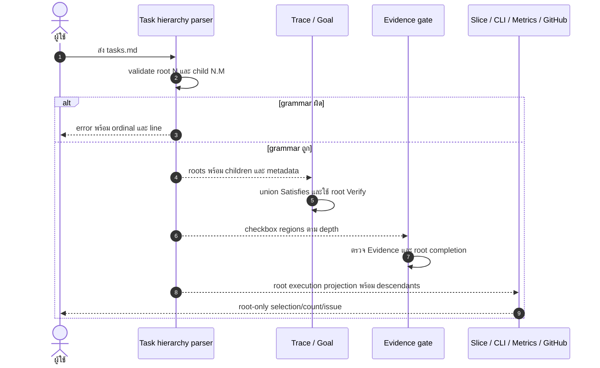

# Design: รายการงานสองระดับแบบ Kiro
> Status: draft

## Architecture Overview

เพิ่ม grammar สองระดับใน canonical task protocol แล้วให้ `scripts/spec_trace.py` เป็น shared parser สำหรับ Python consumers. Root `N` ยังเป็น execution, Goal, CLI, dependency, batch, metrics, cost และ GitHub issue unit; child `N.M` เป็น checked step ภายใน root เท่านั้น. ขอบเขตนี้แก้ parser/consumer และเอกสารกำกับ ไม่สร้าง UI component และไม่ migrate spec เดิม (`.ai/shared/TASK_PROTOCOL.md:91`, `scripts/spec_trace.py:199`, `scripts/spec_to_goal.py:105`).

ลำดับ ownership:

1. parser สร้าง root พร้อม children และ metadata แยกตาม depth
2. trace รวม `Satisfies:` ทุก node ภายใน root
3. Goal และ execution consumers project เฉพาะ root
4. Evidence engine ตรวจแต่ละ checkbox และ invariant การปิด root

## Sequence Diagrams



## Data Models & Interfaces

โมเดลภายในของ `scripts/spec_trace.py`:

```text
TaskDocument
  roots: TaskRoot[]

TaskRoot
  ordinal: int
  line: int
  checked: bool
  headline: string
  metadata: TaskMetadata
  children: TaskChild[]
  evidence: EvidenceRegion | null

TaskChild
  ordinal: "N.M"
  line: int
  checked: bool
  headline: string
  metadata: TaskMetadata
  evidence: EvidenceRegion | null

TaskMetadata
  satisfies: string[]
  verify: string | null
  dependsOn: int[]
  batch: string | null
```

Contract ของ parser:

- root headline เริ่ม column 0; child headline เริ่มสอง spaces; detail เพิ่มอีกสอง spacesตาม owner
- รองรับ blank lines ภายใน root block; root ถัดไปหรือ EOF เท่านั้นที่ปิด root
- fenced block และ Evidence region เป็น opaque content
- child รับ `Satisfies:` และ `Verify:`; `Depends on:`/`Batch:` มีผลเฉพาะ root
- `iter_task_blocks()` คง compatibility wrapper สำหรับ flat callers แต่ consumer ที่ต้องรู้ ownership ใช้ structured roots
- `.ai/bin/check-evidence.sh` คง public CLI และ `awk` core เดิม แต่เพิ่ม depth-aware regions ตาม grammar เดียวกัน

Projection matrix:

| Consumer | Root | Child |
|---|---|---|
| spec trace | รวม coverage | รวมเข้า root coverage |
| Goal | สร้าง `T-N`, ใช้ root `Verify:` | ไม่สร้าง task, ไม่ใช้ `Verify:` |
| slice | เลือกและคืนทั้ง subtree | เลือกตรงไม่ได้ |
| pane/CLI/dependency/batch | เลือกและ schedule | ไม่ schedule |
| metrics/cost | นับ | ไม่นับ |
| GitHub sync | สร้าง task issue และ manifest key | render checklist ใน body |
| archive/Evidence | ต้องเสร็จและมี Evidence | ต้องเสร็จและมี Evidence |

## Technology Decisions

- ใช้ parser ใน `scripts/spec_trace.py` เพราะ `spec_to_goal.py` import โมดูลนี้อยู่แล้ว และ traceability ใช้ task boundary จากที่นี่ (`scripts/spec_to_goal.py:28`, `scripts/spec_trace.py:211`).
- คง shell entry points และ stdlib Python/`awk`; ไม่เพิ่ม dependency.
- ใช้ exact indentation สองระดับแทน Markdown AST เพื่อให้ validation deterministic และรักษา line identity ที่ `--lines-strict` ต้องใช้ (`.ai/bin/check-evidence.sh:26`).
- ไม่เปลี่ยน flat specs และไม่ทำ mass migration; compatibility tests lock ผลเดิม.

## Error Handling Strategy

Parser fail closed พร้อม filename, physical line และเหตุผลสำหรับ duplicate root, duplicate child, orphan, wrong parent และ depth เกินสอง. CLI ที่รับ root ID อยู่แล้วตอบ unknown/non-executable เมื่อได้รับ `N.M`. Evidence engine คืน exit เดิม `0` pass, `1` policy fail, `2` engine/selection error และรายงาน opening line ของ node ที่ผิด. Root `[x]` กับ child `[ ]` เป็น policy fail แม้ root มี Evidence.

## Testing Strategy

- parser/Goal E2E: nested happy path, blank lines, flat compatibility, invalid hierarchy, root-only Goal และ child `Verify:` isolation ครอบคลุม REQ-1 ถึง REQ-3
- Evidence/gate tests: root Evidence หลัง children, Evidence แยก node, pending child และ line-selected mode ครอบคลุม REQ-4
- slice/pane/archive tests: root subtree, reject child selection, root completion และ archive safety ครอบคลุม REQ-5.1-5.3, REQ-5.5, REQ-6.4
- metrics/cost/GitHub projection tests: root-only counts/IDs/issues และ child checklist body ครอบคลุม REQ-5.4, REQ-6.1-6.3
- render fixture ผ่าน `/opt/homebrew/bin/pandoc` และ full `pnpm typecheck`, `pnpm lint`, `pnpm test`, `scripts/spec-trace.sh kiro-nested-tasks` ครอบคลุม REQ-1.5, REQ-2.5, REQ-6.5-6.6

## Requirement Traceability

| Design element | REQ | Section |
|---|---|---|
| grammar สองระดับและ root ownership | REQ-1 (ทุกเกณฑ์), REQ-2 (ทุกเกณฑ์) | Architecture Overview |
| structured root/child model และ metadata ownership | REQ-3 (ทุกเกณฑ์) | Data Models & Interfaces |
| Evidence regions และ completion invariant | REQ-4 (ทุกเกณฑ์) | Error Handling Strategy |
| root-only execution, slice และ observability projection | REQ-5 (ทุกเกณฑ์) | Data Models & Interfaces |
| GitHub root issue, compatibility และ dependency policy | REQ-6 (ทุกเกณฑ์) | Technology Decisions |
