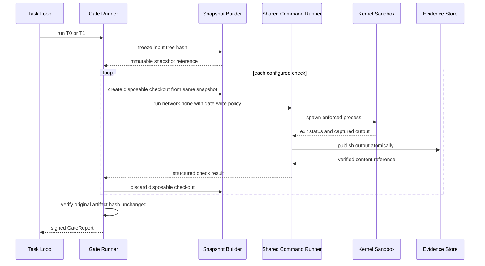
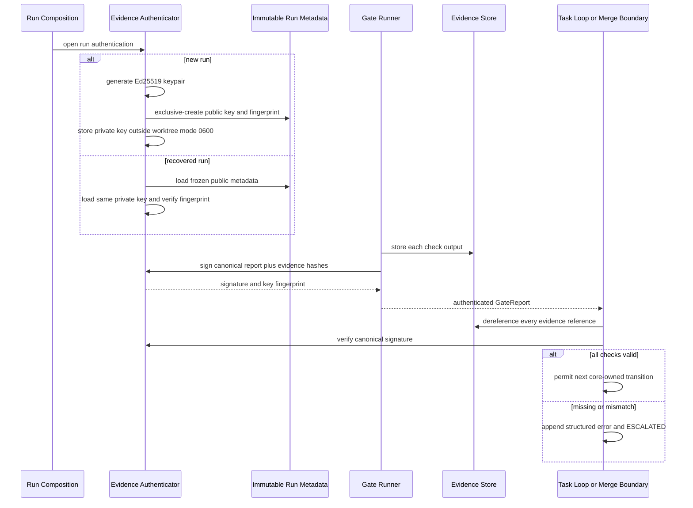
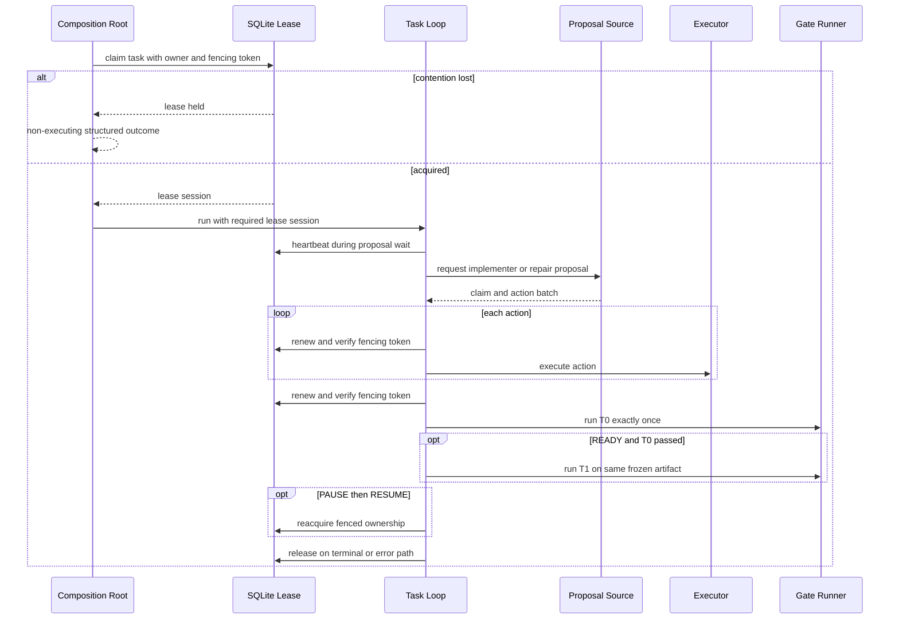
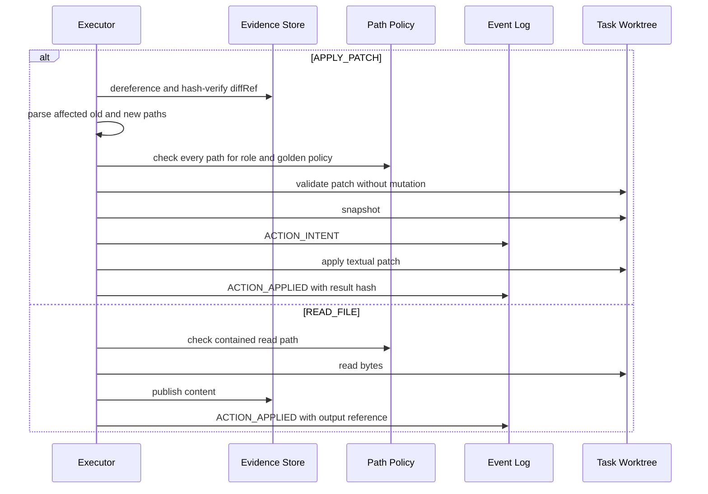

# Design: Loop Engineering Phase 0 Conformance

> Status: approved 2026-07-27, amended 2026-07-27

## Architecture Overview

การเปลี่ยนแปลงนี้เป็น conformance repair ของ Ring 0 และ composition root ปัจจุบัน
ไม่ใช่การสร้าง platform ใหม่ สถาปัตยกรรมยังคงหลัก “agent proposes, core disposes”
และเพิ่ม deterministic boundary ใน altitude ที่ consumer ทุกตัวใช้ร่วมกัน

### Scope boundary

- P0-01 pin
  `/Users/king_developer/Downloads/loop-engineering-implementation-spec.md`
  เข้า repository root แบบ byte-for-byte ก่อนแก้ production code โดยตรวจ `cmp` และ
  SHA-256 ที่บันทึกไว้
- old master, blueprint และ archived specs ไม่ถูกแก้และไม่ถูกใช้ตัดสิน product
  behavior
- Ring 0/AAL เดิมยังเป็น vendor-neutral; ไม่เพิ่ม adapter, mutation gate,
  impact map, calibration corpus, fusion capability, auditor capability หรือ
  learning capability
- ไฟล์ later-phase ที่มีอยู่แล้วอาจถูกแตะเฉพาะจุดรับ `GateReport` เพื่อไม่ให้
  approval/merge/completion path ข้าม Phase 0 evidence invariant
- Amendment วันที่ 2026-07-27 กำหนด macOS backend เป็น inherited
  filesystem/network effect-denial boundary ไม่ใช่ universal descendant audit หรือ
  whole-process-tree cleanup backend จึงห้ามสร้าง fake `sandbox_violation` จาก output
  ของ child หรือจากการอนุมานว่า effect ไม่เกิด
- Phase 0 บน macOS ไม่เปิด network allowlist ใด ๆ Package installation ทำได้เฉพาะ
  แบบ offline ด้วย pre-provisioned input ภายใต้ `network: none`; network grant
  จะเปิดได้ก็ต่อเมื่อ backend ในอนาคตพิสูจน์ revocable descendant containment ได้
- `RUN_COMMAND` ที่มี artifact-write authority ใช้ disposable frozen workspace และ
  core-promote เฉพาะ frozen captured diff ที่ผ่าน role/golden policy หลัง command
  return เท่านั้น ส่วน read-only tests/probes คง result/evidence behavior เดิมโดยไม่
  เข้าสู่ promotion path

### Component changes

| Component | Responsibility | Primary file surface |
|---|---|---|
| Durable authority | Pin exact normative bytes and repair only misleading references in touched Phase 0 files | `loop-engineering-implementation-spec.md`; touched comments in Phase 0 files |
| Shared command boundary | One async child-process runner for every executor/gate/workspace-preparation child, inherited effect-denial sandbox, honest enforcement-owned observations, no Phase 0 network grant, disposable gate and artifact-mutation workspaces, role-scoped diff promotion, fail-closed config/resource validation | `core/src/security/command-runner.ts`, `core/src/security/sandbox.ts`, `core/src/executor/path-policy.ts`, `core/src/executor/executor.ts`, `core/src/gates/frozen-tree.ts`, `core/src/gates/runner.ts` |
| Action lifecycle | Policy-safe textual `APPLY_PATCH`; explicit non-mutating `READ_FILE` path | `core/src/executor/executor.ts`, `core/src/types.ts` |
| Evidence authentication | Atomic blobs, per-run Ed25519 key, canonical report signing, shared trust-boundary verifier | `core/src/evidence/store.ts`, `core/src/evidence/auth.ts`, `core/src/gates/report-integrity.ts`, composition root and existing report consumers |
| Gate orchestration | T0 exactly once per implementation/repair iteration; T1 after same-artifact T0; explicit logged T2/T3 stubs | `core/src/orchestrator/loop.ts`, `core/src/gates/runner.ts` |
| Lease session | Claim, heartbeat, fencing, pause reacquire, terminal release for single and graph modes | `core/src/state/lease.ts`, `core/src/orchestrator/loop.ts`, `core/src/ports.ts`, `console/backend/src/loop-run.ts` |
| Budget validation | Finite non-negative validation at AAL and core boundaries | `core/src/budget/budget.ts`, `core/src/ports.ts`, `core/src/orchestrator/loop.ts`, relevant `aal/src/` usage aggregation |
| Golden operations | System verifier, direct CI command, copy-only fixture input, paired coverage | `core/src/gates/golden.ts`, `core/src/calibration/calibration.ts`, `scripts/check-golden-manifests.sh`, `.github/workflows/ci.yml`, composition fixture |
| Prohibited-change controls | Versioned syntactic rules plus frozen RED provenance | `core/src/gates/convention.ts`, `core/src/gates/runner.ts`, executor policy, event types |
| Closure suite | DoD 1–9 on wired paths and full enforcement-floor commands | `core/test/fault-injection.test.ts` and affected package tests |

### Dependency direction

`core/src/orchestrator` depends on injected ports from `core/src/ports.ts`;
`core/src/executor` and `core/src/gates` both depend on
`core/src/security/command-runner.ts`; neither imports the other.
`console/backend/src/loop-run.ts` constructs run-state resources, evidence
authentication, lease session, executor, and gates. No Ring 0 file imports a
Ring 2 adapter or any provider SDK.

## Sequence Diagrams

### Shared child-process and gate flow



Gate processes may write inside their disposable checkout so ordinary toolchains can
create caches/build outputs, but `test/golden/` remains denied. No output from that
checkout is copied back into the task worktree.

### RUN_COMMAND dispatch, observation, and promotion flow

```mermaid
sequenceDiagram
    participant L as Task Loop
    participant X as Core Artifact Command Executor
    participant F as Frozen Workspace
    participant C as Module-private Sandboxed Spawn
    participant K as macOS Sandbox Profile
    participant W as Task Worktree

    alt core-classified read-only test or probe
        L->>X: RUN_COMMAND plus trusted task context
        X->>X: derive read-only plan from core policy
        X->>C: run network none without artifact promotion
        C->>K: spawn with inherited effect-denial profile
        K-->>C: direct status and captured output
        C-->>X: typed spawn outcome
        X-->>L: preserve exit/output evidence semantics
    else artifact-mutating RUN_COMMAND
        L->>X: RUN_COMMAND plus trusted task context
        X->>X: derive role, roots, mode, and input hash
        X->>F: materialize frozen task-tree hash
        F-->>X: disposable workspace
        X->>C: run in disposable workspace, network none
        C->>K: spawn with role roots inside disposable workspace
        alt direct result or enforcement-owned channel observes denial
            K-->>C: attributable denial
            C-->>X: structured sandbox_violation
            X->>F: discard; promote nothing
            X-->>L: typed violation outcome
        else direct command returns
            K-->>C: direct status and captured output
            C-->>X: typed direct outcome, no universal-attempt claim
            alt non-zero exit or ordinary signal
                X->>F: discard; promote nothing
                X-->>L: command_failed with typed exit or signal
            else exit zero
                X->>F: stream two-inventory immutable capture
                F-->>X: hashes plus bounded captured diff
                alt diff forbidden, unsupported, or unstable
                    X->>F: discard; promote nothing
                    X-->>L: typed capture rejection
                else diff allowed by role and golden policy
                    X->>W: promote exactly frozen captured diff
                    X->>F: discard disposable workspace
                    X-->>L: promoted outcome plus evidence
                end
            end
        end
    end
    Note over K,F: A new-session descendant may outlive the parent, but inherits the profile and remains bound to discarded workspace effects. Termination and CPU containment are not claimed.
```

Core never parses child-controlled stdout/stderr as proof of a denial. A direct
enforcement result or another backend-owned authenticated channel may produce
`sandbox_violation`; if an arbitrary descendant denial is not observable, evidence
records no detection claim while the inherited profile and disposable workspace still
prevent an unauthorized durable artifact/network effect.

Every command outcome persists `networkPolicyHash`, content-bound `environmentHash`,
`denialObservation: direct_only`, `revocableDescendantContainment: false`,
`descendantTermination: unproven_new_session`, and either an enforcement-owned
`observedViolation` or explicit `null`. This is the positive DoD#3/§12 log contract:
it proves which boundary was enforced and what that backend cannot observe without
pretending that an unobserved attempt was detected.

Every artifact-mutating command is frozen twice: once before execution and once after
the direct command returns. Diff capture reads only the stable post-command artifact,
not the live disposable directory. A stability mismatch, unsupported artifact shape,
resource-limit breach, or role/golden-policy violation discards the entire workspace.
This closes the promotion race even when a descendant creates a new session and keeps
running. The descendant may still consume CPU until OS/operator cleanup; Phase 0 records
that backend capability ceiling as a residual and does not fabricate whole-tree cleanup.

### Evidence signing, recovery, and state advancement



### Lease, iteration gates, and pause flow



Diagnostician proposals and read-only hypothesis probes are not implementation/repair
iterations, so they do not increment the T0 count. A `WORKING`, `BLOCKED`, or
`READY_FOR_VERIFICATION` implementer/repair response does.

### Patch and read action flow



`READ_FILE` intentionally has no snapshot or `ACTION_INTENT`: it is non-mutating, so
the recovery invariant that needs pre-side-effect intent does not apply. The explicit
`ACTION_APPLIED` record keeps idempotency and auditability.

## Data Models & Interfaces

Interfaces below define contracts; exact names may be adjusted to existing naming
conventions without weakening fields or semantics.

```ts
type SpawnPurpose =
  | 'read_only_probe'
  | 'gate_check'
  | 'workspace_preparation'
  | 'artifact_process'
  | 'artifact_capture';

interface SandboxedSpawnRequest {
  command: string;
  cwd: string;
  network: 'none';
  writeRoots: string[];
  denyWriteRoots: string[];
  timeoutMs: number;
  purpose: SpawnPurpose;
}

interface SandboxBackendCapabilities {
  inheritedFilesystemAndNetworkPolicy: true;
  denialObservation: 'direct_only';
  revocableDescendantContainment: false;
  descendantTermination: 'unproven_new_session';
}

type CommandRejectionReason =
  | 'sandbox_unavailable'
  | 'network_grant_unavailable'
  | 'offline_dependency_unavailable'
  | 'package_install_denied'
  | 'path_outside_allowlist'
  | 'golden_write_denied'
  | 'command_artifact_unavailable'
  | 'command_diff_rejected';

interface CommandEvidence {
  outputRef: string;
  networkPolicyHash: string;
  environmentHash: string;
  backend: SandboxBackendCapabilities;
  observedViolation: null | {
    source: 'enforcement_owned_direct' | 'backend_owned';
    // 'unknown' = enforcement-owned direct-child kill whose denied operation
    // class (filesystem vs network) the profile cannot disambiguate.
    operation: 'filesystem' | 'network' | 'unknown';
  };
}

type SandboxedSpawnOutcome =
  | {
      status: 'completed';
      exitCode: number;
      signal: null;
      evidence: CommandEvidence;
    }
  | {
      status: 'signaled';
      exitCode: null;
      signal: NodeJS.Signals;
      evidence: CommandEvidence;
    }
  | {
      status: 'sandbox_violation';
      exitCode: number | null;
      signal: NodeJS.Signals | null;
      observation: NonNullable<CommandEvidence['observedViolation']>;
      evidence: CommandEvidence;
    }
  | {
      status: 'preflight_rejected';
      reason: CommandRejectionReason;
      evidenceRef: string;
    };

interface SandboxedSpawn {
  // Module-private: callers cannot provide agent-derived purpose/roots directly.
  runCoreDerived(request: SandboxedSpawnRequest, hooks?: {
    heartbeat(): Promise<boolean>;
  }): Promise<SandboxedSpawnOutcome>;
}

interface TrustedCommandPlan {
  readonly executionMode: 'read_only_probe' | 'artifact_mutation';
  readonly role: AgentRole;
  readonly writeRoots: string[];
  readonly denyWriteRoots: string[];
  readonly frozenInputTreeHash: string;
  readonly offlineDependencyPolicy?: OfflineDependencyPolicy;
  readonly __coreMinted: unique symbol;
}

interface CommandArtifactPolicy {
  version: 1;
  maxFiles: number;
  maxSingleFileBytes: number;
  maxTotalBytes: number;
  maxDiffBytes: number;
  captureTimeoutMs: number;
}

const PHASE0_COMMAND_ARTIFACT_POLICY: CommandArtifactPolicy = {
  version: 1,
  maxFiles: 200_000,
  maxSingleFileBytes: 268_435_456,
  maxTotalBytes: 2_147_483_648,
  maxDiffBytes: 2_147_483_648,
  captureTimeoutMs: 300_000,
};

interface CapturedCommandArtifact {
  exitCode: number;
  inputTreeHash: string;
  outputTreeHash: string;
  preCopyInventoryHash: string;
  postCopyInventoryHash: string;
  captureInventoryHash: string;
  diffRef: string;
  diffHash: string;
  affectedPaths: string[];
}

type ArtifactCommandOutcome =
  | { status: 'promoted'; capture: CapturedCommandArtifact; promotedDiffHash: string; evidence: CommandEvidence }
  | { status: 'no_changes'; capture: CapturedCommandArtifact; evidence: CommandEvidence }
  | {
      status: 'command_failed';
      command: Extract<SandboxedSpawnOutcome, { status: 'completed' | 'signaled' }>;
      evidenceRef: string;
    }
  | {
      status: 'sandbox_violation';
      command: Extract<SandboxedSpawnOutcome, { status: 'sandbox_violation' }>;
      evidenceRef: string;
    }
  | {
      status: 'preflight_rejected';
      reason: CommandRejectionReason;
      evidenceRef: string;
    }
  | { status: 'capture_rejected'; reason: CommandRejectionReason; evidenceRef: string };

interface ArtifactCommandExecutor {
  // Core-only owner of materialize -> spawn -> freeze -> capture -> validate ->
  // promote -> cleanup. No lower-level artifact-write API is exported.
  execute(plan: TrustedCommandPlan, action: RunCommandAction): Promise<ArtifactCommandOutcome>;
}

interface CoreCommandExecutor {
  // The only public RUN_COMMAND entry; derives TrustedCommandPlan from policy.
  execute(action: RunCommandAction, context: TrustedTaskContext): Promise<ArtifactCommandOutcome | SandboxedSpawnOutcome>;
}
```

Only `SandboxedSpawnOutcome.status === 'completed' && exitCode === 0` may enter
artifact capture. A normal non-zero exit is mapped to `command_failed`; a signal uses
the same terminal outcome unless an enforcement-owned observation already produced the
separate `sandbox_violation` variant. Every failed variant promotes nothing and reaches
the shared `finally` cleanup path.

`PathPolicy` gains a normalized `writeRoots(role)` query so direct file actions and
shell processes consume the same policy. `CoreCommandExecutor` derives the mode, role
roots, deny roots, frozen input hash, and dependency policy; an agent cannot choose
`read_only_probe`, mint `TrustedCommandPlan`, or call module-private `SandboxedSpawn`.
`ArtifactCommandExecutor` is the single owner of every mutation phase, so no caller can
spawn first and bypass freeze/capture/policy/promotion. Its own preparation and capture
helpers call `SandboxedSpawn` with core-minted `workspace_preparation` or
`artifact_capture` purpose, avoiding recursive artifact-command dispatch.

Gate and artifact-mutation modes use disposable checkouts with their checkout root as
the only ephemeral artifact write surface and `test/golden/` as an explicit deny. A
core-classified `read_only_probe` does not enter artifact promotion and retains the
existing direct exit/output result contract. The shared runner uses async child-process
APIs so lease heartbeat and cancellation continue while a command is running.

The deprecated macOS backend declares
`denialObservation: 'direct_only'`,
`revocableDescendantContainment: false`, and
`inheritedFilesystemAndNetworkPolicy: true`. Therefore it rejects every allowlist
network request before spawn. An offline package install remains an ordinary
`network: 'none'` command with core-provisioned inputs and validated role-scoped policy
bound by production composition; a role without install permission receives no added
writable root. Missing inputs are a structured failure, never a reason to widen the
profile. `observedViolation` is `null` when no enforcement-owned channel can attribute
a denial, even if the absence of an effect suggests that the inherited profile blocked
an arbitrary descendant.

```ts
interface OfflineDependencyPolicy {
  version: 1;
  allowedRoles: AgentRole[];
  lockfilePath: string;
  lockfileHash: string;
  approvedSourceHashes: string[];
  lifecycleScripts: 'disabled';
  network: 'none';
}
```

The minimal Phase 0 dependency policy resolves the pinned §4.1/§8.1 versus §11 map
conflict conservatively: exact frozen-lockfile match, content-hash-approved offline
source, allowed role, lifecycle scripts disabled, and `network: none` are all required.
The package-manager invocation uses its literal `--ignore-scripts` control and a
frozen-lockfile mode; this is not registry access or the later full dependency-policy
plane.

After the direct command returns, core captures promotion input with this deterministic
protocol:

1. Create an exclusive core-owned capture destination outside every sandbox writable
   root; apply the finite, versioned `CommandArtifactPolicy`.
2. Stream a pre-copy inventory of promotion roots as
   `{path, shape, mode, bytes, sha256}`; reject changed symlinks, submodules, devices,
   sockets, FIFOs, or any unsupported shape. Traverse relative to a held root directory
   descriptor and open files with no-follow semantics; `fstat` must still report the
   inventoried regular file before bytes are accepted.
3. Stream-copy each accepted regular file into the capture destination with exclusive
   creation and verify the destination hash against the pre-copy inventory.
4. Stream a second source inventory. Accept only when the pre/post inventory hashes are
   identical and the independently hashed capture inventory matches them.
5. Make the capture destination non-writable, derive the bounded diff from frozen input
   plus this destination, then validate every old/new path and artifact shape before
   core promotion.
6. Run cleanup in `finally` for success, rejection, timeout, cancellation, signal, and
   every injected failpoint. A source churn or bound breach is one structured
   `capture_rejected`, never a retry loop.

The committed Phase 0 policy uses the exact defaults above; its raw bytes are bound into
command evidence and any loosening follows existing meta-governance. Tests inject
smaller non-default values to prove every boundary. The original task tree is never the
command cwd for an artifact-mutating invocation. Ignored/untracked residue, post-capture
writes, or leaked descendants remain inside the disposable workspace and can never
join the promoted artifact implicitly.

`environmentHash` covers the effective policy bytes plus content hashes of the resolved
control-plane toolchain executables. Paths, version strings, or inherited environment
names alone are not identity: replacing bytes at the same path must change the hash.

```ts
interface FrozenRunMetadata {
  version: 1;
  runId: string;
  evidenceAuth: {
    algorithm: 'Ed25519';
    publicKeyPem: string;
    publicKeyFingerprintSha256: string;
  };
}

interface GateReportAuth {
  version: 'gate-report-v1';
  algorithm: 'Ed25519';
  keyFingerprint: string;
  signatureBase64: string;
}

interface AuthenticatedGateReport extends GateReport {
  auth: GateReportAuth;
}

interface EvidenceAuthenticator {
  signGateReport(reportWithoutAuth: GateReport): GateReportAuth;
  verifyGateReport(report: AuthenticatedGateReport): void;
}
```

Canonical bytes are UTF-8 JSON of a versioned object whose object keys are sorted
recursively, whose array order is retained, and whose values reject non-finite numbers
or unsupported JSON types. The signed object contains the complete report excluding
`auth`, plus a sorted list of `{ evidenceRef, sha256 }` derived by dereferencing every
check reference. The fingerprint is SHA-256 of the DER SPKI public key.

Run-state layout:

```text
<run-state>/
  events.db
  evidence/
  run-metadata.json
  evidence-auth/
    private-key.pem
```

`run-metadata.json` and the private key are exclusive-created. The key is mode `0600`
and never copied into the task or disposable gate worktree. Recovery accepts either a
complete matching pair or fails closed; it never silently generates a replacement key
for an existing run.

```ts
interface PatchInspection {
  paths: Array<{ oldPath?: string; newPath?: string }>;
  kind: 'text';
}

type PatchRejectionReason =
  | 'evidence_invalid'
  | 'patch_malformed'
  | 'patch_unsupported'
  | 'patch_conflict'
  | 'patch_noop'
  | 'path_outside_allowlist'
  | 'golden_write_denied';
```

Git performs syntax and applicability checks. Path discovery uses a NUL-delimited
Git output rather than a hand-written line regex, so quoting cannot hide a path.
Binary and symlink-bearing patches fail closed in Phase 0. Accepted text additions,
updates, deletions, and renames must pass policy for every old/new path before the
snapshot/intent sequence starts.

```ts
interface LeaseClaim {
  taskId: string;
  ownerId: string;
  fencingToken: number;
  leaseUntil: number;
}

interface TaskLeaseSession {
  claim: LeaseClaim;
  heartbeat(): Promise<boolean>;
  verifyOwnership(): boolean;
  reacquireAfterPause(): Promise<boolean>;
  release(): void;
}
```

SQLite stores a monotonically increasing fencing token with each successful new
ownership generation. `runTaskLoop` requires a lease session; a caller cannot select
an unsafe no-lease overload. TTL validation uses the maximum configured atomic command
or gate duration plus a fixed safety margin. Loss of ownership kills an active child
when possible, rolls back an unfinished mutating action through the existing recovery
path, and forbids later side effects from the old token.

```ts
interface GoldenCoverage {
  goldenAcCount: number;
  inScopeAcCount: number;
  rate: number;
}

interface CalibrationResult {
  n: number;
  heldOutPassRate: number;
  range: [number, number];
  reproducibility: number;
  goldenCoverage: GoldenCoverage;
}

interface RedArtifactRecord {
  path: string;
  contentRef: string;
  contentHash: string;
  expectedFailureFingerprint: string;
  sourceRole: 'test_designer';
  frozenBy: 'core';
}
```

Golden coverage deduplicates acceptance-criterion IDs before numerator and denominator
calculation. A zero denominator yields an explicit zero-coverage result rather than an
implicit full pass.

Frozen RED provenance is created only after core observes the expected failing result.
Direct writes, patches, and command write profiles deny frozen paths to implementers.
A test-designer correction is staged separately, run RED by core, then atomically
replaces the provenance record; no semantic classifier decides whether an assertion
was weakened.

## Technology Decisions

### TD-1: Built-in Ed25519, one keypair per run

ใช้ `node:crypto` เท่านั้น จึงไม่มี dependency/license surface ใหม่ Per-run keys ลด
blast radius และทำให้ recovery anchor ชัด Private key อยู่ใต้ run state นอก agent
worktreeด้วย mode `0600`; public key/fingerprint อยู่ใน immutable metadata

Alternative ที่ไม่เลือก:

- content hash อย่างเดียว เพราะพิสูจน์ integrity เมื่ออ่านแต่ไม่พิสูจน์ authenticity
- repository-wide private key เพราะขยาย blast radius และทำ recovery ownership กำกวม
- external signing library เพราะ Node runtime รองรับ Ed25519 อยู่แล้ว

### TD-2: Shared async command runner with disposable promotion

executor, gates และ child process ที่ใช้เตรียม/freeze/capture command workspace ใช้
primitive เดียวเพื่อปิดช่องที่เกิดจาก direct `spawnSync` หรือ target-controlled
`PATH`/Git config/filter/hook Gate check แต่ละตัวเริ่มจาก frozen snapshot เดียวกัน
ส่วน artifact-mutating `RUN_COMMAND` เริ่มจาก frozen task tree แล้ว freeze output
อีกครั้งหลัง direct command return ก่อน core capture และ promote เฉพาะ diff ที่
policy อนุญาต Original task worktree ไม่เป็น command cwd และไม่รับ cache, ignored
residue หรือ delayed descendant write โดยปริยาย การใช้ async spawn ทำให้
heartbeat/fencing และ cancellation ทำงานระหว่าง direct child process ได้

Read-only tests/probes ไม่ถูกบังคับให้สร้างหรือ promote diff พวกมันคง exit-status
และ output-evidence semantics เดิมภายใต้ `network: none` และ role policy การแยก
execution mode มาจาก core-owned classification ไม่ใช่ field ที่ agent ใช้ประกาศ
สิทธิ์ให้ตัวเอง

### TD-2A: Effect denial without fake sandbox audit

macOS `sandbox-exec` เป็น deprecated backend ที่ให้ inherited profile ซึ่งป้องกัน
unauthorized filesystem/network effects ต่อ descendants ได้แม้ process สร้าง session
ใหม่ แต่ไม่มี authenticated observation ของ denial จาก arbitrary descendant ทุกตัว
และไม่มี OS-owned containment ที่ terminate new-session descendant ได้ทั้งหมด

ดังนั้น `sandbox_violation` เกิดเฉพาะ direct-process result หรือ backend-owned channel
ที่ attribute denial ได้ Core ไม่ parse child output และไม่อ้างว่า “detected” เมื่อ
เห็นเพียงว่า effect ไม่เกิด Backend capability ถูกบันทึกว่า new-session termination
`unproven`; disposable workspace + frozen captured diff ทำให้ residual นี้ไม่กลายเป็น
durable artifact/network escape แต่ CPU/session lifetime ยังเป็น explicit follow-up
ไม่ใช่สิ่งที่ documentation ซ่อน

Direct-process result หมายถึง wait status ที่ kernel รายงานให้ parent ซึ่งเป็น
parent-owned state ไม่ใช่ child-controlled output: core จำแนก timeout,
cancellation และ output-limit (kill ที่ core สั่งเอง) ก่อนเสมอ สิ่งที่เหลือมาถึง
observation channel คือ `SIGKILL` ที่ core ไม่ได้สั่ง จึงบันทึกเป็น
`source: 'enforcement_owned_direct'` โดย operation class ระบุไม่ได้จาก wait status
จึงเป็น `'unknown'`; residual สองข้อคือ child ที่ส่ง `SIGKILL` ใส่ตัวเอง และ
external/OOM kill ซึ่ง forge ได้เพียง conservative rejection ของ action ตัวเอง
(fail-closed) ไม่มีทาง forge ความสำเร็จ observation scope ยังเป็น `direct_only`:
descendant ที่ถูก deny แล้ว parent กลืน status ไว้ยังคง `observedViolation: null`
ตาม REQ-2.40 โดย effect ยังถูก deny จริง

Offline package install ที่ policy อนุมัติ (exact lockfile, content-hashed sources,
lifecycle scripts disabled) ได้ profile relaxation ข้อเดียวและไม่แตะ network policy
เลย: approved-source roots ถูกลดจาก kill-on-write เป็น plain deny (EPERM) เพราะ
installer probe staging ใน source dir แล้ว handle EPERM เองได้ แต่ตายกลางคันถ้าโดน
SIGKILL — roots เหล่านั้นยังเขียนไม่ได้ และ installed bytes ถูก verify กับ approved
snapshot ก่อน promote เช่นเดิม graceful root ที่ครอบ protected root ถูก reject
ตั้งแต่ตอน wrap เพื่อไม่ให้ downgrade การป้องกันของ `test/golden` โดยบังเอิญ
`network: none` ยังเป็น SIGKILL deny ทั้ง inet/inet6 และ unix-domain socket
(ยืนยันด้วย probe จริง: DNS ผ่าน mDNSResponder, `/var/run/docker.sock` และ raw-IP
connect ล้วน rc=137) และ evidence bind `offlineInstallProfile` ระดับ command เพื่อ
ให้ auditor แยกได้ว่า command ไหนรันด้วย relaxation นี้

### TD-2B: No Phase 0 network grant on macOS

Network allowlist จะปลอดภัยก็ต่อเมื่อ backend prove ได้ว่า descendant ทุกตัวที่ถือ
grant ถูก revoke/contain เมื่อ invocation จบ macOS backend ปัจจุบันพิสูจน์ไม่ได้ จึง
reject network-allow ทุก request ก่อน spawn Phase 0 package installation ใช้เฉพาะ
pre-provisioned offline input ภายใต้ `network: none`; input ไม่ครบให้ fail closed

Pinned §4.1/§8.1 บังคับ dependency policy แต่ §11 repository map ระบุ phase ที่ช้ากว่า
Amendment นี้ใช้ทางเล็กและย้อนกลับได้ตาม §0: คงเฉพาะ Phase 0 supply-chain floor คือ
role allowlist, exact frozen-lockfile hash, offline source content hash และ disabled
lifecycle scripts ส่วน registry allowlist กลายเป็น no-registry rule เพราะ backend
เปิด network ไม่ได้ Full dependency-policy plane, online resolution และ backend ใหม่
เป็นงาน phase หลัง การเพิ่ม backend ที่ prove revocable containment ในอนาคตเป็นงานแยก
ไม่ใช่ capability ที่ amendment นี้สร้างล่วงหน้า

### TD-3: Git parses patches; policy decides paths

ใช้ Git ที่ repo พึ่งอยู่แล้วสำหรับ `--check` และ NUL-delimited path inspection
ไม่เขียน unified-diff parser แบบ regex และไม่เพิ่ม parser dependency Unsupported
binary/symlink shapes ถูก reject อย่างมีโครงสร้างใน Phase 0

### TD-4: READ_FILE is a documented non-mutating lifecycle exception

Snapshot และ `ACTION_INTENT` ปกป้อง side effect ที่ recovery ต้องตัดสินว่าจะ replay
หรือ rollback `READ_FILE` ไม่มี side effect ต่อ artifact จึงบันทึกเพียง
`ACTION_APPLIED` พร้อม content ref การทำ snapshot/commit ก่อนทุก read จะเพิ่ม mutation
จาก core เองโดยไม่เพิ่ม safety

### TD-5: Lease fencing lives at the task-loop boundary

Graph-only claim ไม่พอ เพราะ single-task callers ยังข้ามได้ Composition ทั้งสองโหมด
ต้องใช้ `TaskLeaseSession` เดียวกัน และ loop ตรวจ ownership ก่อน executor/gate
ทุกครั้ง Fencing token กัน owner เก่ากลับมารันหลัง TTL/pause

### TD-6: Golden tooling is system-owned; truth bytes are operator-supplied

ระบบสร้าง verifier และ coverage calculator ได้ แต่ runtime มีเพียง copy-only input
ไม่มี API regenerate manifest หรือ golden bytes ถ้า operator ยังไม่ให้ bytes งาน
P0-08/P0-10 คง `BLOCKED` และห้าม label fixture ที่ agent สร้างว่า human-authored

### TD-7: Syntax regex plus frozen RED provenance

Regex ใช้กับ deterministic syntax เท่านั้น เช่น focused/skipped calls หรือ explicit
bypass directives Semantic cases เช่น delete failing test หรือ weaken assertion ใช้
core-observed RED artifact hash/provenance ไม่มี classifier, mutation gate หรือ
“AI intent” heuristic ใน Phase 0

### TD-8: Minimal reference hygiene

หลัง pin source แล้วแก้ reference เก่าเฉพาะ Phase 0 files ที่ task นี้แตะและมีข้อความ
ทำให้ behavior เข้าใจผิด ไม่ทำ repo-wide comment churn และไม่ลบ old documents

## Error Handling Strategy

| Condition | Structured response | State/effect |
|---|---|---|
| Authority bytes or SHA mismatch | P0-01 verification failure | Block P0-02 onward; no production edit |
| Sandbox unavailable | `sandbox_unavailable` | Reject/fail gate; never spawn unsandboxed |
| Enforcement-owned direct result or backend channel observes an unauthorized denial | `sandbox_violation` with typed observation provenance | Reject command; preserve core-owned evidence |
| Direct process exits by signal with no denial observation | `signaled` with `exitCode: null` and exact signal | Do not call it a sandbox violation; apply ordinary command-failure policy |
| Artifact-mutating command exits normally with non-zero status | `command_failed` with exact exit code | Skip capture/promotion and run terminal cleanup; partial disposable writes are discarded |
| Arbitrary descendant denial has no enforcement-owned observation | no fabricated violation event; backend capability remains `direct_only` | Prevent unauthorized effect through inherited profile; make no attempt-detection claim |
| Network allow requested on Phase 0 macOS backend | `network_grant_unavailable` | Reject before spawn because descendant revocation is unproven |
| Offline package input unavailable | `offline_dependency_unavailable` | Reject without changing `network: none` |
| Role lacks offline package-install permission | `package_install_denied` | Reject without adding package/cache/artifact write roots |
| Lockfile missing/mismatch or offline source hash unapproved | `offline_dependency_unavailable` | Reject before spawn; no lifecycle script or package process starts |
| Offline package manager would run lifecycle scripts | preflight forces lifecycle scripts disabled | No script hook runs; mismatch is configuration failure |
| Preflight path/role/golden policy violation | `path_outside_allowlist` or `golden_write_denied` | No child starts; no protected-tree mutation |
| Runtime enforcement observes out-of-policy filesystem denial | `sandbox_violation` | Typed observation; never relabel as preflight policy rejection |
| Artifact-mutating command diff is forbidden, unsupported, or unstable | `command_diff_rejected` | Discard disposable workspace; promote nothing |
| Frozen/captured command artifact exceeds resource policy or cannot materialize | `command_artifact_unavailable` | Fail closed and clean every core-owned temporary artifact from the attempt |
| Backend cannot prove new-session termination | capability `descendantTermination: unproven_new_session` | No whole-descendant cleanup claim; inherited profile and discarded workspace prevent unauthorized durable effects; CPU/session escape remains follow-up |
| Empty/malformed T0/T1 policy | `invalid_gate_config` | Signed failing `GATE_RESULT`; no vacuous green |
| Missing/tampered patch ref | `evidence_invalid` | Reject before snapshot |
| Malformed/unsupported/conflicting patch | patch-specific rejection | Reject before mutation |
| Crash after patch intent | dangling intent found on replay | Roll back snapshot, replay once, append recovered applied event |
| Missing key or metadata during recovery | `evidence_auth_unavailable` | Append error; task `ESCALATED`; do not rotate key |
| Blob/hash/signature/fingerprint mismatch | `evidence_auth_mismatch` | Append error; task `ESCALATED`; report cannot advance |
| Invalid negative/non-finite cost | `invalid_response` | Task `ESCALATED`; accumulated cost unchanged |
| Lease contention | `lease_held` | Losing loop emits no proposal/action/gate events |
| Lease lost after start | `lease_lost` | Kill/discard current external work when possible; no later side effect |
| Resume cannot reacquire | `lease_unavailable_after_pause` | Remain non-executing |
| Flake fail-then-pass | `flakySuspect: true`, `pass: false` | One retry only; no auto-quarantine |
| Golden fixture absent | `operator_golden_fixture_missing` | P0-08 and closure remain explicitly blocked |
| Golden tamper | manifest failure with path/reason | T1/direct CI fails |
| Frozen RED artifact mutation | `red_artifact_frozen` | Action rejected; test-designer must re-enter RED flow |

ทุก failure ที่สร้าง evidence ต้องใช้ authenticated report format เดียวกัน Error
handling ห้าม fallback ไป unsigned report, unsandboxed child process, output-derived
sandbox attribution, replacement key, generated golden truth, online package-install
grant หรือ silent lease downgrade

## Testing Strategy

ทุก implementation task เริ่มด้วย failing test/fault scenario ที่พิสูจน์ gap ของ
production path แล้วจึงทำ GREEN ใน task เดียวกัน Tests assert observable state,
event order, artifact bytes, exit status และ side-effect absence ไม่ assert private
helper calls

### Test layers

| Layer | Coverage | Important constraints |
|---|---|---|
| Pure unit | canonical JSON, signature verify, config validation, spawn/result discriminated unions, offline dependency policy, capture-bound policy, patch inspection, cost validation, golden coverage, convention corpus | Deterministic fixtures; no real repo incidental-state assertions |
| Component | evidence store atomic publish, executor patch/read lifecycle, lease fencing, shared spawn primitive, core-only command classification, two-inventory command-artifact capture/promotion | Temp repositories/run dirs; inject clock/failpoint at every materialize/copy/inventory/diff/promote/cleanup edge; assert original-tree bytes and temporary cleanup |
| Wired fault injection | DoD 1–9 through `runTaskLoop` and production composition | Two real loops for contention; fake reports must fail at actual trust boundary |
| Live kernel security | direct observed denial; swallowed arbitrary-descendant denial; executor/T0/T1 network effects; role writes; offline package install; detached descendant after parent return | Run outside nested managed sandbox or on CI `macos-latest`; prove effect denial and honest observation separately; manually reap an intentionally escaped test process |
| CI/enforcement floor | direct golden manifest, typecheck, lint, package tests, vendor scan, spec trace | No `.only`/`.skip`; operator fixture absence is reported as blocked |

### Required regression matrix

| Requirement | RED/fault cases | GREEN/control cases |
|---|---|---|
| REQ-1 | source byte/hash mismatch | exact `cmp` and recorded SHA |
| REQ-2 | fake-PATH/filter/hook child escape; raw low-level/classification bypass; gate raw-IP connect; planner/reviewer/diagnostician/test-designer package/write escalation; direct observed denial; ordinary signal without denial observation; normal non-zero exit after partial writes; descendant denial swallowed by parent; child denial text spoof; macOS network-allow grant; missing/tampered lockfile; unapproved offline source; lifecycle-script fixture; missing production policy wiring; sandbox unavailable; empty config; mutation diff with forbidden/ignored/unsupported/delayed/churning writes; every capture failpoint; each file/byte/diff/time bound; exceptional temp leak; same-path toolchain byte replacement; gate source mutation | only core-minted plan reaches module-private spawn; typed signal is not mislabeled; non-zero exit becomes `command_failed` and promotes nothing; direct/enforcement-owned denial returns `sandbox_violation`; unobserved descendant attempt records `observedViolation:null`, backend limits, and no unauthorized effect; production-wired offline install succeeds only for an allowed role under exact lockfile/content-hash policy, disabled lifecycle scripts, and `network: none`; toolchain bytes change `environmentHash`; identical pre/post/capture inventories allow exact post-return promotion; original tree remains unchanged for reject/failure; delayed detached write stays discarded; read-only test/probe exit/output semantics remain unchanged |
| REQ-3 | tampered/missing diff; traversal; golden; malformed; binary; symlink; conflict; crash before/after apply; duplicate | valid text add/update/delete/rename; read records output without intent |
| REQ-4 | corrupt existing blob; missing ref; forged signature; wrong fingerprint; missing private key on recovery; tamper between gate and merge | valid report survives loop, approval/merge, and completion verification with same run key |
| REQ-5 | WORKING/READY/BLOCKED zero/action batches; T0/T1 failure; fail-then-pass; T2/T3 calls | exact T0/T1 order; explicit logged stubs |
| REQ-6 | two real loops; single-task path; pause beyond TTL; renewal loss; invalid TTL; owner crash | one owner side-effects; terminal release; expired lease reclaimed with new fence |
| REQ-7 | `-1`, `NaN`, infinities, aggregate overflow, custom source bypass | zero and finite positive usage; iteration cap remains independent |
| REQ-8 | edit/delete/add golden; rewrite manifest; zero/partial coverage; missing operator fixture | exact operator-supplied copy; unique-ID coverage; direct CI pass |
| REQ-9 | whitespace focus/skip; explicit bypass syntax; unexplained ignore; frozen test edit/delete through write/patch/command | documented allowed syntax; test-designer candidate becomes frozen only after observed RED |
| REQ-10 | each DoD fault against wired path | all existing passing DoD controls remain green |

### Closure commands

รันอย่างน้อย:

- `cmp -s /Users/king_developer/Downloads/loop-engineering-implementation-spec.md loop-engineering-implementation-spec.md`
- `shasum -a 256 loop-engineering-implementation-spec.md`
- `pnpm --filter core typecheck`
- `pnpm --filter aal typecheck`
- `pnpm --filter console-backend typecheck`
- `pnpm --filter core exec node --test --test-reporter spec test/fault-injection.test.ts`
- `pnpm --filter core test`
- `pnpm --filter aal test`
- `pnpm --filter console-backend test`
- `pnpm lint`
- `scripts/check-core-vendor-free.sh`
- `scripts/check-golden-manifests.sh`
- `scripts/spec-trace.sh loop-engineering-phase0-conformance`
- `scripts/ci-test-scope.sh push develop`

คำสั่งที่ exercise real `sandbox-exec` ต้องรันใน unsandboxed macOS approval context
หรือ CI `macos-latest` และบันทึกผลแยกจาก nested-sandbox exit 71

## Requirement Traceability

| Design element | REQ | Section |
|---|---|---|
| Exact authority pin and strict Phase 0 scope boundary | REQ-1 | Architecture Overview |
| Core-owned command classification and non-bypassable artifact-command lifecycle | REQ-2 | Sequence Diagrams |
| Typed spawn/capture outcomes, backend capabilities, offline policy, and bounded capture contract | REQ-2 | Data Models & Interfaces |
| Honest macOS effect-denial claims and minimal Phase 0 dependency-policy decision | REQ-2 | Technology Decisions |
| Preflight, signal, observed-denial, capture, and residual failure taxonomy | REQ-2 | Error Handling Strategy |
| Adversarial observation, dependency, capture-race, resource, and bypass matrix | REQ-2 | Testing Strategy |
| Policy-safe patch lifecycle and explicit read-only exception | REQ-3 | Data Models & Interfaces |
| Per-run Ed25519 anchor, atomic evidence, and mandatory boundary verification | REQ-4 | Data Models & Interfaces |
| T0/T1 ordering, flake behavior, and explicit stubs | REQ-5 | Sequence Diagrams |
| Required lease session with heartbeat and fencing | REQ-6 | Sequence Diagrams |
| Finite non-negative usage validation and clean escalation | REQ-7 | Error Handling Strategy |
| Direct manifest verification, operator bytes, and paired coverage | REQ-8 | Technology Decisions |
| Versioned syntax rules and frozen RED provenance | REQ-9 | Technology Decisions |
| Wired DoD fault matrix and closure gates | REQ-10 | Testing Strategy |
