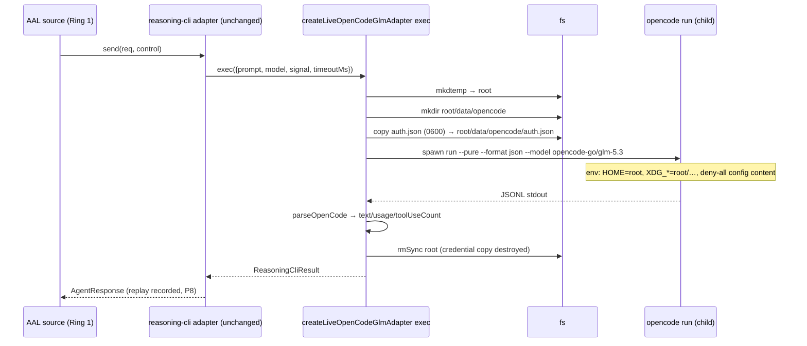
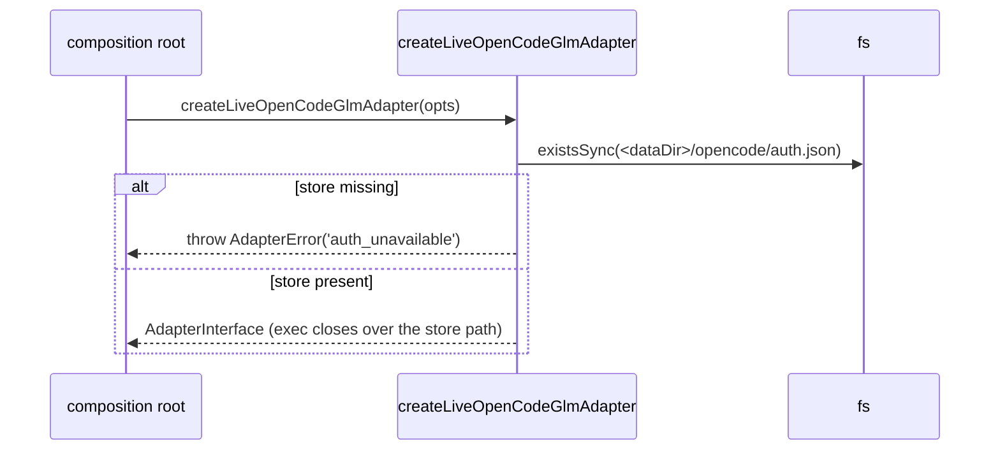

# Design: opencode-glm — GLM-5.3 through the OpenCode CLI

> Status: approved 2026-08-16
> Mode: requirements-first — every design element cites its REQ in the traceability table.

## Architecture Overview

The fifth lineage is a thin live factory over machinery that already exists in
production. One file gains a factory + two small pure helpers; the rest is
composition-root and policy wiring. No `core/` or `aal/` source changes
(INV-8); vendor strings stay in Ring 2 and composition roots (INV-7).

| Component | Ring/layer | Responsibility | New? |
|---|---|---|---|
| `adapters/src/reasoning-cli-live.ts` | Ring 2 | `createLiveOpenCodeGlmAdapter` + `resolveOpenCodeAuthStore` + `buildOpenCodeGlmEnv` (credential sandbox assembly) — reuses `runChild`, `parseOpenCode`, `buildOpenCodeReviewArgv`, `createReasoningCliAdapter` unchanged | edit |
| `adapters/src/opencode-glm.test.ts` | Ring 2 | Unit tests: argv shape, credential sandbox assembly, missing-store fail-fast | new |
| `adapters/src/opencode-glm-conformance.test.ts` | Ring 2 | P1–P8 on a compliant fake `ReasoningCliExec`, P2-only sabotage, stale regression | new |
| `adapters/src/index.ts` | Ring 2 | Export the new factory | edit |
| `console/backend/bin/platform.ts` | composition root | `runConformance()`: `'opencode-glm'` in the allowlist + construction branch (`PR_GATE_OPENCODE_GLM_MODEL` passthrough) | edit |
| `.ai/policies/routing.json` | governance | `tokenBuckets["opencode-glm"]` (capacity 4, refill 0.5) | edit |
| `.ai/policies/provider-data-policy.json` | governance | Per-adapter `opencode-glm` entry (paths identical to `default`, made explicit as processor consent) + `_comment` records the OpenCode Go gateway as an additional data processor | edit |
| `.ai/calibration/conformance-opencode-glm-<stamp>.json` | calibration | LIVE record produced by REQ-7 | produced |

Deliberately NOT touched: `reasoning-cli.ts` (the shared adapter core —
inherited behavior covers REQ-1.3/1.5/1.6), `fusion-profiles.json` (REQ-6.3),
and any PR-gate/loop composition (D2 follow-up).

## Sequence Diagrams

One `send()` through the credential-copy sandbox (REQ-1.1, REQ-2):



Fail-fast credential path (REQ-2.3) happens at factory time — before any
mkdtemp or spawn:



LIVE conformance (REQ-5/7) is byte-identical to the other lineages:
governance preflight → automation guard (`--force-quota-override`) →
`RUN-LIVE` → `runConformanceSuite` → record at
`.ai/calibration/conformance-opencode-glm-<stamp>.json`.

## Data Models & Interfaces

All in `adapters/src/reasoning-cli-live.ts`; imports limited to Ring-2
siblings and `aal` public types.

```ts
export interface OpenCodeGlmOptions extends LiveReasoningOptions {
  /** Override the auth-store location — tests inject a temp dir; default resolves the real one. */
  authDataDir?: string;
}

/** Resolve the real credential store (REQ-2.2/2.3). Pure fs probe: returns the
 *  auth.json path or null. Default data dir = <XDG_DATA_HOME | ~/.local/share>/opencode.
 *  Never reads or returns file CONTENT — only the path. */
export function resolveOpenCodeAuthStore(dataDir?: string): string | null;

/** Assemble the child env for one invocation (REQ-2.1/2.2): the existing
 *  providerEnvironment safe-keys base, then HOME/XDG_* pointed INSIDE the
 *  sandbox root, OPENCODE_CONFIG_DIR=<root>/config, OPENCODE_CONFIG_CONTENT
 *  = DENY_ALL_OPENCODE_CONFIG (unchanged constant), autoupdate off. */
export function buildOpenCodeGlmEnv(root: string, source?: NodeJS.ProcessEnv): NodeJS.ProcessEnv;

export function createLiveOpenCodeGlmAdapter(opts: OpenCodeGlmOptions): AdapterInterface;
```

Factory behavior:

1. `resolveOpenCodeAuthStore(opts.authDataDir ?? undefined)` → `null` throws
   `AdapterError('auth_unavailable', 'opencode auth store not found — run
   `opencode auth login`')` (message names the fix, never file content).
2. `exec` per invocation: `mkdtempSync(tmpdir()/platform-opencode-glm-)` →
   `mkdirSync(root/data/opencode, {recursive:true})` →
   `copyFileSync(store, root/data/opencode/auth.json)` with mode `0600` →
   `runChild({binary: opts.binary ?? 'opencode', argv:
   buildOpenCodeReviewArgv(prompt, model), cwd: root, env:
   buildOpenCodeGlmEnv(root), signal, timeoutMs, parse: parseOpenCode})` →
   `finally rmSync(root)` (REQ-2.4: the copy lives only for the invocation).
3. `createReasoningCliAdapter({...opts, model: opts.model ??
   'opencode-go/glm-5.3', id: 'opencode-glm', lineage: 'zai',
   contextWindowTokens: 1_000_000, exec})` — replay, error classification,
   never-self-retry, usage validation all inherited unchanged (REQ-1.3).

No new argv builder is introduced: `buildOpenCodeReviewArgv` already emits
exactly `['run','--pure','--format','json','--model',model,prompt]` and is
exported; REQ-4.4's shape coverage is a new documenting test over that
function with the glm default model (see Testing Strategy), not a duplicate
wrapper.

Timeout/kill (REQ-1.6): forwarded `timeoutMs` or `runChild`'s built-in
600 000 ms default, with SIGTERM-then-SIGKILL via the existing
`terminateChild` — no new code.

CLI branch (REQ-5.1): allowlist
`['claude','codex','gemini-cli','opencode-deepseek','zai','opencode-glm']`
(plus `'zai'` when PR #142 lands — both branches are additive to the same
array), construction branch
`createLiveOpenCodeGlmAdapter({ ...common, ...(PR_GATE_OPENCODE_GLM_MODEL set ? { model } : {}) })`,
per-run replay dir via the existing `common` object (REQ-5.2).

Policy edits (REQ-6): `routing.json` gains `"opencode-glm": { "capacity": 4,
"refillPerSec": 0.5 }`. `provider-data-policy.json` gains
`"opencode-glm": { "allowPaths": [<identical list to default>] }` — an
explicit, non-loosening consent entry whose meaning is documented in the
file's `_comment` (prompts transit the OpenCode Go gateway, an additional
data processor vs the direct Z.ai endpoint). Both files are POLICY_FILES:
the hash change gates the next live run on operator approval (governance by
construction — PR review plus the run-time prompt).

## Technology Decisions

- **Auth-store copy over real-HOME passthrough** — the deepseek factory
  sandboxes HOME to stop untrusted content from influencing OpenCode config;
  pointing HOME back at the real home would trade that isolation away
  wholesale. Copying exactly one file (`auth.json`, 0600, per-invocation
  temp dir, destroyed in `finally`) is the narrowest credential exposure that
  still authenticates, and it keeps `OPENCODE_CONFIG_CONTENT` deny-all
  intact (REQ-2.1/2.2/2.4). The copy is verbatim bytes — never parsed, never
  logged (REQ-2.5).
- **Shared lineage `'zai'` with the direct-API glm adapter** — lineage feeds
  fusion diversity and susceptibility routing; two transports serving the
  same model family must not be counted as decorrelated panel members.
  Distinct `adapterId`s keep registry/records/policy separate.
- **Reuse over reimplementation** — one factory + two pure helpers; the
  adapter core, parser, argv builder, child runner, and kill semantics are
  all existing tested code. This lane's risk concentrates in exactly one new
  thing (credential sandbox), which is where the tests aim.
- **`authDataDir` injection instead of env faking** — tests pass a temp dir
  rather than mutating `process.env`/`HOME`, keeping them hermetic and
  parallel-safe.
- **Processor-consent policy entry equal to default** — deliberately not
  narrower: this round's decision is "the same content classes may transit
  the OpenCode Go gateway" (explicit, reviewable, hash-gated); narrowing is a
  future governance decision if the operator wants it, and loosening is
  blocked by the never-loosen guards either way.

## Error Handling Strategy

| Case | Detection | Mapped to | Notes |
|---|---|---|---|
| auth store missing | factory-time `resolveOpenCodeAuthStore` → null | `AdapterError('auth_unavailable')` | before mkdtemp/spawn (REQ-2.3); message says how to fix, no content |
| child non-zero exit | `runChild` result | `classifyAdapterError(stderr)` (inherited reasoning-cli core) | 429/quota text → `quota_limited`, auth → `auth_unavailable`, context → `context_limited`, else `transport` |
| cancel/timeout | `runChild` signal/timer → exit 143 + stderr marker | `cancelled` / `timed_out` | SIGTERM→SIGKILL grace built in |
| stdout unparseable | `parseOpenCode` try/catch in `runChild` | exit forced non-zero → classified | inherited |
| usage invalid | reasoning-cli core guard | `invalid_response` | inherited (REQ-1.3) |
| reply text not fenceable JSON | core `JSON.parse` fallback | `{ raw }` structuredResult, no throw | repair loop handles |
| credential leak surface | none by construction | n/a | copy is 0600 in a 0700 temp dir, destroyed post-run; paths-only in errors/logs (REQ-2.5) |

Never self-retry (INV-5) and P8 replay are inherited from
`createReasoningCliAdapter` unchanged.

## Testing Strategy

All hermetic — no `opencode` spawn, no network, no real credential read.

| Test | Asserts | REQ |
|---|---|---|
| `opencode-glm.test.ts` — argv shape | `buildOpenCodeReviewArgv(prompt, 'opencode-go/glm-5.3')` emits `['run','--pure','--format','json','--model','opencode-go/glm-5.3',prompt]` (documents this lane's exact invocation) | 1.1, 4.4 |
| — manifest | `adapterId 'opencode-glm'`, `lineage 'zai'`, `contextWindowTokens 1_000_000`, `executionBackend false` via `createLiveOpenCodeGlmAdapter` with a stub exec | 1.2 |
| — model override | opts.model flows to the exec call (future glm release = config) | 1.4 |
| — `resolveOpenCodeAuthStore` | temp dir with `opencode/auth.json` → path returned; without → null; returned value is a path string, content never touched | 2.2, 2.3 |
| — `buildOpenCodeGlmEnv` | `HOME`/`XDG_DATA_HOME`/`XDG_CONFIG_HOME`/`XDG_CACHE_HOME` all under the sandbox root; `OPENCODE_CONFIG_CONTENT` equals the deny-all constant; source-env keys not under root never appear | 2.1, 2.2 |
| — fail-fast | missing store (injected empty temp dir) → factory throws `auth_unavailable`; no mkdtemp/spawn side effects asserted via stub exec never being called | 2.3 |
| — sandbox copy lifecycle | after one exec invocation the temp root is gone (finally-cleanup); auth copy mode 0600 | 2.4 |
| `opencode-glm-conformance.test.ts` — compliant fake | `directiveExec`-style fake `ReasoningCliExec` (parses `[probe:Px …]`, returns probe-appropriate `ReasoningCliResult`: echo field for P1, `actionRequests` for P2, REQUEST_TOOL for P5, no canary echo for P7) → full `runConformanceSuite` P1–P8 pass, p7 score 0 | 4.1 |
| — sabotage | prose-only fake fails EXACTLY P2 across `PASS_FAIL_PROBES` | 4.2 |
| — stale regression | re-registered record after regressed re-run marks adapter `stale` (registry gate) | 4.3 |

REQ-5 CLI wiring has no test harness (`platform.ts` — recorded ceiling since
v1.7): typecheck + review-verified, then proven by the LIVE run itself.
REQ-6 policy edits verified by `pnpm -C aal test` (routing-config and
data-policy guard tests) plus the governance hash gate on the next live run.
REQ-7 evidence is the LIVE record + per-probe output recorded in tasks.md.

## Requirement Traceability

| Design element | REQ | Section |
|---|---|---|
| `createLiveOpenCodeGlmAdapter` + exec flow (spawn `opencode run --pure`), inherited reasoning-cli core | 1.1, 1.3, 1.5 | Data Models & Interfaces |
| Manifest constants (`opencode-glm`/`zai`/1M) + model default/override | 1.2, 1.4 | Data Models & Interfaces |
| Kill timeout via `runChild` default + `terminateChild` | 1.6 | Data Models & Interfaces |
| `resolveOpenCodeAuthStore` + `buildOpenCodeGlmEnv` + copy lifecycle | 2.1, 2.2, 2.3, 2.4 | Data Models & Interfaces |
| Credential-content silence (paths only, verbatim copy) | 2.5 | Technology Decisions |
| `index.ts` export; import discipline; vendor scan untouched | 3.1, 3.2, 3.3 | Architecture Overview |
| Conformance + unit test matrix | 4.1, 4.2, 4.3, 4.4 | Testing Strategy |
| CLI allowlist + branch + per-run replay dir + record path | 5.1, 5.2 | Data Models & Interfaces |
| routing.json bucket; provider-data-policy entry + `_comment`; fusion untouched | 6.1, 6.2, 6.3 | Data Models & Interfaces |
| LIVE run flow + failure shape recording + follow-up boundary | 7.1, 7.2, 7.3 | Sequence Diagrams |
