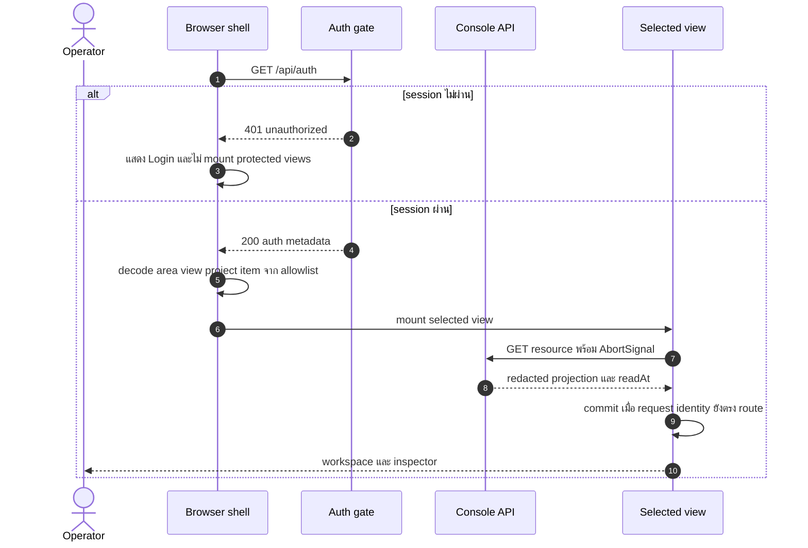
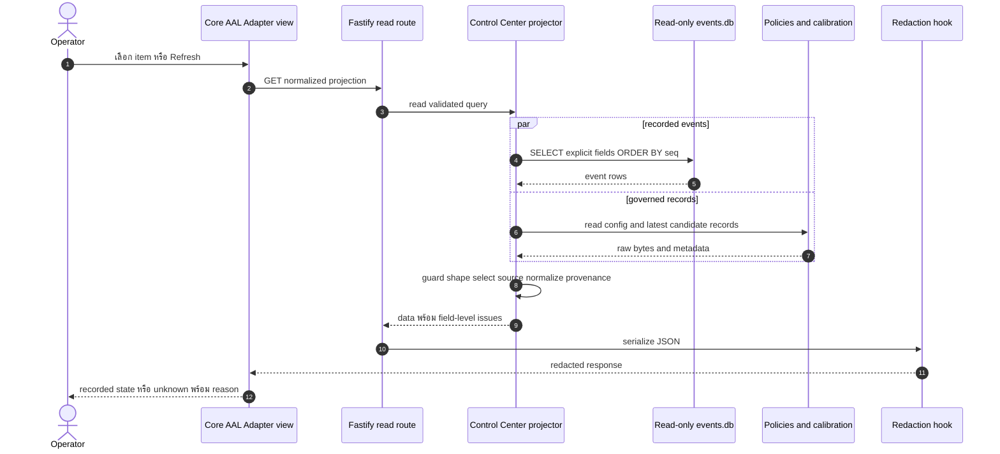
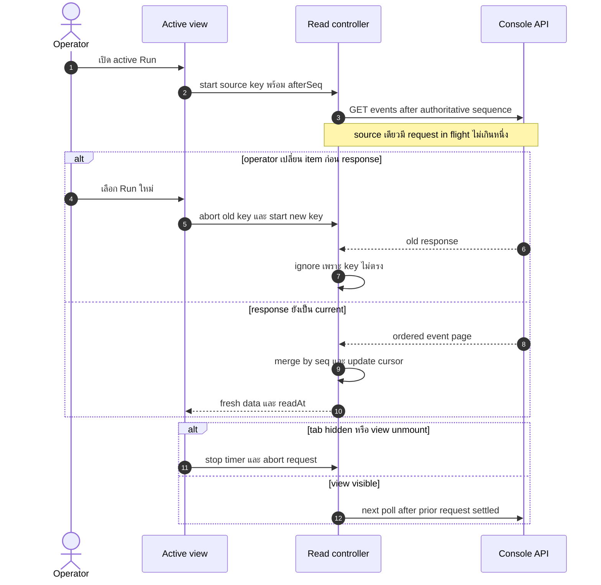
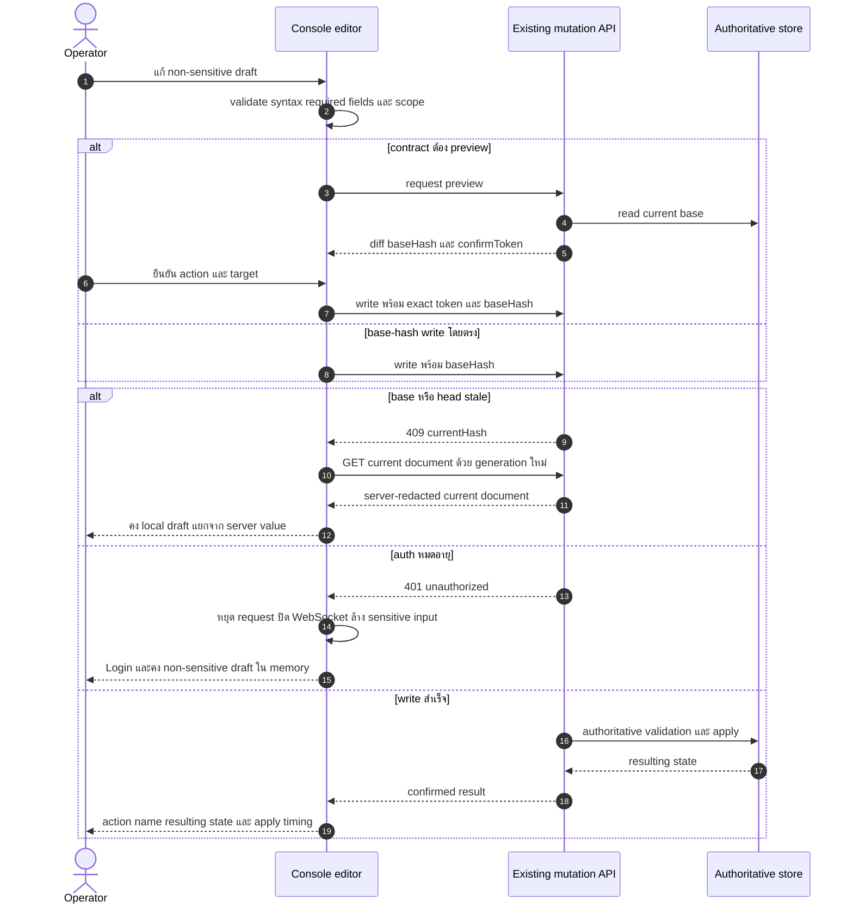
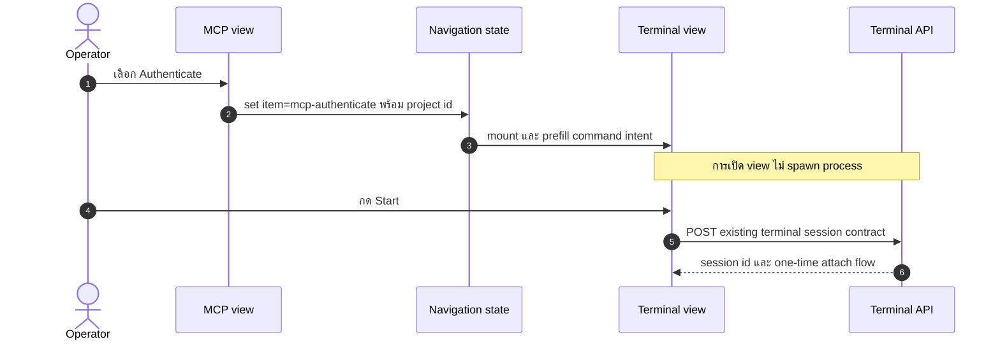

# Design: Operator Control Center Web UI

> Status: approved 2026-08-12

เอกสารนี้ออกแบบ Console SPA สำหรับ single operator ให้จัดการ Dashboard, Core, AAL,
Adapters และ Console จาก shell เดียว โดยใช้ three-panel, progressive disclosure,
dark control-center และ mobile overlay จาก
[Hermes WebUI](https://github.com/nesquena/hermes-webui) เป็น interaction reference
เท่านั้น ไม่คัดลอก source, CSS, asset หรือ runtime architecture

## Architecture Overview

### เป้าหมายและขอบเขต

ผู้ใช้หลักคือ platform operator งานหลักคือดูสถานะจริง หาเหตุผิดปกติ แล้วใช้
governed action เดิมโดยไม่เพิ่ม execution authority ให้ browser

| เป้าหมาย | ข้อจำกัด |
|---|---|
| แทนหน้าเดียวขนาดยาวด้วย shell ที่หา area ได้ทันที | คง React 19, Fastify, CSS และ endpoint เดิม |
| เปิด Core, AAL และ Adapter state จาก authoritative records | browser ห้ามอ่าน host file หรือ store โดยตรง |
| รักษา Terminal, Chat, Loop, Scheduler, Issues, PR Quality และ Governance | Core, AAL และ Adapters ไม่มี mutation control |
| ใช้ได้ที่ 375, 768 และ 1440 px พร้อม keyboard | ไม่เพิ่ม dependency และไม่แก้ `scripts/` หรือ `spikes/` |

### หลักสถาปัตยกรรม

1. `console/web` เป็น presentation และ interaction layer ไม่มี filesystem access
2. `console/backend` เป็น trust boundary สำหรับ auth, validation, redaction,
   authoritative read projection และ mutation contract เดิม
3. `core <- aal <- adapters <- console/backend composition` คง dependency direction เดิม
4. Core, AAL และ Adapter views อ่าน recorded state เท่านั้น การเปิดหน้า, เลือก item,
   search, filter, copy และ refresh ไม่เรียก provider, probe หรือ command
5. Existing Console mutation endpoints คง request, response, status code และ
   idempotency semantics เดิม
6. Source timestamp, authoritative sequence และ client read time เป็นคนละค่า
7. Missing record หมายถึง `unknown` หรือ `unavailable` ไม่ใช่ `healthy`

### Information architecture

URL ใช้ query string เพราะ SPA เดิม serve ที่ path `/` และไม่ต้องเพิ่ม router:

```text
/?area=dashboard
/?area=core&view=runs&item=RUN-1785857687452
/?area=aal&view=routing&item=planner
/?area=adapters&view=catalog&item=claude
/?area=console&view=sessions&project=-Users-operator-project
/?area=console&view=terminal&project=-Users-operator-project&item=mcp-authenticate
```

allowlist มีเพียง `area`, `view`, `project` และ `item` ค่าอื่นถูกตัดทิ้งตอน
normalize URL ค่า `item=mcp-authenticate` เป็น non-secret MCP intent identifier
สำหรับ local Terminal จึง copy/reload ได้โดยไม่ใช้ transient state และยังไม่ spawn process

| Area | Main workspace | Context inspector |
|---|---|---|
| Dashboard | host, run, approval, usage และ PR quality summaries | source health, provenance และทางไป view เจ้าของข้อมูล |
| Core | run list, task graph, task state และ event stream | gate tiers, evidence metadata/reference และ budget |
| AAL | role routing, fallback, breaker, rate limit และ Fusion | target provenance และ P1-P8 |
| Adapters | adapter catalog และ readiness dimensions | manifest, model mapping, health, calibration และ conformance |
| Console | Projects, Sessions, Terminal, Chat, Runs, Scheduler, Issues, PR Quality, Governance, System, Usage | selected resource, editor, approval หรือ operation detail |

Invalid `area` เปิด Dashboard พร้อม link warning ส่วน invalid `item` คง area/view
เดิมและเปิด empty inspector Browser `popstate` decode route ใหม่โดยไม่ส่ง mutation

### Shell layout

Desktop ใช้ CSS Grid สาม region:

```text
┌──────────────────┬────────────────────────────────────┬──────────────────────┐
│ Navigation       │ Workspace                          │ Inspector            │
│ Dashboard        │ provenance rail                    │ selected source      │
│ Core             │ list, graph, table or operation    │ evidence and detail  │
│ AAL              │                                    │                      │
│ Adapters         │                                    │                      │
│ Console          │                                    │                      │
└──────────────────┴────────────────────────────────────┴──────────────────────┘
```

- ตั้งแต่ 1200 px: แสดง navigation และ inspector พร้อม workspace
- 768–1199 px: workspace คงอยู่ region เดียว navigation/inspector เปิดเป็น modal
  drawer ด้วย native `<dialog>`
- ต่ำกว่า 768 px: workspace เป็นหนึ่ง column navigation/inspector ใช้ native
  `<dialog>` overlay
- overlay ทุกขนาดต่ำกว่า 1200 px ย้าย initial focus เข้า dialog, ทำ background inert,
  จำกัด Tab ภายใน, ปิดด้วย Escape และคืน focus ให้ trigger
- table, event stream และ Terminal scroll ภายใน component ห้ามดัน document
- inspector ไม่ render เมื่อไม่มี selected detail ยกเว้น warning, approval หรือ error
  ที่ต้องเห็นทันที

### Visual thesis

แนวทางคือ “deterministic operations ledger” ไม่ใช่ generic analytics dashboard:

- panel ทรงเกือบเหลี่ยม ไม่มี gradient และไม่ใช้ decorative card จำนวนมาก
- ลำดับ `seq`, gate tier, source และ timestamp เป็นโครงสร้างหลัก
- signature element คือ `provenance rail` เส้นเดียวที่เชื่อม source,
  authoritative sequence, recorded timestamp, client read time และ stale state
- status ใช้ icon/label/shape คู่กับสีเสมอ ไม่พึ่งสีอย่างเดียว
- animation จำกัด drawer/panel transition และหยุดเมื่อ
  `prefers-reduced-motion: reduce`

### Frontend composition

| Module | ความรับผิดชอบ | วิธี reuse |
|---|---|---|
| `App.tsx` | auth gate, route state, project context, shell, theme, locale และ draft memory | แทน long-page composition เดิม |
| `Dashboard.tsx` | independent summaries และ explicit refresh | reuse status, usage, loop และ PR APIs |
| `Core.tsx`, `Aal.tsx`, `Adapters.tsx` | read-only list/workspace/inspector | ใช้ normalized projection endpoints |
| `Console.tsx` | secondary navigation และ mount operation view ที่เลือก | reuse existing components ไม่ duplicate logic |
| `Loop.tsx`, `Sched.tsx`, `Issues.tsx`, `PrQuality.tsx`, `Surfaces.tsx`, `TerminalPanel.tsx`, `Chat.tsx` | operation contracts เดิม | ย้ายเข้า Console views และเพิ่ม confirmation/accessibility เท่าที่กำหนด |
| `useFetch.ts` | auth-aware abortable read state พร้อม last-good data | evolve hook เดิม ไม่สร้าง data-client framework |
| `logic/navigation.ts` | parse, normalize และ encode allowlisted route | pure function + co-located test |
| `logic/readState.ts` | request identity, stale response, retry, polling และ pagination reducer | pure function + co-located test |
| `logic/controlCenter.ts` | projection-to-display derivation, status dimension และ sort | pure function + co-located test |
| `logic/theme.ts`, `logic/i18n.ts` | safe preference fallback และ typed labels | ขยายของเดิม |
| `styles.css` | semantic tokens, grid, drawers, focus, overflow และ reduced motion | CSS เดิมไฟล์เดียว |

`Console.tsx` ใช้ view registry แบบ typed object ธรรมดา ไม่เพิ่ม routing library
แต่ละ view mount เมื่อถูกเลือกเท่านั้น จึงหยุด fetch/poll ของ view ที่ซ่อน

### Read lifecycle

- non-live views fetch ครั้งแรกเมื่อ mount แล้ว fetch ใหม่เฉพาะ refresh หรือ selection
- Run, Scheduler และ PR Quality poll เฉพาะเมื่อ view มองเห็นและ
  `document.visibilityState === 'visible'`
- หนึ่ง source มี request in flight ได้หนึ่งรายการ รอบถัดไปถูกข้ามจน request เดิมจบ
- ทุก read ผูก `AbortController` กับ route/selection identity
- response เก่าถูก ignore แม้ abort มาถึงหลัง server ตอบ
- read failure คง last-good data, mark `stale`, แสดง last-read time และ Retry
- events ต่อด้วย `after=<lastSeq>` และ merge ตาม authoritative `seq`
- list เริ่ม 50 records และ load more ครั้งละไม่เกิน 100
- collection เดิมที่ UI นี้ใช้ต้องส่ง `limit=50` เสมอ; load more ส่งไม่เกิน 100
  และใช้ optional additive pagination ของ endpoint เดิม

### Backend projection boundary

เพิ่ม `console/backend/src/control-center.ts` เป็น read-only projector และ test seam
`AppDeps.controlCenter` ใน `app.ts` Routes เรียก seam นี้เท่านั้น ส่วน
`bin/platform.ts` ประกอบ live reader ด้วย root ที่ resolve จาก `aiDir()` เดียวกับ
runtime ไม่ใช้ `process.cwd()`:

- repository `.ai/policies/`
- repository `.ai/calibration/`
- repository `.ai/governance/events.jsonl`
- `~/.ai/runs/<run>/events.db` และ `evidence/`
- `<dataDir>/pr-gate/events.db` และ PR Quality manager projection
- static adapter catalog ที่ composition ใช้งานจริง

Projector:

1. validate path segment และ containment ก่อนเปิด file
2. ใช้ no-follow regular-file read และปฏิเสธ symlink/reparse point ทุก source รวม
   run, evidence, policy, calibration และ governance
3. เปิด SQLite ด้วย `new DatabaseSync(path, { readOnly: true })` และ
   `PRAGMA query_only = ON` ไม่ใช้ `openEventLog` เพราะฟังก์ชันนั้นสร้าง schema/WAL
4. SELECT explicit columns ตาม `seq` และ parse payload ภายใต้ runtime guards
5. validate config/calibration record ก่อนเลือก effective record; event ใช้ `ts`,
   calibration ใช้ `ranAt`, config ใช้ filesystem `mtime`; missing/invalid timestamp
   เป็น unknown freshness
6. map event payload ผ่าน per-event scalar allowlist ก่อนคืน UI ไม่ส่ง raw payload
7. normalize เป็น DTO ที่ไม่มี host absolute path, credential หรือ raw token
8. คืน field-level issue แทนทำทั้ง response ล้มเมื่อ source ย่อยเสีย
9. ปล่อย global `onSend` redaction ใน `app.ts` ทำ defense-in-depth รอบสุดท้าย

### Authoritative source map

| Projection | Source | Selection rule |
|---|---|---|
| Core run/task/event | run directory + read-only `events.db` | directory id เป็น external run id, events เรียง `seq` |
| Task graph | `RUN_DESCRIPTOR` และ `TASK_GRAPH_FROZEN` | full frozen graph เมื่อมี, one-node contract view สำหรับ single task |
| Gate/evidence | `GATE_RESULT` payload + content-addressed run evidence metadata | ตรวจ existence/digest เท่านั้น ไม่คืน raw evidence content และ verdict คงเดิมแม้ evidence missing |
| Budget | `RUN_DESCRIPTOR` caps + latest `BUDGET_SNAPSHOT` | recorded snapshot เท่านั้น |
| AAL routing | `routing.json` + latest `OUTCOME_ROUTE`/`SHADOW_ROUTE` per context/role | event ต้องมี full `order[]`; recorded order ชนะ configured order |
| Breaker/health | latest `BREAKER_STATE_CHANGED` / `QUOTA_PROBE` per target | no record เป็น unknown |
| Rate limit | `routing.json` + latest `RATE_LIMIT_OBSERVED` | policy แยกจาก recorded state |
| Conformance | newest candidate per adapter in `.ai/calibration` | malformed newest เป็น invalid-record, prior valid เป็น history ไม่ใช่ effective |
| Fusion | `fusion-profiles.json` + latest Fusion events/calibration result | config และ recorded run แยก provenance |
| Adapter catalog | shared static descriptors ที่ live factory และ composition ใช้ร่วมกัน | ไม่มี adapter construction หรือ `send`; owner เดียวกัน drift ไม่ได้ |
| Adapter model mapping | automation/PR policy + allowlisted model env names | missing value เป็น unknown, credential env ไม่ถูกอ่าน |

Core run discovery รวมเฉพาะ directory ที่มี `events.db` และมี `TASK_STATE` event
หรือ loop discovery metadata จึงไม่ปน `FUSION-*` calibration runs AAL latest-state
fold สแกน recorded run databases และ PR Gate log แล้วเลือก `ts` ล่าสุด
tie-break ด้วย external run id และ `seq` ห้ามใช้ browser arrival order File count
ยังสแกนแบบเส้นตรงใน feature นี้ ไม่สร้าง index/cache ที่อาจ stale เพิ่มเมื่อ profiling
ชี้ว่า run count ทำให้ refresh เกิน budget ที่กำหนดในภายหลัง

### Observation additions

ข้อมูลที่ runtime เดิมไม่บันทึกต้องเพิ่มเป็น append-only observation โดยไม่เปลี่ยน
decision path:

| Record | Producer | Payload ที่จำเป็น |
|---|---|---|
| `RUN_DESCRIPTOR` | loop composition หลัง contract freeze ก่อน adapter creation | contract hash, goal id/title, task mode และ budget caps |
| `TASK_GRAPH_FROZEN.tasks` | extension ของ payload เดิม | frozen id, title, dependsOn, satisfies, risk และ diff budget |
| `BUDGET_SNAPSHOT` | optional budget observer หลัง init/charge/excluded-time; loop composition ตอน terminal | task id, phase, used/cap ของ iterations, cost units, active wallclock |
| `RATE_LIMIT_OBSERVED` | optional dispatcher observer ที่ natural send boundary | target, limited, available tokens และ policy key |
| `SHADOW_ROUTE.order` | additive field จาก eligible order ที่ router คำนวณแล้ว | full ordered adapter keys; fields เดิม `live`, `wouldChoose`, `basis`, `frozen` คงเดิม |

```ts
interface BudgetUsageSnapshot {
  used: { iterations: number; costUnits: number; activeWallclockMs: number };
  cap: { iterations: number; costUnits: number; wallclockMs: number };
}

type BudgetObserver = (
  phase: 'init' | 'charge' | 'excluded-time',
  snapshot: BudgetUsageSnapshot,
) => void;

interface RateObservation {
  target: string;
  policyKey: string | null;
  limited: boolean;
  availableTokens: number | null;
}

// Additive signatures; existing two-argument callers remain valid.
declare function createBudget(
  limits: BudgetLimits,
  clock: Clock,
  observe?: BudgetObserver,
): BudgetTracker;
// BudgetTracker adds snapshot(): BudgetUsageSnapshot.
// TokenBucket adds peekAvailable(): number with no refill or clock read.
// DispatcherOptions adds observeRate?: (record: RateObservation) => void.
```

`BudgetTracker.snapshot()` คืน counter เดียวกับที่ `exceeded()` ใช้โดยไม่แก้ state
`createBudget(limits, clock, observe?)` รับ optional callback แล้ว emit อย่างมากหนึ่ง
snapshot หลัง init, successful `noteIteration` และ positive `noteExcludedMs`; loop
composition เรียก `snapshot()` อีกครั้งตอน terminal transition เพื่อ append terminal
record แต่ไม่ retry observation ที่ append ล้มเหลว

`DispatcherOptions.observeRate?: (record: RateObservation) => void` รับ target,
`limited`, `availableTokens` และ policy key Dispatcher เรียกหลัง `tryTake()` decision
เมื่อสถานะ limited ของ target เปลี่ยนและครั้งสุดท้ายก่อน `send` Observer exception
ถูกจับและ append `ERROR` แบบ best-effort; ห้ามเปลี่ยน wait, send, return หรือ provider
count ค่า token มาจาก additive `peekAvailable()` ซึ่งไม่ refill, อ่าน clock หรือแก้
bucket state Decision folds ignore observation event types ทุกตัว แต่ projector ใช้
latest `seq` แต่ละ dimension จึงทน duplicate หลัง restart ได้

Event types ใหม่เป็น append-only ส่วน `TASK_GRAPH_FROZEN` และ `SHADOW_ROUTE` คง
fields/meaning เดิมแล้วเพิ่มเฉพาะ `tasks` และ `order` Existing runs ที่ไม่มี record
แสดง `unavailable` หรือ `unknown` พร้อม reason ห้าม reconstruct จาก guess

### Console capability preservation

| Console view | Existing contract ที่คงไว้ |
|---|---|
| Projects / Sessions | `GET /api/projects`, `GET /api/sessions` |
| Terminal | create, list, attach, detach, reattach และ ticketed WebSocket เดิม |
| Chat | start/resume/fork, stream, send และ allow/deny tool request เดิม |
| Runs | event cursor, approvals, pause/resume, guidance, kill, deploy decision และ rollback |
| Scheduler | status, confirmed start, allowlisted script และ stop |
| Issues | create, convert และ reject |
| PR Quality | start, list/detail, cancel, findings, coverage, cost, head status และ override history |
| Governance | Settings, Permissions, Memory, MCP, Hooks, Subagents, Skills, Plugins, System และ Retention |
| Usage | estimate, disclaimer และ existing calibration write |

MCP Authenticate navigate เป็น
`area=console&view=terminal&project=<id>&item=mcp-authenticate` Terminal แปลง
allowlisted item เป็น prefilled intent เฉพาะ local loopback การเปิด deep link ไม่ยิง
route และไม่ spawn process Operator ต้องกด Start จึงใช้ Terminal session contract เดิม

Collection endpoints เดิมที่ control center ใช้ ได้แก่ `/api/projects`,
`/api/sessions`, `/api/sessions/search`, `/api/term/sessions`, `/api/subagents`,
`/api/skills`, `/api/loop/runs`, `/api/loop/:run/events` และ `/api/issues` รับ
optional `cursor`/`limit` แบบ additive New UI ส่ง 50 ครั้งแรกและไม่เกิน 100 ต่อ batch
เสมอ Endpoint ที่เดิมคืน object คง collection field เดิมและเพิ่ม `nextCursor`; event
array ใช้ `since=<lastSeq>&limit=` จึงคง shape เดิม PR Quality ใช้ bounded `limit`
เดิม คำขอที่ไม่ส่ง pagination parameters คง response เดิมเพื่อ backward compatibility
List cursor เดิมใช้ immutable tuple `(createdAt,id)` เมื่อมี timestamp และ `(name)`
สำหรับ named catalog; malformed cursor คืน 400 จึงไม่ซ้ำ/ข้ามจาก browser arrival order

Dashboard และ Console System ห้ามเรียก `/api/status` หรือ `/api/system/doctor`
ตอน mount เพราะสอง route นี้รัน CLI command Existing routes คง contract เดิมแต่ UI
เรียกได้หลัง operator กด `Check CLI` หรือ `Run doctor` เท่านั้น

## Sequence Diagrams

### Auth, deep link และ read



### Authoritative read projection



### Polling, cursor และ selection race



### Governed mutation และ stale state



### MCP Authenticate intent



## Data Models & Interfaces

### Browser route และ read state

```ts
type Area = 'dashboard' | 'core' | 'aal' | 'adapters' | 'console';

interface RouteState {
  area: Area;
  view: string | null;
  project: string | null;
  item: string | null;
}

type ReadState<T> =
  | { kind: 'idle' | 'loading'; previous: T | null }
  | { kind: 'data'; value: T; readAt: string; stale: false }
  | { kind: 'error'; previous: T | null; readAt: string | null; stale: boolean; reason: string };

interface RequestIdentity {
  sourceKey: string;
  generation: number;
}
```

`decodeRoute` คืน normalized state พร้อม optional warning `encodeRoute` เขียนเฉพาะ
allowlisted fields ผ่าน `history.pushState` หรือ `replaceState` และไม่รับ arbitrary
query object

### Projection primitives

```ts
interface SourceStamp {
  source: string;
  sourceTimestamp: string | null;
  sequence: number | null;
  freshness: 'recorded' | 'unknown';
}

interface ProjectionIssue {
  field: string;
  code: 'source-unavailable' | 'invalid-record' | 'evidence-unavailable' | 'redacted';
  reason: string;
  source?: string;
}

interface Page<T> {
  items: T[];
  nextCursor: string | null;
  limit: number;
}

interface ProjectionEnvelope<T> {
  data: T;
  readAt: string;
  issues: ProjectionIssue[];
}

type RecordedDimension<T> =
  | { status: 'known'; value: T; provenance: SourceStamp }
  | { status: 'unknown'; reason: string; provenance?: SourceStamp }
  | {
      status: 'invalid-record';
      reason: string;
      provenance: SourceStamp;
      previousValid?: { value: T; provenance: SourceStamp };
    };
```

`previousValid` ใช้ดู history เท่านั้น ห้ามใช้ตัดสิน current eligibility
`SourceStamp.sourceTimestamp` ใช้ event `ts`, calibration `ranAt` และ config file
`mtime` ตามลำดับ ค่า missing, parse ไม่ได้ หรืออยู่นอก valid range เป็น `null` พร้อม
`freshness: 'unknown'`; `readAt` อยู่เฉพาะ envelope และห้ามใช้แทน source timestamp

### Core projection

```ts
interface CoreTaskState {
  taskId: string;
  currentState: RecordedDimension<string>;
}

interface CoreRunSummary {
  runId: string;
  lifecycle: RecordedDimension<'active' | 'ended'>;
  taskStates: CoreTaskState[];
  currentTaskId: RecordedDimension<string | null>;
  pendingApprovals: RecordedDimension<number>;
  latestSequence: RecordedDimension<number>;
  provenance: SourceStamp;
}

interface CoreRunTotals {
  activeRuns: number;
  pendingApprovals: number;
}

interface TaskNode {
  id: string;
  title: string;
  dependsOn: string[];
  satisfies: string[];
  state: RecordedDimension<string>;
  risk: RecordedDimension<string | null>;
  diffBudget: RecordedDimension<number | null>;
}

interface GateProjection {
  tier: 'T0' | 'T1' | 'T2' | 'T3';
  verdict: boolean | 'not_enabled';
  sequence: number;
  evidence: EvidenceMetadata[];
}

interface EvidenceMetadata {
  ref: string;
  digest: string | null;
  available: boolean;
  byteLength: number | null;
}

interface BudgetProjection {
  used: { iterations: number; costUnits: number; wallclockMs: number };
  cap: { iterations: number; costUnits: number; wallclockMs: number };
  recordedAt: string;
}

interface CoreEventProjection {
  seq: number;
  ts: string;
  taskId: string | null;
  type: string;
  fields: Record<string, string | number | boolean | null>;
  redactedFields: string[];
}

interface CoreRunDetail {
  summary: CoreRunSummary;
  taskGraph: RecordedDimension<{
    graphHash: string | null;
    mode: 'multi-task' | 'single-task';
    tasks: TaskNode[];
  }>;
  latestGatesByTask: Record<string, GateProjection[]>;
  budgetsByTask: Record<string, RecordedDimension<BudgetProjection>>;
}
```

Task transition history fold จาก `TASK_STATE` ตาม `seq` Gate result fold ตาม task
และ tier โดย latest sequence ชนะ Projector ใช้ allowlist ต่อ event type เช่น
`state`, `trigger`, `tier`, `pass`, `role`, `why` และ `decision` ค่า object/array,
path, command output และ field ไม่รู้จักถูก omit พร้อมชื่อใน `redactedFields`
Evidence metadata รับเฉพาะ digest 64 hex ใต้ run เดียวและตรวจ existence โดยไม่อ่าน
content เข้า response UI render reference ด้วย text node ใน `<code>` ไม่มี Markdown,
HTML, linkify หรือ `dangerouslySetInnerHTML`

ทุก Core status field ที่ source ไม่มีหรืออ่านไม่ได้ต้องเป็น `RecordedDimension`
สถานะ `unknown`/`invalid-record` พร้อม `reason` หรือมี `ProjectionIssue` ที่ `field`
ตรงกัน ห้ามใช้ `null` แทน unavailable; `known` value ที่เป็น `null` ใช้เฉพาะ domain
state ที่บันทึกชัดว่าไม่มีค่า เช่นไม่มี current task

### AAL projection

```ts
interface RoutingRoleProjection {
  context: 'autonomous-loop' | 'pr-quality';
  role: string;
  orderedTargets: string[];
  fallbackOrder: string[];
  basis: 'recorded' | 'configured' | 'unknown';
  provenance: SourceStamp;
}

interface RoutingTargetProjection {
  target: string;
  breaker: RecordedDimension<{ state: 'closed' | 'open' | 'half_open' }>;
  rateLimitPolicy: RecordedDimension<{ capacity: number; refillPerSec: number }>;
  recordedLimitState: RecordedDimension<{ limited: boolean; availableTokens: number }>;
  conformance: RecordedDimension<ConformanceSummary>;
}

interface ConformanceSummary {
  modelVersion: string;
  probes: Record<'P1' | 'P2' | 'P3' | 'P4' | 'P5' | 'P6' | 'P8', boolean>;
  p7SusceptibilityScore: number;
}

interface FusionProfileProjection {
  artifact: string;
  panelSize: number;
  diversity: string;
  resolve: string;
  budgetCapCostUnits: number;
  estimateCostUnitsPerCandidate: number;
  provenance: SourceStamp;
}

interface FusionProjection {
  profiles: FusionProfileProjection[];
  plannerRoleEnabled: boolean;
  latestRun: RecordedDimension<{
    resolved: string | null;
    escalated: boolean;
    usageCostUnits: number | null;
  }>;
}

interface AalProjection {
  roles: RoutingRoleProjection[];
  targets: RoutingTargetProjection[];
  fusion: FusionProjection;
}
```

Configured routing order ใช้ pure `evaluateEligibility` ที่รับ role, manifest,
conformance/stale, recorded breaker/health และ route hints AAL `Registry.eligible()`
กับ projector map state ของตนเข้า function เดียวกัน; input ที่ projector ไม่มีทำให้
eligibility เป็น unknown ไม่เดา Projector ไม่สร้าง adapter และไม่เรียก `eligible()`
บน live registry `SHADOW_ROUTE` เพิ่ม full `order[]` จาก eligible order ที่คำนวณแล้ว
ก่อน append; `OUTCOME_ROUTE` คง `order[]` เดิม Projector เลือก latest event ที่มี valid
full order ต่อ context/role ถ้า newest malformed ให้ dimension เป็น invalid-record ไม่
ย้อนใช้ event เก่าเป็น current

### Adapter projection

```ts
interface AdapterManifestProjection {
  structuredOutput: boolean;
  toolCalling: boolean;
  contextWindowTokens: number | null;
  executionBackend: false;
  determinism: 'none' | 'seed' | 'unknown';
  lineage: string | null;
}

interface AdapterDescriptor {
  id: string;
  transport: 'sdk' | 'cli' | 'fake' | 'unknown';
  manifest: AdapterManifestProjection;
}

interface AdapterProjection extends AdapterDescriptor {
  registrationEligibility: {
    state: 'eligible' | 'ineligible' | 'unknown';
    reasons: string[];
    provenance: SourceStamp | null;
  };
  modelMappings: {
    context: 'autonomous-loop' | 'pr-quality';
    role: string;
    model: string | null;
    provenance: SourceStamp;
  }[];
  health: RecordedDimension<{ ok: boolean; reason?: string }>;
  calibration: RecordedDimension<{
    recordType: string;
    outcome: 'pass' | 'fail' | 'measured';
    metrics: Record<string, string | number | boolean | null>;
  }>;
  conformance: RecordedDimension<ConformanceSummary>;
}
```

Catalog มีเฉพาะ descriptor ของ adapter ที่ composition รองรับจริง Adapter module
extract existing manifest body เป็น pure `describe*Adapter(nonSecretOptions)` แล้ว
ทั้ง `manifest()` และ `platform.ts` ใช้ผลเดียวกัน; `platform.ts` inject exact
`AdapterDescriptor[]` เข้า projector จึงไม่มี catalog สำเนาที่ drift ได้ Calibration
file ต้องมี adapter/model identity ที่ validate ได้จึงนับเป็น adapter calibration
Fusion uplift ที่ไม่มี identity ดังกล่าวอยู่ AAL Fusion เท่านั้น

```ts
interface ConsoleServiceHealth {
  console: 'available';
  services: Record<
    'terminal' | 'chat' | 'loop' | 'scheduler' | 'prQuality',
    { status: 'available' | 'unavailable' | 'policy-disabled'; reason: string | null }
  >;
  disclaimer: string;
}
```

ค่า health สร้างจาก Fastify composition flags และ remote policy เท่านั้น ห้ามเรียก
CLI, child process, Human Plane, provider หรือ network probe

### Read port และ additive endpoints

```ts
interface ControlCenterReadPort {
  listRuns(input: { cursor: string | null; limit: number }): ProjectionEnvelope<{
    page: Page<CoreRunSummary>;
    totals: CoreRunTotals;
  }>;
  readRun(runId: string): ProjectionEnvelope<CoreRunDetail> | null;
  readRunEvents(input: { runId: string; after: number; limit: number }): ProjectionEnvelope<Page<CoreEventProjection>> | null;
  readAal(): ProjectionEnvelope<AalProjection>;
  listAdapters(input: { cursor: string | null; limit: number }): ProjectionEnvelope<Page<AdapterProjection>>;
  readAdapter(id: string): ProjectionEnvelope<AdapterProjection> | null;
  readServiceHealth(): ProjectionEnvelope<ConsoleServiceHealth>;
}
```

Interface นี้เป็น Fastify test seam และ machine-I/O boundary ไม่ใช่ domain service
ใหม่

| Method and path | Response | Refresh policy |
|---|---|---|
| `GET /api/control-center/core/runs?cursor&limit` | run page + active/pending totals | Dashboard refresh หรือ Core mount |
| `GET /api/control-center/core/runs/:run` | graph, current task states, latest gate per tier และ per-task budget | selection/refresh |
| `GET /api/control-center/core/runs/:run/events?after&limit` | event page หลัง authoritative seq; UI ใช้ `TASK_STATE` สร้าง transition history | Core manual refresh/load more |
| `GET /api/control-center/aal` | routing, breaker, rate, conformance และ Fusion | AAL mount/refresh |
| `GET /api/control-center/adapters?cursor&limit` | adapter page | Adapters mount/refresh/load more |
| `GET /api/control-center/adapters/:id` | selected adapter detail | selection/refresh |
| `GET /api/control-center/health` | pure service composition/status snapshot | Dashboard mount/refresh |

กติกา route:

- `limit` default 50, integer 1–100
- run cursor encode tuple immutable `(createdAt DESC, runId ASC)` โดย `createdAt`
  คือ first valid event `ts`; timestamp ที่ unknown เรียงท้ายด้วย `runId`
- adapter cursor encode `(adapterId ASC)` Cursor เป็น opaque base64url JSON ที่ server
  ออกให้; malformed, wrong shape หรือ sort-version ไม่ตรงคืน 400
- event `after` เป็น integer sequence ตั้งแต่ 0 และ `limit` ไม่เกิน 100
- invalid query คืน 400
- missing run/adapter คืน 404
- missing authoritative record คืน 200 พร้อม empty/unknown
- source ย่อยเสียคืน 200 พร้อม `issues` เมื่อ projection ส่วนอื่นยังอ่านได้
- source root ใช้ไม่ได้ทั้งก้อนคืน 503 เพื่อให้ UI ใช้ stale last-good data
- ไม่มี POST, PUT, PATCH หรือ DELETE ใต้ `/api/control-center/core`,
  `/api/control-center/aal` หรือ `/api/control-center/adapters`

### Dashboard source contracts

Dashboard ไม่ duplicate backend logic ใช้:

| Summary | API |
|---|---|
| host health | `/api/system/stats` |
| Console service health | `/api/control-center/health` |
| active runs and pending approvals | `/api/control-center/core/runs?limit=1` totals |
| usage and quota estimate | `/api/usage/estimate` |
| latest PR quality | `/api/pr-quality/runs?limit=1` |

แต่ละ summary มี read state และ Retry ของตัวเอง การเลือก card navigate:
host → Console System, usage → Console Usage, runs/approvals → Console Runs,
PR quality → Console PR Quality

### Mutation and draft state

```ts
interface MutationIdentity {
  action: string;
  target: string;
  concurrencyKey: string | null;
}

interface DraftEntry {
  resourceKey: string;
  content: string;
  baseHash: string | null;
  sensitivity: 'non-sensitive';
}
```

- pending mutation map ปิด duplicate identity เดียวกัน
- destructive confirmation แสดง localized action + technical target ก่อน fetch
- confirmation token อยู่ memory และผูกกับ preview/base เท่านั้น
- `DraftEntry` รับเฉพาะ typed form fields ที่ view metadata allowlist ว่าไม่รับ secret;
  อยู่ React memory ของ tab ไม่เขียน URL/localStorage
- raw free-form Governance document ถือเป็น sensitive เสมอ ไม่เข้า draft restore store
  และอยู่ component memory เท่านั้น; `scanForSecret` ไม่ถูกใช้พิสูจน์ว่า draft ปลอดภัย
- credential/connection-test secret อยู่ component memory และถูก clear เมื่อ 401,
  close หรือ submit
- mutation ไม่ retry อัตโนมัติ

Governance editor ใช้ scope matrix จาก requirements เป็น typed view metadata
Save disabled สำหรับ unsupported หรือ managed read-only scope Client validation
เป็น feedback เร็ว Server validation และ stale/permission decision ยัง authoritative

### Governance contracts

```ts
interface GovernanceReadMetadata {
  sensitive: true;
  redacted: boolean;
}

interface GovernanceEditorModel {
  scope: 'managed' | 'user' | 'project' | 'local';
  displayContent: string;
  editableContent: string | null;
  hash: string | null;
  readOnly: boolean;
  sensitivity: 'sensitive';
  editMode: 'edit-redacted-safe' | 'replace-entire';
  provenance: string;
}

type ApplyTiming = 'immediate' | 'next-session';

interface GovernanceWriteResult {
  saved: true;
  hash: string;
  applyTiming: ApplyTiming;
}
```

เพิ่มเฉพาะ contract ที่ Settings UI ยังขาด:

| Method and path | Contract |
|---|---|
| `GET /api/settings/:scope?project=` | content/hash/scope/provenance + `GovernanceReadMetadata`; managed ไม่มี source คืน read-only unavailable |
| `PUT /api/settings/:scope` | user/project/local JSON object + `baseHash`; managed ไม่มี route |
| `GET /api/settings/effective?project=` | server อ่าน scope ต่ำไปสูงแล้วคืน effective field + winning scope + provenance |

`POST /api/settings/effective` เดิมคงอยู่เพื่อ backward compatibility New GET เป็น
server-owned view จึงไม่ให้ browser ประกอบ authoritative scope values เอง
Settings JSON validation ใช้ `JSON.parse`, object-root guard และ `writeSafe`

| View | Read/write contract | Apply timing |
|---|---|---|
| Settings | new GET/PUT + effective GET | next session |
| Permissions | existing `/api/permissions/simulate`; rules รับ optional scope provenance, ไม่ expose install-guards | no write |
| Memory | existing GET/PUT `/api/memory` | next session |
| MCP | existing user/project GET, project PUT และ explicit POST test | next session, test immediate advisory |
| Hooks | existing GET, validate preview, install/uninstall exact token | next session |
| Subagents | existing list/detail/PUT/DELETE | next session |
| Skills | existing list/detail/PUT | next session |
| Plugins | existing enabled-plugins PUT | next session |
| System/Retention | existing stats, explicit doctor, setting PUT, preview/prune | setting next session, prune immediate |

Governance write success responses เพิ่ม `applyTiming` field แบบ backward-compatible
Permission simulator คืน winning rule พร้อม scope provenance Retention prune และ
MCP test ยังเป็น explicit action ไม่ถูกเรียกตอน mount

Governance GET ใช้ route-specific redaction ก่อน global `onSend`: redact value ของ
sensitive keys, credential URI userinfo, private-key blocks และ token patterns
Response เดิมคงทุก field และเพิ่ม `GovernanceReadMetadata` เท่านั้น UI map existing
`content` เป็น `displayContent`; ถ้า `redacted: false` ให้ `editableContent` เท่ากับ
content ที่ผ่าน redaction ถ้า `redacted: true` ให้ `editableContent: null` และ
`editMode: 'replace-entire'` จึงไม่คืน secret เดิมหรือยอมให้ marker ทับค่าเดิม

Feature นี้มี explicit `Replace entire document` flow: เปิด editor ว่าง, รับ full
replacement ใน component memory, validate, ส่ง full content + `baseHash` ผ่าน write
contract เดิม และล้าง buffer หลัง success/close/401 Server ไม่ merge placeholder และ
ยังรัน authoritative validation Project MCP จึงแก้ได้ตาม REQ-7.12 แม้ไฟล์เดิมมี secret
โดยไม่สร้าง secret-preserving placeholder protocol

## Technology Decisions

### TD-1: คง stack เดิม

ใช้ React 19, TypeScript, Vite, Fastify, `node:sqlite`, `fetch`,
`AbortController`, History API, native `<dialog>` และ CSS Grid ไม่มี dependency ใหม่
package manifests และ lockfile ต้องไม่เปลี่ยนจาก feature นี้

### TD-2: Hermes เป็น pattern reference

ยืมแนวคิด three-panel, persistent navigation, right-side detail, control center,
dark-first และ mobile slide-over จาก Hermes WebUI แต่ mapping, component,
security boundary, wording และ visual tokens ออกแบบตามระบบนี้ Source/CSS/assets
ไม่ถูก copy

### TD-3: Server-owned projection

backend อ่าน raw store แล้วคืน redacted normalized DTO เพราะ browser ไม่ควรรู้ path,
SQLite schema, evidence layout หรือ credential location Projection logic อยู่
`console/backend` ไม่ย้อน dependency เข้า Core/AAL/Adapters

### TD-4: Read-only SQLite connection

projection ห้าม reuse `openEventLog` เพราะมี schema/WAL side effect ใช้ native
`DatabaseSync` read-only, explicit SELECT, bounded rows และ close ใน `finally`
GET projection test ต้องยืนยัน source bytes/mtime ไม่เปลี่ยน

### TD-5: Additive observations เท่าที่จำเป็น

ใช้ event log เดิมแทน database/cache ใหม่ เพิ่ม observation ที่ขาดสำหรับ budget,
run descriptor และ rate state เท่านั้น Existing event meaning และ decision folds
ห้ามเปลี่ยน `SHADOW_ROUTE.order` และ `TASK_GRAPH_FROZEN.tasks` เป็น additive fields
Older records degrade เป็น unknown

### TD-6: Native navigation และ modal

History API เพียงพอกับ query route สี่ field Native `<dialog>` ใช้กับ navigation และ
inspector overlay ทุก viewport ต่ำกว่า 1200 px เพื่อให้ focus containment และ inert
background ใน Chromium โดยไม่สร้าง focus-trap library Wrapper คืน focus ไป trigger
เมื่อ close

### TD-7: Visual tokens

Core palette อ้างวัสดุของ audit ledger และ instrument panel ไม่ใช้ default neon:

| Token | Dark | Light | Use |
|---|---|---|---|
| `--canvas` | `#101419` | `#F2F0EA` | page background |
| `--panel` | `#192129` | `#FCFBF8` | navigation/workspace/inspector |
| `--ink` | `#E7EBEF` | `#22272D` | primary text |
| `--muted` | `#A7B0BA` | `#5D6670` | secondary metadata |
| `--evidence` | `#D39A68` | `#754523` | provenance rail, selected sequence |
| `--verified` | `#72B5A6` | `#28685F` | pass/healthy with text label |

Danger/error ใช้ semantic `--danger` ที่ผ่าน contrast test แยกจาก core palette
Border, hover และ raised surface derive จาก tokens กลาง ห้าม hardcode สีใน
component

Typography ใช้ installed system fonts:

| Role | Stack |
|---|---|
| display and navigation | `"Aptos Display", "Segoe UI Variable Display", system-ui, sans-serif` |
| body | `system-ui, -apple-system, BlinkMacSystemFont, "Segoe UI", sans-serif` |
| ids, paths, seq and evidence | `ui-monospace, "SFMono-Regular", Consolas, monospace` |

### TD-8: Safe technical rendering

Issue, transcript, evidence, provider output และ server error detail render ผ่าน
text nodes/`<pre>`/`<code>` เท่านั้น Terminal คง xterm renderer เดิม ไม่มี Markdown,
HTML execution หรือ auto-link

### TD-9: Theme และ locale fallback

inline bootstrap ใน `index.html` อ่าน stored theme ใน `try/catch` valid value ชนะ
ค่าอื่น default dark ก่อน first paint React storage writes ใช้ safe wrapper เมื่อ
storage ใช้ไม่ได้ state ยัง toggle ใน memory Locale fallback ใช้ `th` เมื่อ primary
browser language เริ่ม `th` ไม่เช่นนั้น `en`

UI-owned label/action/empty/error summary ต้องอยู่ typed dictionary ทั้งสองภาษา
command, path, identifier, enum, provider id และ original technical detail ไม่แปล

### TD-10: No client cache framework

read state reducer + existing hook ครอบ use case ปัจจุบัน Cache library, router,
sanitizer, icon pack, animation library และ virtualization ถูกตัดออก เพิ่มเมื่อ
collection หรือ interaction วัดแล้วเกิน browser-native/CSS solution

### Fresh-context critique resolution

| Finding | Resolution |
|---|---|
| 1 public contracts | ใช้ `CoreRunDetail`, `AalProjection`, `FusionProfileProjection` และ DTO typed ทั้ง read port |
| 2 routing fold | เพิ่ม `SHADOW_ROUTE.order[]`; live registry/projector ใช้ pure eligibility functions เดียวกัน |
| 3 sensitive drafts | raw Governance เป็น sensitive เสมอ; เพิ่ม replace-entire + `baseHash` ใน feature นี้ |
| 4 criterion trace | trace ด้านล่าง map compact ranges ครบ 170 criteria พร้อม design/test owner |
| 5 observation seam | กำหนด snapshot/observer signature, append point, error และ compatibility rules |
| 6 Core unavailable | task id/current state ชัด; ทุก missing status ใช้ `RecordedDimension` + reason |
| 7 pagination | เพิ่ม optional bounded pagination ให้ collection endpoint เดิมที่ UI ใช้ |
| 8 filesystem/time | no-follow ทุก source; event/config/calibration timestamp rule ชัด |
| 9 stale write | 409 ใช้ `currentHash`; UI GET current ด้วย generation guard และคง draft |
| 10 tablet focus | overlay ทุก width ต่ำกว่า 1200 px ใช้ native `<dialog>` semantics |
| 11 MCP intent | encode เป็น allowlisted `item=mcp-authenticate` |
| 12 cursor order | กำหนด immutable keyset tuple, sort direction/version และ malformed 400 |

## Error Handling Strategy

### Error contract

| สถานการณ์ | Server behavior | UI behavior | Retry |
|---|---|---|---|
| auth ยัง checking | ไม่รับ protected read จาก UI | render shell placeholder หรือว่าง ไม่ mount view | probe ครั้งเดียว |
| auth probe network failure | ไม่มี protected read | connection-unavailable + Retry Login check | explicit retry |
| protected request 401 | existing `unauthorized` | abort protected reads, close authenticated WebSockets, clear credential, Login | ไม่มี mutation retry |
| remote/local policy ปิด capability | route absent, 403 หรือ auth metadata `remote` ตาม contract เดิม | disabled control + policy reason | ไม่มี |
| invalid deep link area | ไม่มี API call จาก invalid state | Dashboard + link warning | ไม่มี |
| invalid selected item | 404 หรือ list miss | คง area, empty inspector | manual selection |
| malformed query | 400 | localized summary + original detail | หลังแก้ input |
| validation fail | existing 400/422 | คง draft, focus first invalid field | explicit resubmit |
| stale base/head | 409 + `currentHash` | คง local draft, GET current ด้วย generation guard, แสดง server value แยก, Reload หรือ Discard | ไม่มี auto retry |
| stale/missing confirm token | 428 | กลับ preview step, invalidate token | explicit preview |
| rate limit | 429 | คง input, แสดง slow-down reason | explicit retry |
| source record ไม่มี | 200 unknown/empty | guidance สร้าง first record | manual refresh |
| newest record malformed | 200 invalid-record issue | แสดง invalid เฉพาะ dimension, previous valid เป็น history | หลังแก้ source |
| evidence missing/unreadable | run detail field issue | gate verdict คงเดิม, evidence unavailable | manual retry |
| projection source ย่อยเสีย | 200 + field issues | card/field error เฉพาะส่วน | per-source Retry |
| read route unavailable/network | 503/network error | คง last-good data เป็น stale + last-read | manual หรือ next bounded poll |
| selection เปลี่ยนกลาง read | server อาจตอบตามปกติ | abort/ignore generation เก่า | current selection fetch |
| poll ช้า | request เดิมคง in flight | skip tick ไม่ overlap | tick หลัง settle |
| mutation network/error | existing status/detail | คง unsaved input, action-specific reason | explicit operator action |
| Chat/Terminal WebSocket ปิด | existing close/error | state disconnected, pending message/decision ไม่ replay | explicit reconnect/send |
| area render throw | ไม่เกี่ยว | area boundary fallback, shell/nav คงอยู่ | Reload area |
| storage throw | ไม่เกี่ยว | theme/locale session-only | ไม่มี |
| long id/path | redacted technical value | wrap หรือ component scroll + keyboard-readable full value | ไม่มี |

### Auth loss coordination

fetch wrapper ส่ง signal `auth-invalid` เมื่อเจอ 401 ครั้งแรก App shell:

1. เปลี่ยน gate เป็น unverified
2. abort registry ของ protected reads
3. ปิด Terminal/Chat sockets ผ่าน cleanup ที่ component register ไว้
4. เก็บเฉพาะ `DraftEntry` ที่ประกาศ `sensitivity: 'non-sensitive'`
5. ล้าง raw Governance buffer, password, token, MCP test secret และ confirmation token
6. แสดง Login
7. หลัง login สำเร็จ remount route เดิมและคืน non-sensitive draft โดยไม่ replay request

### Confirmation policy

client confirmation บังคับสำหรับ run kill, deploy rollback, Scheduler stop,
issue reject, PR cancel, PR override, Hooks uninstall, retention prune และ resource
delete Server preview/token ยังคงใช้เฉพาะ endpoint ที่ contract กำหนด Client
confirmation ไม่แทน server consent, idempotency หรือ stale check

### Partial and stale data

ทุก card/panel มีสถานะ `loading | data | empty | stale | unavailable` แยกกัน
`recordedAt` มาจาก source ส่วน `readAt` มาจาก projector response ถ้า source ไม่มี
freshness metadata ใช้ label `unknown freshness` ห้ามใช้ live/fresh

## Testing Strategy

### Pure frontend tests

| Test module | Observable behavior |
|---|---|
| `logic/navigation.test.ts` | allowlist, invalid area/item, URL secret exclusion, Back/Forward round trip |
| `logic/readState.test.ts` | generation race, abort, last-good stale, one in-flight, visibility stop, cursor merge |
| `logic/controlCenter.test.ts` | seq ordering, task/gate fold, unknown/invalid dimension, adapter eligibility, pagination |
| `logic/theme.test.ts` | invalid/missing preference defaults dark, storage failure session-only |
| `logic/i18n.test.ts` | TH/EN completeness, browser fallback, technical values unchanged |
| existing domain tests | Loop/Chat/PR/Scheduler/Governance behavior คงเดิมและเพิ่ม confirmation gates |

Non-trivial transformation อยู่ pure logic เท่านั้น React components ทดสอบผ่าน
observable browser flow ไม่ duplicate reducer logic

| Frontend test set | REQ coverage |
|---|---|
| navigation | REQ-1.1–1.12, REQ-8.5, REQ-8.21 |
| read state/polling | REQ-2.8–REQ-2.13, REQ-8.21–REQ-8.30 |
| Core/AAL/Adapter display folds | REQ-3.1–3.9, REQ-4.1–4.10, REQ-5.1–5.10 |
| existing operation/governance logic | REQ-6.1–6.25, REQ-7.1–7.20, REQ-8.7–8.20 |
| theme, locale and storage | REQ-9.1–9.14 |

### Backend unit and route tests

Fixtures ใช้ temporary repo/run roots และ injected `ControlCenterReadPort`:

1. list/detail/events เรียง authoritative `seq`, paginate 50/default, 100/max และ
   keyset cursor ไม่ซ้ำ/ข้ามเมื่อมี record ใหม่; malformed cursor คืน 400
2. SQLite เปิด read-only หลัง GET source file hash และ mtime ไม่เปลี่ยน
3. malformed payload จำกัด issue ที่ field/record และไม่ crash route
4. newest malformed conformance เป็น invalid ไม่ fallback เป็น effective pass
5. missing health/calibration/conformance แยก dimension เป็น unknown
6. evidence digest validation, path traversal, no-follow/symlink refusal ทุก source และ metadata-only response
7. response redaction ไม่คืน home path, bearer token, API key หรือ credential value
8. opening Dashboard/Core/AAL/Adapters routes ไม่เรียก adapter `send`, health probe,
   `execFile`, spawn, doctor, CLI version หรือ Human Plane mutation
9. no mutation route exists ใต้ read-only prefixes
10. old run ที่ไม่มี observation events คืน unavailable พร้อม reason
11. partial source failure คืน usable fields + issues
12. Core discovery ตัด fusion-only runs; AAL fold tie-break ตาม `ts`, run id, `seq`;
    timestamp mapping ใช้ event `ts`, calibration `ranAt`, config `mtime`
13. existing collection endpoints รับ optional bounded pagination โดย caller เดิมที่ไม่ส่ง query ยังได้ shape/semantics เดิม
14. 409 flow เก็บ local draft แล้ว GET current ด้วย generation guard โดย response เก่าแทน current ไม่ได้
15. raw Governance document ไม่เข้า restore store; redacted source ใช้ replace-entire + baseHash และไม่คืน old secret

Observation tests ยืนยัน optional observer ไม่เปลี่ยน return value, routing order,
budget decision หรือ provider count Existing event fields/meaning คงเดิม; มีเพียง
declared additive `tasks`, `order` และ observation event types Decision folds ให้ผล
เดิมเมื่อแทรก observation events และ observer exception

| Backend test set | REQ coverage |
|---|---|
| projection, provenance, ordering and pagination | REQ-2.1–2.13, REQ-3.1–3.9, REQ-4.1–4.10, REQ-5.1–5.10, REQ-8.25–8.30, REQ-11.11–11.12 |
| path, evidence, redaction and no-live-I/O negatives | REQ-3.4, REQ-3.9, REQ-4.8, REQ-5.6–REQ-5.7, REQ-8.3–REQ-8.6, REQ-8.12 |
| Settings and existing governance routes | REQ-7.1–7.20, REQ-8.7–8.20, REQ-11.1 |
| observation compatibility | REQ-3.5, REQ-4.3, REQ-11.3 |

### Browser verification

ใช้ production build เสิร์ฟผ่าน Console backend แล้วตรวจ latest stable Chromium:

| Width | Layout gate |
|---|---|
| 375 px | one-column workspace, modal nav/inspector, no document overflow |
| 768 px | workspace + explicit modal drawer controls, contained wide tables |
| 1440 px | navigation/workspace/inspector พร้อมกัน |

ทุก width ตรวจ:

- keyboard-only navigation, selection, forms, Terminal controls และ dialogs
- visible focus, overlay initial focus/trap/return, inert background และ Escape close
- semantic `header`, `nav`, `main`, `aside`, heading order และ accessible names
- live-region loading/success/error announcements ไม่ซ้ำ
- 44 x 44 CSS px primary touch targets
- text contrast 4.5:1 และ large/non-text boundary 3:1 ใน dark/light
- `prefers-reduced-motion` ปิด non-essential transitions
- TH/EN toggle ไม่เปลี่ยน route, selection หรือ draft
- long path/id, event table และ Terminal ไม่ทำ document horizontal overflow
- untrusted HTML/Markdown แสดงเป็น literal text

Browser matrix ครอบ REQ-1.1–1.12, REQ-2.1–2.13, REQ-6.1–6.25,
REQ-7.1–7.20, REQ-8.1–8.24, REQ-9.1–9.14, REQ-10.1–10.15 และ REQ-11.9

### Regression and security gate

รัน:

```sh
pnpm --filter console-web typecheck
pnpm --filter console-web test
pnpm --filter console-web build
pnpm --filter console-backend typecheck
pnpm --filter console-backend test
pnpm typecheck
pnpm lint
pnpm test
pnpm build
pnpm vendor-check
```

ตรวจ `console/web/package.json`, `console/backend/package.json` และ lockfile diff ว่า
ไม่มี dependency ใหม่ ตรวจ `scripts/` และ `spikes/` ว่าไม่มี diff Secret scan และ
spec-trace ต้องผ่าน CI

## Requirement Traceability

| Design element | REQ | Section |
|---|---|---|
| Shell/area/inspector; test: Chromium navigation | REQ-1.1–1.3 | Architecture Overview |
| Route codec, deep link, invalid link, history และ secret allowlist; test: `navigation.test.ts` | REQ-1.4–1.12 | Data Models & Interfaces |
| Real Dashboard sources, totals, disclaimer และ destination map; test: backend routes + Chromium | REQ-2.1–2.7 | Architecture Overview |
| Independent error/empty/read-time states; test: `readState.test.ts` + Chromium | REQ-2.8–2.10 | Error Handling Strategy |
| Runs/PR navigation และ read-only refresh; test: navigation + no-side-effect route test | REQ-2.11–2.13 | Architecture Overview |
| Core list/detail/gates/evidence/budget/events และ read-only controls; test: projector + Chromium | REQ-3.1–3.7 | Data Models & Interfaces |
| Core unavailable/evidence error semantics; test: partial-source negative tests | REQ-3.8–3.9 | Error Handling Strategy |
| AAL routing, breaker, rate, conformance, Fusion และ provenance; test: projector folds | REQ-4.1–4.6 | Data Models & Interfaces |
| AAL read-only/no probe; test: no-live-I/O negative test + Chromium | REQ-4.7–4.8 | Architecture Overview |
| AAL empty/unknown freshness; test: malformed/missing fixture tests | REQ-4.9–4.10 | Error Handling Strategy |
| Adapter catalog, manifest, mapping และ status provenance; test: projector folds | REQ-5.1–5.5 | Data Models & Interfaces |
| Credential redaction, no probe และ read-only controls; test: security negatives + Chromium | REQ-5.6–5.8 | Architecture Overview |
| Independent unknown/invalid adapter dimensions; test: malformed/missing fixtures | REQ-5.9–5.10 | Error Handling Strategy |
| Project registry/context/session facts; test: existing route tests + Chromium | REQ-6.1–6.3 | Architecture Overview |
| Terminal locality และ Chat approval/label; test: existing domain tests + Chromium | REQ-6.4–6.7 | Architecture Overview |
| Run events, approvals, pause/resume, kill และ deploy; test: existing Loop tests + Chromium | REQ-6.8–6.12 | Architecture Overview |
| Scheduler และ Issues operations; test: existing domain tests + confirmations | REQ-6.13–6.16 | Architecture Overview |
| PR Quality mutation/guidance contracts; test: existing PR/Loop tests | REQ-6.17–6.20 | Architecture Overview |
| Chat lifecycle และ PR Quality detail; test: WebSocket/PR regression tests | REQ-6.21–6.24 | Architecture Overview |
| MCP intent และ explicit Start; test: route codec + terminal spawn negative | REQ-6.25 | Sequence Diagrams |
| Governance views/scope/effective/base hash/client validation; test: governance route + form tests | REQ-7.1–7.5 | Data Models & Interfaces |
| Preview/token/stale draft flow; test: 409/428 generation tests + Chromium | REQ-7.6–7.8 | Sequence Diagrams |
| Managed scope, simulator และ MCP read/write/test; test: governance route negatives | REQ-7.9–7.12 | Data Models & Interfaces |
| Hooks/Subagents/Skills/Plugins/Retention contracts; test: existing route regression | REQ-7.13–7.17 | Data Models & Interfaces |
| Apply timing, server validation และ direct base-hash write; test: mutation response tests | REQ-7.18–7.20 | Data Models & Interfaces |
| Auth gate/401; test: auth gate + protected-read negative | REQ-8.1–8.2 | Error Handling Strategy |
| Redaction, no browser persistence, no auto action และ escaped rendering; test: security negatives | REQ-8.3–8.6 | Technology Decisions |
| Governed mutation authority, duplicate lock, result/error; test: mutation identity tests | REQ-8.7–8.10 | Sequence Diagrams |
| Area isolation, no Core/AAL/Adapter mutation, policy/server/auth authority; test: route negatives | REQ-8.11–8.15 | Error Handling Strategy |
| Draft/secret cleanup, terminal safety และ confirmations; test: auth-loss + Chromium | REQ-8.16–8.20 | Error Handling Strategy |
| Selection race, bounded poll, stale read และ no mutation retry; test: `readState.test.ts` | REQ-8.21–8.24 | Architecture Overview |
| Authoritative order/time, bounded collections, event cursor และ non-live fetch; test: pagination/projector tests | REQ-8.25–8.30 | Data Models & Interfaces |
| Dark/light bootstrap และ semantic tokens; test: `theme.test.ts` + contrast browser check | REQ-9.1–9.5 | Technology Decisions |
| TH/EN state and technical labels; test: `i18n.test.ts` + Chromium | REQ-9.6–9.9 | Technology Decisions |
| Essential/reduced motion; test: media-query browser check | REQ-9.10–9.11 | Technology Decisions |
| Localized errors, locale fallback และ storage failure; test: i18n/theme failure tests | REQ-9.12–9.14 | Error Handling Strategy |
| Desktop/tablet/mobile layout และ contained overflow; test: 375/768/1440 Chromium | REQ-10.1–10.5 | Architecture Overview |
| Keyboard, focus, landmarks, names และ touch targets; test: keyboard/semantics browser pass | REQ-10.6–10.10 | Testing Strategy |
| Contrast, overlay focus, live region และ long values; test: accessibility browser pass | REQ-10.11–10.15 | Testing Strategy |
| Backward-compatible reads, additive projection/observations และ unchanged decisions; test: regression + observer tests | REQ-11.1–11.3 | Technology Decisions |
| Existing stack, no dependency, pure logic และ co-located tests; test: manifest diff + unit tests | REQ-11.4–11.7 | Technology Decisions |
| Build/browser/no scripts-spikes delivery gate; test: full command gate + diff check | REQ-11.8–11.10 | Testing Strategy |
| Server-owned authoritative projection; browser raw-store prohibition; test: trust-boundary negatives | REQ-11.11–11.12 | Architecture Overview |
