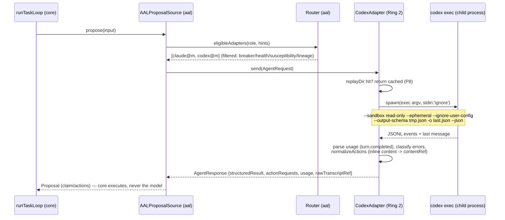
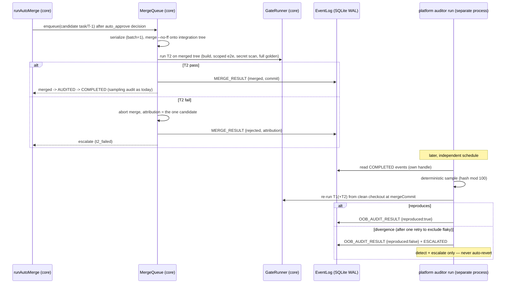
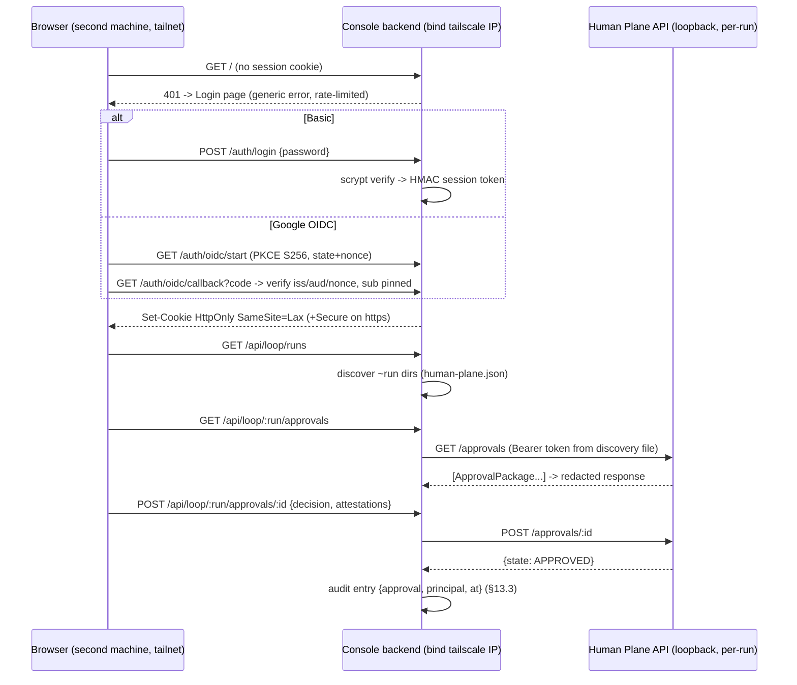

# Design: platform-phase3 — Multi-model + Fusion + Merge Queue/T2 + Auditor + F-Loop/F-Sched + Remote Auth

> Status: draft
> Mode: design-first (no requirements.md yet — REQ IDs backfilled by /spec-requirements).
> Upstream: unified-platform-spec.md v1.2 §5.3-5.4, §6.4-6.6, §7, §8 (F-Loop/F-Sched rows),
> §10.2-10.4, §11.3, §12, §13, §14 Phase 3 + invariants §2. User decisions binding:
> clarifications.md (Tailscale-only, Basic->Google-OIDC, ~3 fusion activations, all four
> carried items in scope, F-Sys update OUT). SPIKE-6 (PASS) caveats are binding inputs.

## Architecture Overview

Phase 3 extends the delivered Phase 0-2 platform along six workstreams. Ring
discipline is unchanged (INV-7/8/9): Ring 0 stays vendor-name-free, fusion and
routing live in Ring 1, the Codex wire translator lives in Ring 2, and the
Console remains a client of the Human Plane API.

| # | Workstream | Ring / package | New modules | Modified modules |
|---|---|---|---|---|
| A | Codex adapter + shared wire helpers | Ring 2 `adapters/` | `wire.ts`, `codex.ts`, `_template.ts` | `anthropic.ts` (extract-only), `live.ts`, `index.ts` |
| B | Multi-lineage AAL: lineage metadata, injection-aware routing, token bucket, parallel dispatch, shadow routing | Ring 1 `aal/` | `ratelimit.ts`, `dispatch.ts`, `shadow.ts` | `protocol.ts`, `registry.ts` (lineage + `all()` + `reviewer` case), `router.ts`, `source.ts`, `fake-adapter.ts` (lineage option) |
| C | Fusion plane §7.5 | Ring 1 `aal/fusion/` | `profiles.ts`, `panel.ts`, `analyze.ts`, `resolve.ts`, `run.ts` | `core/src/calibration/calibration.ts` (pure metric additions), `core/src/types.ts` (`Role` += `'reviewer'`) |
| D | Merge queue + T2 tier + out-of-band auditor | Ring 0 `core/` | `merge/queue.ts`, `audit/oob.ts` | `gates/runner.ts` (T2 real), `merge/auto-merge.ts` (queue path), `types.ts` (EventType additions) |
| E | Console F-Loop + F-Sched + carried items | `console/backend`, `console/web` | `loop-proxy.ts`, `sched.ts`, web `Loop.tsx` + `logic/loop.ts`, web `Sched.tsx` + `logic/sched.ts` | `app.ts`, `bin/platform.ts`, `loop-run.ts`, `core/src/human/api.ts` (inject-without-pause) |
| F | Remote auth §13 (Basic + Google OIDC) over Tailscale | `console/backend/src/auth/` | `provider.ts`, `basic.ts`, `oidc.ts`, web `Login.tsx` | `security.ts` wiring in `bin/platform.ts` (hasAuthProvider becomes real), `app.ts` (auth middleware) |
| G | Symbol-level COMPRESS (carried) | Ring 0 `core/context/` | — | `builder.ts` (COMPRESS stage) |

Dependency edges: B needs A (a second lineage to route across). C needs B
(dispatcher + lineages) and injects execution back into Ring 0 through a port
(no aal->executor import). D is independent of A-C. E's F-Loop needs only the
existing Human Plane API; F-Sched reuses `guards.ts` unchanged. F is
independent; E's DoD ("approve from another machine") composes with F.

Key architectural decisions (details in Technology Decisions):

1. **Fusion orchestrates in Ring 1 but never executes.** The EVIDENCE step
   runs gates per candidate through an injected `CandidateEvidenceRunner` port
   implemented at the composition root (`loop-run.ts`) using core's executor +
   gate runner in per-candidate worktrees. Core stays the only measurer
   (INV-1/2); aal stays vendor-neutral and execution-free.
2. **Merge queue serializes with batch size 1.** Attribution is trivially the
   single candidate; auto-bisect becomes real only when batching arrives
   (recorded ceiling). T2 runs on the merged tree inside the queue; T3 stays
   `not_enabled` (mutation = Phase 4 per §6.4).
3. **Out-of-band auditor is a separate CLI process** (`platform auditor run`)
   reading the same SQLite event log (WAL supports cross-process readers +
   serialized writers). It detects and escalates — it never reverts (in-band
   sampling audit keeps the revert authority it already has).
4. **No Codex quota probe exists** (SPIKE-6): the codex lineage registers
   without a `healthProbe`; its breaker operates on error rate only. Recorded
   residual, not assumed parity.
5. **Remote = Tailscale interface only.** `decideStartup` logic is unchanged;
   `platform console --host <tailscale-ip>` now refuses without a configured
   auth provider and starts with the auth middleware when one exists. F-Term
   stays loopback-only HARD (`termAccessAllowed` untouched) — the remote
   surface is F-Loop/F-Sched/observability, which satisfies the DoD.
6. **MCP OAuth round-trip rides the real CLI** (INV-12): F-MCP gains a
   "authenticate" action that opens the claude-only F-Term with
   `claude mcp …` for the named server — the CLI performs the browser
   round-trip and owns token storage; the Console never sees credentials.

## Sequence Diagrams

### 1. Codex adapter propose (workstream A)



### 2. Fusion pipeline (workstream C)

```mermaid
sequenceDiagram
  participant F as runFusion (aal/fusion)
  participant D as Dispatcher (aal)
  participant A1 as Adapter claude
  participant A2 as Adapter codex
  participant E as CandidateEvidenceRunner (port -> core)
  participant J as Blind judge (adapter)
  F->>F: load profile, check budget cap + depth<=1
  F->>D: PANEL: N requests (seed/temp or cross-lineage)
  par panel
    D->>A1: send(req#p0)
    D->>A2: send(req#p1)
  end
  D-->>F: candidates[]
  alt artifact = code_diff | tests
    F->>E: run gates per candidate (separate worktrees)
    E-->>F: GateReport per candidate (core-produced evidence)
  end
  F->>J: ANALYZE: anonymized candidates + deliberation-analysis schema
  J-->>F: {consensus, contradictions, unique, blindSpots}
  F->>F: RESOLVE per rule table (judge can never overrule gate=0;<br/>code = evidence-tournament, no synthesis)
  F->>F: CAPTURE dissent -> FUSION_DISSENT events + captured proposals
  F-->>F: FusionOutcome {winner, deliberationRef, usage}
```

### 3. Merge queue + T2 + out-of-band auditor (workstream D)



### 4. Remote login + F-Loop approve (workstreams E+F)



## Data Models & Interfaces

### A. Ring 2 — `adapters/`

**`adapters/src/wire.ts` (NEW)** — shared pure wire helpers, behavior-preserving
extraction from `anthropic.ts` (`unfence`/`normalizeActions` are exported
today; `buildPrompt` is a closure and `classify` a private function — both
effectively pure, extracted with signatures made explicit; INV-8: wire format
only):

```ts
export function unfence(text: string): string;
export function normalizeActions(raw: unknown, put: (c: string) => string): Action[];
export function buildProposePrompt(req: AgentRequest,
  opts?: { fenceGuard?: boolean }): string;  // the Phase-1 vocabulary: WRITE_FILE inline content,
                                             // REQUEST_TOOL, UNTRUSTED-DATA marking, no-execution
                                             // statement. fenceGuard=false for Codex — --output-schema
                                             // already constrains the final message, so the
                                             // "raw JSON, no fences" clause is dropped there
export function classifyAdapterError(err: unknown): AdapterErrorKind;
```

**`adapters/src/codex.ts` (NEW)** — mirror of `anthropic.ts` with an injectable
exec seam (unit tests inject a fake; live wraps a child process):

```ts
export interface CodexEvent { type: string; usage?: { input_tokens?: number;
  cached_input_tokens?: number; output_tokens?: number; reasoning_output_tokens?: number };
  [k: string]: unknown }
export interface CodexExecResult { exitCode: number; lastMessage: string;
  events: CodexEvent[]; stderr: string }
export type ExecFn = (args: { prompt: string; schema: Record<string, unknown>;
  cwd: string; model?: string }) => Promise<CodexExecResult>;
export interface CodexAdapterOptions {
  id?: string;                 // default 'codex'
  model?: string;              // recorded as adapterMeta.modelVersion (events do not echo it — SPIKE-6 #5)
  exec: ExecFn;
  cwd: string;                 // fixed agent-sessions dir, like anthropic
  replayDir: string;           // durable requestId replay (P8), per-run, never committed
  putEvidence: (content: string) => string;
  costUnitsPer1k?: number;     // default 1; costUnits = (input+output+reasoning)/1000 * per1k
}
export function createCodexAdapter(opts: CodexAdapterOptions): AdapterInterface;
```

Behavior contract: no `healthProbe` (SPIKE-6 #2 — no quota signal); manifest
`{ structuredOutput: true, toolCalling: false, executionBackend: false,
determinism: 'none', lineage: 'openai' }`; `rawTranscriptRef` = the JSONL event
stream put into evidence (`--ephemeral` leaves no session files — the events
ARE the transcript); errors classified from exitCode + stderr via
`classifyAdapterError`; disk replay identical to anthropic.

**`adapters/src/codex-live.ts` (NEW)** — `createLiveCodexAdapter(opts:
Omit<CodexAdapterOptions,'exec'>)`: spawns
`codex exec --sandbox read-only --ephemeral --skip-git-repo-check
--ignore-user-config --output-schema <tmpfile> -o <tmpfile> --json -m <model>
<prompt>` with **`stdio: ['ignore', 'pipe', 'pipe']`** (SPIKE-6 #1: open stdin
hangs forever) and a hard kill timeout. All configuration passes via flags —
zero dependence on `~/.codex/config.toml` or project `.codex/` (SPIKE-6 #3).
Sandbox flag is the enforcement; the prompt merely restates propose-only
(SPIKE-6 #4) — conformance P6 verifies the wire.

**`adapters/src/_template.ts` (NEW)** — documented non-registered skeleton
composing `wire.ts` helpers; the checklist header states: implement
`AdapterInterface`, pass P1-P8, register — never touch Ring 0/1 (INV-8).

### B. Ring 1 — `aal/` multi-lineage

**`protocol.ts` (MOD)** — additive:

```ts
export interface CapabilityManifest { /* existing */ lineage?: string }  // 'anthropic' | 'openai' | ...
```

**`registry.ts` (MOD)** — `RegisteredAdapter` gains `lineage: string`
(defaulted `'unknown'` from manifest at register time). `Registry` gains
`all(): RegisteredAdapter[]` (enumeration for shadow-freeze and observability —
today `eligible()` filters stale out, so "any adapter stale" is unobservable).
`roleRequires` gains a `reviewer` case (`() => true`, reasoning role like
planner). Eligibility filter otherwise unchanged.

**`core/src/types.ts` (MOD)** — `Role` union gains `'reviewer'` (§7.4 has a
Reviewer row that Phase 1-2 never wired; the fusion blind judge routes as
`reviewer`). The exhaustive switches that break (`registry.roleRequires`) are
exactly the ones listed as modified.

**`router.ts` (MOD)** — routing hints, backward-compatible:

```ts
export interface RouteHints {
  maxSusceptibility?: number;     // filter out adapters with p7 score above this
  excludeLineages?: string[];     // e.g. test_designer excludes implementer's lineage
}
// Cross-role coordination: the composition root (loop-run) remembers the lineage of the
// adapter that served the last implementer round (from its own route call, not an event
// replay) and passes it as excludeLineages for test_designer. With only two lineages,
// "must differ" is a HARD rule (§7.4): if the other lineage's breaker is open, the filter
// yields empty -> NoCapacityError -> clean BLOCKED(no_capacity). Recorded trade-off —
// never silently relax the lineage rule (INV-16 spirit).
export interface Router {
  route(role: Role, hints?: RouteHints): AdapterInterface;
  eligibleAdapters(role: Role, hints?: RouteHints): RegisteredAdapter[];
  refreshHealth(): Promise<HealthChange[]>;
}
```

Order stays deterministic: registry order, filtered. Cost/outcome weighting
remains a shadow-only concern (workstream B shadow, below) — the live route
NEVER consults outcome data in Phase 3 (§10.4: active = Phase 4).

**`source.ts` (MOD)** — `AALSourceDeps` gains
`routeHints?: (input: ProposalInput) => RouteHints` (composition-supplied;
default = susceptibility cap from `.ai/policies/routing.json` when the bundle
contains file pieces — all repo content is untrusted, INV-3).

**`aal/src/ratelimit.ts` (NEW)** — pure token bucket, injected clock:

```ts
export interface TokenBucketOptions { capacity: number; refillPerSec: number }
export interface TokenBucket { tryTake(n?: number): boolean; available(): number }
export function createTokenBucket(opts: TokenBucketOptions, now: () => number): TokenBucket;
```

**`aal/src/dispatch.ts` (NEW)** — bounded parallel dispatch honoring
per-adapter buckets (§10.2 "Rate limit ต่อ provider; scheduler เคารพก่อน dispatch"):

```ts
export interface DispatcherOptions {
  buckets: Map<string, TokenBucket>;   // key = adapterId
  maxParallel: number;                 // from routing.json
}
export interface DispatchItem { adapter: AdapterInterface; request: AgentRequest }
export interface DispatchResult { item: DispatchItem;
  outcome: { ok: true; response: AgentResponse } | { ok: false; error: AdapterError } }
export function createDispatcher(opts: DispatcherOptions):
  { dispatchAll(items: DispatchItem[]): Promise<DispatchResult[]> };
```

No token available -> the item waits (bounded by caller budget), never drops
silently. Errors are captured per item, never thrown across the batch.

**`aal/src/shadow.ts` (NEW)** — outcome-routing shadow (§10.4, off->shadow only):

```ts
export interface ShadowChoiceInput { role: Role; liveChoice: string;   // adapterId@model
  eligible: string[]; outcomeStats: Record<string, { attempts: number; reviewingReached: number }> }
export function shadowWouldChoose(input: ShadowChoiceInput): { wouldChoose: string; basis: string };
export function shadowFrozen(adapters: RegisteredAdapter[]): boolean; // any stale => frozen
                                                            // (conformance drift canary; caller passes registry.all())
export function compareShadow(events: PlatformEvent[]):     // retrospective, pure
  { n: number; agreementRate: number; divergences: { at: string; live: string; shadow: string }[] };
```

The recorder appends `SHADOW_ROUTE {role, live, wouldChoose, basis, frozen:false}`
from the composition root after each live route. Shadow NEVER influences
`route()` in Phase 3.

### C. Ring 1 — `aal/fusion/`

**`profiles.ts`** — loads `.ai/policies/fusion-profiles.json`
(JSON, not the yaml name §11.1 mentions — consistency with the four existing
policy files and the byte-hashing governance snapshot; recorded deviation):

```ts
export type FusionArtifact = 'plan' | 'code_diff' | 'tests' | 'hypotheses' | 'reviews';
export type ResolveRule = 'deliberate_synthesis' | 'evidence_tournament'
  | 'union_red_check' | 'union_rank_probe_cost' | 'weighted_ensemble';
export interface FusionProfile {
  artifact: FusionArtifact;
  panel: { size: number;                            // N independent candidates
    diversity: { kind: 'self'; seeds: number[] } | { kind: 'cross_lineage'; lineages: string[] } };
  resolve: ResolveRule;                              // fixed per artifact (validated against §7.5 table)
  budgetCapCostUnits: number;                        // hard cap per activation
}
export function loadFusionProfiles(path: string): Map<FusionArtifact, FusionProfile>;
```

**`run.ts`** — the pipeline:

```ts
export interface CandidateEvidenceRunner {           // port implemented at composition root (core side)
  run(candidate: { actions: Action[] }): Promise<GateReport>;
}
export interface FusionDeps {
  router: Router; dispatcher: ReturnType<typeof createDispatcher>;
  // blind judge always routes as role 'reviewer' (new Role member, see workstream B/C)
  evidenceRunner?: CandidateEvidenceRunner;          // required for code_diff/tests artifacts
  evidence: EvidenceStore; log: EventLog;
  ids: { requestId(): string };
}
export interface FusionOutcome {
  winner: { structuredResult: unknown; actions: Action[] } | null;   // null => escalate
  deliberationRef: string;                           // blob:// of validated deliberation-analysis
  dissentRefs: string[];                             // CAPTURE outputs
  usage: { costUnits: number };                      // summed across panel + judge
  resolved: ResolveRule; escalateReason?: 'budget_cap' | 'depth_exceeded'
    | 'no_gate_survivor' | 'judge_invalid';
}
export function runFusion(deps: FusionDeps, profile: FusionProfile,
  baseRequest: AgentRequest): Promise<FusionOutcome>;
```

Resolve-rule invariants enforced in `resolve.ts` (pure, unit-tested
adversarially): for `code_diff`/`tests`, a candidate whose GateReport is not
`pass:true` can never win regardless of judge ranking (judge overrule of
gate=0 is structurally impossible — the tournament filters by gate first);
`code_diff` winner is exactly one candidate's actions, never a merge
(chimera ban); `tests` resolve = union with per-test dedupe + RED-check flag
for downstream core verification; `hypotheses` = union ranked by
`probes.length` (proxy for probe cost); `reviews` = weighted ensemble where
disagreement raises an `escalation` marker, never a majority-silences-minority
vote.

Entry points (composition root wiring, not new aal API):
- Policy trigger: `loop-run.ts` routes planner-role proposals through
  `runFusion` when a fusion profile for `plan` exists and the run is live
  (fusion never activates under CI — `decideLiveRun` already refuses CI).
- Agent request: executor's `REQUEST_TOOL name='fusion.deliberate'` handler
  (currently rejected as unsupported) is wired at the composition root to
  `runFusion`. Depth <= 1 enforcement point: the handler keeps a per-task
  fusion-activation counter — a `fusion.deliberate` arriving while the task
  has already consumed its activation (in-flight or resolved this task) is
  rejected as structured feedback (`depth_exceeded`), mirroring the
  out-of-authority rejection pattern. Panel candidates themselves never reach
  the handler (their actions run only through gates in EVIDENCE), so the
  counter is the sole, real trigger.
- The §5.3 policy-review gate is procedural: the LIVE task records the review
  outcome BEFORE the first activation (clarifications B3); no code gate can
  verify a human read a policy page — the run evidence carries the record.

**`core/src/calibration/calibration.ts` (MOD)** — pure additions:

```ts
export interface FusionCalibrationInput {
  single: boolean[];            // baseline pass/fail on corpus tasks (single model)
  fused: boolean[];             // same tasks through fusion
  panelDisagreements: number[]; // per-activation: fraction of pairwise divergent candidates
}
export interface FusionCalibrationResult {
  n: number; uplift: number; upliftRange: [number, number];   // ±1/√n band, clamped
  decorrelation: number;        // mean pairwise disagreement — a MEASUREMENT, never "independence"
}
export function computeFusionCalibration(input: FusionCalibrationInput): FusionCalibrationResult;
```

### D. Ring 0 — merge queue, T2, out-of-band auditor

**`gates/runner.ts` (MOD)** — `LadderConfig.t2` accepts a real shape:

```ts
t2?: { status?: string } | { build?: string; scopedE2e?: string;
       secretScan?: string; fullGolden?: 'builtin' }
```

`{status}` keeps returning `not_enabled` (back-compat with the committed
`gate-ladder.json` until governance approves the new ladder — changing
`gate-ladder.json` alters the policy snapshot hash, so enabling T2 IS a
governance-approved event by construction). Command execution reuses the
existing spawnSync/timeout/retry/flaky machinery; `fullGolden: 'builtin'`
reuses `verifyGoldenManifest`. T3 unchanged (`not_enabled`).

**`merge/queue.ts` (NEW)**:

```ts
export interface MergeCandidate { taskId: string; taskBranch: string;
  approvalBasis: 'auto_approved' | 'human_approved'; originalReport: GateReport }
export interface MergeQueueOptions { repoDir: string; mainBranch: string;
  gates: GateRunner;             // a runner whose worktreeDir is the queue's integration worktree
  log: EventLog; evidence: EvidenceStore; clock: Clock; lease: LeaseManager }
export interface MergeQueueResult { taskId: string;
  outcome: 'merged' | 'rejected_t2' | 'merge_conflict';
  mergeCommit: string | null; t2Report: GateReport | null; attribution: string }
export function createMergeQueue(opts: MergeQueueOptions):
  { process(candidate: MergeCandidate): Promise<MergeQueueResult> };
```

Serialization: single-writer via the existing lease manager
(`LEASE_CLAIMED {taskId: 'merge-queue'}`); batch size 1 — `attribution` is
always the candidate itself (auto-bisect = recorded ceiling until batching).
Recorded deviation (to land in `docs/DEVIATIONS.md` at implementation): §6.4
places T2 "ก่อน REVIEWING", but the binding carried decision is "T2 arrives
with merge queue" — consequence: an L2+ approval package carries T1-only
evidence, and a post-approval T2 failure in the queue re-escalates an
already-approved task. Intentional, labeled in the package
(`evidence.gateReports` names its tier).
Flow per candidate: `git merge --no-ff` onto an integration worktree of
`mainBranch` -> run T2 -> pass: fast-forward `mainBranch`, emit
`MERGE_RESULT {outcome:'merged'}` -> fail: abort merge, emit
`MERGE_RESULT {outcome:'rejected_t2', attribution}` + `ESCALATED`.
`runAutoMerge` (MOD): when a queue is supplied in options
(`queue?: MergeQueue`), the direct `git merge` is replaced by
`queue.process(...)`; the in-band sampling audit and revert authority stay
exactly where they are today (post-merge).

**`audit/oob.ts` (NEW)** — out-of-band auditor core (vendor-free, pure logic +
explicit fs/git effects):

```ts
export interface OobAuditorOptions { dbPath: string; repoDir: string;
  gateConfigRelPath: string; sampleRate: number;    // INDEPENDENT stream: hash(runId+taskId+'oob') mod 100
  evidenceDir: string; clock: Clock }
export interface OobVerdict { taskId: string; mergeCommit: string;
  verdict: 'reproduced' | 'non_repro' | 'flaky_suspect';
  originalRef: string; rerunRef: string }
export function selectAuditTargets(events: PlatformEvent[], sampleRate: number,
  alreadyAudited: Set<string>): { taskId: string; mergeCommit: string }[];   // pure
export function runOobAudit(opts: OobAuditorOptions): Promise<OobVerdict[]>;
```

Verdict discipline: first divergence triggers exactly one retry; divergence
that persists across the retry = `non_repro` (deterministic divergence on the
frozen artifact); pass-after-fail = `flaky_suspect` (retry-and-flag vocabulary
from Phase 0 — never silent quarantine). `non_repro` appends
`OOB_AUDIT_RESULT {reproduced:false}` + `ESCALATED {why:'oob_audit_mismatch'}`;
the auditor never reverts and never mutates task state (detection only, §6.5).
Comparison = `reproduces()` semantics (ordered check names + pass +
evidenceRef; timing/host excluded) — currently a private function in
`auto-merge.ts`; it gets EXPORTED (auto-merge.ts joins workstream D's modified
list for this and for the queue path). Sampling independence: the OOB stream
salts the fold (`hash(runId+taskId+'oob')`) so it does NOT retrace the in-band
sampled set — the 75% that auto-merged unaudited gets real coverage; targets
already carrying an `AUDIT_RESULT {sampled:true}` are excluded via
`alreadyAudited`. Repo contention: the auditor NEVER opens worktrees in the
live `repoDir` — it makes a fresh local `git clone` per target into its own
temp dir, checks out `mergeCommit` there, and re-runs gates in the clone
(clone reads refs concurrently-safe; a transient lock retries once, then the
target is skipped with an `ERROR` event — next cycle picks it up). Bin
surface: `platform auditor run [--db <path>] [--repo <dir>] [--rate <pct>]
[--once]` — separate process; opens its own `EventLog` handle (WAL).

**`types.ts` (MOD)** — `EventType` additions (append-only union):
`FUSION_PANEL`, `FUSION_CANDIDATE`, `FUSION_RESOLVED`, `FUSION_DISSENT`,
`SHADOW_ROUTE`, `MERGE_ENQUEUED`, `MERGE_RESULT`, `OOB_AUDIT_RESULT`.

### E. Console — F-Loop, F-Sched, carried items

**`console/backend/src/loop-proxy.ts` (NEW)** — Human Plane discovery + client
(Console = client, owns no state, INV-11):

```ts
export interface LoopRunRef { runId: string; runDir: string; url: string }   // token NEVER serialized out
export function discoverRuns(runsRoot: string): LoopRunRef[];   // scan */human-plane.json (0600)
export function loopFetch(ref: LoopRunRef, req: { method: string; path: string;
  body?: unknown }): Promise<{ status: number; body: unknown }>; // injects Bearer token server-side
```

**`app.ts` (MOD)** — new routes (all behind the auth middleware when remote):

```
GET  /api/loop/runs                          -> discovered runs (id + state projection)
GET  /api/loop/:run/approvals                -> proxy GET /approvals
POST /api/loop/:run/approvals/:id            -> proxy (decision + attestations)
GET  /api/loop/:run/events?since=            -> proxy /events (poll; no new WS surface)
POST /api/loop/:run/steering/pause|inject|resume -> proxy
POST /api/loop/:run/kill                     -> proxy
POST /api/sched/start                        -> spawn `platform loop run` child (two-step confirm + per-source rate limit, §13.3 spawn-endpoint rule)
POST /api/sched/stop                         -> SIGTERM the registered child
GET  /api/sched/status                       -> pids + args + startedAt
POST /api/sched/script                       -> run allowlisted opaque script (calibrate.sh)
```

Every F-Loop mutation and every sched start/stop fires `deps.audit`
({kind, principal, at}) — `platform console` now wires `deps.audit` to the
same `~/.platform/audit.jsonl` appender the CLI uses (§13.3 audit item; today
the console path leaves it unwired).

**`sched.ts` (NEW)** — pure decide + thin runtime:

```ts
export interface SchedDecideInput { running: boolean; automation: AutomationDecision;
  confirmed: boolean }
export type SchedDecision = { ok: true } | { refuse: true;
  reason: 'already_running' | 'automation_deferred' | 'needs_confirmation' };
export function decideSchedStart(input: SchedDecideInput): SchedDecision;
export function scriptAllowed(name: string, allowlist: string[]): boolean;  // exact-name match only
```

Quota guard: `decideAutomationStart` is reused UNCHANGED (its purity was the
design intent recorded in Phase 2); estimate stays `null` -> fail-closed defer
unless the operator overrides through the confirmation page (two-step
`confirmToken` 428 pattern already used by hooks/retention). No task
scheduling, no lease — start/stop opaque processes only (§8 F-Sched row).

**`core/src/human/api.ts` (MOD)** — inject-without-pause (carried):
`POST /steering/inject` body gains `atNextBoundary?: boolean`. When true and
state is steerable-but-not-PAUSED, the guidance queues (202
`{queued:true, evidenceRef}`) and `runTaskLoop`'s existing `takeGuidance()`
drains it at the next iteration boundary; `GUIDANCE_INJECTED` payload gains
`{mode:'immediate'|'next_boundary'}`. AC/scope-touching guidance remains a
contract amendment through governance (unchanged rule).

**Web** — follows the established pattern (thin view + pure logic):
`Loop.tsx` (+ `logic/loop.ts`: task-state badge projection from events,
approval-package rendering incl. attestation checklist, steering controls) and
`Sched.tsx` (+ `logic/sched.ts`: status rows, confirm-flow state). New
sections composed in `App.tsx` like `Surfaces`/`TerminalPanel`.

**F-MCP OAuth (carried)**: `logic/surfaces.ts` + F-MCP card gain an
"Authenticate" action producing a deep link to `/terminal?cmd=mcp` — the
claude-only PTY runs `claude mcp` for the server; CLI owns the browser
round-trip and token storage (INV-12). No new backend token endpoints exist.
Known limitation (recorded): because F-Term stays loopback-hard, this action
works only when the operator is at the host machine's console — a remote
tailnet session sees the action disabled with an explanatory hint. Not a DoD
item; the carried scope is satisfied locally.

### F. Remote auth — `console/backend/src/auth/`

**`provider.ts`** — the pluggable seam (INV-15: single operator):

```ts
export interface Principal { sub: string; method: 'basic' | 'oidc' }
export interface AuthProvider {
  kind: 'basic' | 'oidc';
  routes(app: FastifyInstance): void;               // /auth/login, /auth/oidc/start, /auth/oidc/callback, /auth/logout
  verify(cookieHeader: string | undefined): Principal | null;   // stateless
}
export interface SessionTokenOptions { signingSecret: string; ttlMs: number }
export function mintSession(p: Principal, opts: SessionTokenOptions, now: number): string;  // HMAC-SHA256, payload|exp|sig
export function verifySession(token: string, opts: SessionTokenOptions, now: number): Principal | null;
export function loadAuthConfig(path: string): AuthConfig | null;  // ~/.platform/console-auth.json, 0600
```

```ts
export type AuthConfig =
  | { provider: 'basic'; scryptHash: string; salt: string; signingSecret: string }
  | { provider: 'oidc'; issuer: 'https://accounts.google.com'; clientId: string;
      clientSecret: string;          // Google web clients require it even with PKCE; 0600, outside repo
      redirectUri: string;           // MUST be the https public URL (see --behind-proxy)
      allowedSub: string; signingSecret: string };
```

**Google OIDC feasibility (the concrete path):** Google web clients reject
plain-http/private-IP redirect URIs, so the OIDC deployment shape is
**Tailscale Serve** terminating TLS at `https://<machine>.<tailnet>.ts.net`
and proxying to the loopback bind. That proxy shape would silently disable
the gate today (loopback bind => gate OFF) and 403 the proxied Host header —
so `platform console` gains `--behind-proxy <public-url>`: it (a) forces the
auth gate ON even on a loopback bind (fail-closed direction — a proxy flag
never weakens), (b) adds the public URL's host to the host-header/CORS
allowlist, (c) marks cookies `Secure`, and (d) derives the OIDC
`redirectUri`. Basic auth needs none of this (tailnet already encrypts
transport) — OIDC stays the LAST auth task (user decision #2) and if
Tailscale cert/Serve is unavailable in the live environment, Basic alone
already satisfies the DoD (recorded fallback).

Config lives OUTSIDE the repo (`~/.platform/console-auth.json`, mode 0600) —
never committed, never a governance policy file (it contains secret material;
Secrets rules). `platform console` computes
`hasAuthProvider = loadAuthConfig(...) !== null` and passes it to the
UNCHANGED `decideStartup` — non-loopback bind without config keeps refusing
(fail-closed, INV-15); with config, `app.ts` registers an `onRequest` auth
hook for every route except `/auth/*` and the static login assets, returning
generic 401 (no user enumeration — there is exactly one operator). Login
attempts are rate-limited (existing hand-rolled pattern); cookies are
`HttpOnly; SameSite=Lax` plus `Secure` when the request arrived over TLS.
`--insecure` on a non-loopback bind keeps starting WITHOUT auth but with the
loud warning — except F-Term, which stays structurally unreachable remotely
(`termAccessAllowed` loopback-hard, INV-17).

**`basic.ts`** — scrypt verify (node:crypto, constant-time compare), lockout
counter per source IP. **`oidc.ts`** — Google discovery (fetched once,
cached), PKCE S256 public client, `state`+`nonce`, id_token verification with
pinned `iss`/`aud` + `sub === allowedSub`; refresh optional (session TTL can
simply expire — single operator re-logs in); revocation = logout deletes the
cookie and the session is stateless-expiring (recorded simplification).

### G. Symbol-level COMPRESS — `core/src/context/builder.ts` (MOD)

COMPRESS stage upgrade: files exceeding `maxFileBytes` go through
`compressToSymbols(content)` — a dependency-free, language-heuristic reducer
(keeps: import/export lines, top-level declaration headers
`function|class|interface|type|const` with signature lines, comment headers;
drops: indented bodies) emitting a `[compressed:symbols]` trailer; falls back
to the existing byte-truncation when the heuristic yields < 2 declarations
(non-code files). GOVERN keeps scanning the FULL pre-compression content
(secret scan runs before reduction — unchanged order). `ContextPiece.reason`
distinguishes `'compressed:symbols'` vs `'truncated'` so context-waste metrics
stay interpretable.

### Policies & schemas (new/changed files)

| File | Change |
|---|---|
| `.ai/policies/fusion-profiles.json` | NEW — profiles per artifact (§7.5 + budget caps; ~3 live activations enforced procedurally in the LIVE task, cap per activation enforced here) |
| `.ai/policies/routing.json` | NEW — `{ maxSusceptibility, maxParallel, tokenBuckets: { <adapterId>: {capacity, refillPerSec} } }` |
| `core/src/governance/policy.ts` `POLICY_FILES` | MOD — append both new names; first run after the change refuses `policy_unapproved` until the operator approves (intentional: new policy surface = governance event) |
| `.ai/policies/gate-ladder.json` | MOD (T2 real commands) — same governance cycle |
| `.ai/schemas/deliberation-analysis.schema.json` | NEW — `{consensus[], contradictions[], partialAgreements[], uniqueContributions[], blindSpots[]}`, additionalProperties:false |
| `.ai/schemas/approval-package.schema.json` | NEW — mirrors `ApprovalPackage` (F-Loop client-side validation) |

## Technology Decisions

| Decision | Choice | Rationale |
|---|---|---|
| Codex integration | CLI child process (`codex exec`), not an OpenAI SDK | SPIKE-6 proved propose-only + subscription billing through the CLI; an API SDK would bill separately and bypass the ChatGPT-plan auth (INV-12 analog); injectable `ExecFn` keeps unit tests hermetic |
| Second fake for CI | Reuse `FakeAdapter` with `{id:'codex', modelVersion:...}` + manifest lineage; codex.ts unit tests inject a fake `ExecFn` | FakeAdapter is already parameterizable; a parallel FakeCodexAdapter class would duplicate the sabotage machinery (refines the clarifications wording — recorded) |
| Shared wire helpers | Extract to `adapters/src/wire.ts`; `_template.ts` composes them | Two adapters would otherwise duplicate normalizeActions/prompt vocabulary; INV-8 holds (pure wire, no business logic) |
| Fusion placement | `aal/fusion/` + `CandidateEvidenceRunner` port into core | §3 puts FUSION in Ring 1; INV-1/2 demand core-run gates — the port inverts the dependency so aal never imports the executor |
| fusion-profiles format | JSON (spec §11.1 sketch says `.yaml`) | All four existing policy files are JSON; governance hashes raw bytes by NAME list; one format = one loader. Recorded deviation |
| Merge queue batch size | 1 (serialize), attribution trivial | §6.5 wants serialize + attribution; bisect only means anything with batches — YAGNI now, ceiling recorded in code comment |
| OOB auditor runtime | Separate CLI process over shared SQLite (WAL) | §6.5 demands a separate process runtime; WAL gives cross-process readers + serialized writers with busy-timeout — no new IPC surface |
| F-Loop transport | REST polling (`/events?since=`) | Human Plane API already paginates by `since`; a new WS surface would expand §13.3 ticket obligations for marginal UX |
| Remote exposure | Tailscale interface bind; F-Term stays loopback-hard | User decision #1; DoD needs F-Loop approve remotely, not a remote shell; keeps the highest-risk surface (INV-17) off the network entirely |
| Auth config location | `~/.platform/console-auth.json` (0600), not `.ai/policies/` | Contains secret material (scrypt hash, signing secret, client id) — committing it would violate Secrets rules; governance hashes only repo policies |
| Session mechanism | Stateless HMAC token in HttpOnly cookie | §13.2 names it ("stateless HMAC session token; signing secret คงที่"); no session store to persist or replicate |
| OIDC provider | Google **web client** behind Tailscale Serve (TLS) + `--behind-proxy` | User decision #2 — real OIDC discovery + PKCE, zero self-hosted maintenance; sub pinned to the single operator. Google web clients demand https public redirect + client_secret — see §F feasibility path; Basic remains the DoD fallback |
| MCP OAuth | Delegate to `claude mcp` inside claude-only F-Term | INV-12 forbids the platform touching credentials; the CLI already owns the browser round-trip + token storage |
| Shadow routing basis | reviewing-reached rate per adapter from event log | Cheapest outcome signal that exists today; shadow-only (§10.4), frozen when any conformance record goes stale (drift canary) |
| COMPRESS upgrade | Heuristic line-based symbol reducer, no parser dependency | core/ is zero-dep by design; a real parser (tree-sitter/ts) would add a vendor dep to Ring 0 for marginal gain; fallback to truncation keeps behavior total |

## Error Handling Strategy

| Case | Handling |
|---|---|
| `codex exec` hang risk | stdin `'ignore'` at spawn + hard kill timeout -> `AdapterError('transport')`; never an unbounded wait (SPIKE-6 #1) |
| `codex exec` non-zero exit / garbled last message | classify stderr+exit -> typed `AdapterError` (`quota_limited` on rate-limit text/429, `auth_unavailable` on login text, else `transport`); schema-invalid last message -> existing `proposeWithRepair` bounded repair, then `invalid_response` |
| Codex quota exhaustion | No probe exists -> first failure surfaces as `quota_limited` -> breaker `recordFailure` -> open -> router skips lineage; no eligible -> `BLOCKED(no_capacity)` (INV-5, never thrash) |
| Fusion budget cap | Enforced BEFORE dispatch points (panel fan-out ships concurrently): pre-panel — `N x profile per-candidate estimate` must fit the cap, else the panel shrinks or escalates `budget_cap`; pre-judge — remaining budget must cover the judge round, else resolve over gate evidence alone (code/tests) or escalate (plan/reviews). Actual usage recorded post-hoc |
| Fusion judge returns invalid deliberation | One bounded repair round; still invalid -> `judge_invalid` -> fall back per artifact: `code_diff`/`tests` = gate-evidence-only ranking (no judge), `plan`/`reviews` = escalate to human |
| All panel candidates fail gates (code_diff) | `no_gate_survivor` -> escalate with per-candidate GateReports attached (never synthesize, never pick a red candidate) |
| `fusion.deliberate` at depth 1 | Rejected as structured feedback (`depth_exceeded`) — mirrors executor's out-of-authority rejection pattern, no crash |
| Merge conflict in queue | `git merge --abort`, `MERGE_RESULT {outcome:'merge_conflict'}` + `ESCALATED`; queue continues with next candidate |
| T2 failure in queue | Abort merge, attribution = candidate, escalate; main branch never contains the failing merge |
| OOB auditor: repo/db missing or locked | Exit non-zero with reason; busy-timeout on SQLite; git clone hitting a transient lock retries once then skips the target with an `ERROR` event (next cycle retries); never spins |
| Sched start flooding | Per-source rate limit (mirrors `termRateOk`) -> 429 before the confirm flow |
| OOB divergence | One retry -> persists = `non_repro` + `ESCALATED`; recovers = `flaky_suspect` (flagged, not quarantined — quarantine stays a governance action, INV-16) |
| Auth: wrong password / unknown OIDC sub | Generic 401, rate-limited, no detail (single operator — nothing to enumerate); repeated failures lock the source IP for a cooldown |
| Auth config malformed | `hasAuthProvider=false` -> non-loopback start refuses (fail-closed, INV-15) with a pointer to the config path — never a permissive fallback |
| Human Plane unreachable from F-Loop proxy | 502 `{upstream:'human_plane_unreachable'}`; discovery file stale (run ended) -> run listed as `ended`, mutations 409 |
| Sched child crash | Status endpoint reports `exited {code}`; restart is a human action (no auto-respawn — F-Sched is start/stop only) |
| Shadow recorder failure | Never blocks the live route — records are best-effort appends; a failed append logs `ERROR` and continues |
| Symbol compression yields garbage | Fallback to byte truncation (total function); reason field records which path ran |

## Testing Strategy

Design-first mode: tests map to design sections (REQ IDs backfilled by
/spec-requirements). All CI tests run on fakes — zero quota (FakeAdapter +
fake `ExecFn`); live items are explicitly listed last.

| Design area | Tests (co-located `*.test.ts` unless noted) |
|---|---|
| A wire.ts extraction | Behavior-preserving: existing anthropic tests stay green unchanged; wire unit tests for unfence/normalizeActions/classify edge cases |
| A codex.ts | Fake ExecFn: schema-conforming happy path; usage summation incl. reasoning tokens; replay hit = no second exec (P8); error classification per exit/stderr fixture; stdin closed + kill-timeout asserted on the live spawn argv builder (argv snapshot, no real spawn) |
| A conformance | `runConformanceSuite` green against codex adapter with compliant fake ExecFn; sabotage discrimination — a `prose_only`-style fake ExecFn fails exactly P2 (INV-16 self-test extended to the second adapter) |
| B routing | RouteHints filters: susceptibility cap excludes high-P7 adapter; excludeLineages enforces test_designer != implementer lineage; empty result -> NoCapacityError; hints absent = Phase-2 behavior byte-identical |
| B ratelimit/dispatch | Token bucket refill math (injected clock); dispatcher honors maxParallel + per-adapter buckets; one item's AdapterError never poisons the batch |
| B shadow | shadowWouldChoose determinism; frozen-on-stale (drift canary); compareShadow agreement math; recorder never alters route results (property: route(x) identical with/without recorder) |
| C fusion resolve | Adversarial: judge ranks a gate-red candidate first -> tournament still picks the gate-green one; no-synthesis property (winner actions === one candidate's actions, deep-equal); tests-union dedupe; hypotheses ranked by probe count; reviews disagreement -> escalation marker |
| C fusion run | Panel fan-out N with distinct requestIds + seeds; budget cap stops dispatch; depth 1 rejection; judge_invalid fallback paths; usage summation |
| C fusion calibration | computeFusionCalibration math incl. interval clamp + n=0 guards |
| D T2 runner | `{status}` config still not_enabled; real config runs commands; gate-config hash changes when ladder changes (governance coupling asserted) |
| D merge queue | Serialize via lease (contention test); T2 fail -> abort + escalate + main untouched (git state asserted); conflict path; MERGE_RESULT events |
| D OOB auditor | Fixture: plant a COMPLETED whose gate result depended on uncommitted state -> auditor returns non_repro + ESCALATED (fault-injection style); flaky path (fail-then-pass) -> flaky_suspect, no quarantine; deterministic sampling (same hash fold as in-band); second-process event append (WAL) smoke |
| E F-Loop routes | Fastify inject: proxy pass-through incl. Bearer injection; token never appears in any response body (redaction + shape test); 502/409 paths; audit entry per mutation |
| E F-Sched | decideSchedStart matrix (running/deferred/needs-confirmation); script allowlist exact-match (path traversal attempts rejected); estimate null -> defer -> confirm-token override flow (428 two-step) |
| E inject-without-pause | atNextBoundary queues at 202, drains at iteration boundary (loop test extends steering-loop.test.ts); PAUSED path unchanged |
| F auth | decideStartup matrix with real hasAuthProvider; mintSession/verifySession round-trip + expiry + tamper (bit-flip -> null); scrypt verify constant-time path; OIDC callback: state/nonce mismatch, wrong iss/aud/sub -> 401; cookie flags asserted; login rate-limit; generic-401 property (same body for wrong-password vs unknown-sub); every §13.3 checklist line that is testable gets a named test |
| G COMPRESS | Symbol reduction on a TS fixture (exports kept, bodies dropped); fallback on prose file; GOVERN still sees full content (secret planted in a dropped body is still blocked); metrics reason field |
| Cross-cutting | Vendor-check: `core/` still names no vendor (fusion/queue/auditor are vendor-free); event-type append-only lint; spec-trace passes once requirements land |

Live/manual (LIVE task, never CI): live Codex conformance P1-P8 (expect the
INV-16 wire-vocabulary class — fix in Ring 2 prompt, never verdicts;
discrimination self-test stays green); §5.3 policy review recorded, then <= 3
fusion activations -> uplift interval into `docs/calibration/`; real login +
F-Loop approve from a second machine over tailnet (Basic, then Google OIDC);
real-repo auto-merge stretch; replay/cache stays per-run and uncommitted.

## Non-Functional Considerations

- **Quota (INV-13):** fusion ~4-5x per activation; budget cap per activation in
  fusion-profiles.json + ~3 live activations total (user decision #3); panel
  dispatch respects per-provider token buckets; automation guards keep
  yielding to interactive (85% threshold, estimate fail-closed). CI spends
  zero quota structurally (fakes + `decideLiveRun` CI refusal).
- **§5.3 policy gate:** non-interactive-usage policy review is a human gate
  inside the LIVE task before the first fusion activation; outcome recorded in
  run evidence. Every adapter run stays labeled non-interactive.
- **Security (§13.3):** the checklist is the release gate for this phase —
  auth fail-closed (INV-15), F-Term loopback-hard (INV-17), single-operator
  (no user-creation endpoint), audit covers approvals/steer/kill/sched/auth
  events, redaction spans all new routes (onSend hook is global), WS surface
  unchanged (single-use tickets remain F-Term-only), Human Plane token never
  leaves the backend, auth config 0600 outside the repo.
- **Ring integrity (INV-7/8/9):** merge queue, auditor, COMPRESS, calibration
  additions are vendor-free (CI vendor-check unchanged); lineage strings live
  in Ring 1/2 only; fusion executes nothing — the evidence port keeps core the
  sole measurer.
- **Determinism/replayability:** injected clocks everywhere (breaker, buckets,
  queue, auditor, sessions use `now` params); fusion panel requestIds derive
  from the base requestId; deterministic sampling reuses the existing hash
  fold; SQLite WAL busy-timeout for the second process.
- **Platform:** RUN_COMMAND sandbox remains darwin-only (D-003) — merge-queue
  T2 and auditor tests that execute commands run under the macOS CI job like
  the existing fault-injection suite; ConPTY/Windows stays a recorded ceiling.
- **Honest claims (§16):** decorrelation is measured, never claimed as
  independence; uplift reported as an interval (small n); consensus never
  crosses a gate; quota numbers stay labeled estimates.

## Architect Review Findings (fresh-context spec-architect, applied)

Verdict on draft: REVISE (5 MAJOR, 9 MINOR); no INV-1/2/7/8/9/11 violations
found. All findings applied — none rebutted:

| # | Sev | Finding | Resolution in this design |
|---|---|---|---|
| 1 | MAJOR | No `reviewer`/judge role exists (`Role` = 4 values; `roleRequires` exhaustive) | `Role` += `'reviewer'` (core/types.ts) + `roleRequires` case; fusion judge routes as `reviewer`; modified lists updated |
| 2 | MAJOR | `shadowFrozen(registry)` unobservable — Registry cannot enumerate; `eligible()` filters stale out | Registry gains `all()`; shadowFrozen takes `RegisteredAdapter[]` |
| 3 | MAJOR | Google OIDC infeasible as drafted (https+public redirect required; web client needs client_secret; TLS proxy to loopback disables gate + 403s Host) | Concrete path: Tailscale Serve TLS + `--behind-proxy <public-url>` (forces gate ON, allowlists proxy host, Secure cookies, derives redirectUri) + `clientSecret` in AuthConfig; Basic = recorded DoD fallback |
| 4 | MAJOR | OOB sampling reused the in-band hash fold — would retrace the audited 25%, never the unaudited 75% | Independent salted stream `hash(runId+taskId+'oob')` + `alreadyAudited` exclusion + `--rate` flag |
| 5 | MAJOR | OOB auditor contends for the live git repo (index.lock/HEAD) — WAL covers only SQLite | Auditor clones per target into its own temp dir; never opens worktrees in live repoDir; transient-lock retry-then-skip |
| 6 | MINOR | T2-in-queue means L2+ approval packages carry T1-only evidence; post-approval T2 failure re-escalates | Accepted + recorded deviation (DEVIATIONS.md at implementation); package labels its tier |
| 7 | MINOR | `reproduces()` is private, not reusable as claimed | Export it; auto-merge.ts added to D modified list |
| 8 | MINOR | FakeAdapter lacks `lineage` option; fake-adapter.ts missing from modified list | Both added (workstream B) |
| 9 | MINOR | Fusion depth guard had no real trigger path | Reworded: per-task activation counter at the composition-root handler is the sole enforcement point |
| 10 | MINOR | "Stop dispatching mid-panel" impossible under concurrent fan-out | Enforcement moved to pre-panel (N x estimate fits cap) + pre-judge checkpoints |
| 11 | MINOR | excludeLineages cross-role coordination + 2-lineage degraded case unspecified | Composition root passes implementer's lineage; hard rule -> clean BLOCKED when the other lineage is down (recorded trade-off) |
| 12 | MINOR | F-MCP "Authenticate" unreachable remotely (F-Term loopback-hard) | Recorded limitation; action disabled remotely with hint; carried scope satisfied locally |
| 13 | MINOR | wire.ts helpers described as "moved" but two are private/closures; fence clause redundant for Codex | Wording fixed; `buildProposePrompt` gains `fenceGuard` opt (false for Codex) |
| 14 | MINOR | `/api/sched/start` lacked the §13.3 spawn-endpoint rate limit | Per-source rate limit added (mirrors termRateOk) |
