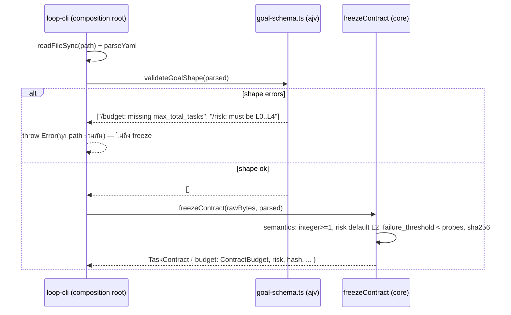
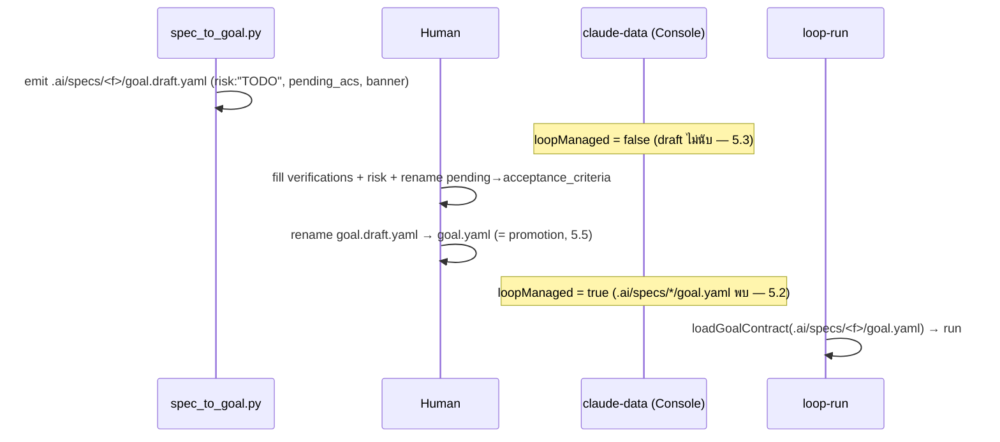

# Design: platform-phase5-stage2 — goal.schema.json + Typed Contract
> Status: approved 2026-07-12, amended 2026-07-12 (CX1: guard scope สอง flag — Codex review PR #110)

## Architecture Overview

หลักการ: **schema = shape ที่ edge, freeze = semantics ใน core** — สองชั้น additive,
core คง zero-runtime-dependency (ajv อยู่ console เท่านั้น, convention เดียวกับ `yaml`).

Components (ตามลำดับ data flow):

| # | Component | File | Responsibility |
|---|-----------|------|----------------|
| C1 | Governance schema | `.ai/schemas/goal.schema.json` (ใหม่) | JSON Schema draft-07 ครอบ §11.1 เต็ม — source of truth ที่ human/CI อ่าน |
| C2 | Embedded schema + validator | `console/backend/src/goal-schema.ts` (ใหม่) | `GOAL_SCHEMA` (embedded copy, deep-equal กับ C1) + `validateGoalShape(parsed): string[]` (ajv, allErrors — คืน list ของ failing paths, ว่าง = ผ่าน) |
| C3 | Edge integration | `console/backend/src/loop-cli.ts` `loadGoalContract` | parse YAML → C2 validate (fail = throw รวมทุก path) → `freezeContract` |
| C4 | Typed freeze | `core/src/contract/contract.ts` | `ContractBudget` (6 field), `risk: RiskClass` default L2, validation integer>=1, comment Stage-4 deferral ของ `maxTotalTasks` |
| C5 | Repair wiring | `console/backend/src/loop-run.ts` + `core/src/orchestrator/loop.ts` (export เพิ่ม 1 ตัว) | ส่ง `repairPolicy` จาก contract เข้า `runLoop` (option มีอยู่แล้ว) |
| C6 | Dispatch ceiling | `aal/src/dispatch.ts` + guard ใน `loop-run.ts` | `ceiling?: number` ใน `DispatcherOptions` + `effectiveMaxParallel` ที่อ่านได้ + fail-closed guard ตอน planning เปิด |
| C7 | loopManaged redefinition | `console/backend/src/claude-data.ts` | scan `.ai/specs/*/goal.yaml` หนึ่งระดับแทน root file |
| C8 | Generator banner | `scripts/spec_to_goal.py` | เพิ่ม `# HUMAN:` step สุดท้าย: promote = rename (text เท่านั้น) |
| C9 | Spec doc amendment | `unified-platform-spec.md` §11.1 + §17 | canonical path ใหม่ + `risk: L2` ใน template + promotion sentence + changelog v1.5 |

Blast-radius decision: `ContractBudget` เป็น type ใหม่ใน `contract.ts` ที่ `extends
BudgetLimits` — `BudgetLimits` (`core/src/types.ts:288`) และ `createBudget`
(budget tracker) **ไม่แตะเลย** ผู้บริโภค budget เดิมเห็น shape เดิม; ผู้ที่ต้องการ cap
ใหม่อ่านจาก `contract.budget` โดยตรง (REQ-3.1 อนุญาต "or the frozen contract type").

## Sequence Diagrams

Load → validate → freeze (C2/C3/C4):



Lifecycle ของ goal file (C7/C8/C9 — ตอบ D4):



## Data Models & Interfaces

### C1 — `.ai/schemas/goal.schema.json` (shape เต็ม)

ตาม style precedent ของ `plan.schema.json`: `$schema` draft-07, `$id`
`goal.schema.json`, `$comment` ชี้ §11.1 + embed site + supersession ของ P1 REQ-8.4.

```jsonc
{
  "$schema": "http://json-schema.org/draft-07/schema#",
  "$id": "goal.schema.json",
  "type": "object",
  "additionalProperties": false,
  "required": ["goal", "acceptance_criteria", "budget"],          // 1.3
  "properties": {
    "goal": {                                                      // 1.9
      "type": "object", "additionalProperties": false,
      "required": ["id"],
      "properties": { "id": {"type": "string", "minLength": 1},
                      "title": {"type": "string"},
                      "objective": {"type": "string"} }
    },
    "business_outcomes": { "type": "array", "items": {"type": "string"} },
    "scope": {
      "type": "object", "additionalProperties": false,
      "properties": { "include": {"type": "array", "items": {"type": "string"}},
                      "exclude": {"type": "array", "items": {"type": "string"}} }
    },
    "constraints": {
      "type": "object", "additionalProperties": false,
      "properties": {
        "stack": { "type": "object",
                   "additionalProperties": {"type": "string"} },   // ข้อยกเว้นเดียว (1.2)
        "forbidden": {"type": "array", "items": {"type": "string"}} }
    },
    "acceptance_criteria": {                                       // 1.7
      "type": "array", "minItems": 1,
      "items": { "type": "object", "additionalProperties": false,
                 "required": ["id", "description"],
                 "properties": { "id": {"type": "string", "minLength": 1},
                                 "description": {"type": "string", "minLength": 1},
                                 "verification": {"type": "string"},
                                 "golden": {"type": "boolean"} } }
    },
    "quality_gates": {                                             // 1.9
      "type": "object", "additionalProperties": false,
      "properties": { "ladder": {"type": "string"},
                      "mutation": { "type": "object", "additionalProperties": false,
                                    "properties": { "min_score_on_changed_files": {"type": "number"},
                                                    "tier": {"type": "string"} } },
                      "security": {"type": "string"},
                      "fusion": {"type": "string"} }
    },
    "budget": {                                                    // 1.4
      "type": "object", "additionalProperties": false,
      "required": ["max_iterations_per_task", "max_hypotheses_per_failure",
                   "max_total_tasks", "max_parallel_agents",
                   "max_cost_units_per_task", "max_wallclock_per_task_min"],
      "properties": { /* ทั้ง 6: {"type": "integer", "minimum": 1} */ }
    },
    "approval_policy": {                                           // 1.9
      "type": "object", "additionalProperties": false,
      "required": ["require_human_approval"],
      "properties": { "require_human_approval": {"type": "array", "items": {"type": "string"}} }
    },
    "deploy": {                                                    // 1.8 — 4 commands
      "type": "object", "additionalProperties": false,
      "required": ["canary_cmd", "observe_cmd", "expand_cmd", "rollback_cmd", "observe"],
      "properties": { "canary_cmd": {"type": "string", "minLength": 1},
                      "observe_cmd": {"type": "string", "minLength": 1},
                      "expand_cmd": {"type": "string", "minLength": 1},
                      "rollback_cmd": {"type": "string", "minLength": 1},
                      "observe": { "type": "object", "additionalProperties": false,
                                   "required": ["probes", "failure_threshold", "interval_ms"],
                                   "properties": { "probes": {"type": "integer"},
                                                   "failure_threshold": {"type": "integer"},
                                                   "interval_ms": {"type": "number"} } } }
    },
    "risk": { "enum": ["L0", "L1", "L2", "L3", "L4"] },            // 1.5
    "provenance": {                                                // 1.6 — Stage-3 ready
      "type": "object", "additionalProperties": false,
      "required": ["spec_path", "requirements_commit", "generated_at"],
      "properties": { "spec_path": {"type": "string"},
                      "requirements_commit": {"type": "string"},
                      "generated_at": {"type": "string"} }
    }
  }
}
```

หมายเหตุ shape: cross-field (`failure_threshold < probes`, probes >= 1) อยู่ freeze
เท่านั้น (1.8) — schema ให้แค่ type integer เพื่อไม่ duplicate เกณฑ์สองที่.

### C2 — `goal-schema.ts`

```ts
export const GOAL_SCHEMA: Record<string, unknown> = { /* deep-equal C1 — parity test */ };

// ajv compile ครั้งเดียวระดับ module (allErrors: true)
// คืน [] เมื่อผ่าน; เมื่อไม่ผ่านคืนทุก error เป็น "<instancePath>: <message>"
export function validateGoalShape(parsed: unknown): string[];
```

### C3 — `loadGoalContract` (แก้จุดเดียว)

```ts
export function loadGoalContract(path: string): TaskContract {
  const rawBytes = readFileSync(path);
  const parsed: unknown = parseYaml(rawBytes.toString('utf8'));
  const shapeErrors = validateGoalShape(parsed);                       // 2.1
  if (shapeErrors.length > 0) {
    throw new Error(`goal file failed schema validation:\n  ${shapeErrors.join('\n  ')}`); // 2.2
  }
  return freezeContract(rawBytes, parsed);                             // 2.4
}
```

### C4 — `contract.ts`

```ts
import type { RiskClass } from '../human/approval.ts';   // core-internal, มีอยู่แล้ว (approval.ts:6)

/** Contract-level budget: BudgetLimits ที่ tracker ใช้ + governance caps ใหม่ 3 ตัว. */
export interface ContractBudget extends BudgetLimits {
  maxHypothesesPerFailure: number;   // consumer: RepairPolicy (C5)
  maxTotalTasks: number;             // Stage-4 deferral — comment ที่นี่ (4.4): no runtime
                                     // consumer until the task graph lands (§14 Stage 4)
  maxParallelAgents: number;         // consumer: dispatch ceiling (C6)
}

export interface TaskContract {
  // ...เดิม...
  budget: ContractBudget;            // 3.1
  risk: RiskClass;                   // 3.5 — default L2 (3.3)
}
```

Freeze rules (helper ใหม่ `reqPosInt(v, what)` — precedent เดียวกับ deploy probes):

- ทั้ง 6 budget keys: missing / non-integer / < 1 → `ContractInvalidError` ระบุ key (3.2)
- `max_wallclock_per_task_min` ยัง × 60_000 เป็น `maxWallclockMs` เหมือนเดิม
- `risk`: absent → `'L2'`; ไม่อยู่ใน enum → `ContractInvalidError` (3.4)
- `raw`, sha256 hash, ลำดับ field อื่น — ไม่แตะ (3.6)

### C5 — Repair wiring

`core/src/orchestrator/loop.ts`: export `DEFAULT_REPAIR_POLICY` (เดิมเป็น module const
— เปลี่ยนเป็น export เดียว, ไม่มี logic ใหม่; `LoopOptions.repairPolicy` มีอยู่แล้ว)
**+ re-export ผ่าน barrel `core/src/index.ts`** — console import ทุก symbol ผ่าน
`'core'` เท่านั้น (AD3; index.ts:37-42 ปัจจุบัน export `runTaskLoop`/`RepairPolicy`).

`loop-run.ts` (จุดสร้าง `runLoop` options):

```ts
repairPolicy: { ...DEFAULT_REPAIR_POLICY,
                maxHypotheses: opts.contract.budget.maxHypothesesPerFailure },  // 4.1
```

พ่วงงานเดียวกัน: แทน `parseRisk(opts.contract.raw['risk'])` (`loop-run.ts:94-97,733`)
ด้วย `opts.contract.risk` แล้วลบ `parseRisk` — orphan จากการเปลี่ยนนี้เอง. Phase-4
semantic "unrecognized → L2 เงียบ" (REQ-7.6 เดิม) ถูกแทนด้วย "invalid → reject ตั้งแต่
edge/freeze, absent → L2 ที่ freeze" — เข้มขึ้นแบบ fail-closed, บันทึกใน changelog v1.5.
(downstream สอดคล้องอยู่แล้ว: `AutoApproveInput.riskClass ?? 'L2'` ใน auto-merge —
พฤติกรรมเท่าเดิมทุกกรณี, ยืนยันจาก critique.)

Fixture hazard (AD1): `loop-run.test.ts` สร้าง `TaskContract` เป็น literal — `CONTRACT`
(`:37,:41`) ต้องได้ 6-key `ContractBudget` + `risk` field, และ `L1_CONTRACT` (`:431`)
ตั้ง risk ผ่าน `raw: { risk: 'L1' }` ต้อง migrate เป็น `risk: 'L1'` (typed field) —
ถ้าเผลอเติม `risk: 'L2'` ทั้งกระดาน L1 auto-merge case จะพลิกพฤติกรรมเงียบ (6.6
ระบุ L1-stays-L1 แล้ว).

### C6 — Dispatch ceiling

`aal/src/dispatch.ts` (ตัวเลขล้วน — Ring 1 ไม่รู้จัก contract type, ไม่มี layering ใหม่):

```ts
export interface DispatcherOptions {
  buckets: Map<string, TokenBucket>;
  maxParallel: number;
  ceiling?: number;    // governance cap จาก contract (4.2); absent = ไม่จำกัดเพิ่ม
}
// effective = Math.max(1, Math.min(maxParallel, ceiling ?? maxParallel))
// dispatcher คืน { dispatchAll, effectiveMaxParallel }  ← อ่านได้ เพื่อ guard + test
```

`loop-run.ts` planning guard (fail-closed กัน caller ประกอบผิด — บทเรียน
`#ci-green-not-pipeline-connected`):

```ts
// Both flags — mirror of the dispatch condition (Codex review PR #110, CX1)
if (opts.planning?.enabled === true && opts.planning.plannerRoleTrigger === true &&
    opts.planning.dispatcher.effectiveMaxParallel > opts.contract.budget.maxParallelAgents) {
  throw new Error(`planning dispatcher parallelism ${eff} exceeds contract max_parallel_agents ${cap}`);
}
```

Composition rule: ที่ใดสร้าง `createDispatcher` โดยมี contract ใน scope ให้ส่ง
`ceiling: contract.budget.maxParallelAgents` — guard ข้างบนจับกรณีที่ลืม.

Semantics ยืนยัน (AD6): "effective = min()" ของ REQ-4.2 คือ composed rule (clamp ผ่าน
`ceiling`); guard refuse เป็นคนละเหตุการณ์ — fail-closed เมื่อ caller ประกอบผิด (ลืม
ceiling จน dispatcher ขนานเกิน contract) ไม่ใช่ clamp เงียบ เพราะ dispatcher เป็น
opaque หลังสร้างแล้ว retro-clamp ไม่ได้; ใน default config (routing `maxParallel: 1`)
guard ไม่มีวัน trip. Production ยังไม่มีจุดสร้าง dispatcher จริง (tests เท่านั้น) —
guard คือ enforcement ที่รอ live assembler ในอนาคต.

Guard scope แก้ตาม Codex review PR #110 (CX1): เช็ค **สอง** flag mirror เงื่อนไข
dispatch (`enabled && plannerRoleTrigger`) — REQ-4.2 เป็น WHILE-dispatching; run ที่
trigger ปิดไม่ dispatch จึงไม่มีอะไรให้ bound และต้องไม่ถูก refuse (config ชอบธรรมที่
test "EITHER axis off" รับรอง). Fail-closed ไม่เสีย: run ถัดไปที่ trigger เปิดเข้า
guard ใหม่ตอนเริ่มของมันเอง; regression test คู่กัน (trigger off + over-wide
dispatcher → รันสำเร็จ, PLAN_RESOLVED = 0).

### C7 — loopManaged

`claude-data.ts:79` เปลี่ยน predicate:

```ts
loopManaged: cwd !== null && hasPromotedGoal(cwd),
// hasPromotedGoal — try/catch ทั้งตัว (AD5): readProjects วนทุก project ใน home dir
// ซึ่งส่วนใหญ่ไม่มี .ai/specs → ENOENT คือ common case ไม่ใช่ edge; throw ใดๆ = false
//   try { readdirSync(join(cwd,'.ai','specs'), {withFileTypes:true})
//           .some((d) => d.isDirectory() && existsSync(join(specsDir, d.name, 'goal.yaml'))) }
//   catch { return false }
//   goal.draft.yaml ไม่นับ (5.3); archive/<f>/goal.yaml อยู่สองระดับ — ไม่ match (5.2/L6)
```

### C8 — Generator banner (text เท่านั้น)

`spec_to_goal.py` เพิ่มบรรทัดสุดท้ายใน banner ทั้งสอง variant (unresolved/resolved):

```
#        (N) when approved: rename goal.draft.yaml -> goal.yaml (promotion — the
#            Console loop-managed banner and the loop CLI read only goal.yaml)
```

`risk: "TODO"` คงเดิม — และหลัง C4 **freeze layer ก็ reject ด้วย** (ไม่ใช่แค่ schema):
นี่คือ supersession ของ stage-1 REQ-4.5 "resolved draft freezes unchanged" อย่างเป็น
ทางการ (REQ-3.7/AD2) — verification-resolved draft freeze ผ่านก็ต่อเมื่อ human ตั้ง
risk จริงแล้ว ตามเจตนา D5 (risk = human gate). e2e assertion เดิมที่ให้ resolved
draft freeze ผ่านทันทีต้องเขียนใหม่เป็นสองจังหวะ: reject ที่ `risk:"TODO"` → fill
risk → freeze ผ่าน (อยู่ใน 6.6 sweep).

### C9 — Spec doc amendment

- §11.1 บรรทัดแรกของ template: `# .ai/goal.yaml` → `# .ai/specs/<feature>/goal.yaml
  (draft: goal.draft.yaml — promote by renaming when approved)` + เพิ่มบรรทัด
  `risk: L2  # L0..L4, default L2` ใน example + ประโยค promotion (5.1/5.5)
- §17 เพิ่ม changelog **v1.5**: schema+typed contract ส่งมอบ, retire `.ai/goal.yaml`,
  supersede P1 REQ-8.4 (unknown key = reject ที่ edge, forward-compat ผ่าน schema
  amendment), supersede stage-1 REQ-4.5 (resolved draft freeze หลัง human ตั้ง risk —
  3.7), risk semantics เข้มขึ้น (invalid → reject แทน silent L2) (5.4/2.6/3.7)

## Technology Decisions

| Decision | Choice | Rationale |
|----------|--------|-----------|
| Validator | `ajv` ^8 ใน `console/backend` dependencies | de-facto standard, MIT, active; draft-07 support ตรง; อยู่ package เดียวกับ `yaml` ตาม pattern "dep ที่ edge" — core/aal ไม่แตะ (2.3); บันทึก dependency rationale ใน requirements Edge Cases แล้ว, approve PR = อนุมัติ |
| ajv config | `new Ajv({ allErrors: true })` | 2.2 ต้องการทุก path ไม่ใช่ตัวแรก |
| Budget type | `ContractBudget extends BudgetLimits` ใน contract.ts | blast radius เล็กสุด — tracker (`createBudget`) และ test ของมันไม่แตะ; REQ-3.1 เปิดทางเลือกนี้ไว้ |
| Risk type | reuse `RiskClass` จาก `core/src/human/approval.ts:6` | type เดิมที่ auto-merge/approval ใช้อยู่ — ไม่สร้าง enum ซ้ำ |
| Ceiling mechanism | optional `ceiling` ใน DispatcherOptions + guard ที่ loop-run | aal คงเป็นตัวเลขล้วน (ไม่ import core type); guard fail-closed จับ misassembly ที่จุดที่รู้ทั้ง contract และ dispatcher |
| Parity depth | deep-equal ทั้ง object (แรงกว่า precedent required-set ของ PLAN_SCHEMA) | schema นี้คือ governance ของ contract ทั้งใบ — drift ทุกระดับต้อง fail (6.1) |
| loopManaged scan | `readdirSync` หนึ่งระดับ ไม่ใช้ glob lib | stdlib พอ; ความหมาย "หนึ่งระดับ" ตรง 5.2 ตามตัวอักษร |

## Error Handling Strategy

| Error case | Layer | Behavior |
|------------|-------|----------|
| YAML parse ล้มเหลว / root ไม่ใช่ object | edge (pre-existing) | `yaml` throw ตรง (L2 — นอก scope); root non-object → ajv `"/: must be object"` |
| Unknown key ทุกระดับ | schema (C2) | reject + path (`"/buget: unexpected property"` class ตาย — D1) |
| Budget key หาย/ผิด type/ศูนย์/ลบ/เศษ | ทั้งสองชั้น | schema: named path; freeze: `ContractInvalidError` ระบุ key (6.2 พิสูจน์ทั้งคู่ — freeze ผ่าน direct unit call) |
| `risk` ผิดค่า | ทั้งสองชั้น | schema enum + freeze reject (6.3); absent → freeze ใส่ L2 |
| Unresolved draft (`pending_...`, `risk:"TODO"`, AC ว่าง) | schema | reject หลาย path — test 6.4 assert ว่ามี empty-AC path เฉพาะ |
| Deploy cross-field (`failure_threshold >= probes`) | freeze เท่านั้น | เดิม — schema ไม่ duplicate |
| Planning dispatcher เกิน cap | loop-run guard | throw ก่อน run เริ่ม (fail-closed) — ไม่ clamp เงียบ |
| `.ai/specs` ไม่มี / อ่านไม่ได้ | claude-data | `loopManaged: false` (try/catch — read-only observability path) |

## Testing Strategy

Unit (co-located):

- `console/backend/src/goal-schema.test.ts` (ใหม่): parity deep-equal กับ C1 (**6.1**);
  ครอบ shape cases — unknown key, budget missing/zero/negative/fractional (**6.2**
  ฝั่ง schema), risk enum ทุกค่า + invalid (**6.3** ฝั่ง schema), stack free-form ผ่าน,
  provenance shape, deploy 4-command
- `core/src/contract/contract.test.ts`: ขยาย — 6 budget keys required + `reqPosInt`
  ทุก failure mode ระบุ key (**6.2** ฝั่ง freeze, direct call), risk default L2 /
  round-trip / reject (**6.3**), `some_future_key` test คงอยู่ (raw passthrough —
  D1 note), fixture GOAL อัปเป็น 6-key (**6.6**)
- `aal/src/dispatch.test.ts`: ceiling clamp — `maxParallel 4, ceiling 3` → observed
  concurrency 3; ceiling absent → เดิม (**6.9** ฝั่ง unit)

Integration (console/backend):

- `loop-cli.test.ts`: loadGoalContract กับ goal ที่ผิด shape → error รวมทุก path
  (**2.2**); fixture เดิมอัป 6-key (**6.6**)
- `loop-run.test.ts`: (ก) contract `max_hypotheses_per_failure: 5` + gate แดงต่อเนื่อง
  → repair engine เดินถึง hypothesis ที่ 5 (ค่า non-default — **6.8**); (ข) planning
  dispatcher `maxParallel 2` + contract `max_parallel_agents: 1` → refuse (**6.9**
  ฝั่ง guard); fixtures budget อัป 6-key โดยตั้ง `max_parallel_agents` >= dispatcher
  parallel ของ harness เดิม (**6.6**)
- `claude-data.test.ts`: สี่เคสของ **6.7** (promoted / draft-only / none / legacy root)
- `spec-to-goal.e2e.test.ts`: banner assertion ใหม่ (C8) + assertion เดิมที่ให้
  resolved draft freeze ทันทีเขียนใหม่เป็นสองจังหวะตาม 3.7 (reject ที่ `risk:"TODO"`
  → fill → ผ่าน); **6.5** full human fill สองระดับ (AD4): (ก) unresolved-draft
  fixture (มี `pending_acceptance_criteria` จริง) — exercise ครบทุก clause: fill
  verifications + rename pending + drop placeholder + set risk; (ข) phase4 archived
  corpus (resolved 126 ACs, ไม่มี pending block) — exercise fill risk + scale;
  **6.4** unresolved draft → error paths มี `/acceptance_criteria` (minItems)
  โดยเฉพาะ + `freezeContract` direct call reject

Property-based: ไม่มี — domain เป็น enumerable shapes, ตาราง case ครอบตรงกว่า
(/spec-pbt ข้ามได้ stage นี้).

CI: ทุกอย่างวิ่งใต้ `SDD_TYPECHECK_CMD`/`SDD_TEST_CMD` เดิม; vendor check (INV-7)
ไม่กระทบ — ajv อยู่ console, schema อยู่ `.ai/`.

## Requirement Traceability

| Design element | Satisfies |
|----------------|-----------|
| C1 governance schema (shape ตามด้านบน) | 1.1, 1.2, 1.3, 1.4, 1.5, 1.6, 1.7, 1.8, 1.9 |
| C2 `goal-schema.ts` embedded + `validateGoalShape` | 2.5, 2.2 (allErrors) |
| C3 `loadGoalContract` validate-then-freeze | 2.1, 2.2, 2.4, 2.6 |
| ajv เฉพาะ console/backend | 2.3 |
| C4 `ContractBudget` + `reqPosInt` + risk default/reject + raw/hash untouched | 3.1, 3.2, 3.3, 3.4, 3.5, 3.6 |
| C4 comment ที่ `maxTotalTasks` | 4.3, 4.4 |
| C8 สองจังหวะ freeze + e2e rewrite (supersede stage-1 REQ-4.5) | 3.7 |
| C5 `repairPolicy` จาก contract + `DEFAULT_REPAIR_POLICY` export | 4.1 |
| C5 แทน `parseRisk` ด้วย `contract.risk` | 3.5 (consumer สอดคล้อง) |
| C6 ceiling + `effectiveMaxParallel` + planning guard | 4.2 |
| C7 `hasPromotedGoal` one-level scan | 5.2, 5.3 |
| C8 banner promotion step | 5.5 |
| C9 §11.1 amendment + §17 v1.5 | 5.1, 5.4, 2.6 |
| goal-schema.test.ts parity | 6.1 |
| contract.test.ts + goal-schema.test.ts budget/risk ทั้งสองชั้น | 6.2, 6.3 |
| spec-to-goal.e2e.test.ts unresolved/full-fill | 6.4, 6.5 |
| fixture migration sweep (รายชื่อใน 6.6) | 6.6 |
| claude-data.test.ts สี่เคส | 6.7 |
| loop-run.test.ts hypothesis non-default | 6.8 |
| dispatch.test.ts clamp + loop-run guard test | 6.9 |
