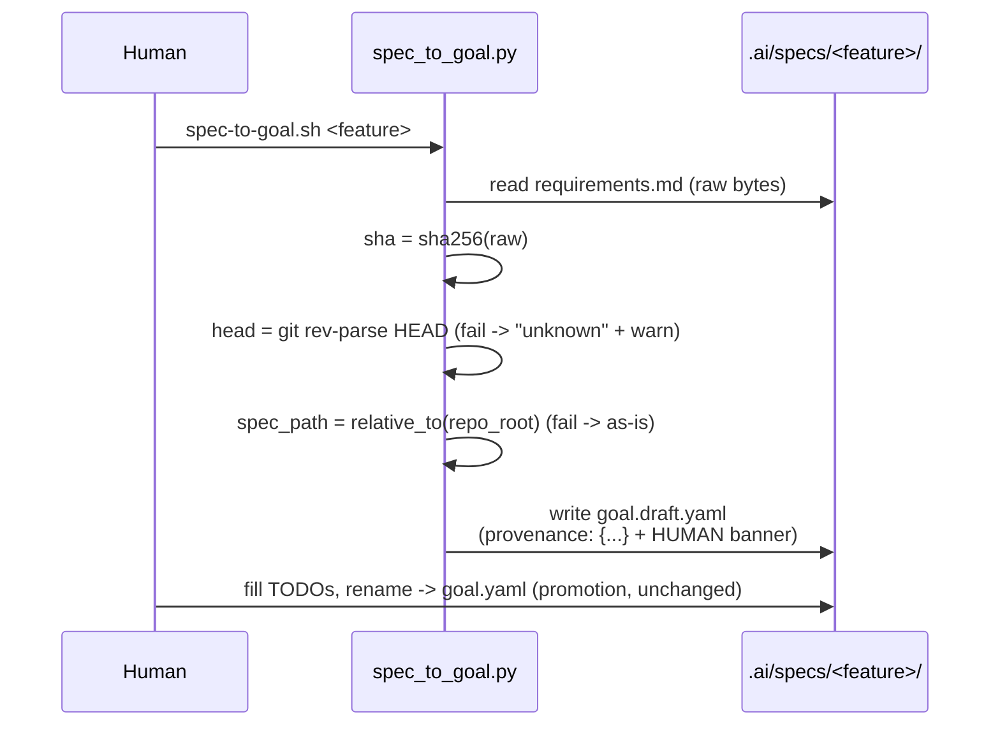
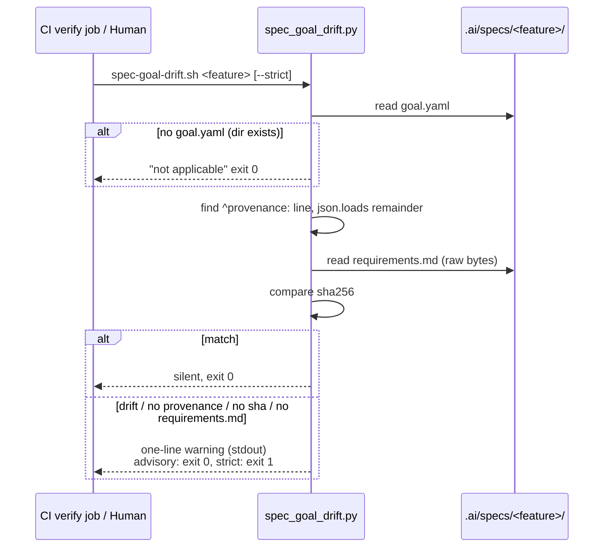
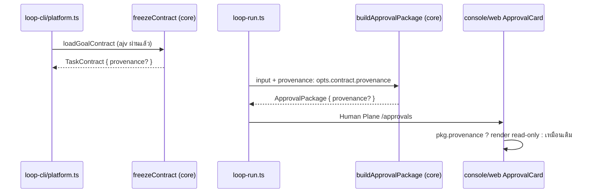

# Design: platform-phase5-stage3 — Provenance + Drift Detection
> Status: approved 2026-07-12, amended 2026-07-12 (traceability rows 3.5/5.2 added
> to match the requirements 3.5/5.2 EARS restatement — no design change)

## Architecture Overview

หกชิ้น ตามลำดับ dependency — ไม่มีชิ้นไหนแตะ state machine หรือ INV ของ core:

1. **Schema (D1)** — `.ai/schemas/goal.schema.json` + embedded `GOAL_SCHEMA`
   (`console/backend/src/goal-schema.ts`): `provenance` เพิ่ม optional
   `requirements_sha256`, ทั้ง 4 field ติด `minLength: 1` (parity กับ `deploy` fields
   ที่ทำอยู่แล้วบรรทัด 122-125). Governance + embedded ขยับใน commit เดียว —
   parity test (deep-equal) คุมอยู่.
2. **Generator (D2)** — `scripts/spec_to_goal.py` `emit()`: แทน comment header
   4 บรรทัด (`# source:` / `# requirements_sha256:` / `# head_commit:` /
   `# generated_at:`) ด้วย top-level `provenance:` flow mapping บรรทัดเดียว
   (JSON-quoted ทั้ง key และ value — remainder หลัง `provenance:` เป็น valid JSON).
   `spec_path` stamp เป็น repo-root-relative (fallback: path ตามจริงเมื่ออยู่นอก repo).
3. **Core (D3)** — `core/src/contract/contract.ts`: `TaskContract.provenance?` typed
   field + validation block ใน `freezeContract` (pattern เดียวกับ `deploy` optional
   block บรรทัด 146-174). ใช้ helper เดิม (`asRecord`, `reqNonEmptyStr`) — ไม่มี
   helper ใหม่. Absent = ไม่มี validation ใหม่รัน, `raw` passthrough คงเดิม.
4. **Drift checker (D4)** — ใหม่: `scripts/spec_goal_drift.py` (stdlib-only) +
   `scripts/spec-goal-drift.sh` (thin wrapper, convention เดียวกับ `spec-trace.sh`).
   เทียบ sha256 ของ `<specs-dir>/<feature>/requirements.md` bytes ปัจจุบัน กับ
   `requirements_sha256` ใน `goal.yaml` ของ dir เดียวกัน. Advisory default (exit 0
   เสมอ), `--strict` พลิก non-clean เป็น exit 1.
5. **CI (D5)** — step ใหม่ใน `verify` job ต่อจาก "Spec trace": loop
   `.ai/specs/*/goal.yaml` เรียก `spec-goal-drift.sh` ไม่มี `--strict`
   (advisory phase — escalation = เติม flag เดียว).
6. **Console (D6)** — provenance ไหล read-only: `TaskContract.provenance` →
   `ApprovalInput`/`ApprovalPackage` (`core/src/human/approval.ts`) →
   `buildApprovalPackage` copy ทีละ field → `loop-run.ts` ส่ง
   `opts.contract.provenance` ทั้งจุด task-approval และ deploy-approval → web
   `LoopApprovalPackage` (duplicated type ตาม convention) → render ใน
   `ApprovalCard` + i18n heading key เดียว (en+th).
7. **Doc (D7)** — `unified-platform-spec.md` v1.6 amendment (§11.1 + §14 note +
   §17 changelog + แก้ banner ค้าง v1.4).

หลักการรวม: **sha256 ของ bytes = anchor เดียวที่ใช้ตัดสิน drift**;
`requirements_commit`/`spec_path` เป็น human metadata ล้วน (ไม่มี code path ไหน
resolve มัน — A1/A2). Checker ไม่พึ่ง git เลย.

## Sequence Diagrams

### Generate + stamp provenance



### Drift check (advisory / strict)



### Provenance ถึงจอ approver



## Schema (governance + embedded — byte-identical)

```json
"provenance": {
  "type": "object",
  "additionalProperties": false,
  "required": ["spec_path", "requirements_commit", "generated_at"],
  "properties": {
    "spec_path":           { "type": "string", "minLength": 1 },
    "requirements_commit": { "type": "string", "minLength": 1 },
    "requirements_sha256": { "type": "string", "minLength": 1 },
    "generated_at":        { "type": "string", "minLength": 1 }
  }
}
```

`requirements_sha256` optional (ไม่อยู่ใน `required`) — REQ-1.4 backward compat.
ไม่มี hex pattern โดยเจตนา (Edge Cases: malformed sha = mismatch = drift warning,
fail-safe โดยไม่เพิ่มกติกา).

## Generator output (แทน comment header เดิม)

```yaml
# spec-to-goal draft — DO NOT run as-is
# HUMAN: ...(เดิม + "do not hand-edit or reflow the machine-stamped provenance line")
provenance: { "spec_path": ".ai/specs/<feature>/requirements.md", "requirements_commit": "<head|unknown>", "requirements_sha256": "<64-hex>", "generated_at": "2026-07-12T00:00:00Z" }
goal: { id: ..., ... }
```

- ตำแหน่ง: top-level key แรก ก่อน `goal:` (column 0)
- ทุก scalar ผ่าน `json.dumps` (stage-1 REQ-3.7 convention เดิม) — key ก็ quote
  ด้วย ให้ remainder เป็น valid JSON (`json.loads` ได้ตรง ๆ)
- `spec_path`: `req_path.resolve().relative_to(repo_root)` โดย
  `repo_root = Path(__file__).resolve().parent.parent`; `ValueError` (specs-dir
  นอก repo) → `str(req_path)` ตามจริง — metadata เท่านั้น ไม่มีใคร resolve (A1)
- sha คำนวณจาก raw bytes buffer เดิม (ห้าม `read_text().encode()` — comment
  ในโค้ดเดิมคงไว้)

## Core typed field

```ts
// contract.ts — TaskContract เพิ่ม (วางใต้ deploy?, convention เดียวกัน)
/** Optional generator-stamped origin record (phase5-stage3 REQ-3). Absent -> no validation runs. */
provenance?: {
  specPath: string;
  requirementsCommit: string;
  requirementsSha256?: string;
  generatedAt: string;
};
```

Freeze block (วางหลัง deploy block, ก่อน return — mirror pattern):

```ts
let provenance: TaskContract['provenance'];
const provRaw = root['provenance'];
if (provRaw !== undefined) {
  const p = asRecord(provRaw, 'provenance');
  provenance = {
    specPath: reqNonEmptyStr(p['spec_path'], 'provenance.spec_path'),
    requirementsCommit: reqNonEmptyStr(p['requirements_commit'], 'provenance.requirements_commit'),
    generatedAt: reqNonEmptyStr(p['generated_at'], 'provenance.generated_at'),
  };
  if (p['requirements_sha256'] !== undefined) {
    provenance.requirementsSha256 = reqNonEmptyStr(p['requirements_sha256'], 'provenance.requirements_sha256');
  }
}
// return: ...(provenance !== undefined ? { provenance } : {}),
```

หมายเหตุ: `reqNonEmptyStr` trim ก่อนเช็ค — string ช่องว่างล้วนโดน reject ด้วย
(เข้มกว่า schema `minLength` เล็กน้อย, ทิศทางเดียวกับ deploy fields เดิม).
ไม่มี unknown-key check ใน core (A5 — ajv edge จัดการ, raw passthrough คงเดิม).

## Approval package (core + web)

```ts
// core/src/human/approval.ts — ทั้ง ApprovalPackage และ ApprovalInput เพิ่ม
provenance?: { specPath: string; requirementsCommit: string; requirementsSha256?: string; generatedAt: string };
// buildApprovalPackage constructor เพิ่มบรรทัด copy ชัด ๆ (A6):
...(input.provenance !== undefined ? { provenance: input.provenance } : {}),
```

```ts
// console/web/src/logic/loop.ts — LoopApprovalPackage เพิ่ม (duplicated โดยเจตนา)
provenance?: { specPath: string; requirementsCommit: string; requirementsSha256?: string; generatedAt: string };
```

```ts
// loop.ts — pure projection (critique D2: web ไม่มี component-test convention —
// ทุก test เป็น logic/*.test.ts; view ต้อง thin ตาม doctrine ของไฟล์เอง)
/** Display line for a package's provenance, or null when absent (REQ-6.3/6.4). Values verbatim — audit data. */
export function goalProvenanceLine(pkg: LoopApprovalPackage): string | null {
  const p = pkg.provenance;
  if (p === undefined) return null;
  return `${p.specPath} @ ${p.requirementsCommit} · ${p.generatedAt}`;
}
```

```tsx
// Loop.tsx ApprovalCard — หลัง <p>{pkg.goalExcerpt}</p> (thin render จาก projection)
{goalProvenanceLine(pkg) !== null && (
  <p>
    {t('loopProvenanceHeading')} <code>{goalProvenanceLine(pkg)}</code>
  </p>
)}
```

i18n: key เดียว `loopProvenanceHeading` ใน `en` + `th` (`th` typed
`Record<keyof typeof en, string>` — ขาดแล้ว typecheck แดงเอง). Values render
verbatim ไม่ผ่าน `t()` (audit data — A10). ไม่แสดง `requirementsSha256` เต็มบนจอ
(ยาว 64 ตัว ไม่ช่วยคนตัดสิน) — spec_path + commit + generated_at พอสำหรับ
REQ-6 user story; sha อยู่ใน package payload ครบถ้าอยากดู raw.

`loop-run.ts` สองจุด — target ต่างกัน (critique D3):
- จุด task-approval (~766): ส่งผ่าน `ApprovalInput` เข้า `buildApprovalPackage`
- จุด deploy-approval (~853): สร้าง `ApprovalPackage` **literal ตรง ๆ** ไม่ผ่าน
  input — spread เข้า literal:
  `...(opts.contract.provenance !== undefined ? { provenance: opts.contract.provenance } : {})`

ทั้งคู่ conditional spread (`tsconfig.base.json` เปิด
`exactOptionalPropertyTypes` — verified).

## Drift checker CLI

```
usage: spec-goal-drift.sh <feature> [--specs-dir DIR] [--strict]
```

| เงื่อนไข | ข้อความ (stdout, บรรทัดเดียว) | advisory | --strict |
|---|---|---|---|
| hash ตรง | (เงียบ) | 0 | 0 |
| hash ต่าง | `warning: <feature>: requirements.md changed since goal.yaml was generated (sha256 <old8>... -> <new8>..., generated <generated_at>) — regenerate or re-review` | 0 | 1 |
| ไม่มีบรรทัด `^provenance:` ที่ parse ได้ | `warning: <feature>: goal.yaml has no parseable provenance — regenerate with scripts/spec-to-goal.sh` | 0 | 1 |
| provenance ไม่มี `requirements_sha256` | `warning: <feature>: provenance lacks requirements_sha256 — content drift cannot be verified` | 0 | 1 |
| ไม่มี `requirements.md` ใน feature dir | `warning: <feature>: requirements.md not found next to goal.yaml` | 0 | 1 |
| dir มีจริงแต่ไม่มี `goal.yaml` | `not applicable (no promoted goal.yaml)` | 0 | 0 |
| feature dir ไม่มี / arg ผิด | usage/error (stderr) | 2 | 2 |

การ parse: หา line แรกที่ match `^provenance:` (column 0 — comment `#` ไม่ match
โดยธรรมชาติ, A3), `json.loads` ส่วนหลัง colon; exception ใด ๆ = โหมด
"no parseable provenance". ไม่ใช้ PyYAML (stdlib-only — repo convention;
ceiling documented: goal.yaml ที่คน reflow บรรทัด provenance จะเข้าโหมด
no-parseable ซึ่ง fail-safe).

## CI step

```yaml
- name: Spec-goal drift (advisory)
  # Phase 5 Stage 3 (REQ-5): advisory only — warnings surface in the log, never
  # fail the build. Escalation to blocking = add --strict to this one invocation.
  run: |
    set -euo pipefail
    shopt -s nullglob
    for dir in .ai/specs/*/; do
      [ -f "${dir}goal.yaml" ] || continue
      feature="$(basename "$dir")"
      echo "::group::spec-goal-drift ${feature}"
      scripts/spec-goal-drift.sh "$feature"
      echo "::endgroup::"
    done
```

ศูนย์ไฟล์ = loop body ไม่รัน = ผ่านเงียบ (REQ-5.3, ไม่มี special case).
`goal.draft.yaml` ไม่ match filename check; `archive/<feature>/` อยู่นอก glob
ชั้นเดียว (A7 — จงใจ, revisit เมื่อมี archived goal จริง).

## Technology Decisions

| เรื่อง | เลือก | เหตุผล |
|---|---|---|
| Drift anchor | sha256 ของ bytes, ไม่ใช่ git commit | squash merge ทำ commit unreachable → `git show` fail ถาวรใน CI; sha เทียบได้เสมอ, git-free (user decision 2026-07-12) |
| Checker ภาษา | Python stdlib-only + sh wrapper | convention เดิม (`spec_trace.py`/`spec_to_goal.py`); CI มี Python 3.12 อยู่แล้ว |
| Provenance รูปแบบใน YAML | flow mapping บรรทัดเดียว JSON-quoted | parse ได้ด้วย `json.loads` ไม่ต้องเพิ่ม PyYAML; convention `json.dumps` scalar มีอยู่แล้ว (stage-1 REQ-3.7) |
| Advisory semantics | exit 0 เสมอ + stdout warning | precedent `check-spec-edit.sh` (exit-0 informs-never-blocks) + `check-evidence.sh` (`--strict`, exit 2 usage) |
| Core validation | hand-rolled ใน freeze, helper เดิม | core zero-runtime-dependency (ajv ลง core ไม่ได้); pattern เดียวกับ deploy block |
| Web type | duplicate ใน `LoopApprovalPackage` | web ไม่ import core โดยเจตนา (convention ระบุใน loop.ts:70-72) |

## Error Handling Strategy

- **Generator**: git fail → `"unknown"` + stderr warn (เดิม, REQ-2.5); `relative_to`
  fail → path ตามจริง (metadata เท่านั้น); pre-condition เดิมทั้งหมด (approved
  status, tasks.md warn) ไม่แตะ.
- **Freeze**: ทุกความผิดปกติของ provenance ที่ present → `ContractInvalidError`
  พร้อม path ชื่อ field (`provenance.spec_path` ฯลฯ); absent → เงียบ 100%
  (fixtures เดิม freeze ผ่านไม่เปลี่ยน).
- **Checker**: ทุก failure mode มีข้อความเฉพาะ (ตาราง CLI ด้านบน) — ไม่มีเงียบ
  ยกเว้น hash ตรง; strict = โหมดเดียวที่ non-zero นอกเหนือ usage error.
  ไม่มี exception รั่ว: I/O + parse error ทุกตัวถูกจับเข้าโหมด warning ที่ตรง.
- **CI**: step advisory — ไม่มีทาง fail build ในโหมดนี้ (script exit 0 เสมอ);
  `set -euo pipefail` คุมเฉพาะ script error จริง (เช่น wrapper หาย = ควร fail).
- **Console**: `pkg.provenance` undefined → ไม่ render อะไรเลย (REQ-6.4);
  ไม่มี write path (REQ-6.5 — display เท่านั้น).

## Testing Strategy

Test คู่กับโค้ดที่มันทดสอบ (co-located, convention เดิมทุกไฟล์):

- **`console/backend/src/goal-schema.test.ts`** (ขยาย): 4-field provenance ผ่าน
  (REQ-1.3), 3-field ผ่าน (REQ-1.4), empty-string field reject (REQ-1.1/minLength),
  unknown key reject พร้อม key ใน message (REQ-1.5), sha field ผิด type reject.
  Parity test เดิมคุม governance↔embedded (REQ-1.2) — ไม่ต้องแตะ ตัวมันจะแดงเอง
  ถ้าลืมฝั่งใดฝั่งหนึ่ง.
- **`console/backend/src/spec-to-goal.e2e.test.ts`** (แก้ + ขยาย): draft มี
  `^provenance:` column 0 + `json.loads` ได้ + ครบ 4 key (REQ-2.1); comment
  header 4 บรรทัดเดิมหายไป (REQ-2.2); banner มีคำสั่งห้าม reflow (REQ-2.3);
  `validateGoalShape` ของ draft ไม่มี provenance error (REQ-2.4); sha ใน
  provenance ตรงกับ sha256 ของ requirements.md fixture byte-exact (REQ-2.6).
  `spec_path` สองกิ่ง (critique D1 — temp-dir harness อยู่นอก repo เสมอ):
  เคส temp dir → assert fallback "as given" (absolute path ของ fixture);
  เคส in-repo (test ที่รันกับ archived spec จริงใน repo ซึ่ง harness มีอยู่แล้ว)
  → assert relative, ไม่ขึ้นต้น `/`.
- **`core/src/contract/contract.test.ts`** (ขยาย): valid 4-field → typed field
  ครบ camelCase (REQ-3.1/3.2); 3-field → `requirementsSha256` undefined;
  absent → `provenance` undefined + fixture freeze เดิมผ่าน (REQ-3.3);
  reject: non-object, field หาย, empty string, sha ผิด type (REQ-3.4);
  unknown key ใน provenance **ไม่** reject ที่ freeze (pin A5 decision —
  ajv edge จับแทน, กันคน reintroduce strict check ผิดชั้น).
- **`console/backend/src/spec-goal-drift.e2e.test.ts`** (ใหม่ — spawn script จริง
  บน temp dir, pattern เดียวกับ spec-to-goal.e2e): hash ตรง → เงียบ + exit 0
  (REQ-4.3); แก้ requirements.md → warning + exit 0 / `--strict` exit 1
  (REQ-4.4/4.6/4.7 — นี่คือ DoD หลักของ stage: "drift check จับการแก้
  requirements.md หลัง generate ได้"); ไม่มี provenance / ไม่มี sha / ไม่มี
  requirements.md → สามข้อความแยก (REQ-4.5); banner `# HUMAN:` ที่มีคำ
  `provenance:` ไม่หลอก parser (A3 regression); dir มีแต่ draft →
  "not applicable" exit 0 (REQ-4.8); feature ไม่มีจริง → exit 2 (REQ-4.9);
  end-to-end: generate จริงด้วย spec_to_goal → promote (rename) → checker เงียบ
  → แก้ไฟล์ → checker เตือน.
- **`core/src/human/approval.test.ts`** (ขยาย — ไฟล์ test ของ approval ที่มีอยู่):
  input มี provenance → package มี (REQ-6.1); ไม่มี → ไม่มี key.
- **`console/web/src/logic/loop.test.ts`** (ขยาย — web ไม่มี component test โดย
  เจตนา, critique D2): `goalProvenanceLine` คืน values verbatim เรียงตาม spec
  เมื่อมี provenance (REQ-6.3), คืน `null` เมื่อไม่มี (REQ-6.4); heading key
  ค้ำด้วย typecheck (`th` typed `Record<keyof typeof en, string>`); ตัว JSX
  render เป็น thin branch จาก projection — eyeball + typecheck พอ.
- **CI (REQ-5)**: พิสูจน์ด้วยตัว CI run ของ PR นี้เอง — ศูนย์ goal.yaml บน repo
  = step เขียวเงียบ (REQ-5.3); loop pattern copy จาก spec-trace step ที่พิสูจน์แล้ว.
- **Doc (REQ-7)**: ตรวจด้วยตา + spec-trace ยังเขียว (ไม่มี REQ engine สำหรับ doc).

## Requirement Traceability

| Design element | REQ | Section |
|---|---|---|
| D1 schema `requirements_sha256` + `minLength:1` (governance) | 1.1 | Schema (governance + embedded — byte-identical) |
| D1 embedded `GOAL_SCHEMA` ขยับพร้อมกัน + parity | 1.2 | Schema (governance + embedded — byte-identical) |
| D1 ajv รับ 4-field / 3-field / reject unknown+empty | 1.3, 1.4, 1.5 | Schema (governance + embedded — byte-identical) |
| D2 `provenance:` flow line JSON-quoted + spec_path relative | 2.1 | Generator output (แทน comment header เดิม) |
| D2 ลบ comment header 4 บรรทัด (banner คง) | 2.2 | Generator output (แทน comment header เดิม) |
| D2 HUMAN banner + no-reflow instruction | 2.3 | Generator output (แทน comment header เดิม) |
| D2 draft ผ่าน `validateGoalShape` ส่วน provenance | 2.4 | Generator output (แทน comment header เดิม) |
| D2 git fallback `"unknown"` + warn | 2.5 | Generator output (แทน comment header เดิม) |
| D2 sha จาก raw bytes buffer เดิม | 2.6 | Generator output (แทน comment header เดิม) |
| D3 `TaskContract.provenance?` typed | 3.1, 3.2 | Core typed field |
| D3 absent → พฤติกรรมเดิมเป๊ะ | 3.3 | Core typed field |
| D3 reject non-object/missing/empty/ผิด type | 3.4 | Core typed field |
| D3 ไม่มี unknown-key check ที่ freeze (pin ด้วย test) | 3.5 | Core typed field |
| D4 script + wrapper + CLI contract | 4.1 | Drift checker CLI |
| D4 `^provenance:` column-0 + json.loads + hash เทียบใน dir เดียวกัน | 4.2 | Drift checker CLI |
| D4 เงียบเมื่อตรง / warning modes / exit semantics | 4.3, 4.4, 4.5, 4.6, 4.7 | Drift checker CLI |
| D4 "not applicable" / usage exit 2 | 4.8, 4.9 | Drift checker CLI |
| D5 CI advisory step + glob ชั้นเดียว + ศูนย์ไฟล์เงียบ + ไม่มี --strict | 5.1, 5.3, 5.4 | CI step |
| D5 draft/archive อยู่นอก loop โดย construction | 5.2 | CI step |
| D6 core ApprovalPackage/Input + explicit copy | 6.1 | Approval package (core + web) |
| D6 loop-run สองจุดส่ง contract.provenance | 6.2 | Approval package (core + web) |
| D6 web render + i18n key เดียว en+th + values verbatim | 6.3 | Approval package (core + web) |
| D6 absent-tolerant / display-only | 6.4, 6.5 | Approval package (core + web) |
| D7 §11.1 example + §14 note + §17 v1.6 + banner fix | 7.1, 7.2, 7.3, 7.4 | Architecture Overview |

## Critique log — spec-architect round 1 (2026-07-12, applied ทั้งหมด)

- **D1 (major)**: e2e assertion "spec_path relative" fail เสมอใน temp-dir harness
  (นอก repo → fallback absolute) — แก้ Testing Strategy เป็นสองกิ่ง (temp = as-given,
  in-repo archived spec = relative).
- **D2 (major)**: web ไม่มี component-test convention (logic/*.test.ts ล้วน) —
  ดึง `goalProvenanceLine` pure projection เข้า `loop.ts`, test ใน `loop.test.ts`,
  JSX เหลือ thin branch.
- **D3 (minor)**: จุด deploy-approval สร้าง `ApprovalPackage` literal ตรง ไม่ผ่าน
  `ApprovalInput` — ระบุ target spread ให้ถูก.

Verified-fine โดย critique (ไม่ต้องเช็คซ้ำตอน implement): exactOptionalPropertyTypes
เปิดจริง (conditional spread จำเป็น) · flow mapping JSON-quoted เป็น valid YAML ที่
eemeli yaml parse ได้ · `approval.test.ts`/`loop.test.ts` มีจริง · fixtures ไม่มี
provenance (schema bump ไม่กระทบ) · ไม่มี consumer อื่น parse comment header เดิม
(นอกจาก e2e ที่อัปเดตใน REQ-2.2) · draft ที่ fail schema อยู่แล้วไม่เพิ่ม broken flow
ใหม่ · CI zero-file เขียวเงียบ · i18n th ผูก typecheck.
