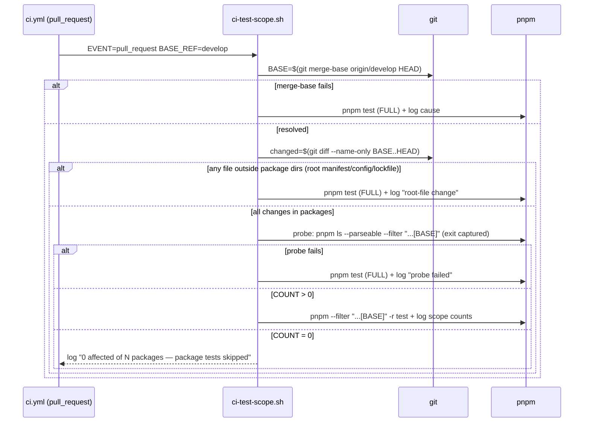

# Design: CI Incremental Checks (diff-scoped PR, full floor on develop)

> Status: approved 2026-07-11

## Architecture Overview

Four files change — the orchestration lives in TESTABLE scripts, not inline
workflow shell (REQ-5.3, ARC-F12/F13):

- **`.ai/bin/check-secrets.sh`** — new `--range <base>..<head>` gathering mode
  with the same guards the other modes have (ARC-F6).
- **`scripts/ci-secret-scope.sh`** — decides and runs the right scan for the
  event: PR → resolve merge-base → `--range`; anything else / any resolution
  failure → `--all` with the cause logged.
- **`scripts/ci-test-scope.sh`** — decides and runs the right test scope:
  PR → merge-base + root-file guard + package probe → filtered or full;
  any failure anywhere → FULL suite (fail closed to running, REQ-3.6).
- **`.github/workflows/ci.yml`** — both jobs get `fetch-depth: 0` (ARC-F1);
  the scan/test steps become one-line calls into the two scripts, passing
  `$GITHUB_EVENT_NAME` / `$GITHUB_BASE_REF`.

```
ci.yml (thin)                      scripts/ (testable)
  platform job ── ci-test-scope.sh ──► full | filtered | full-on-any-doubt
  verify  job  ── ci-secret-scope.sh ─► --range | --all-with-cause
  (both checkouts fetch-depth: 0)
```

## Sequence Diagrams



Merge-ref semantics (ARC-F5): on `pull_request` the default checkout HEAD is
the ephemeral merge commit, whose parents are the base tip and the PR head —
so `merge-base(origin/base, HEAD)` = base tip and the diff/filter measures
the PR AS MERGED against current base. That is the semantics REQ-3.1 now
specifies; no `ref:` override in checkout (overriding to `head.sha` would
silently change scope semantics — documented in the workflow comment).

## Data Models & Interfaces

`check-secrets.sh` range mode (ARC-F6 — guards mirror the other modes):

```sh
--range) MODE=range; RANGE="${2:?usage: --range <base>..<head>}" ;;
...
if [ "$MODE" = range ]; then
  BASE_REF_SPEC="${RANGE%%..*}"; HEAD_REF_SPEC="${RANGE##*..}"
  git rev-parse --verify --quiet "$BASE_REF_SPEC^{commit}" >/dev/null \
    && git rev-parse --verify --quiet "$HEAD_REF_SPEC^{commit}" >/dev/null || {
      echo "check-secrets: range endpoint unresolvable ($RANGE) — falling back to --all" >&2
      exec "$0" --all
    }
  FILES=$(git diff --name-only --diff-filter=ACMR "$RANGE" -- . "$TESTS_EXCLUDE" 2>/dev/null) || {
      echo "check-secrets: git diff failed for $RANGE — falling back to --all" >&2
      exec "$0" --all
    }
  [ -z "$FILES" ] && exit 0     # verified-valid range with an empty diff = clean
  CONTENT=$(git diff --unified=0 "$RANGE" -- . "$TESTS_EXCLUDE" 2>/dev/null) || {
      echo "check-secrets: git diff (content) failed — falling back to --all" >&2
      exec "$0" --all
    }
fi
```

- Hunk-scoped by design (REQ-1.1 as amended, ARC-F7); `--all` on develop is
  the whole-file floor.
- `SECRET_GUARD_SKIP` line change (ARC-F10): the existing
  `[ "$MODE" != "all" ]` becomes `[ "$MODE" = staged ]` — skip honors ONLY
  the one interactive mode; the header comment gains "ignored in --all and
  --range (CI modes)". This exact line is named as a task item and locked by
  a test.

`scripts/ci-secret-scope.sh` / `ci-test-scope.sh` shared contract:

```
usage: ci-secret-scope.sh <event_name> <base_ref>
       ci-test-scope.sh   <event_name> <base_ref>
env:   CI_SCOPE_DRY_RUN=1  → print decisions, run nothing (for tests)
exit:  the underlying scan/test exit code; decision failures never exit 0
       without having run the FULL fallback
```

Root-file guard in ci-test-scope.sh (ARC-F4): package dirs are read from
`pnpm-workspace.yaml` (`core aal adapters console/backend console/web
spikes`); any changed path not under one of them → full suite. This covers
`pnpm-lock.yaml`, `tsconfig.base.json`, `eslint.config.mjs`, root
`package.json`, workflow/guard files — anything pnpm cannot attribute.

Probe with captured exit (ARC-F3):

```sh
if AFFECTED=$(pnpm ls -r --depth -1 --parseable --filter "...[${BASE}]" 2>/dev/null); then
  COUNT=$(printf '%s\n' "$AFFECTED" | grep -c . || true)
  TOTAL=$(pnpm ls -r --depth -1 --parseable | grep -c .)
  echo "scope: event=$EVENT base=$BASE affected=$COUNT skipped=$((TOTAL-COUNT))"
else
  echo "scope: package probe FAILED — running full suite (fail-closed)"; run_full; fi
```

Log lines carry event, base, in-scope and skipped counts computed from the
same filtered sets the scan/tests actually use (REQ-4.1, ARC-F8).

## Technology Decisions

- **Orchestration as scripts, ci.yml as caller** (ARC-F12): the fail-open
  probe bug class and the hard-crash class both become unit-testable in the
  guard suite; the workflow file can no longer hide logic.
- **`fetch-depth: 0` on both jobs** (ARC-F1): repo is small; full history
  removes the shallow-clone failure class in the common path; the
  in-script fallback stays for the residual (`origin/<base>` missing —
  ARC-F11).
- **Default merge-ref checkout kept** (ARC-F5): PR-as-merged is the more
  honest scope than branch-point; rationale documented in the workflow file.
- **`exec "$0" --all` fallback**: one implementation of the fallback, cause
  logged before exec (REQ-1.3, 2.4).
- **Fail-closed direction everywhere**: every ambiguity (unresolvable base,
  probe error, root file, dry-run misuse) resolves to MORE scanning/testing,
  never less (REQ-3.6).

## Error Handling Strategy

| Failure | Behavior | REQ |
|---|---|---|
| range endpoint unresolvable / git diff errors | logged fallback to `--all` | 1.3, 2.4 |
| merge-base unresolvable in test scope | full suite + cause log | 3.6 |
| package probe non-zero exit | full suite + cause log | 3.6 |
| changed file outside every package dir | full suite + "root-file change" log | 3.5 |
| zero affected, all changes in-package | logged skip with affected/skipped counts | 3.3 |
| violation in range | exit 2 → PR red (unchanged contract) | 2.3 |
| `SECRET_GUARD_SKIP` in CI | cleared at workflow level AND ignored by mode rule | 1.4 |

## Testing Strategy

New `.claude/hooks/tests/ci-scope.test.sh` + extended
`secrets-guard.test.sh`, fixture repos via `git init` in `mktemp -d`
(REQ-5.1/5.3):

| Case | Asserts | REQ |
|---|---|---|
| `--range` spanning a secret commit | exit 2, names pattern | 1.1, 2.3 |
| `--range` clean commits, old secret outside range | exit 0 | 1.1 |
| `--range` bad endpoint | falls back to `--all`, cause logged, still catches tree secret | 1.3 |
| `SECRET_GUARD_SKIP=1` with `--range` violation | exit 2 | 1.4, ARC-F10 |
| same secret via `staged` vs `--range` | identical reason string | 1.2 |
| ci-test-scope: unresolvable base (dry-run) | decision=FULL, cause logged | 3.6 |
| ci-test-scope: root-file change (lockfile fixture) | decision=FULL | 3.5 |
| ci-test-scope: probe forced to fail (PATH stub) | decision=FULL | 3.6, ARC-F3 |
| ci-test-scope: in-package change | decision=FILTERED, affected/skipped counts logged | 3.1, 3.3, 4.1 |
| ci-test-scope: in-package change, zero dependents match | decision=SKIP + counts | 3.3 |
| ci-secret-scope: push event | decision=`--all` | 2.2 |

Live confirmation on this feature's own PR (scope log lines on the
pull_request run; full floor on the develop push after merge) recorded in the
task Evidence block — supplementing, not replacing, the automated cases
(ARC-F12 resolved).

## Requirement Traceability

| Design element | REQ |
|---|---|
| `--range` gather with both-end verify + error-vs-empty split | REQ-1.1 |
| single rule path across modes | REQ-1.2 |
| logged `exec $0 --all` fallbacks | REQ-1.3 |
| skip honored only in staged mode + CI env clear | REQ-1.4 |
| ci-secret-scope PR branch → `--range` | REQ-2.1 |
| push branch → `--all` unchanged | REQ-2.2 |
| exit-2 contract preserved | REQ-2.3 |
| fetch-depth 0 both jobs + fallback cause log | REQ-2.4 |
| merge-ref merge-base filter (PR-as-merged) | REQ-3.1 |
| push branch full `pnpm test` | REQ-3.2 |
| zero-affected logged skip with counts | REQ-3.3 |
| unconditional typecheck/lint/vendor/guards/trace | REQ-3.4 |
| root-file guard from pnpm-workspace.yaml | REQ-3.5 |
| captured-exit probe + full-on-failure | REQ-3.6 |
| scope log lines from the scanned/tested sets | REQ-4.1 |
| workflow comments (scoped PR vs floor; merge-ref rationale) | REQ-4.2 |
| secrets-guard + ci-scope test cases | REQ-5.1, 5.2 |
| orchestration in scripts/ + dry-run seam | REQ-5.3 |
