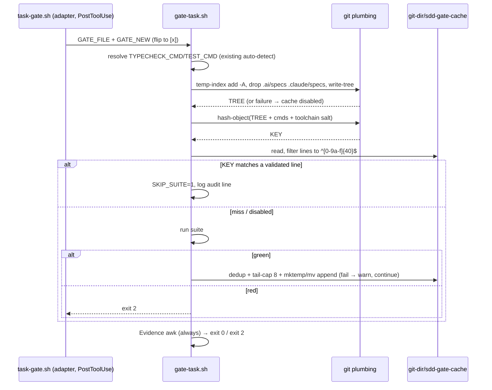

# Design: SDD Gate-Task Cache (tree-hash skip)

> Status: approved 2026-07-11

## Architecture Overview

One file changes: `.ai/bin/gate-task.sh` gains a cache stage wrapped around its
existing code-green stage. No new processes, no daemons, no dependencies beyond
git itself.

Components:

- **Fingerprint builder** (new function inside gate-task.sh, placed AFTER the
  existing auto-detect block so it hashes the RESOLVED commands — ARC-14):
  key = "this exact working tree minus spec artifacts + this exact gate
  config + this exact toolchain".
- **Green-cache file** at `$(git rev-parse --git-dir)/sdd-gate-cache` —
  newline list of green fingerprints, capped at 8. `--git-dir` (not a literal
  `.git/`) keeps linked worktrees working, where `.git` is a file (ARC-11).
  Inside the git dir = per-clone, untracked by construction (REQ-2.3), immune
  to the committed-replay-cache lesson (LESSONS.md:31).
- **Cache gate** between flip detection and the code-green stage. Single-exit
  control flow (ARC-18): the cache can only ever set `SKIP_SUITE=1`; nothing
  in the cache logic exits — the Evidence stage always runs (REQ-3.4).
- **Disable guards**: `SDD_GATE_NO_CACHE=1` (REQ-4.1), `.gitmodules` present
  (REQ-1.6), empty/failed KEY (REQ-1.4), pre-write adapters must pass the
  disable env (REQ-3.5; engine header documents the post-write contract).

```
flip detected
   │
   ├─ cache disabled? (env / .gitmodules / KEY compute failed)
   │        └─ SKIP_SUITE=0 (full run; zero cache I/O)
   ├─ KEY ∈ validated cache lines ──► SKIP_SUITE=1 + audit log line
   └─ miss ──► SKIP_SUITE=0
   │
   ├─ SKIP_SUITE=0: run typecheck+test
   │        ├─ red → exit 2 (unchanged; no cache write)
   │        └─ green → append KEY (atomic, dedup, cap 8; failure = warn only)
   │
   └─ Evidence per-task check (ALWAYS reached) → verdict
```

## Sequence Diagrams



## Data Models & Interfaces

Fingerprint (REQ-1) — computed once, after command auto-detect:

```sh
compute_key() {  # echoes KEY, or nothing on any failure (caller treats empty = cache disabled)
  [ -f .gitmodules ] && return 0                      # REQ-1.6 (ARC-6)
  local tmpidx tree salt
  tmpidx=$(mktemp) || return 0
  cp "$(git rev-parse --git-path index)" "$tmpidx" 2>/dev/null || true
  tree=$(GIT_INDEX_FILE="$tmpidx" git add -A 2>/dev/null \
      && GIT_INDEX_FILE="$tmpidx" git rm -r --cached -q --ignore-unmatch \
           .ai/specs .claude/specs 2>/dev/null \
      && GIT_INDEX_FILE="$tmpidx" git write-tree 2>/dev/null) || { rm -f "$tmpidx"; return 0; }
  rm -f "$tmpidx"
  salt=""
  [ -n "${SDD_GATE_TOOLCHAIN_CMD:-}" ] && salt=$(eval "$SDD_GATE_TOOLCHAIN_CMD" 2>/dev/null)
  if [ -f package.json ]; then
    salt="$salt|$(node --version 2>/dev/null)|$(pnpm --version 2>/dev/null)"
  fi
  printf '%s\n%s\n%s\n%s\n' "$tree" "$TYPECHECK_CMD" "$TEST_CMD" "$salt" \
    | git hash-object --stdin 2>/dev/null
}
KEY=$( [ "${SDD_GATE_NO_CACHE:-0}" = 1 ] || compute_key )
```

- KEY empty ⇒ every cache read/write is skipped; suite runs (ARC-2 — no
  `fallback_run` control-flow trap; there is no jump, only a flag).
- `git rm --cached` of the spec dirs implements the REQ-1.1 exclusion (ARC-1)
  deterministically inside the temp index.
- Salt generalizes to any stack via `SDD_GATE_TOOLCHAIN_CMD` (ARC-5).

Cache read (REQ-2.4, ARC-17):

```sh
CACHE="$(git rev-parse --git-dir 2>/dev/null)/sdd-gate-cache"
SKIP_SUITE=0
if [ -n "$KEY" ] && [ -r "$CACHE" ]; then
  if grep -a -xE '[0-9a-f]{40}' "$CACHE" 2>/dev/null | grep -qxF "$KEY"; then
    SKIP_SUITE=1
    echo "gate cache hit: tree $KEY previously green — skipping typecheck/test (SDD_GATE_NO_CACHE=1 to force)" >&2
  fi
fi
```

Cache append after a green suite (REQ-2.1/2.2/2.5, REQ-4.2, ARC-3/16):

```sh
if [ -n "$KEY" ]; then
  tmp=$(mktemp "$(dirname "$CACHE")/sdd-gate-cache.XXXXXX") && {
    { grep -a -xE '[0-9a-f]{40}' "$CACHE" 2>/dev/null | grep -vxF "$KEY" | tail -7
      printf '%s\n' "$KEY"; } > "$tmp" && mv "$tmp" "$CACHE"
  } || echo "gate cache: append failed (non-fatal) — verdict unaffected" >&2
fi
# execution CONTINUES to the Evidence stage — no exit here (REQ-3.4, ARC-3)
```

## Technology Decisions

- **git plumbing over checksum tools**: `write-tree` on a temp index hashes
  tracked+unstaged+untracked-non-ignored in one pass honoring `.gitignore`;
  `git hash-object` avoids darwin/linux shasum divergence.
- **Seed the temp index from the real index**: unseeded `add -A` re-hashes
  every blob per invocation — the cache must be cheaper than the suite. The
  residual is git's own racy-stat ceiling on coarse-mtime filesystems,
  documented in requirements (ARC-4); on APFS/ext4 the window is nil.
- **Flag, not function-jump, for fallback** (ARC-2): `SKIP_SUITE` + empty-KEY
  guard means there is no code path where an unset variable or a `return`
  lands in cache logic — fail-open is structurally unreachable.
- **Warn-and-continue on append failure** (ARC-3): the suite verdict is
  already earned; the Evidence stage still decides the final exit. A cache
  write can never gate.
- **Post-write contract** (ARC-9): engine header states the cache stage
  assumes the edit is on disk; the shipped adapters (Claude PostToolUse,
  pre-commit) satisfy it; any future pre-write adapter must export
  `SDD_GATE_NO_CACHE=1` (REQ-3.5).
- **N=8, dedup before cap** (ARC-16): re-appending an existing key refreshes
  its position instead of shrinking effective capacity.

## Error Handling Strategy

| Failure | Behavior | REQ |
|---|---|---|
| mktemp/cp/add/rm-cached/write-tree/hash-object fails | KEY empty → cache disabled, full run | 1.4 |
| `.gitmodules` present | cache disabled, full run | 1.6 |
| cache file missing/unreadable/garbage/binary | validated-line filter yields nothing → miss → full run | 2.4 |
| suite red | exit 2 exactly as today; no cache write | 2.2 |
| cache append fails | stderr warning; control continues to Evidence | 3.4 |
| `SDD_GATE_NO_CACHE=1` | no read, no write, full run | 4.1 |
| pre-write adapter | must disable cache (documented contract) | 3.5 |

## Testing Strategy

Extend `.claude/hooks/tests/gate-task.test.sh`. Fixture = a REAL isolated git
repo: `git init` inside `mktemp -d`, `GIT_CEILING_DIRECTORIES` set to the
temp parent so no git call can escape to the enclosing repo (ARC-10);
destructive strings via files per LESSONS.md:24.

| Case | Asserts | REQ |
|---|---|---|
| green run writes exactly one 40-hex key | cache content | 2.1 |
| red run | exit 2, no cache file/entry | 2.2 |
| flip task 1 (green) then flip task 2, code untouched | second run logs cache hit, suite spy-counter unchanged | 3.1, 3.3, ARC-1 regression |
| edit tracked source file | miss, suite runs | 3.2, 1.1 |
| delete a tracked file | miss, suite runs (ARC-15) | 1.1 |
| create untracked file | miss, suite runs | 1.1 |
| edit only tasks.md content (evidence text) | HIT (spec dirs excluded) | 1.1 |
| change `SDD_TEST_CMD` | miss | 1.2 |
| change `SDD_GATE_TOOLCHAIN_CMD` output | miss | 1.5 |
| add `.gitmodules` | cache disabled (no read/write), suite runs | 1.6 |
| `SDD_GATE_NO_CACHE=1` on warm cache | suite runs, no cache write | 4.1 |
| corrupt cache (binary garbage) | full run, no crash, no false hit | 2.4 |
| cache hit + missing Evidence | still exit 2 | 3.4 |
| cache append to read-only dir | warning, Evidence still evaluated, exit reflects Evidence | 3.4, ARC-3 regression |
| 9 distinct green keys | file capped at 8 | 4.2 |
| re-append same key ×3 | one entry, still capped capacity | 4.2, ARC-16 |
| parallel invocations (loop, background) | final cache file contains ONLY valid 40-hex lines (integrity, not count — non-flaky) | 2.5 |
| deterministic: two computes, no change | same KEY | 1.3 |

## Requirement Traceability

| Design element | REQ | Section |
|---|---|---|
| temp-index add -A + spec-dir rm --cached + write-tree | REQ-1.1, 1.3 | Data Models & Interfaces |
| resolved-command + toolchain salt via hash-object | REQ-1.2, 1.5 | Data Models & Interfaces |
| empty-KEY-disables-cache flag flow | REQ-1.4 | Data Models & Interfaces |
| `.gitmodules` guard | REQ-1.6 | Data Models & Interfaces |
| append-only-on-green; red writes nothing | REQ-2.1, 2.2 | Data Models & Interfaces |
| `git rev-parse --git-dir` cache path | REQ-2.3 | Data Models & Interfaces |
| validated-line read filter | REQ-2.4 | Data Models & Interfaces |
| mktemp+mv atomic append with dedup | REQ-2.5 | Data Models & Interfaces |
| exact-match skip + audit log line | REQ-3.1, 3.2, 3.3 | Data Models & Interfaces |
| single-exit flow; Evidence unconditional | REQ-3.4 | Data Models & Interfaces |
| post-write contract in engine header | REQ-3.5 | Data Models & Interfaces |
| SDD_GATE_NO_CACHE guard | REQ-4.1 | Data Models & Interfaces |
| dedup + tail-7 cap | REQ-4.2 | Data Models & Interfaces |
| isolated-git-fixture test cases | REQ-5.1, 5.2 | Testing Strategy |
