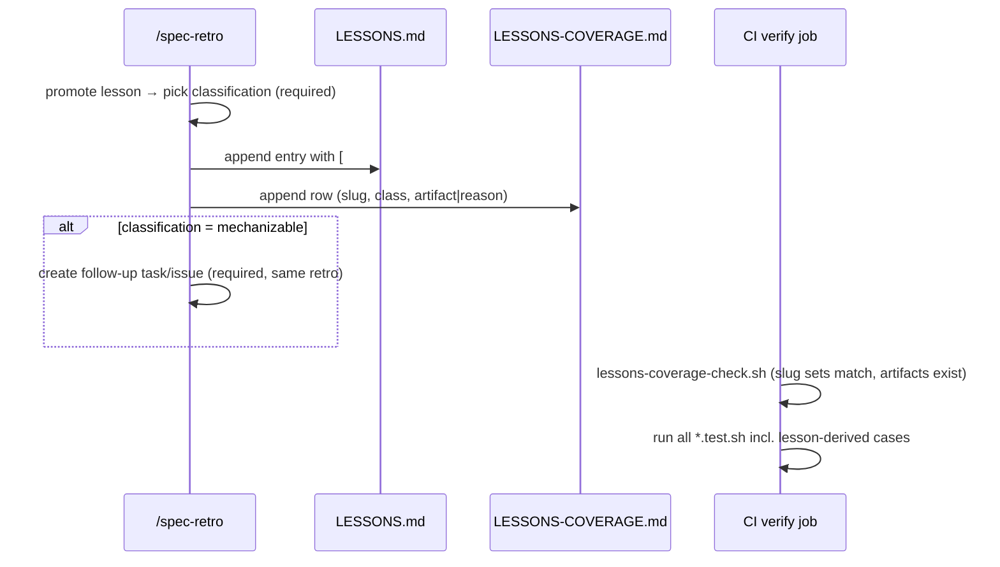

# Design: Lessons to Guard Tests (mechanize the lesson ledger)

> Status: approved 2026-07-11, amended 2026-07-11

## Architecture Overview

Four deliverables, no new runtime components:

- **`.ai/shared/LESSONS-COVERAGE.md`** — the versioned coverage table
  (REQ-1.1/1.2): one row per LESSONS.md entry, keyed by a stable slug.
- **Slug annotations in LESSONS.md** — each entry gains a leading
  `[#slug]` marker; wording untouched (REQ-2.4).
- **New/extended guard tests** in `.claude/hooks/tests/` for every
  `mechanizable` row (REQ-2.1), starting with the two documented
  reintroduction cases (REQ-4).
- **`scripts/lessons-coverage-check.sh`** — a tiny CI checker: every slug in
  LESSONS.md has a row in LESSONS-COVERAGE.md and vice versa, and every
  `mechanized` row's artifact file exists AND still carries the row's slug
  marker (Codex-P2 #3). Wired into the CI verify job next to the guard tests
  — this is what stops the table from rotting.
- **`/spec-retro` SKILL.md edit** — lesson-promotion step requires a
  classification and (for `mechanizable`) a follow-up work item (REQ-3).

```
LESSONS.md [#slug] entries ──┐
                             ├─ lessons-coverage-check.sh (CI) ── red on drift
LESSONS-COVERAGE.md rows ────┘
        │ mechanized rows point at →  .claude/hooks/tests/*.test.sh cases
        │                             (run by existing CI verify job)
        └ advisory rows carry the one-line reason
```

## Sequence Diagrams



## Data Models & Interfaces

`LESSONS-COVERAGE.md` row format:

```markdown
| slug | classification | enforcement / reason |
|---|---|---|
| verdict-null-not-rejected | mechanized | .claude/hooks/tests/lesson-tripwires.test.sh::verdict_null |
| guard-read-vs-write | mechanized | .claude/hooks/tests/hook-bypass-guard.test.sh::config_read_allowed |
| headless-pane-buffers | advisory | human workflow judgment — no executable surface |
```

Classification semantics (REQ-1.1):

- `mechanized` — an executable check exists; the third column is its artifact
  path (`file::case` convention, human-readable).
- `mechanizable` — check possible but not yet built; third column names the
  follow-up work item. lessons-coverage-check treats this as legal but counts
  it in output (visible backlog, not an error).
- `advisory` — one-line reason why no executable surface exists (REQ-1.3).

`scripts/lessons-coverage-check.sh`:

```
exit 0: slug sets identical in both files AND, for every mechanized row,
        the artifact file (part before ::) exists AND contains the row's
        slug string (the case-marker comment) — path-exists alone would let
        a deleted case rot silently inside a surviving test file
        (Codex-P2 #3)
exit 1: lists missing/orphan slugs, dangling paths, or files that no longer
        carry the slug marker
```

Test placement rule (REQ-2.3): a lesson about a bash guard extends that
guard's existing suite; a lesson about harness-script logic (workflow JS,
skills) gets a **tripwire** case in
`.claude/hooks/tests/lesson-tripwires.test.sh` — a grep-based structural
assertion that the required construct is present (e.g. review-fanout.js must
contain an explicit `unverified` partition distinct from `refuted`). Tripwires
are weaker than behavior tests and each carries a comment saying exactly that
plus the lesson slug (traceability both directions, REQ-2.2).

REQ-4 concrete cases:

- `verdict-null-not-rejected` (LESSONS.md:29/45): tripwire on
  `.claude/workflows/review-fanout.js` — asserts the file greps for a
  `!c.verdict` (or equivalent `unverified`) branch AND that branch is not
  merged into the refuted path; plus the inverse fixture: a stub result list
  with one undefined-verdict item must classify as unverified in a small
  node -e replica of the partition expression (REQ-4.1 — behavior where
  possible, tripwire where not).
- `guard-read-vs-write` (LESSONS.md:27/42): behavior pair in
  `hook-bypass-guard.test.sh`: `git config core.hooksPath` (read) → allowed;
  `git config core.hooksPath .githooks` (write) → blocked (REQ-4.2).

## Technology Decisions

- **Slug in-file, table out-of-file**: LESSONS.md stays the human ledger
  (lean, per its own header rule); machine state lives in the coverage table.
  Slugs are the join key — stable across renumbering (recorded edge case).
- **Tripwire tests acknowledged as second-class**: for logic outside bash
  reach, a structural grep beats nothing and reds CI the day someone deletes
  the guard construct; the comment discipline keeps them honest (claim
  discipline: never present a tripwire as a behavior proof).
- **Checker in CI verify job**: same floor as the guard suites — no new CI
  job, one more line in the existing loop's directory.
- **First audit is part of this feature**: the initial classification of all
  ~33 existing entries is a deliverable task, not a standing process — the
  standing process is REQ-3's retro step.

## Error Handling Strategy

| Failure | Behavior | REQ |
|---|---|---|
| slug in LESSONS.md missing from table (or orphan row) | lessons-coverage-check exit 1 → CI red | 1.1, 1.2 |
| mechanized row's artifact path gone | checker exit 1 → CI red | 2.2 |
| retro promotes without classification | retro checklist marks retro incomplete (skill text; procedural by design) | 3.3 |
| lesson pattern reintroduced | its guard/tripwire case fails → CI red | 2.1 |

## Testing Strategy

The feature's own tests (REQ-2.1/4) ARE the deliverable; meta-coverage:

| Case | Asserts | REQ |
|---|---|---|
| coverage-check on synced fixtures | exit 0 | 1.1 |
| fixture with orphan slug / missing row | exit 1, names it | 1.1, 1.2 |
| fixture with dangling artifact path | exit 1 | 2.2 |
| fixture whose test file exists but slug marker was removed | exit 1, names the slug | 2.2 |
| verdict-null tripwire vs a mutated review-fanout copy (partition removed) | fails | 4.1 |
| read-vs-write config pair | read passes, write blocks | 4.2 |

## Requirement Traceability

| Design element | REQ |
|---|---|
| LESSONS-COVERAGE.md table + slug key | REQ-1.1, 1.2 |
| advisory reason column | REQ-1.3 |
| per-lesson guard/tripwire cases | REQ-2.1 |
| file::case convention + slug comments | REQ-2.2 |
| tripwire placement rule for non-bash surfaces | REQ-2.3 |
| annotation-only LESSONS.md change | REQ-2.4 |
| retro skill classification step | REQ-3.1, 3.3 |
| follow-up work item requirement | REQ-3.2 |
| verdict-null case | REQ-4.1 |
| read-vs-write case | REQ-4.2 |
