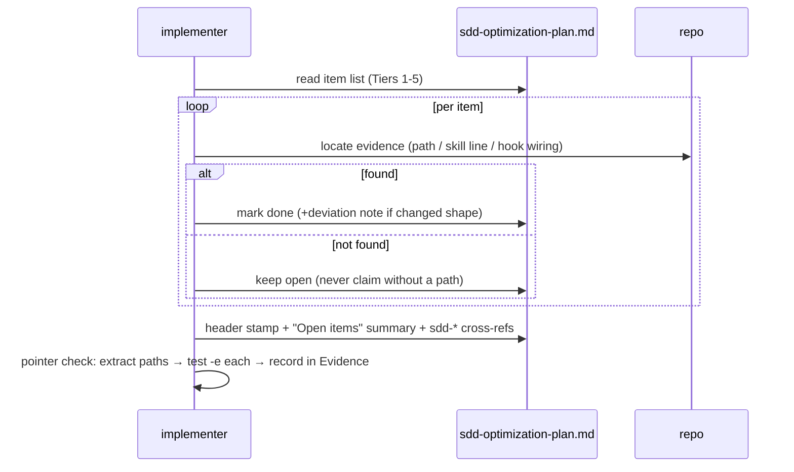

# Design: Optimization Plan Reconcile (make the plan match reality)

> Status: approved 2026-07-11

## Architecture Overview

Pure documentation change to `docs/sdd-optimization-plan.md` plus a one-shot
mechanical verification. No new committed tooling.

- **Status pass** over Tiers 1-4 and all 22 Tier-5 items: each gets its true
  state + an evidence pointer (REQ-1).
- **Header block**: `Last reconciled: <date>` + "Open items as of <date>"
  summary with cross-references to the sdd-* specs that now own several
  items (REQ-2).
- **One-shot pointer check**: a throwaway command (recorded in the task's
  Evidence block, not committed) extracts every evidence path from the edited
  doc and `test -e`'s it (REQ-3).

Known ground truth feeding the pass (verified earlier in this workstream):

| Item | Actual state | Evidence pointer |
|---|---|---|
| W3 approval headers | done | `> Status:` lines in `.ai/specs/*/requirements.md` |
| W4(ก) coverage rule / A5 spec-trace | done | `scripts/spec-trace.sh` + ci.yml spec-trace step + 5 SKILL.md references |
| W4(ข)+ST7 spec-state step 0 | done | `scripts/spec-state.sh` + spec-implement SKILL.md:24 |
| W5 spec-analyze repair loop | done | spec-analyze SKILL.md:31-36 |
| W7 spec-quick self-check | done | spec-quick SKILL.md:24-31 |
| Tier-5 PreCompact hook | done | `.claude/hooks/precompact-persist.sh` + settings.json PreCompact |
| Tier-5 spec-edit-guard | done | `.claude/hooks/spec-edit-guard.sh` → `.ai/bin/check-spec-edit.sh` |
| (remaining Tier-5) | audit per item during implementation | — |

## Sequence Diagrams



## Data Models & Interfaces

Status vocabulary written into the doc (REQ-1.1/1.2/1.4):

```
APPLIED <date> — evidence: <path[:line]>
APPLIED-WITH-DEVIATION <date> — evidence: <path>; deviation: <one line>
OPEN — [covered by .ai/specs/<sdd-*> | unowned]
SUPERSEDED — by <artifact/path>
```

Pointer-check one-shot (REQ-3.3; recorded, not committed):

```sh
grep -oE 'evidence: [^;)]*' docs/sdd-optimization-plan.md \
  | sed 's/evidence: //; s/:[0-9]*$//' \
  | while read -r p; do [ -e "$p" ] || echo "DANGLING: $p"; done
# Evidence block records: command + "DANGLING: none"
```

## Technology Decisions

- **In-place status edits, no restructuring** (recorded edge case): the diff
  must stay reviewable; the doc's Tier structure is the review map.
- **No committed checker**: the doc is reconciled rarely; a permanent CI
  check for a planning doc is ceremony (the sdd-spec-metrics feature is the
  ongoing measurement; this is a one-time truth-up). The one-shot command in
  Evidence satisfies mechanical verification without new surface.
- **Unproven = OPEN** (REQ-3.2): the reconcile inherits the platform's claim
  discipline — a status the pointer check cannot back stays open.

## Error Handling Strategy

| Case | Behavior | REQ |
|---|---|---|
| evidence cannot be located for a "believed done" item | stays OPEN | 3.2 |
| item folded into other work without clean artifact | SUPERSEDED + covering artifact | 1.2 (edge case) |
| implementation deviated from proposal | APPLIED-WITH-DEVIATION + one line | 1.4 |

## Testing Strategy

Doc-only feature — verification is the pointer check plus review:

| Case | How | REQ |
|---|---|---|
| every status has evidence or is OPEN/SUPERSEDED | pointer-check one-shot, output in Evidence block | 1.1, 3.1, 3.3 |
| all 22 Tier-5 items present in the swept list | count check against the original list during review | 1.2 |
| no proposal text deleted | `git diff` shows status/header edits only | 1.3 |
| header + open-items summary present | review | 2.1, 2.2 |
| sdd-* cross-references resolve | pointer check covers spec folder paths | 2.3 |

## Requirement Traceability

| Design element | REQ | Section |
|---|---|---|
| status vocabulary + per-item pass | REQ-1.1, 1.2, 1.4 | Data Models & Interfaces |
| status-only edits (no deletion/restructure) | REQ-1.3 | Data Models & Interfaces |
| `Last reconciled` stamp | REQ-2.1 | Data Models & Interfaces |
| Open-items summary | REQ-2.2 | Data Models & Interfaces |
| sdd-* spec cross-references | REQ-2.3 | Data Models & Interfaces |
| test -e pointer resolution | REQ-3.1 | Data Models & Interfaces |
| unproven-stays-open rule | REQ-3.2 | Data Models & Interfaces |
| one-shot check recorded in Evidence | REQ-3.3 | Data Models & Interfaces |
