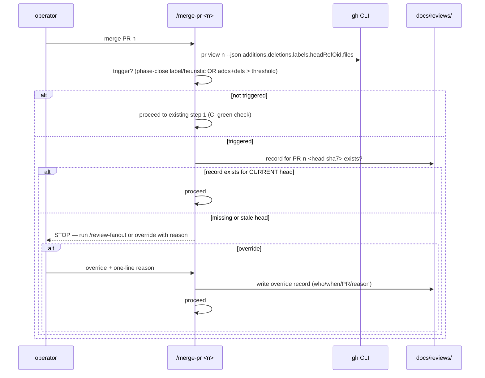

# Design: Pre-merge Review Standard (multi-angle review before phase-closing merges)

> Status: approved 2026-07-11, amended 2026-07-11

## Architecture Overview

Process feature: one config file, one record template, two skill edits, one
protocol section. No new executables — the "engine" is the merge-pr skill's
checklist, which is where merges already happen (REQ-2).

- **`.ai/policies/review-standard.json`** — `{ "diffThreshold": 400 }`
  (REQ-1.2; threshold changes are normal PRs, recorded edge case).
- **`docs/reviews/PR-<n>-<sha7>.md`** — one review record per reviewed head
  (REQ-3.1); template at `.ai/templates/review-record.md`.
- **`.ai/shared/REVIEW_PROTOCOL.md`** — gains the canonical
  "Pre-merge multi-angle review" section: trigger criteria, record format,
  override path (REQ-4.1).
- **`merge-pr` SKILL.md** — new step 1.5 implementing the confirm-gate
  (REQ-2.1..2.4), referencing the protocol section instead of restating it
  (REQ-4.2).
- **`review-fanout` workflow description** — output contract gains "write the
  record file" (REQ-3.2; the main loop writes it — workflow scripts have no
  filesystem access, so the record is written from the returned findings).

## Sequence Diagrams



## Data Models & Interfaces

Record file `docs/reviews/PR-<n>-<sha7>.md` (from template):

```markdown
# Review record — PR #<n> @ <head sha7>
- date: <YYYY-MM-DD>
- kind: review-fanout | override
- finders/verifiers: <counts>            (override: "—")
- override reason: <one line>            (review: "—")

| # | finding (file:line) | verdict | outcome |
|---|---|---|---|
| 1 | ... | CONFIRMED | fixed |
(none found → single row "no confirmed findings")
```

Trigger evaluation in merge-pr step 1.5 (REQ-1):

- **phase-close**: PR carries the `phase-close` label, OR the PR diff touches
  a `.ai/specs/*/tasks.md` and its post-merge content has zero `- [ ]` lines
  (heuristic executed by the model from `gh pr diff`; label is the explicit
  path).
- **size**: `additions + deletions > diffThreshold` from
  `.ai/policies/review-standard.json`.
- Neither → no gate (REQ-1.3).

Staleness rule (REQ-3.3): the record's `<sha7>` must equal the PR's current
`headRefOid` prefix; findings fixed after a review produce a new head → new
record (or an updated one renamed to the new sha) before merge proceeds.

Override path (REQ-2.3): merge-pr writes the record itself with
`kind: override` and commits it TO THE PR BRANCH before running the merge
command — the squash then carries the record in the merged head. No
follow-up-commit variant exists (Codex-P2 #2: a post-merge record would let
the merge land unaudited, bypassing REQ-2.3); if the record cannot be
committed to the PR branch, the override is not available.

## Technology Decisions

- **Skill-level gate, not a git hook or CI check**: the review is expensive
  and human-priced (REQ-2.4) — CI cannot decide to spend it, and a hard CI
  gate would invite `--insecure`-style workarounds. The confirm-gate lives
  where the human already confirms the merge, with the override recorded
  rather than forbidden (same philosophy as the platform's approval
  packages).
- **Record keyed by head sha, not PR number alone**: squash-merge makes PR
  titles unreliable (LESSONS.md:33); the head sha is the only honest "what
  was reviewed" anchor.
- **JSON policy file over inline constant**: the threshold is data shared by
  a skill and (later, if wanted) other tooling; `.ai/policies/` already
  exists in the repo's layout conventions.
- **Main loop writes the record from review-fanout's return value**: workflow
  scripts cannot touch the filesystem; the record contract belongs to the
  skill/workflow description layer.

## Error Handling Strategy

| Failure | Behavior | REQ |
|---|---|---|
| policy file missing/unparseable | treat threshold as default 400 and say so (gate still evaluates; never fail-open to "no gate") | 1.2 |
| `gh pr view` fails | merge-pr already stops on gh failures (existing step 1 behavior extends) | 2.1 |
| record exists but for stale head | treated as missing — stop + ask | 3.3 |
| override chosen but no reason given | not a valid override — record requires the reason field | 2.3 |

## Testing Strategy

Process feature → verification is procedural + one fixture check:

| Case | How | REQ |
|---|---|---|
| trigger math (threshold, phase-close heuristic) | worked examples in the protocol section; merge-pr step lists the exact gh fields — verified live on this feature's own PR (which exceeds nothing → fast path) and on the next phase-closing PR (recorded in Evidence) | 1.1, 1.2, 1.3 |
| stop-on-missing-record + override record shape | dry-run walkthrough on a synthetic PR in Evidence block | 2.1, 2.2, 2.3 |
| template completeness | `.ai/templates/review-record.md` fields cover REQ-3.1 list — checked in review | 3.1 |
| protocol canon + skill cross-reference | REVIEW_PROTOCOL section exists; merge-pr references it, no restatement | 4.1, 4.2 |

## Requirement Traceability

| Design element | REQ |
|---|---|
| phase-close label + all-[x] heuristic | REQ-1.1 |
| diffThreshold from review-standard.json | REQ-1.2 |
| no-trigger fast path | REQ-1.3 |
| merge-pr step 1.5 record check | REQ-2.1 |
| STOP + run-or-override prompt | REQ-2.2 |
| override record written before merge | REQ-2.3 |
| gate never auto-runs the review | REQ-2.4 |
| record file format + location | REQ-3.1 |
| review-fanout output contract addition | REQ-3.2 |
| head-sha staleness rule | REQ-3.3 |
| REVIEW_PROTOCOL canonical section | REQ-4.1 |
| skill references protocol | REQ-4.2 |
