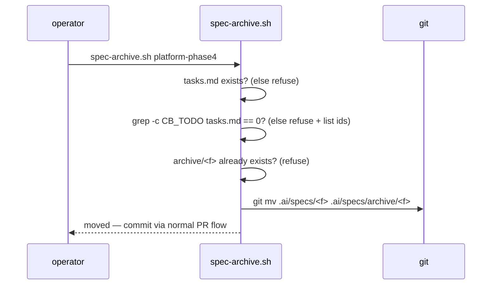
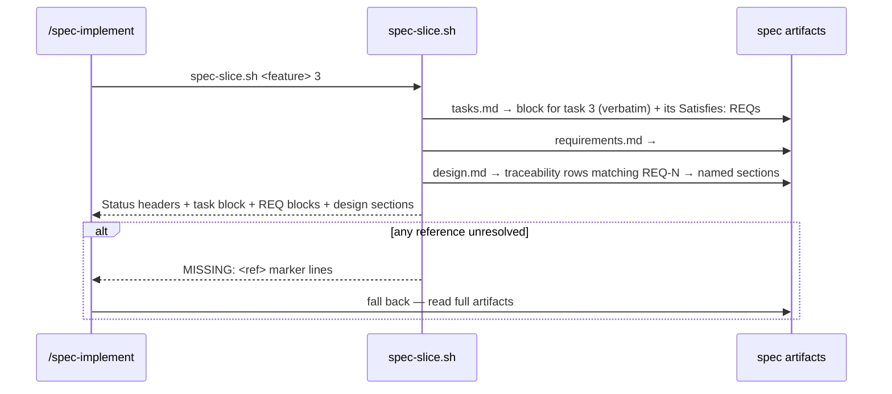

# Design: Spec Context Loading Discipline (archive + per-task slice)

> Status: approved 2026-07-11, amended 2026-07-11

## Architecture Overview

Three small mechanisms plus one skill edit; the enforcement stack is untouched
(REQ-4.4):

- **`scripts/spec-archive.sh <feature>`** — validated `git mv` of
  `.ai/specs/<feature>/` → `.ai/specs/archive/<feature>/`.
- **SessionStart hook** (in `.claude/settings.json`) — its `ls .ai/specs`
  gains `grep -v '^archive$'` so the "Active specs" line lists live work only.
- **`scripts/spec-slice.sh <feature> <task-id>`** — deterministic awk
  extraction of: the task block + its `Satisfies:` REQ blocks + the design
  sections mapped to those REQs via design.md's Requirement Traceability
  table.
- **`.claude/skills/spec-implement/SKILL.md` step 1** — slice-first loading
  with three fallback triggers (MISSING marker / assembly-final task /
  operator asks).
- **CI** (`.github/workflows/ci.yml` spec-trace step) — second glob
  `.ai/specs/archive/*/` so archived specs keep tracing (REQ-1.5).

```
active work                        closed feature
.ai/specs/<f>/  ── spec-archive ─► .ai/specs/archive/<f>/
   │                                    │
   ├─ SessionStart lists it             ├─ hidden from SessionStart
   ├─ spec-slice serves tasks           └─ CI spec-trace still covers it
   └─ CI spec-trace covers it
```

## Sequence Diagrams





## Data Models & Interfaces

`spec-archive.sh`:

```
usage: spec-archive.sh <feature>
exit 0 moved · exit 1 refusal (message lists unchecked ids / missing tasks.md)
```

Checks in order: feature dir exists under `.ai/specs/` (and NOT already under
`archive/`) → `tasks.md` present (REQ-1.4) → zero `- [ ]` checkbox lines
(REQ-1.2/1.3, pattern shared with the guard engine's `CB_TODO`) → destination
free → `git mv`. It never commits — the move rides the normal PR flow.

`spec-slice.sh` output contract (REQ-3.1, ordered):

```
== STATUS ==
requirements.md: > Status: approved 2026-07-11
design.md:       > Status: ...
tasks.md:        > Status: ...
== TASK 3 (tasks.md, verbatim) ==
- [ ] 3. <title>
      ... entire block to next checkbox/EOF ...
== REQ-2 (requirements.md) ==
## REQ-2: ... block to next ## ...
== DESIGN §Data Models & Interfaces (design.md) ==
... section block ...
== MISSING ==            (only when unresolved)
MISSING: REQ-9 (not found in requirements.md)
```

Resolution rules (all deterministic, REQ-3.2):

- Task block: from the checkbox line whose leading `N.` matches `<task-id>`
  to the next checkbox line or EOF (same region rule as the Evidence gate).
- REQ ids: every `REQ-<n>` token on the block's `Satisfies:` line(s);
  criterion-level ids (`REQ-1.2`) resolve to their parent `## REQ-1` block.
- Design sections: rows of the `## Requirement Traceability` table whose REQ
  column mentions any selected id; the row's design-element cell is matched
  against `## ` headings by literal substring; a row whose cell matches no
  heading resolves to `MISSING:` per REQ-3.4 (verified against all 8 design
  docs in this batch: every traceability cell is a free-text summary, never a
  heading name — a silent default here would make the full-read fallback
  unreachable for design sections in every real spec, not an edge case).
- Unknown task id → exit 1 + `available: 1..N` list from the checkbox scan
  (REQ-3.3). Unresolvable REQ/section → `MISSING:` marker, exit 0 (REQ-3.4 —
  the marker, not the exit code, drives the fallback).

SessionStart edit (REQ-2.1) — the jq command's `$s` becomes:

```sh
ls .ai/specs 2>/dev/null | grep -v '^archive$' | tr '\n' ' '
```

ci.yml spec-trace loop (REQ-1.5): `for dir in .ai/specs/*/ .ai/specs/archive/*/;`
— REQUIRES a CLI extension first (Codex-P2 #1): today `spec_trace.py main()`
accepts only `<feature>` and hardcodes `specs_dir = .ai/specs`, so a second
glob alone would look for archived features under the WRONG root and fail.
This spec adds an optional second argument `spec-trace.sh <feature>
[<specs-dir>]` (default `.ai/specs` — existing callers unchanged), threaded
through `main()` to the already-parameterized `run(feature, specs_dir)`; the
CI archive glob passes `.ai/specs/archive`.

skill edit (REQ-4.1/4.2/4.3) — step 1 of spec-implement becomes: run
`scripts/spec-slice.sh <feature> <id>` and read ONLY its output; fall back to
full artifacts when (a) output contains `MISSING:`, (b) the task is the final
or an assembly task, (c) the operator asked for full context. Steps 2-5 and
all gates unchanged.

## Technology Decisions

- **`git mv` over `mv`**: preserves history and stages the rename in one step;
  archive rides a normal PR (no new commit paths).
- **Slice = bash+awk, zero model judgment**: the slicer must be as
  deterministic as spec-trace; anything fuzzy goes through the MISSING →
  full-read fallback instead of guessing (REQ-3.2/3.4 — correctness outranks
  savings, per CLAUDE.md).
- **Traceability table as the design index**: it is the one artifact section
  whose format spec_trace.py already standardizes — reusing it avoids
  inventing a new cross-reference syntax.
- **Archive subdirectory over a status flag**: the SessionStart hook and every
  `ls`-based surface get the exclusion for free from the filesystem shape; a
  flag would need every consumer to parse frontmatter.
- **Existing closed phases**: the acceptance demo archives
  `platform-phase0..4` + the two bugfix specs (recorded open question:
  resolved as yes).

## Error Handling Strategy

| Failure | Behavior | REQ |
|---|---|---|
| unchecked tasks present | refuse, list ids | 1.2, 1.3 |
| tasks.md absent | refuse | 1.4 |
| destination exists | refuse (no overwrite) | 1.1 |
| unknown task id | exit 1 + available ids | 3.3 |
| REQ/section unresolved | MISSING: marker, still exit 0 | 3.4 |
| slice script itself absent/broken | skill instruction: fall back to full read (slice is an optimization, never a gate) | 4.2, 4.4 |

## Testing Strategy

New `.claude/hooks/tests/spec-slice.test.sh` with a fixture feature under
`mktemp -d` (mirrors CI's verify job pattern — REQ-5.2):

| Case | Asserts | REQ |
|---|---|---|
| archive with one `- [ ]` left | refuses, names the id | 1.2, 1.3, 5.1 |
| archive without tasks.md | refuses | 1.4 |
| archive clean feature | dir moved under archive/, `git status` shows rename | 1.1, 5.1 |
| spec-trace over archived fixture | still passes | 1.5, 5.1 |
| slice known task | output contains task block + its REQ block + mapped design section + Status headers | 3.1, 3.5 |
| slice unknown id | exit 1, lists available | 3.3 |
| slice with Satisfies: naming absent REQ | `MISSING:` present, exit 0 | 3.4 |
| slice where the traceability row's design-element cell matches no `## ` heading | `MISSING:` present for that design ref, exit 0 | 3.4 |
| SessionStart command with archive present | output lacks `archive` | 2.1, 2.2 |

## Requirement Traceability

| Design element | REQ |
|---|---|
| spec-archive.sh git mv flow | REQ-1.1 |
| CB_TODO zero-count check + id listing | REQ-1.2, 1.3 |
| tasks.md-present check | REQ-1.4 |
| ci.yml second glob + specs-dir arg | REQ-1.5 |
| SessionStart grep -v archive | REQ-2.1, 2.2 |
| slice output contract + resolution rules | REQ-3.1, 3.2, 3.5 |
| unknown-id exit path | REQ-3.3 |
| MISSING marker | REQ-3.4 |
| spec-implement step-1 rewrite + fallback triggers | REQ-4.1, 4.2, 4.3 |
| gates untouched (slice never enforces) | REQ-4.4 |
| spec-slice.test.sh cases | REQ-5.1, 5.2 |
