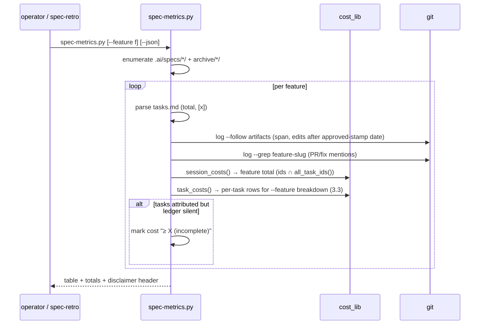

# Design: Spec Effectiveness Metrics (measure the process itself)

> Status: approved 2026-07-11

## Architecture Overview

One script + one skill edit:

- **`scripts/spec-metrics.py`** — offline aggregator importing
  `scripts/cost_lib.py` (REQ-1.3). Reads: `.ai/specs/*/` +
  `.ai/specs/archive/*/` (feature inventory), `tasks.md` (task/checkbox
  counts), git history (spans, post-approval edits, PR mentions), and the
  cost ledger via cost_lib (`task_costs`, `session_costs`, `all_task_ids`,
  `ledger_for`).
- **`/spec-retro` SKILL.md** — one added step running
  `spec-metrics.py --feature <active>` and pasting the table (REQ-4).

Data flow:

```
.ai/specs/**/tasks.md ─── task counts, [x] counts
git log --follow <artifacts> ─ span (first..last commit), post-approval edits
git log --grep "<feature>" ── PR mentions, rework fix-PR count
~/.claude/cost-sessions/*.json ─(cost_lib)─ session cost per task label
        │
        ▼
per-feature rows ── markdown table (default) / --json ── totals row
```

## Sequence Diagrams



## Data Models & Interfaces

CLI:

```
spec-metrics.py                 # all features, markdown table
spec-metrics.py --json          # same data, JSON array + totals object
spec-metrics.py --feature <f>   # one feature + per-task breakdown
exit 0 always on a produced report (missing data is REPORTED, not fatal)
exit 1 only on unusable repo state (no .ai/specs at all)
```

Row model (one per feature):

```json
{
  "feature": "platform-phase4",
  "archived": true,
  "tasks": {"total": 14, "done": 14},
  "cost_usd": {"value": 123.45, "complete": false},
  "sessions": 9,
  "span_days": 3.2,
  "pr_mentions": 4,
  "rework": {"fix_prs": 1, "post_approval_edits": 2}
}
```

- **Attribution** (REQ-1.1): per-feature `cost_usd` sums `cost_lib.session_costs()`
  rows whose `ids` intersect the feature's `all_task_ids(tasks_path)` — NOT
  `task_costs()` alone, which silently drops every batched (`/spec-implement
  all`) session (`task_of()` returns `None` whenever a session covers more
  than one task id, per cost_lib's own docstring, so `task_costs()` skips it
  entirely). `task_costs()` is still used for the `--feature` per-task
  breakdown (REQ-3.3); a task completed inside a batched session has no
  single-task cost to show there and renders `n/a` for that row — the
  feature-level total from `session_costs()` still counts it, so the feature
  is never reported as cheaper than the ledger shows. Ledger semantics
  (dedup, allocation) are cost_lib's — no reimplementation.
- **Incomplete marker** (REQ-2.1): a feature whose git history shows sessions
  (commits) in its span but whose ledger rows are missing/partial renders
  cost as `≥ $X (incomplete)`; JSON carries `"complete": false`. Ledger dir
  absent → cost columns `n/a`, rest of the row intact (REQ-2.3).
- **Post-approval edits** (REQ-1.2): parse the `> Status: approved <date>`
  stamp; count commits touching requirements.md/design.md dated after it
  (`git log --since=<date> --oneline -- <file>`), minus the stamp commit
  itself. Fix-PR count: commits whose subject matches
  `fix|bugfix` AND mentions the feature slug.
- **Header** (REQ-2.2): every table/JSON output leads with
  `estimates from local ledger — API-equivalent value, not an actual bill`
  plus the baseline-latency note (recorded edge case).

## Technology Decisions

- **Python, importing cost_lib directly** (REQ-1.3): cost_lib already owns
  ledger parsing, task-label extraction, and the "never recompute from
  transcripts" lesson (LESSONS.md:17); spec-metrics is a consumer, not a
  second implementation.
- **Bash test harness, not pytest** (REQ-5): CI's verify job runs every
  `.claude/hooks/tests/*.test.sh`; a `spec-metrics.test.sh` driving the
  script against fixture dirs (fake specs + fake ledger via `HOME` override)
  joins that floor with zero new CI plumbing. cost_lib reads the ledger under
  the user home — the fixture sets `HOME` to a temp dir, same technique the
  fail-closed console test used.
- **git-history heuristics labeled as such**: PR mentions and fix-PR counts
  are proxy signals; the script header documents the imprecision (recorded
  edge case) — claim discipline over false precision.
- **No trend storage**: the script recomputes from sources every run;
  retrospectives archive the rendered tables, which IS the history (YAGNI on
  a metrics database).

## Error Handling Strategy

| Failure | Behavior | REQ |
|---|---|---|
| ledger dir absent | cost columns `n/a`, report proceeds | 2.3 |
| ledger partial for a feature | `≥ X (incomplete)` marker | 2.1 |
| tasks.md missing in a feature dir | row with `tasks: n/a`, flagged — never skipped silently | 1.1 |
| approval stamp absent (draft spec) | post-approval-edit count `n/a` | 1.2 |
| git commands fail | exit 1 with the failing command named (unusable state) | 1.4 |
| script fails inside /spec-retro | retro proceeds, notes the failure (skill text) | 4.2 |

## Testing Strategy

`.claude/hooks/tests/spec-metrics.test.sh`, fixtures under `mktemp -d`
(fake `.ai/specs/` + fake `$HOME/.claude/cost-sessions/`):

| Case | Asserts | REQ |
|---|---|---|
| two features, complete ledger | correct counts, costs, totals row | 1.1, 3.2, 5.1 |
| feature with commits but no ledger rows | `incomplete` marker, not zero | 2.1, 5.1 |
| `HOME` without cost-sessions | cost `n/a`, other columns intact, exit 0 | 2.3 |
| `--json` | parses, `complete` flags present, disclaimer field present | 3.1, 2.2 |
| `--feature` with per-task breakdown | task rows match fixture ledger labels | 3.3 |
| post-approval edit fixture (commit after stamp) | rework count = 1 | 1.2 |
| offline check | script runs with network disabled (no imports beyond stdlib+cost_lib) | 1.4 |

## Requirement Traceability

| Design element | REQ | Section |
|---|---|---|
| feature enumeration incl. archive + row model | REQ-1.1 | Data Models & Interfaces |
| approval-stamp parse + post-approval commit count + fix-PR grep | REQ-1.2 | Data Models & Interfaces |
| cost_lib import (no second parser) | REQ-1.3 | Data Models & Interfaces |
| stdlib-only offline CLI, exit contract | REQ-1.4 | Data Models & Interfaces |
| incomplete marker path | REQ-2.1 | Data Models & Interfaces |
| disclaimer header | REQ-2.2 | Data Models & Interfaces |
| ledger-absent n/a path | REQ-2.3 | Data Models & Interfaces |
| markdown default + --json | REQ-3.1 | Data Models & Interfaces |
| totals row | REQ-3.2 | Data Models & Interfaces |
| --feature per-task breakdown | REQ-3.3 | Data Models & Interfaces |
| spec-retro step addition | REQ-4.1 | Data Models & Interfaces |
| non-blocking failure note in retro | REQ-4.2 | Data Models & Interfaces |
| spec-metrics.test.sh fixture cases | REQ-5.1, 5.2 | Testing Strategy |
