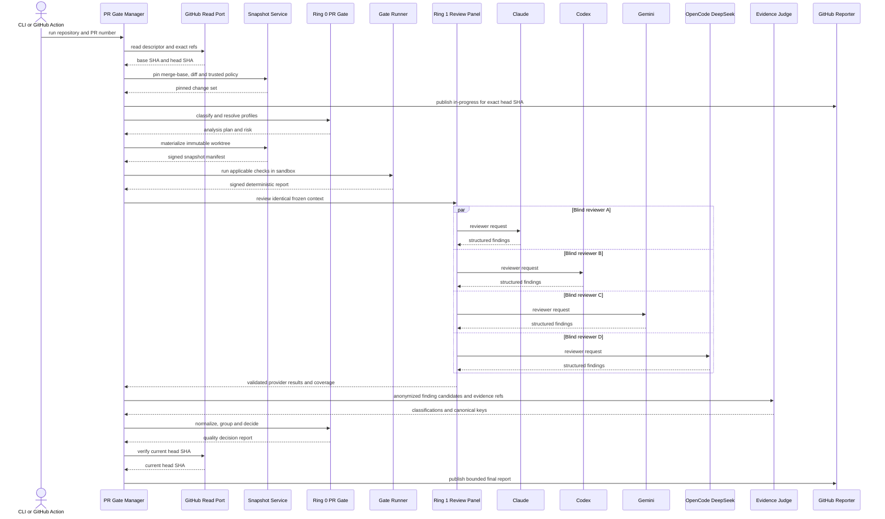
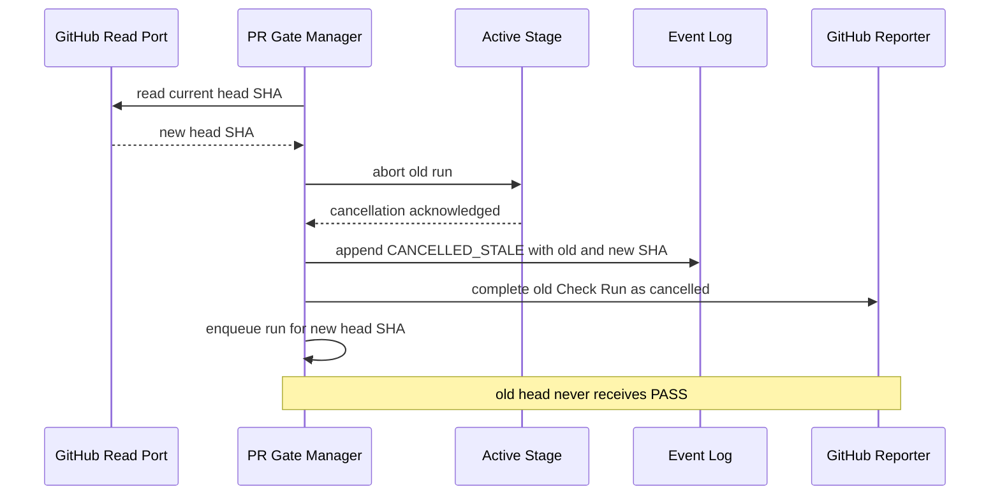

# Design: Universal PR Quality Gate

> Status: approved 2026-08-09, amended 2026-08-10

แบบออกแบบ Design-First สำหรับ Quality Gate ของ GitHub Pull Request ระดับ `module/interface-level` เป้าหมาย Phase 1 คือ vertical slice ตั้งแต่ Stage 0–5 บน Node.js/TypeScript, documentation/configuration และ OpenAPI โดยต่อยอด Ring 0/1/2 เดิม ไม่สร้าง platform ซ้ำอีกชุด

## Architecture Overview

### เป้าหมายและขอบเขต Phase 1

ระบบต้องรับ PR ที่ระบุชัด, ตรึง `base SHA`/`head SHA`, วิเคราะห์บน snapshot เดียว, รัน deterministic checks, ส่ง context เดียวกันให้ reviewer อิสระ 4 ราย, ตรวจหลักฐานด้วย Judge แล้วให้ Ring 0 ตัดสิน `PASS`, `PASS_WITH_WARNINGS`, `HUMAN_REVIEW_REQUIRED`, `FAIL` หรือ `INFRASTRUCTURE_FAILURE`

| อยู่ใน Phase 1 | เลื่อนไป phase ถัดไป |
|---|---|
| GitHub PR, Check Run และ Console | GitLab, Bitbucket และ provider อื่น |
| Node.js/TypeScript, docs/config และ OpenAPI | frontend/mobile/database/IaC detector เชิงลึก |
| Claude, Codex, Gemini CLI, OpenCode + DeepSeek | dynamic marketplace และ calibration-based weighting |
| repository policy จาก base SHA และ organization floor | visual policy editor และ fleet-wide policy service |
| self-hosted macOS, network/install default-deny | distributed worker pool และ multi-tenant control plane |
| manual human override พร้อม audit | automated learning จาก post-merge defects |

`review-fanout` เดิมคงเป็น manual fallback เท่านั้น Automated PR gate คือ enforcement path ใหม่ ทั้งสองทางไม่แชร์ state machine หรือผลตัดสิน

### หลักการออกแบบ

1. Ring 0 เป็นเจ้าของ state, evidence identity, consensus และ policy decision
2. Ring 1 เป็นเจ้าของ provider-neutral orchestration, blind fan-out และ Judge request
3. Ring 2 แปลเฉพาะ provider wire format ไม่มี policy หรือ merge authority
4. `console/backend` เป็น composition root และเจ้าของ GitHub/technology-specific I/O
5. ทุก stage อ้าง `SnapshotIdentity` เดียว ห้ามอ่าน mutable checkout ระหว่าง run
6. deterministic evidence มีอำนาจเหนือ AI opinion และ reviewer count ไม่ใช่การโหวตความจริง
7. provider unavailable ไม่เท่ากับ `no findings`
8. untrusted PR content ห้ามเปลี่ยน policy ที่ใช้ตัดสิน PR ของตัวเอง

### Dependency map

```text
GitHub / Console
        ↓
console/backend composition root
        ├──→ Ring 0 core contracts, evidence, state and policy
        └──→ Ring 1 AAL orchestration
                    └──→ Ring 2 provider adapters
```

Dependency direction คงเดิม: `core` ไม่ import `aal`, `adapters`, Fastify หรือ GitHub types; `aal` import ได้เฉพาะ vendor-neutral contracts; provider และ GitHub names อยู่ Ring 2 หรือ composition root

### Module map

| Ring / path | ความรับผิดชอบใหม่ | ของเดิมที่ reuse |
|---|---|---|
| `core/src/pr-gate/` | contracts, risk/profile merge, planned-check runner, finding validation, canonical grouping, coverage, policy decision, run transitions | frozen-tree, core command executor, evidence, event log, report integrity |
| `core/src/gates/` | คง task gate ladder เดิม และเปิดใช้ low-level primitives ที่ PR gate ต้อง reuse | sandbox, frozen-tree, command executor, report integrity |
| `aal/src/pr-review/` | สร้าง blind panel requests, enforce identical context, validate structured output, เรียก Judge แบบ anonymized | `AgentRequest`, registry, router, dispatcher, budgets |
| `aal/src/fusion/` | คง semantics เดิมสำหรับ manual fusion | automated gate ไม่เรียก `resolveReviews`; generic resolver ไม่มี evidence verdict/location contract |
| `adapters/src/` | เพิ่ม Gemini CLI และ OpenCode + DeepSeek adapters; reviewer role ต้อง reasoning-only | wire helpers, typed `AdapterError`, durable replay/conformance patterns |
| `console/backend/src/pr-gate/` | GitHub read/report adapters, snapshot materialization, Node/docs/OpenAPI analyzers, run manager, API/CLI composition | Fastify security guards, config loading, core/AAL/adapters wiring |
| `console/web/src/` | run list/detail, evidence summary, coverage, cost, decision, override UI | shell, auth และ presentation patterns เดิม |

ไม่เพิ่ม workspace package ใหม่ ไม่เพิ่ม database ใหม่ และไม่สร้าง `.pr-quality/` tree การตั้งค่า repository อยู่ใต้ `.ai/policies/`

### Stage pipeline

| Stage | เจ้าของ | Input | Durable output |
|---|---|---|---|
| Acquire | backend Git adapter | GitHub base/head refs | `PinnedChangeSet` จาก exact Git objects |
| 0 Classification | backend analyzers + Ring 0 planner | `PinnedChangeSet` และ SHA-bound source reader | `ChangeAnalysis`, `ImpactGraph`, `RiskAssessment`, profile plan |
| 1 Immutable Snapshot | backend snapshot service | base/head/merge-base และ trusted policy | signed `SnapshotManifest` พร้อม content hashes |
| 2 Deterministic Analysis | PR check runner บน core gate primitives | snapshot + applicable checks | signed `DeterministicReport` |
| 3 Blind AI Review | Ring 1 panel | byte-identical context manifest + reviewer schema | 4 independent `ReviewerResult` records |
| 4 Evidence Judge | Ring 1 Judge + Ring 0 validator | anonymized findings + snapshot evidence | validated `JudgedFinding` records |
| 5 Consensus and Policy | Ring 0 | checks, coverage, risk, judged findings, policy | `QualityDecisionReport` |

Acquire เป็น prerequisite ที่ไม่เปลี่ยนเลข stage ของสถาปัตยกรรมเป้าหมาย มัน fetch exact commits, resolve merge-base, hash diff และอ่าน trusted policy ก่อน Stage 0 โดยไม่ execute head code Stage 1 materialize detached worktree แล้ว attest classification, policy และ check plan จาก identifiers ชุดเดียวกัน

## Sequence Diagrams

### เส้นทางปกติ



Reviewer requests สร้างจาก immutable template เดียวและ `ContextBundle` digest เดียว ต่างกันเฉพาะ `requestId` กับ routing metadata ที่ไม่อยู่ใน model-visible context ไม่มี reviewer ใดเห็น output ของรายอื่น

Sequence นี้แสดง logical flow ของ direct CLI/Console สำหรับ GitHub Actions, Acquire/Stage 2 อยู่ unprivileged job ส่วน Stage 3–5/Reporter อยู่ trusted `workflow_run` job ตาม trust split ด้านล่าง

### Head SHA เปลี่ยนระหว่าง run



ตรวจ stale อย่างน้อยหลัง snapshot, ก่อน Stage 3, ก่อน Stage 5 และก่อน final report การเปลี่ยน SHA ส่ง `AbortSignal` ไป gates, dispatcher และ Judge

## Data Models & Interfaces

### Run identity และ snapshot

```ts
type RepositoryId = `${string}/${string}`;
type Sha256Ref = `sha256:${string}`;

interface PullRequestDescriptor {
  repository: RepositoryId;
  number: number;
  title: string;
  description: string;
  baseRef: string;
  baseSha: string;
  headSha: string;
  fromFork: boolean;
}

interface PinnedChangeSet {
  descriptor: PullRequestDescriptor;
  mergeBaseSha: string;
  diffRef: Sha256Ref;
  files: Array<{
    path: string;
    previousPath?: string;
    status: 'added' | 'modified' | 'deleted' | 'renamed';
  }>;
  trustedRepositoryPolicyRef: Sha256Ref;
}

interface SnapshotIdentity {
  repository: RepositoryId;
  pullRequest: number;
  baseSha: string;
  headSha: string;
  mergeBaseSha: string;
  diffRef: Sha256Ref;
  policyRef: Sha256Ref;
}

interface SnapshotManifest {
  schemaVersion: 1;
  identity: SnapshotIdentity;
  createdAt: string;
  worktreeRef: Sha256Ref;
  changedFiles: Array<{
    path: string;
    status: 'added' | 'modified' | 'deleted' | 'renamed';
    beforeRef?: Sha256Ref;
    afterRef?: Sha256Ref;
  }>;
  configRefs: Sha256Ref[];
  rulesRefs: Sha256Ref[];
  manifestRef: Sha256Ref;
}
```

`title`, `description`, diff, source, tests และ policy edits จาก head เป็น `UNTRUSTED DATA` Trusted repository policy อ่านจาก `baseSha`; organization floor มาจาก operator-owned path นอก snapshot

### Classification, impact และ profile plan

```ts
type ChangeCategory =
  | 'BUG_FIX' | 'FEATURE' | 'REFACTOR' | 'SECURITY' | 'PERFORMANCE'
  | 'DEPENDENCY' | 'DATABASE' | 'API' | 'FRONTEND' | 'MOBILE'
  | 'INFRASTRUCTURE' | 'CI_CD' | 'CONFIGURATION' | 'DOCUMENTATION'
  | 'TEST' | 'ARCHITECTURE' | 'MIGRATION';

type RiskLevel = 'LOW' | 'MEDIUM' | 'HIGH' | 'CRITICAL';
type AnalysisCoverage = 'FULL' | 'PARTIAL' | 'LIMITED';

interface ChangeAnalysis {
  technologies: string[];
  categories: ChangeCategory[];
  components: string[];
  publicContracts: string[];
  impactEdges: Array<{ from: string; to: string; reason: string }>;
  risk: { level: RiskLevel; reasons: string[] };
  coverage: AnalysisCoverage;
  omittedPaths: Array<{ path: string; reason: string }>;
}

interface DeterministicCheckSpec {
  id: string;
  command: string;
  cwd?: string;
  required: boolean;
  timeoutMs: number;
  network: 'none';
  install: false;
  profiles: string[];
  components: string[];
}

interface QualityProfile {
  id: string;
  activationReasons: string[];
  checks: DeterministicCheckSpec[];
  reviewDimensions: string[];
  riskFloor?: RiskLevel;
}

interface AnalysisPlan {
  snapshot: SnapshotIdentity;
  analysis: ChangeAnalysis;
  profiles: QualityProfile[];
  policyRef: Sha256Ref;
}

interface DeterministicReport {
  snapshot: SnapshotIdentity;
  checks: Array<{
    id: string;
    status: 'PASSED' | 'FAILED' | 'TIMED_OUT' | 'INFRASTRUCTURE_FAILURE';
    required: boolean;
    durationMs: number;
    evidenceRef: Sha256Ref;
  }>;
  reportRef: Sha256Ref;
}
```

Technology analyzers เป็น extension seam เดียวที่ composition root:

```ts
interface ChangeAnalyzer {
  readonly id: string;
  supports(input: Readonly<PinnedChangeSet>): boolean;
  analyze(
    input: Readonly<PinnedChangeSet>,
    source: PinnedSourceReader,
  ): Promise<Partial<ChangeAnalysis>>;
}

interface PinnedSourceReader {
  readText(side: 'base' | 'head', path: string, maxBytes: number): Promise<string | null>;
  listFiles(side: 'base' | 'head'): Promise<string[]>;
}
```

`PinnedSourceReader` resolve ทุก read ผ่าน SHA ใน `PinnedChangeSet` ไม่อ่าน working directory Phase 1 มี `node-typescript`, `docs-config` และ `openapi` analyzers เท่านั้น การ merge ผลเป็น deterministic: normalize, deduplicate, sort และยกระดับ risk เท่านั้น ห้าม analyzer ลด risk ที่ policy floor กำหนด

### Review contracts

```ts
type FindingSeverity = 'LOW' | 'MEDIUM' | 'HIGH' | 'CRITICAL';

interface ReviewerFinding {
  id: string;
  category: string;
  severity: FindingSeverity;
  title: string;
  finding: string;
  rootCause: string;
  evidence: Array<{
    path: string;
    startLine: number;
    endLine: number;
    excerptHash: Sha256Ref;
  }>;
  trigger: string;
  impact: string;
  suggestedFix: string;
  confidence: number;
}

interface ReviewerResult {
  requestId: string;
  adapterId: string;
  modelVersion: string;
  snapshot: SnapshotIdentity;
  status:
    | 'SUCCEEDED'
    | 'TIMED_OUT'
    | 'RATE_LIMITED'
    | 'AUTH_FAILED'
    | 'FAILED'
    | 'INVALID_RESPONSE'
    | 'CONTEXT_LIMITED'
    | 'UNAVAILABLE'
    | 'CANCELLED';
  findings: ReviewerFinding[];
  usage: { costUnits: number; rawRef?: Sha256Ref };
  transcriptRef: Sha256Ref | null;
}

type VerificationClass =
  | 'VERIFIED'
  | 'PARTIALLY_VERIFIED'
  | 'UNVERIFIED'
  | 'FALSE_POSITIVE';

interface JudgedFinding {
  canonicalFindingKey: string;
  sourceFindingIds: string[];
  classification: VerificationClass;
  severity: FindingSeverity;
  evidenceRefs: Sha256Ref[];
  rationaleRef: Sha256Ref;
}

interface AgentCallControl {
  signal: AbortSignal;
  timeoutMs: number;
}
```

Normalizer ต้องตรวจ schema, snapshot identity, path อยู่ใน manifest, line range, excerpt hash, severity และ `confidence` ช่วง `0..1` ก่อนส่ง Judge Reviewer `actionRequests` ต้องว่าง, `toolUseCount` ต้องเป็น `0`; response ที่ขอ write, command หรือ tool เป็น `INVALID_RESPONSE`

เพิ่ม optional control แบบ backward-compatible ให้ transport: `AdapterInterface.send(req, control?)` Dispatcher ส่ง `AbortSignal`/timeout ลงไปจริง Adapter ต้อง abort SDK request หรือ terminate child process ไม่ใช้ `Promise.race` ที่ปล่อยงานเบื้องหลังวิ่งต่อ เพิ่ม typed adapter errors `timeout`, `cancelled`, `context_limited` และ `unavailable`; retry ยังคุมที่ Ring 1

Judge เห็น provider labels แบบ `C0..C3` เท่านั้น รับ finding candidates พร้อม evidence refs และคืน `canonicalFindingKey` กับ classification Judge เป็น reasoning-only เช่นเดียวกับ reviewer: `actionRequests` ต้องว่างและ `toolUseCount` ต้องเป็น `0` Ring 0 ตรวจ key, evidence และ identity ซ้ำก่อน group การ deduplicate ใช้ canonical key ไม่ใช้ wording similarity และไม่แก้ semantics ของ `aal/src/fusion/resolve.ts`

### Provider coverage และ consensus

```ts
type ReviewerCoverage = 'FULL' | 'DEGRADED' | 'INSUFFICIENT' | 'INFRASTRUCTURE_FAILURE';

interface ConsensusInput {
  snapshot: SnapshotIdentity;
  deterministic: DeterministicReport;
  risk: RiskLevel;
  analysisCoverage: AnalysisCoverage;
  reviewerResults: ReviewerResult[];
  judgedFindings: JudgedFinding[];
  policyRef: Sha256Ref;
}

interface ConsensusSummary {
  reviewerCoverage: ReviewerCoverage;
  availableReviewers: number;
  findingsByClass: Record<VerificationClass, number>;
  uniqueDiscoveriesByReviewer: Record<string, number>;
  dissentRefs: Sha256Ref[];
}
```

Coverage mapping:

| Reviewer สำเร็จ | Coverage | ผลขั้นต่ำ |
|---:|---|---|
| 4 | `FULL` | ตัดสินตาม evidence/policy |
| 3 | `DEGRADED` | ผลดีที่สุด `PASS_WITH_WARNINGS` |
| 2 | `INSUFFICIENT` | อย่างน้อย `HUMAN_REVIEW_REQUIRED` |
| 0–1 | `INFRASTRUCTURE_FAILURE` | `INFRASTRUCTURE_FAILURE` เว้น deterministic blocker หรือ Judge-verified `HIGH`/`CRITICAL` ที่คง `FAIL` |

Finding จริงจาก reviewer เพียงรายเดียวบล็อกได้เมื่อ Judge ยืนยันและ policy ระบุ severity นั้น ไม่มี majority vote และความเงียบ 4/4 ไม่ลบ deterministic failure Analysis coverage `PARTIAL` จำกัดผลดีที่สุดเป็น `PASS_WITH_WARNINGS`; `LIMITED` ต้อง `HUMAN_REVIEW_REQUIRED` หรือเข้มกว่า

### State และ final decision

```ts
type PrGateRunState =
  | 'QUEUED' | 'ACQUIRING' | 'CLASSIFYING' | 'SNAPSHOT_ATTESTING' | 'CHECKING'
  | 'REVIEWING' | 'JUDGING' | 'DECIDING' | 'REPORTING'
  | 'AWAITING_HUMAN' | 'COMPLETED' | 'CANCELLED_STALE' | 'CANCELLED'
  | 'FAILED_INFRASTRUCTURE' | 'REPORTING_FAILED' | 'FAILED_INTERNAL';

type QualityDecision =
  | 'PASS'
  | 'PASS_WITH_WARNINGS'
  | 'HUMAN_REVIEW_REQUIRED'
  | 'FAIL'
  | 'INFRASTRUCTURE_FAILURE';

interface QualityDecisionReport {
  runId: string;
  snapshot: SnapshotIdentity;
  decision: QualityDecision;
  reasons: string[];
  profiles: string[];
  risk: RiskLevel;
  analysisCoverage: AnalysisCoverage;
  reviewerCoverage: ReviewerCoverage;
  deterministicReportRef: Sha256Ref;
  judgedFindingRefs: Sha256Ref[];
  consensusRef: Sha256Ref;
  policyRef: Sha256Ref;
  costUnits: number;
  durationMs: number;
  reportRef: Sha256Ref;
}

interface HumanOverride {
  overrideId: string;
  runId: string;
  actor: string;
  headSha: string;
  action: 'APPROVE' | 'REJECT';
  reason: string;
  findingIds: string[];
  createdAt: string;
}
```

Run state บอก lifecycle; `QualityDecision` บอก merge policy ห้ามใช้ `FAILED_INTERNAL` แทน quality `FAIL` Override เป็น append-only record แยกจาก original report; projection แสดงทั้ง original และ effective decision ห้ามแก้ทับหลักฐานเดิม

State transitions เป็น allowlist:

```text
QUEUED
→ ACQUIRING
→ CLASSIFYING
→ SNAPSHOT_ATTESTING
→ CHECKING
→ REVIEWING
→ JUDGING
→ DECIDING
→ REPORTING
→ COMPLETED
```

ถ้า decision เป็น `HUMAN_REVIEW_REQUIRED`, `REPORTING` ไป `AWAITING_HUMAN`; human decision ที่ valid จึงไป `REPORTING → COMPLETED` จาก active state ใดก็ไป `CANCELLED_STALE`, `CANCELLED`, `FAILED_INFRASTRUCTURE` หรือ `FAILED_INTERNAL` ได้ตาม typed cause Reporting transport fail ไป `REPORTING_FAILED` และ retry idempotently Publish `PASS` ได้หลัง verify current head เท่านั้น

เพิ่ม event names แบบ append-only ใน `core/src/types.ts`: `PR_GATE_STATE`, `PR_SOURCE_PINNED`, `PR_SNAPSHOT_ATTESTED`, `PR_CLASSIFIED`, `PR_CHECK_RESULT`, `PR_REVIEW_RESULT`, `PR_JUDGE_RESULT`, `PR_GATE_DECIDED`, `PR_HUMAN_DECISION`, `PR_GATE_REPORTED` และ `PR_RUN_CANCELLED` แต่ละ event เก็บ refs/hashes ไม่เก็บ source/transcript ตรง ๆ

### Boundary ports

สร้าง ports เฉพาะ trust/I/O boundaries ไม่สร้าง interface ให้ pure helper:

```ts
interface PullRequestReadPort {
  getPullRequest(repository: RepositoryId, number: number): Promise<PullRequestDescriptor>;
  getCurrentHead(repository: RepositoryId, number: number): Promise<string>;
}

interface GitObjectReadPort extends PinnedSourceReader {
  pin(descriptor: PullRequestDescriptor): Promise<PinnedChangeSet>;
}

interface SnapshotPort {
  materialize(
    changes: PinnedChangeSet,
    trustedPolicy: EffectivePolicy,
    signal: AbortSignal,
  ): Promise<SnapshotManifest>;
}

interface ReviewerPanelPort {
  review(plan: AnalysisPlan, contextRef: Sha256Ref, signal: AbortSignal): Promise<ReviewerResult[]>;
}

interface EvidenceJudgePort {
  judge(findingsRef: Sha256Ref, signal: AbortSignal): Promise<JudgedFinding[]>;
}

interface GitHubReportPort {
  start(descriptor: PullRequestDescriptor, runId: string): Promise<string>;
  cancel(checkRunId: string, reason: string): Promise<void>;
  complete(checkRunId: string, report: QualityDecisionReport): Promise<void>;
}

interface PrGateRunStore {
  append(runId: string, event: PrGateEvent): void;
  load(runId: string): PrGateProjection;
  findActive(repository: RepositoryId, pullRequest: number): PrGateProjection[];
}
```

`PrGateRunStore` เป็น adapter บางบน append-only SQLite event log เดิม Payload ใหญ่เก็บใน evidence blob store แล้ว event เก็บเฉพาะ refs

`GitHubReportPort` เป็น boundary เดียวที่ถือ GitHub write credential `PullRequestReadPort`/`GitObjectReadPort` ใช้ได้เพียง read credential สำหรับ private repository ส่วน snapshot, gates และ reviewersไม่มี GitHub credential Child process ทุกตัวรับ scrubbed environment

### Trigger และ Console API

Phase 1 มี entrypoints สองทางเข้าหา `PrGateManager.run()` เดียว:

- CLI `platform pr-gate run --repo <owner/name> --pr <number>` สำหรับ self-hosted GitHub Actions
- Console `POST /api/pr-quality/runs` สำหรับ operator บน loopback/protected host

GitHub Actions แยก trust boundary:

1. unprivileged `pull_request` workflow acquire snapshot และรัน deterministic checks โดยไม่มี provider/GitHub write secrets
2. trusted `workflow_run` job ดาวน์โหลด artifact ด้วย exact workflow run id, verify GitHub provenance, repository, event, PR, head SHA, schema และ deterministic report integrity แล้ว re-fetch read-only Git objects เพื่อคำนวณ source/policy hashes เทียบ manifest ก่อนรัน reviewers/Judge ลายเซ็นที่ artifact สร้างเองอย่างเดียวไม่ถือเป็น trust anchor Binding ใดไม่ผ่านต้องจบ `INFRASTRUCTURE_FAILURE` ก่อน child process เห็น provider หรือ reporter credential
3. reporter ใน trusted job เป็น component เดียวที่ถือ `checks: write`; ห้าม checkout หรือ execute fork head และไม่ส่ง token เข้า adapter child environment

same-repository PR ใช้ contract เดียวกัน Fork PR จึงรองรับได้โดย privileged job ประมวลผลเฉพาะ verified artifact ไม่ใช้ `pull_request_target` รัน untrusted code

API:

| Method | Path | หน้าที่ |
|---|---|---|
| `POST` | `/api/pr-quality/runs` | เริ่ม run จาก repository และ PR number |
| `GET` | `/api/pr-quality/runs` | list projection แบบ bounded |
| `GET` | `/api/pr-quality/runs/:id` | ดู stages, profiles, evidence refs, findings, coverage, cost และ decision |
| `POST` | `/api/pr-quality/runs/:id/cancel` | ยกเลิก run โดย operator |
| `POST` | `/api/pr-quality/runs/:id/override` | บันทึก human override ที่ผูก actor, reason และ exact head SHA |

Route register เมื่อ `PrGateManager` ถูก configure เท่านั้น และใช้ startup/host/auth guards เดิม Override ที่ head SHA ไม่ตรง current PR ต้อง reject

GitHub Check conclusion mapping:

| Gate result/state | Check conclusion |
|---|---|
| `PASS`, `PASS_WITH_WARNINGS` | `success` |
| `HUMAN_REVIEW_REQUIRED` | `action_required` |
| `FAIL`, `INFRASTRUCTURE_FAILURE` | `failure` |
| `CANCELLED_STALE`, `CANCELLED` | `cancelled` |

Human override ไม่แก้ original decision Actor และ timestamp มาจาก authenticated server context ไม่รับเป็น authority จาก request เมื่อ `APPROVE` valid, projection บันทึก effective `PASS` และ reporter update exact-head Check Run เป็น `success` พร้อม summary ที่ระบุ actor/reason/original report ref เมื่อ `REJECT`, projection บันทึก effective `FAIL` และ Check Run เป็น `failure` ทุก override ต้อง exact-current head และ idempotency key; replay key เดิมคืน record เดิมโดยไม่ append หรือ publish ซ้ำ

## Technology Decisions

| Decision | เลือก | เหตุผล |
|---|---|---|
| Packaging | เพิ่ม modules ใน `core`, `aal`, `adapters`, `console` เดิม | รักษา Ring boundaries และไม่สร้าง platform ซ้ำ |
| Language | Node.js 26 + strict TypeScript ตาม workspace | reuse types, tests, event log และ execution stack |
| State | SQLite append-only event log เดิม | recovery/audit มีแล้ว; payload ใหม่เป็น append-only event types |
| Evidence | content-addressed evidence store + Ed25519 metadata เดิม | reproducible และ tamper-evident โดยไม่สร้าง blob system ใหม่ |
| Git snapshot | detached immutable worktree จาก exact Git SHAs | ใช้ native Git; ไม่พึ่ง mutable checkout |
| GitHub API | built-in `fetch` หลัง `GitHubReportPort` พร้อม GitHub App installation token หรือ Actions `GITHUB_TOKEN` ที่มี `checks: write` | Checks write ต้องเป็น GitHub App authority; ไม่เพิ่ม dependency และไม่ใช้ PAT/OAuth แทน |
| Deterministic checks | เพิ่ม PR check runner ที่ reuse frozen-tree, core command executor, report integrity และ enforcing macOS sandbox | task gate ladder เดิมคง API; PR checks รองรับ profile plan โดยไม่แปลงเป็น task tiers ปลอม |
| Model transport | `AgentRequest`/`AdapterInterface` เดิม | provider-neutral budget, routing, replay และ conformance มีแล้ว |
| Reviewer prompt | เพิ่ม reviewer-specific branch ใน shared wire builder | role เดิมเป็น reasoning-only; ห้าม advertise write/tool actions |
| Config | organization floor + `.ai/policies/pr-quality-gate.json` จาก base SHA | reuse JSON/governance convention; repoเพิ่มความเข้มได้แต่ลด security floor ไม่ได้ |
| Schemas | `.ai/schemas/pr-review.schema.json`, `pr-judge.schema.json`, `pr-quality-result.schema.json` | durable contracts สำหรับ adapters, replay และ signed result |
| Profiles | data-driven profiles ใน policy เดียว Phase 1 | composable โดยไม่สร้าง directory scaffolding ก่อนจำเป็น |
| Dedup | Judge canonical key + Ring 0 evidence validation | รวม semantic duplicate โดยไม่พึ่ง wording heuristic |
| UI | ขยาย Console เดิม | operator surface/auth/host guards มีแล้ว |

### Effective policy merge

ลำดับ trust:

```text
hard security invariants
→ organization policy floor
→ repository policy at base SHA
→ detected profile activation
```

Repository policyเพิ่ม checks, ลด timeout ภายใน ceiling, เพิ่ม human approval หรือยกระดับ risk ได้ แต่ห้ามเปิด network/install, ลด required reviewer floor, ปิด secret scanning, ลด blocker severity หรือยอม stale PASS การแก้ policy ใน PR ถูกแสดงเป็น impact แต่มีผลตั้งแต่ run หลัง merge เท่านั้น

`pr-quality-gate.json` ต้องเข้า `POLICY_FILES` การสร้างหรือเปลี่ยนไฟล์จึงทำให้ governance preflight ปฏิเสธ run แรกจน operator อนุมัติ snapshot ใหม่ ไม่มี Console route แก้ policy นี้

### Reviewer และ Judge routing

- Panel route ไป adapter ids ที่ policy pin: `anthropic`, `codex`, `gemini`, `opencode-deepseek`
- ทุก adapter ต้องผ่าน conformance และประกาศ lineage ต่างกันตาม provider
- Provider timeout `10 minutes`; ไม่มี adapter-level retry AAL คุม retry budget และ idempotency
- Run deadline `30 minutes`; เกินแล้ว cancel remaining work และตัดสินตาม evidence/coverage ที่ได้
- Judge ใช้ request แยก, ไม่เห็น provider identity, deterministic checks มีสิทธิ์หักล้าง Judge
- Judge invalid/timeout ทำ critical/high ที่ยังไม่ตัดสินเป็น `HUMAN_REVIEW_REQUIRED`; deterministic blocker ยังคง `FAIL`
- Gemini/OpenCode ต้องใช้ checked-in deny-all tool configuration ร่วมกับ outer filesystem sandbox และ conformance probe ที่พิสูจน์ `toolUseCount === 0`; ถ้าพิสูจน์ไม่ได้ให้ slot เป็น `UNAVAILABLE`
- `review-fanout` manual fallback อาจช่วยมนุษย์ แต่ห้ามนับเป็น automated reviewer coverage หรือ mint signed gate result

## Error Handling Strategy

ทุก boundary คืน typed error และ append event ก่อนเปลี่ยน terminal state Raw stderr/transcript เก็บเป็น redacted evidence ref ไม่ใส่ GitHub summary ตรง ๆ

| Failure | การจัดการ | Decision floor |
|---|---|---|
| policy missing/malformed/unapproved | หยุดก่อน provider call และบันทึก governance evidence | `INFRASTRUCTURE_FAILURE` |
| PR/ref อ่านไม่ได้ | retry ตาม bounded transport policy แล้วจบ internal failure | `INFRASTRUCTURE_FAILURE` |
| snapshot hash/manifest mismatch | หยุดทันที, quarantine evidence | `INFRASTRUCTURE_FAILURE` |
| head SHA เปลี่ยน | abort old run, mark Check Run cancelled, enqueue new run | ไม่มี decision สำหรับ old head |
| sandbox เปิดไม่ได้ | fail closed; ห้าม unsandboxed fallback | `INFRASTRUCTURE_FAILURE` |
| build/test/security check fail | เก็บ signed evidence และทำ Stage 3 ต่อถ้ายังอยู่ใน deadline | `FAIL` |
| required check timeout | เก็บ timeout evidence และทำ Stage 3 ต่อถ้ายังอยู่ใน deadline | `FAIL` |
| reviewer timeout/unavailable | เก็บ provider status; ห้ามสร้าง empty-success result | ตาม coverage table |
| reviewer invalid JSON/action request | `INVALID_RESPONSE`, ไม่นับ available | ตาม coverage table |
| reviewer canary/tool violation | `INVALID_RESPONSE`, เก็บ redacted conformance evidence | ตาม coverage table |
| Judge invalid/timeout/tool violation | เก็บ unresolved findings และเหตุผล | อย่างน้อย `HUMAN_REVIEW_REQUIRED` |
| verified `HIGH`/`CRITICAL` | block โดยไม่สนับ majority | `FAIL` |
| partially verified/unverified `HIGH`/`CRITICAL` | ส่งคนตรวจ | `HUMAN_REVIEW_REQUIRED` |
| verified `MEDIUM`/`LOW` เท่านั้น | แสดง warning | `PASS_WITH_WARNINGS` |
| risk `CRITICAL` | require maintainer approval แม้ checks เขียว | `HUMAN_REVIEW_REQUIRED` |
| analysis coverage `PARTIAL` | เปิดเผย omitted paths | ผลดีที่สุด `PASS_WITH_WARNINGS` |
| analysis coverage `LIMITED` | เปิดเผย omitted paths และห้าม silent pass | อย่างน้อย `HUMAN_REVIEW_REQUIRED` |
| total deadline 30 นาที | abort active calls; deterministic blocker คงอำนาจ | `INFRASTRUCTURE_FAILURE` ถ้ายังไม่มี `FAIL` |
| reporter write fail | decision/evidence คง durable, retry bounded | state `REPORTING_FAILED`; ห้ามอ้าง published |

Error precedence:

1. stale SHA ยกเลิก run เดิม
2. deterministic blocker หรือ Judge-verified `HIGH`/`CRITICAL` คง `FAIL`
3. insufficient evidence/coverage ยกระดับเป็น human หรือ infrastructure
4. warning ใช้ได้เมื่อไม่มี blocker
5. `PASS` ต้องมี current SHA, acceptable coverage และไม่มี unresolved blocker

## Testing Strategy

ใช้ `node:test` และ fixtures เดิม ไม่เพิ่ม test framework Tests แยก pure policy จาก I/O adapters เพื่อให้ failure ชี้ root ได้

| Behavior | REQ | Test layer | Phase 1 fixture / assertion |
|---|---|---|---|
| classification/profile merge | REQ-2.1–REQ-2.9 | Ring 0 unit | Node backend, docs-only, OpenAPI break, monorepo partial |
| risk cannot be lowered | REQ-2.7, REQ-3.3 | Ring 0 table test | repo override ต่ำกว่า organization floor ถูก reject |
| policy governance | REQ-3.8–REQ-3.10 | Ring 0 integration | new/changed `pr-quality-gate.json` ต้อง approved snapshot ก่อน run |
| state allowlist | REQ-8.1–REQ-8.3 | Ring 0 unit | invalid transition และ stale transition |
| finding validation | REQ-6.1–REQ-6.3 | Ring 0 unit | path/line/hash/severity/confidence invalid |
| semantic grouping | REQ-6.7–REQ-6.8 | Ring 0 unit | wording ต่างแต่ canonical key เดียว; key ต่างห้าม merge |
| decision precedence | REQ-7.3–REQ-7.14 | Ring 0 table test | build fail, test fail, 1/4 verified high, partial/limited coverage, 4/4 false positive, critical risk |
| deterministic blocker authority | REQ-4.5–REQ-4.9 | backend integration | required check fail แล้ว blind panel ยังรันเมื่อ budget/deadline เหลือ; final decision คง `FAIL` |
| reviewer coverage | REQ-7.1–REQ-7.5 | Ring 0 table test | 4/4, 3/4, 2/4, 1/4, 0/4 |
| blind context | REQ-5.2–REQ-5.4 | AAL integration | 4 requests มี model-visible context digest เดียวและไม่มี peer output |
| reviewer read-only | REQ-5.5–REQ-5.8 | AAL + wire test | `actionRequests` ว่าง, `toolUseCount` เป็นศูนย์, promptไม่มี write/command/tool authority |
| Judge anonymity/failure | REQ-6.4–REQ-6.10 | AAL integration | เห็น `C0..C3`; zero tool/action; timeout/invalid JSON ไม่สร้าง PASS |
| Gemini/OpenCode transport | REQ-5.9–REQ-5.11, REQ-8.4 | adapter conformance | deny-all tools, typed errors, invalid response, child ถูก terminate เมื่อ abort |
| immutable snapshot | REQ-1.1–REQ-1.6 | backend integration | base/head/diff/config hashes stable หลัง checkout เปลี่ยน |
| stale SHA | REQ-1.7–REQ-1.9 | backend integration | old run cancelled, new head enqueued, old Check Run ไม่มี success |
| command isolation | REQ-4.1–REQ-4.3, REQ-11.2–REQ-11.3 | core/backend integration | network/install denied, env ไม่มี reporter token |
| prompt injection | REQ-3.2, REQ-11.1 | end-to-end fixture | instruction ใน PR/diff ไม่เปลี่ยน policy/action authority |
| fork PR trust split | REQ-9.1–REQ-9.8, REQ-9.14 | workflow/fake ports | privileged job verify provenance/report/source/policy/head และไม่ checkout/execute fork head |
| GitHub report binding | REQ-9.9–REQ-9.13 | fake port integration | start/final report ผูก exact head และ output bounded/redacted |
| Console API/UI | REQ-10 | backend/web tests | list/detail/cancel/override, host/auth guard, server-derived actor/time, current-head and idempotent override |

Acceptance corpus Phase 1 ต้องผ่านอย่างน้อย: backend PR, docs-only PR, API breaking change, stale SHA/new commit, provider timeout, invalid JSON, build failure, test failure, prompt injection, monorepo partial change และ human override

เพิ่ม table cases สำหรับ `3/4 → PASS_WITH_WARNINGS` สูงสุด (REQ-7.3), stack ที่ไม่มี analyzer (REQ-2.8), invalid cost/cap (REQ-8.11–REQ-8.12), finding location ผิด (REQ-6.2–REQ-6.3) และ replay ข้าม head SHA (REQ-8.10) Live four-provider calibration รัน manual บน self-hosted macOS ไม่อยู่ normal CI

ก่อน implementation task ใดปิด ต้องรัน focused tests, package typecheck และ repository CI gate ตาม `TESTING_PROTOCOL.md`

## Requirement Traceability

| Design element | REQ | Section |
|---|---|---|
| Immutable PR identity, snapshot binding และ stale handling | REQ-1 | Sequence Diagrams |
| Adaptive classification, impact, risk และ profile resolution | REQ-2 | Data Models & Interfaces |
| Trusted effective policy และ governance floor | REQ-3 | Technology Decisions |
| Sandboxed deterministic evidence และ blocker authority | REQ-4 | Error Handling Strategy |
| Four-slot blind reviewer orchestration | REQ-5 | Sequence Diagrams |
| Finding validation, anonymous Judge และ canonical grouping | REQ-6 | Data Models & Interfaces |
| Coverage matrix และ deterministic quality decision | REQ-7 | Error Handling Strategy |
| Lifecycle, cancellation, budget, evidence และ recovery | REQ-8 | Non-Functional Considerations |
| Fork-safe GitHub workflow และ Check Run reporting | REQ-9 | Technology Decisions |
| CLI, Console และ audited human override | REQ-10 | Data Models & Interfaces |
| Trust boundaries, observability, accessibility และ support ceiling | REQ-11 | Non-Functional Considerations |

## Non-Functional Considerations

### Security

- reviewer, Judge และ deterministic child process ไม่ได้รับ GitHub reporter credential
- environment allowlist แทนการส่ง `process.env` ทั้งก้อน
- shell commands มาจาก trusted base-SHA policyเท่านั้น, exact-match กับ effective plan และห้าม interpolate PR-controlled data
- network และ package installation default-deny; sandbox unavailable ต้อง fail closed
- PR text, source comments, generated files และ head policy เป็น untrusted context พร้อม prompt boundary ชัด
- logs, transcripts และ GitHub summary ต้อง redact token, path ส่วนตัว, PII และ provider secrets
- fork PR ใช้ policy/credentials จาก trusted control plane เท่านั้น ไม่ execute workflow code จาก head ด้วยสิทธิ์ reporter
- provider egress ออกจาก trusted orchestration process เท่านั้น Repo command sandbox ไม่มี egress route เดียวกัน

### Performance และ budget

- reviewers 4 รายรัน parallel
- timeout ต่อ provider `10 minutes`; deadline ต่อ run `30 minutes`
- เก็บ `duration`, token/raw usage ref และ normalized `costUnits` ต่อ provider/run
- context มี byte/token budget; เมื่อเกินต้องระบุ `PARTIAL`/`LIMITED` และ omitted paths ห้าม silent truncation
- deterministic checks เลือกตาม activated profiles ไม่รันทุก check ทุก repository

### Reliability และ audit

- ทุก external request ใช้ stable `requestId`; replay ห้าม double-publish หรือ double-charge ใน projection
- event log append-only; report และ evidence อ้าง content hash
- final decision reproducible จาก snapshot, policy, deterministic report, judged findings และ consensus refs
- Check Run summary เป็น projection ไม่ใช่ source of truth
- restart โหลด projection แล้ว resume stage ที่ idempotent หรือจบ typed terminal state
- adapter abort ต้องยืนยัน process/SDK request จบจริงก่อน run terminal; cancellation latency เป็น metric

### Observability

บันทึก repository/PR/SHA, technologies, categories, profiles, risk, coverage, stage duration, provider/model, provider status, usage, finding counts by verification class, unique discovery count, overrides และ final decision ไม่บันทึก secrets หรือ raw source ใน metrics

### Accessibility และ operations

- Console ใช้ semantic status text ร่วมกับสี, keyboard navigation และ accessible labels
- detail view แยก deterministic failures, AI findings, coverage และ override history
- operator เห็น stale/current SHA และ publication status ชัดก่อน override
- production release ต้องผ่าน staging, มี rollback plan, version tag และ changelog ตาม repository rules

## Deferred Scope

หลัง Phase 1 ค่อยเพิ่ม technology analyzers และ fixtures สำหรับ frontend, mobile, database migration, infrastructure, dependency update, security-sensitive repository และ large PR การเพิ่มเหล่านี้ใช้ `ChangeAnalyzer`/`QualityProfile` contracts เดิม ไม่เปลี่ยน Ring 0 policy authority

ยังไม่สร้าง distributed queue, webhook service, calibration weights, domain profile catalog, visual policy editor หรือ automated post-merge learning จนมี requirement และ operational evidence รองรับ
