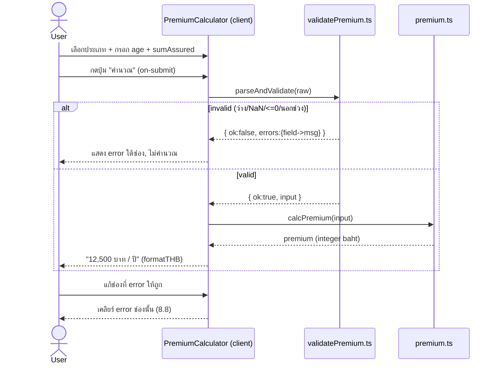

# Design: Insurance Homepage

> Status: approved 2026-06-04 (retroactively recorded 2026-06-13)

## Architecture Overview

Next.js 16 App Router, single route `/` (homepage). Server Components เป็นค่าเริ่มต้น;
`"use client"` เฉพาะ leaf ที่โต้ตอบ. `app/page.tsx` (server) ประกอบ section ตามลำดับ REQ-1.1
โดย import mock data จาก `app/data/` แล้วส่งเป็น props ลง component. Logic คำนวณ/validate
แยกล้วนใน `app/lib/` (testable, ไม่แตะ DOM).

### Component tree + render mode

| Component                                               | Mode   | Responsibility                                       | REQ        |
| ------------------------------------------------------- | ------ | ---------------------------------------------------- | ---------- |
| `app/layout.tsx`                                        | server | `<html lang="th">`, โหลดฟอนต์ไทย, metadata           | 15.1, 16.1 |
| `app/page.tsx`                                          | server | ประกอบ 12 section + `<main>` + skip link             | 1.1, 16.1  |
| `components/UtilityBar`                                 | client | toggle TH/EN + currency (UI-only), search (UI-only)  | 2.x        |
| `components/Header`                                     | client | sticky nav, hamburger, dropdown, anchors             | 3.x, 1.3   |
| `components/Hero`                                       | server | split L/R, 4 shortcut, campaign SVG banner           | 4.x        |
| `components/InsuranceTypes`                             | client | grid + search + category filter (AND)                | 5.x        |
| `components/Services`                                   | server | >=12 icon grid                                       | 6.x        |
| `components/Promotions`                                 | client | >=8 card grid + type filter                          | 7.x        |
| `components/PremiumCalculator`                          | client | form -> validate -> calc -> display                  | 8.x        |
| `components/Stats`                                      | server | >=4 trust numbers, พื้นกรมท่า                        | 9.1        |
| `components/Articles`                                   | server | >=8 article card grid                                | 10.1       |
| `components/Testimonials`                               | client | slider (prev/next/dots/swipe/keyboard)               | 11.x       |
| `components/AppDownload`                                | server | phone mockup (UI จำลอง) + store badges               | 12.x       |
| `components/Footer`                                     | server | directory หลายคอลัมน์                                | 13.x       |
| `components/ui/Container`                               | server | max-width 1280 + padding เท่ากัน                     | 1.2, 14.x  |
| `components/ui/{Card,Button,Badge,Icon,SectionHeading}` | server | primitive + state ครบ                                | 17.3       |
| `components/ui/SmartImage`                              | client | next/image + blur placeholder + onError SVG fallback | 15.3, 15.6 |

### lib (pure, no DOM)

| File                         | Export                                                      | REQ           |
| ---------------------------- | ----------------------------------------------------------- | ------------- |
| `app/lib/premium.ts`         | `BASE_RATES`, `AGE_FACTORS`, `RANGES`, `calcPremium(input)` | 8.2, 8.3, 8.9 |
| `app/lib/validatePremium.ts` | `parseAndValidate(raw)` -> typed input \| field errors      | 8.4-8.8       |
| `app/lib/format.ts`          | `formatTHB(n)` -> "12,500"                                  | 8.9           |

### data (mock + types)

`app/data/types.ts` (central types) + `navigation.ts`, `insuranceTypes.ts`, `services.ts`,
`promotions.ts`, `stats.ts`, `articles.ts`, `testimonials.ts`, `appFeatures.ts`.

---

## Sequence Diagrams

### Premium calculator (on-submit, REQ-8)



### Insurance type filter + search (AND, REQ-5)

```mermaid
sequenceDiagram
    actor U as User
    participant I as InsuranceTypes (client)
    U->>I: เลือกหมวด และ/หรือ พิมพ์คำค้น
    I->>I: items.filter(category match AND text match)
    alt มีผลลัพธ์
        I-->>U: render การ์ดที่ผ่าน (อัปเดตทันที)
    else ว่าง
        I-->>U: empty state สื่อความหมาย (5.5)
    end
```

---

## Data Models & Interfaces

```ts
// app/data/types.ts
export type InsuranceCategory =
  | "life"
  | "health"
  | "motor"
  | "travel"
  | "accident"
  | "home"
  | "cancer"
  | "savings";

export interface NavItem {
  label: string;
  anchor: `#${string}`;
}

export interface InsuranceType {
  id: string;
  category: InsuranceCategory;
  name: string; // ไทย
  tagline: string; // ป้ายกำกับ
  imageUrl: string; // picsum
  planHref: string; // ดูแผน (placeholder)
}

export interface ServiceItem {
  id: string;
  label: string;
  icon: IconName;
  href: string;
}

export interface Promotion {
  id: string;
  category: InsuranceCategory; // ใช้ filter (7.3)
  title: string;
  badge: string;
  priceCurrent: number; // THB
  priceOriginal: number; // > current -> ขีดฆ่า (7.4)
  expiresOn: string; // ISO date
  imageUrl: string;
  detailsHref: string;
  buyHref: string;
}

export interface Stat {
  id: string;
  value: string;
  label: string;
}
export interface Article {
  id: string;
  title: string;
  category: string;
  imageUrl: string;
  author: { name: string; avatarUrl: string };
  date: string;
}
export interface Testimonial {
  id: string;
  quote: string;
  name: string;
  avatarUrl: string;
  rating: number;
}
```

### Premium engine (LOCKED — REQ-8.3)

```ts
// app/lib/premium.ts
export interface PremiumInput {
  category: InsuranceCategory;
  age: number; // จำนวนเต็มปี
  sumAssured: number; // บาท
}

// เบี้ยต่อทุน 1,000 บาท ต่อปี (THB), แยกตามประเภท
export const BASE_RATES: Record<InsuranceCategory, number> = {
  life: 8.0,
  health: 12.0,
  motor: 18.0,
  travel: 3.0,
  accident: 5.0,
  home: 2.5,
  cancer: 6.0,
  savings: 10.0,
};

// ตัวคูณตามช่วงอายุ (อายุมาก = เสี่ยงมาก = เบี้ยสูง)
export const AGE_FACTORS: { max: number; factor: number }[] = [
  { max: 17, factor: 0.8 },
  { max: 30, factor: 1.0 },
  { max: 40, factor: 1.2 },
  { max: 50, factor: 1.5 },
  { max: 60, factor: 2.0 },
  { max: 70, factor: 2.8 },
  { max: 80, factor: 3.5 },
];

export const RANGES = {
  age: { min: 1, max: 80 },
  sumAssured: { min: 100_000, max: 50_000_000 },
} as const;

export function ageFactor(age: number): number {
  return AGE_FACTORS.find((b) => age <= b.max)!.factor; // age รับประกันว่า <=80 หลัง validate
}

/**
 * สูตร: premium = base_rate[type] x (sumAssured / 1000) x ageFactor(age)
 * ปัดเป็นจำนวนเต็มบาท. deterministic ล้วน.
 * ตัวอย่าง (acceptance #4): life, age 30, sum 1,000,000
 *   = 8.0 x (1_000_000/1000) x 1.0 = 8.0 x 1000 x 1.0 = 8,000 บาท/ปี
 */
export function calcPremium(input: PremiumInput): number {
  const rate = BASE_RATES[input.category];
  const perThousand = input.sumAssured / 1000;
  return Math.round(rate * perThousand * ageFactor(input.age));
}
```

### Validation (REQ-8.4-8.8)

```ts
// app/lib/validatePremium.ts
export interface RawInput {
  category: string;
  age: string;
  sumAssured: string;
}
export type FieldErrors = Partial<
  Record<"category" | "age" | "sumAssured", string>
>;
export type ValidationResult =
  | { ok: true; input: PremiumInput }
  | { ok: false; errors: FieldErrors };

// ลำดับเช็คต่อช่อง: ว่าง -> ไม่ใช่ตัวเลข(NaN) -> <=0 / นอกช่วง
// คืน errors ของ "ทุก" ช่องที่ผิดพร้อมกัน (ไม่หยุดที่ช่องแรก)
export function parseAndValidate(raw: RawInput): ValidationResult;
```

ข้อความ error (ไทย, สื่อความหมาย):

- ว่าง: "กรุณากรอกอายุ" / "กรุณากรอกทุนประกัน"
- NaN: "อายุต้องเป็นตัวเลข" / "ทุนประกันต้องเป็นตัวเลข"
- age นอกช่วง: "อายุต้องอยู่ระหว่าง 1-80 ปี"
- sumAssured นอกช่วง: "ทุนประกันต้องอยู่ระหว่าง 100,000-50,000,000 บาท"

---

## Technology Decisions

| เรื่อง                                    | เลือก                                                                     | เหตุผล                                                                                              |
| ----------------------------------------- | ------------------------------------------------------------------------- | --------------------------------------------------------------------------------------------------- |
| Framework                                 | Next.js 16 App Router + React 19                                          | tech.md บังคับ; RSC ลด client JS                                                                    |
| Styling                                   | Tailwind + tokens ใน `theme.extend`                                       | tech.md; token รวมศูนย์ (17.1)                                                                      |
| ฟอนต์ไทย                                  | `next/font/google` (IBM Plex Sans Thai, w 400/500/600/700)                | self-host ตอน build -> runtime ไม่ง้อ net (15.1). ตั้งเป็น `--font-sans` -> `theme.fontFamily.sans` |
| ฟอนต์ fallback ถ้า build offline          | self-host `@font-face` (.woff2 ใน `app/fonts/`)                           | กัน build พังเมื่อไม่มีเน็ต (edge case). ใช้เฉพาะเมื่อ `next/font/google` fetch ไม่ได้              |
| รูปการ์ด                                  | `next/image` + picsum.photos (`images.remotePatterns`)                    | รูปจริง (15.x); optimize อัตโนมัติ                                                                  |
| placeholder ระหว่างโหลด                   | `SmartImage` ครอบ next/image, `placeholder="blur"` + blurDataURL gradient | กล่องไม่ว่างตอนโหลด (15.6)                                                                          |
| รูปโหลดไม่ได้ (offline/404)               | `SmartImage` จับ `onError` -> render gradient+icon SVG fallback           | ไม่ broken / ไม่กล่องว่าง (15.3)                                                                    |
| ไอคอน / hero / phone mockup / store badge | inline SVG (มีรายละเอียด)                                                 | tech.md ห้าม icon font/กล่องว่าง (15.2)                                                             |
| calc trigger                              | on-submit                                                                 | REQ-8.2 lock; test ตรงไปตรงมา                                                                       |
| state interaction                         | React `useState` ใน client leaf                                           | ไม่ต้องใช้ state lib                                                                                |
| test                                      | vitest (unit, lib ล้วน)                                                   | pure-logic-first (lessons); ไม่เพิ่ม dep เกิน                                                       |

### Design tokens (LOCKED hex — REQ-17.1)

```ts
// tailwind.config.ts -> theme.extend.colors
colors: {
  primary:      { DEFAULT: '#13266B', dark: '#0E1C50', light: '#24398A' },
  accent:       { DEFAULT: '#FDB913', dark: '#E0A500' },
  bg:           '#F5F7FB',
  surface:      '#FFFFFF',
  text:         { DEFAULT: '#1A2238', muted: '#5B6479' },
  border:       '#E2E6EF',
}
// radius: sm 6 / md 10 / lg 16 / xl 24 (px) | shadow: card, cardHover, banner
// spacing ใช้ scale Tailwind ปกติ (4/8/12/16/24/32/48/64)
// fontFamily.sans = ['var(--font-sans)', 'sans-serif']
```

semantic utility ใช้ `bg-primary text-surface`, `bg-accent text-primary-dark`, `text-text-muted`,
`border-border` ฯลฯ. ห้าม hex ดิบในคอมโพเนนต์ (17.2). กรมท่าเป็นพื้น section เด่น, เหลืองทองเป็น
ปุ่มหลัก/ป้ายราคา (17.4).

### Typographic scale (REQ-15.4)

| token   | size / line-height / weight |
| ------- | --------------------------- |
| h1      | 2.5-3rem / 1.2 / 700        |
| h2      | 2rem / 1.25 / 700           |
| h3      | 1.25rem / 1.3 / 600         |
| body    | 1rem / 1.6 / 400            |
| caption | 0.875rem / 1.5 / 400        |

---

## Error Handling Strategy

| กรณี                               | จัดการ                                                     | REQ  |
| ---------------------------------- | ---------------------------------------------------------- | ---- |
| age/sumAssured ว่าง                | `parseAndValidate` คืน field error "กรุณากรอก..." ไม่คำนวณ | 8.4  |
| age <=0 หรือ >80                   | field error ช่วง 1-80                                      | 8.5  |
| sumAssured <=0 หรือ นอกช่วง        | field error ช่วง 100,000-50,000,000                        | 8.6  |
| input ไม่ใช่ตัวเลข (NaN)           | ถือ invalid, error "ต้องเป็นตัวเลข"                        | 8.7  |
| แก้ช่อง error ให้ถูก               | re-validate ช่องนั้น on-change -> เคลียร์ error            | 8.8  |
| รูป remote โหลดไม่ได้              | SmartImage onError -> SVG fallback                         | 15.3 |
| รูป remote กำลังโหลด               | blur placeholder                                           | 15.6 |
| ฟอนต์ google fetch ไม่ได้ตอน build | fallback `@font-face` self-host                            | 15.1 |
| filter/search ไม่เจอผล             | empty state สื่อความหมาย                                   | 5.5  |
| prefers-reduced-motion             | ปิด slider auto + transition ตกแต่ง (CSS media)            | 16.5 |

ไม่มี error handling สำหรับ scenario ที่เป็นไปไม่ได้ (ไม่มี backend/network call นอกจากรูป).

---

## Testing Strategy

Pure-logic-first: unit test `lib/` ให้เขียวก่อนแตะ UI (lessons). vitest เท่านั้น
(ไม่เพิ่ม dep). Interaction/visual = browser acceptance manual (prod build, ตาม memory).

### Unit (vitest) — `app/lib/`

| Test                                      | ยืนยัน                                      | REQ        |
| ----------------------------------------- | ------------------------------------------- | ---------- |
| `calcPremium` ตัวอย่าง acceptance #4      | life/30/1,000,000 -> 8,000                  | 8.3, acc#4 |
| `calcPremium` หลายประเภท×ช่วงอายุ         | ตรงสูตร base×(sum/1000)×factor, ปัดเศษ      | 8.3        |
| `ageFactor` ขอบ band                      | 17->0.8, 18->1.0, 30->1.0, 31->1.2, 80->3.5 | 8.3        |
| `calcPremium` deterministic               | input เดิม -> ผลเดิม                        | 8.3        |
| `parseAndValidate` ว่าง                   | error ทั้ง age+sumAssured                   | 8.4        |
| `parseAndValidate` NaN                    | error "ต้องเป็นตัวเลข"                      | 8.7        |
| `parseAndValidate` age 0 / 81 / -5        | error ช่วง                                  | 8.5        |
| `parseAndValidate` sum 0 / 99,999 / 5e7+1 | error ช่วง                                  | 8.6        |
| `parseAndValidate` valid                  | ok:true + typed input                       | 8.2        |
| `formatTHB`                               | 8000->"8,000", 12500->"12,500"              | 8.9        |

property-based (optional, `/spec-pbt` ภายหลัง): premium monotonic เพิ่มตาม sumAssured และ age;
ผล >=0; valid input ไม่เคย throw.

### Browser acceptance (manual, prod build 375/768/1440)

map acceptance checklist #1-11 -> REQ-1,2,3,5,7,8,11,12,15,16,14. ตรวจ: ครบ section, hamburger,
calc+validate, ตัวกรอง, slider, phone mockup UI, alt/keyboard, ฟอนต์โหลดจริง, no overflow, no กล่องว่าง.

---

## Requirement Traceability

| Design element                                                          | REQ       |
| ----------------------------------------------------------------------- | --------- |
| `page.tsx` ลำดับ section + Container                                    | 1.1, 1.2  |
| `navigation.ts` + Header anchors mapping                                | 1.3, 3.1  |
| `UtilityBar` (client) toggle/search/currency UI-only                    | 2.1-2.5   |
| `Header` (client) sticky/hamburger/dropdown                             | 3.2-3.5   |
| `Hero` split + 4 shortcut + SVG banner                                  | 4.1-4.5   |
| `InsuranceTypes` (client) grid+search+filter AND+empty                  | 5.1-5.6   |
| `Services` >=12 SVG icon grid                                           | 6.1-6.3   |
| `Promotions` (client) >=8 card+filter+strikethrough                     | 7.1-7.4   |
| `PremiumCalculator` + `premium.ts` + `validatePremium.ts` + `format.ts` | 8.1-8.9   |
| `Stats` >=4 พื้นกรมท่า                                                  | 9.1       |
| `Articles` >=8 + avatar                                                 | 10.1      |
| `Testimonials` (client) slider                                          | 11.1-11.4 |
| `AppDownload` phone mockup SVG + store badge                            | 12.1-12.2 |
| `Footer` directory + ยุบมือถือ                                          | 13.1-13.2 |
| Tailwind breakpoints + grid cols + Container                            | 14.1-14.5 |
| `next/font/google` + SmartImage + inline SVG + type scale               | 15.1-15.6 |
| semantic HTML + alt/aria + focus ring + contrast + reduced-motion       | 16.1-16.5 |
| `tailwind.config.ts` tokens hex + ui primitives state                   | 17.1-17.4 |
