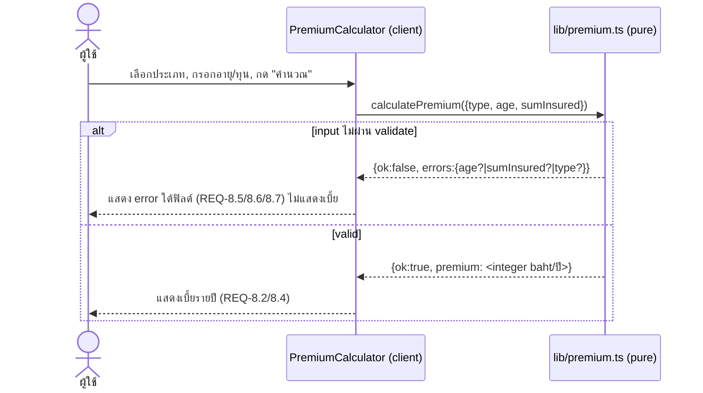
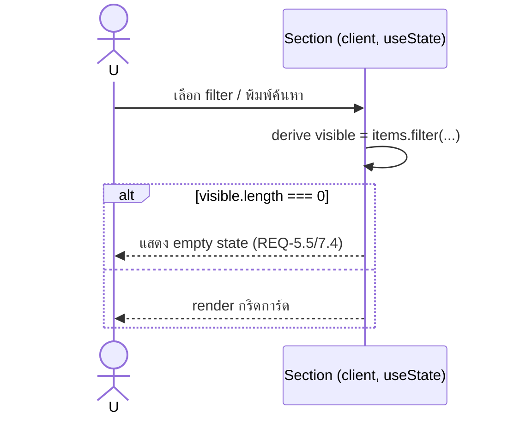
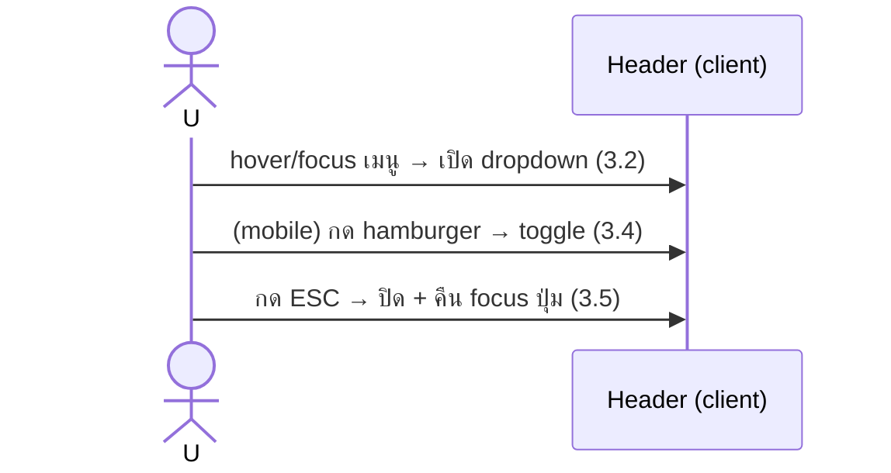

# Design: Insurance Homepage

อ้างอิง: `requirements.md` (REQ-1..17), `clarifications.md`, `@.claude/rules/tech.md`, `@.claude/rules/structure.md`.

## Architecture Overview

Next.js 16 App Router, single route `/`. หน้าเป็น **Server Component** ที่ compose section
จาก mock data; เฉพาะ section ที่โต้ตอบเป็น **Client Component** (`"use client"`).

```
app/
  layout.tsx              # Server — โหลดฟอนต์ไทย (next/font/google), <html lang="th">, metadata
  page.tsx                # Server — import mock data, render section 1..13 ตามลำดับ REQ-1.1
  globals.css             # @tailwind + keyframes เท่านั้น
  components/
    ui/
      Container.tsx        # Server — max-w 1200–1280 + padding (REQ-1.2)
      Button.tsx          # Server — variants: primary(accent)/secondary/ghost, states (REQ-15.3)
      Card.tsx            # Server — shell การ์ด เงา/รัศมีสม่ำเสมอ (REQ-15.4)
      Badge.tsx           # Server — ป้ายหมวด
      Icon.tsx            # Server — registry inline SVG (REQ-14.5) by name
      SmartImage.tsx      # Client — next/image + onError → SVG placeholder (REQ-14.6/14.7)
    UtilityBar.tsx        # Client — toggle ภาษา/สกุลเงิน (REQ-2)
    Header.tsx            # Client — sticky + dropdown + hamburger + ESC (REQ-3)
    Hero.tsx              # Server — shell; ปุ่ม/ลิงก์ static (REQ-4)
    InsuranceTypes.tsx    # Client — search + filter + empty state (REQ-5)
    Services.tsx          # Server — grid ไอคอน ≥12 (REQ-6)
    Promotions.tsx        # Client — filter + currency selector + empty state (REQ-7)
    PremiumCalculator.tsx # Client — form + เรียก lib/premium (REQ-8)
    Stats.tsx             # Server (REQ-9)
    Articles.tsx          # Server — grid ≥8 (REQ-10)
    Testimonials.tsx      # Client — slider (REQ-11/16.5)
    AppDownload.tsx       # Server — phone mockup UI จำลอง (REQ-12)
    Footer.tsx            # Server — directory หลายคอลัมน์ (REQ-13)
  data/                   # mock + types (REQ-17.2 strict)
    types.ts
    insuranceTypes.ts
    services.ts
    promotions.ts
    articles.ts
    testimonials.ts
    stats.ts
  lib/
    premium.ts            # สูตร+validate (REQ-8.8) — pure, testable
    premium.test.ts       # unit/property (acceptance #4/#5)
tailwind.config.ts        # design tokens (REQ-15.1/15.2)
next.config.ts            # images.remotePatterns: picsum.photos (REQ-17.3)
```

**หลักการแบ่ง client/server:** default Server; `"use client"` เฉพาะ component ที่มี state/event
(UtilityBar, Header, InsuranceTypes, Promotions, PremiumCalculator, Testimonials, SmartImage).
Static section ที่มีแค่ลิงก์ (Hero, Services, Stats, Articles, AppDownload, Footer) เป็น Server.

## Sequence Diagrams

### คำนวณเบี้ย (REQ-8)



### filter/search กริด (REQ-5/7)



### เมนู (REQ-3)



## Data Models & Interfaces

```ts
// data/types.ts
export type InsuranceTypeId =
  | "life"
  | "health"
  | "motor"
  | "travel"
  | "accident"
  | "home"
  | "cancer"
  | "savings";

export interface InsuranceType {
  id: InsuranceTypeId;
  name: string; // ไทย
  tagline: string; // ป้ายกำกับ
  imageId: number; // seed สำหรับ picsum
  href: string; // placeholder
}

export interface Service {
  id: string;
  label: string;
  icon: IconName;
  href: string;
}

export interface Promotion {
  id: string;
  title: string;
  category: InsuranceTypeId; // ใช้กรอง (REQ-7.3)
  imageId: number;
  price: number; // เบี้ยปัจจุบัน (บาท)
  originalPrice: number; // ราคาเดิม ขีดฆ่า (REQ-7.1)
  expiresOn: string; // ISO date string (ไม่ใช้ Date.now ใน build)
  href: string;
}

export interface Article {
  id: string;
  title: string;
  category: string;
  imageId: number;
  author: { name: string; avatarId: number };
  date: string;
}

export interface Testimonial {
  id: string;
  name: string;
  role: string;
  quote: string;
  avatarId: number;
  rating: number;
}
export interface Stat {
  id: string;
  label: string;
  value: string;
}

// lib/premium.ts
export interface PremiumInput {
  type: InsuranceTypeId | "";
  age: number | null;
  sumInsured: number | null;
}
export type PremiumResult =
  | { ok: true; premium: number } // บาท/ปี จำนวนเต็ม
  | {
      ok: false;
      errors: Partial<Record<"type" | "age" | "sumInsured", string>>;
    };
```

### สูตรคำนวณเบี้ย (REQ-8.3/8.4) — deterministic

```
premium = Math.round( sumInsured × baseRate[type] × ageFactor(age) )   // บาท/ปี
```

- **ageFactor(age)** piecewise (รวมขอบ valid 18–70):
  - 18–30 → 1.0
  - 31–45 → 1.3
  - 46–60 → 1.8
  - 61–70 → 2.5
- **baseRate[type]** (สัดส่วนของทุนต่อปี):
  | type | baseRate | type | baseRate |
  |------|----------|------|----------|
  | life | 0.012 | home | 0.0015 |
  | health | 0.018 | cancer | 0.010 |
  | motor | 0.025 | savings | 0.030 |
  | travel | 0.004 | accident | 0.006 |

**ตัวอย่างยืนยัน (acceptance #4):** type=life, age=30, sum=1,000,000
→ 1,000,000 × 0.012 × 1.0 = **12,000 บาท/ปี**.
(health, age 46, sum 500,000 → 500,000 × 0.018 × 1.8 = 16,200)

### validate (REQ-8.5/8.6/8.7) — ลำดับตรวจใน calculatePremium

1. `type === ''` → errors.type
2. `age` null/NaN/ไม่ใช่จำนวนเต็ม/< 18/> 70 → errors.age (ขอบ 18,70 ผ่าน)
3. `sumInsured` null/NaN/< 100000/> 10000000 → errors.sumInsured (ขอบผ่าน)
4. มี error ใด → `{ok:false}`; ไม่มี → คำนวณ `{ok:true, premium}`

## Technology Decisions

- **next/font/google** โหลดฟอนต์ไทย (เลือก **IBM Plex Sans Thai**) — เร็ว, ไม่ FOUT, self-optimized; ตรง REQ-14.1 และเลี่ยง broken เน็ต (next/font แคช). ตั้ง `theme.fontFamily.sans` → ตัวแปรฟอนต์.
- **picsum.photos ผ่าน next/image** (clarifications #2): ใช้ URL `https://picsum.photos/seed/{imageId}/{w}/{h}` เพื่อ seed คงที่ (รูปเดิมทุกครั้ง, deterministic). `remotePatterns` ใน next.config. `SmartImage` ครอบ next/image + `onError` → `<Icon name="image-fallback">` SVG (REQ-14.6). กำหนด width/height คงที่กัน CLS (REQ-14.7).
- **ไม่มี state library** — local `useState` ต่อ section เพียงพอ (filter/slider/form อิสระ). ตรง simplicity (karpathy.md).
- **ไอคอน = registry inline SVG** ใน `Icon.tsx` (map IconName → JSX path) — ไม่มี icon font dependency (REQ-14.5, tech.md hard constraint).
- **Tailwind tokens** ใน `theme.extend.colors` ด้วย semantic name: `primary`, `primary-dark`, `accent`, `bg`, `surface`, `text`, `muted`, `border` (REQ-15.1/15.2). ไม่ hardcode hex ใน component.
- **ปัดเศษ:** `Math.round` → จำนวนเต็มบาท (REQ-8.4) — เลือก round (ไม่ floor) ให้ "โดยประมาณ" สมเหตุผล; test ใช้ค่าที่ลงตัวอยู่แล้วจึงไม่กำกวม.

## Error Handling Strategy

| กรณี                     | การจัดการ                                                                                                     | REQ         |
| ------------------------ | ------------------------------------------------------------------------------------------------------------- | ----------- |
| input คำนวณไม่ผ่าน       | `calculatePremium` คืน `{ok:false, errors}`; component แสดงข้อความใต้ฟิลด์ที่ผิด, ไม่แสดงเบี้ย, ปุ่มไม่ crash | 8.5/8.6/8.7 |
| ยังไม่เลือกประเภท        | errors.type "กรุณาเลือกประเภทประกัน"                                                                          | 8.7         |
| รูป picsum โหลดล้ม       | `SmartImage.onError` → SVG placeholder มีลวดลาย (ไม่ใช่กล่องเทา)                                              | 14.6        |
| filter/search ไม่เหลือผล | render empty-state component (ข้อความ + ไอคอน) แทนกริด                                                        | 5.5/7.4     |
| prefers-reduced-motion   | CSS `@media (prefers-reduced-motion: reduce)` ปิด transition/auto-advance                                     | 16.5        |
| เมนูเปิดค้างบน mobile    | ESC + click-outside ปิด, คืน focus                                                                            | 3.5         |

## Testing Strategy

- **Unit (lib/premium.ts)** — vitest:
  - happy: ตาราง (type, age, sum) → premium คาดหวัง (รวม example 12,000) → **acceptance #4**
  - boundary: age 18/70/17/71, sum 100000/10000000/99999/10000001 → ok/error ถูกฝั่ง → **#5, REQ-8.5/8.6**
  - invalid: null/NaN/ติดลบ/type ว่าง → `{ok:false}` พร้อม error key ถูกต้อง → **REQ-8.7**
- **Property-based (ภายหลังด้วย /spec-pbt)** — invariants:
  - valid input ใดๆ → premium > 0 และเป็นจำนวนเต็ม
  - sumInsured โตขึ้น (อื่นคงที่) → premium ไม่ลดลง (monotonic)
  - age สูงขึ้นข้าม bracket → factor ไม่ลดลง
- **Manual / DevTools (REQ visual & responsive)** — checklist 375/768/1440: section ครบ, ฟอนต์ไทยโหลด, ไม่ broken image, ไม่ horizontal overflow, hamburger toggle, filter, slider, empty state → **acceptance #1,2,3,6,7,8,9,10,11**
- กรอบ test runner (vitest) เป็น dependency ใหม่ → ขออนุมัติใน tasks ก่อนเพิ่ม (tech.md dependency rule).

## Requirement Traceability

| Design element                                                           | REQ                  |
| ------------------------------------------------------------------------ | -------------------- |
| page.tsx render order + Container                                        | 1.1, 1.2             |
| Tailwind tokens + spacing scale, ห้าม overflow                           | 1.3, 1.4, 15.1, 15.2 |
| UtilityBar.tsx                                                           | 2.1–2.3              |
| Header.tsx (sticky/dropdown/hamburger/ESC)                               | 3.1–3.5              |
| Hero.tsx (shortcuts + campaign SVG)                                      | 4.1–4.4              |
| InsuranceTypes.tsx (filter/search/empty/grid)                            | 5.1–5.6              |
| Services.tsx (≥12 SVG icon)                                              | 6.1–6.3              |
| Promotions.tsx (price/strikethrough/filter/currency UI/empty)            | 7.1–7.5              |
| PremiumCalculator.tsx + lib/premium.ts                                   | 8.1–8.8              |
| Stats.tsx                                                                | 9.1                  |
| Articles.tsx                                                             | 10.1–10.2            |
| Testimonials.tsx (slider)                                                | 11.1–11.2            |
| AppDownload.tsx (phone mockup UI)                                        | 12.1–12.2            |
| Footer.tsx (directory)                                                   | 13.1–13.2            |
| next/font + typographic scale                                            | 14.1, 14.2           |
| Icon registry / SmartImage fallback / fixed-size                         | 14.3–14.7            |
| Button/Card states, shadow/radius                                        | 15.3, 15.4           |
| responsive breakpoints / semantic / keyboard / contrast / reduced-motion | 16.1–16.5            |
| next.config remotePatterns, App Router, strict TS                        | 17.1–17.3            |

## Open design notes

- ฟอนต์: เลือก IBM Plex Sans Thai (น้ำหนัก 400/500/600/700). เปลี่ยนได้ถ้าต้องการ Prompt/Kanit ให้ดู "แบรนด์" กว่า.
- vitest = dependency ใหม่ → ยืนยันใน tasks ก่อนติดตั้ง.
